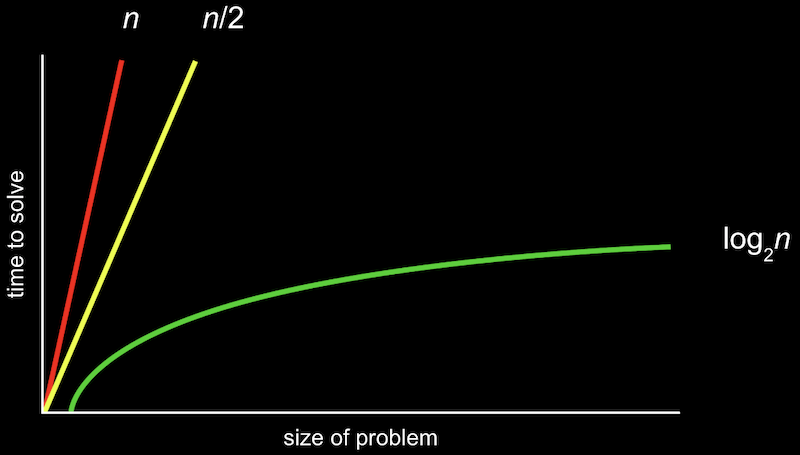

# 4. 알고리즘

[Naver BoostCourse CS50 2019](https://www.edwith.org/boostcourse-cs-050)

<details>
  <summary>1) 검색 알고리즘</summary>

# 학습 목표

주어진 배열 속에서 특정 값을 찾는 방법을 설명할 수 있다.

# 검색 알고리즘

**배열**은 한 자료형의 여러 값들이 메모리 상에 모여 있는 구조이다.

컴퓨터는 이 값들에 접근할 때 배열의 인덱스 하나하나를 접근한다.

만약 어떤 값이 배열 안에 속해 있는지를 찾아 보기 위해서는 배열이 정렬되어 있는지 여부에 따라 아래와 같은 방법을 사용할 수 있다.

# 선형 검색

배열의 인덱스를 처음부터 끝까지 하나씩 증가시키면서 방문하여 그 값이 속하는지를 검사한다.

아래 의사코드와 같이 나타낼 수 있다.

```
For i from 0 to n–1

    If i'th element is 50

        Return true

Return false
```

# 이진 검색

만약 배열이 정렬되어 있다면, 배열 중간 인덱스부터 시작하여 찾고자 하는 값과 비교하며 그보다 작은(작은 값이 저장되어 있는) 인덱스 또는 큰(큰 값이 저장되어 있는) 인덱스로 이동을 반복하면 된다.

아래 의사코드와 같이 나타낼 수 있다.

```
If no items

    Return false

If middle item is 50

    Return true

Else if 50 < middle item

    Search left half

Else if 50 > middle item

    Search right half
```

# 생각해보기

만약 정렬되지 않은 배열이 있다면, 선형 검색이 빠를까 이진 검색이 빠를까?

- 정답을 찾는 속도는 선형 검색이 더 빠를 것이다. 선형 검색은 데이터를 차례대로 계속해서 찾기만 하지만, 이진 검색의 경우 해당 인덱스의 데이터와 찾고자 하는 값을 비교하는 과정을 반복하기 때문이다.
- 또한, 정렬되지 않은 상태에서 이진 검색으로 찾게 되면 데이터가 배열 안에 존재하는 데에도 불구하고 그 데이터가 없는 것으로 잘못 결론을 내릴 수도 있다.
- 하지만 배열이 정렬되어 있는 경우라면 이진 검색이 올바른 결과를 도출하면서도 그 속도가 평균적으로 훨씬 빠를 것이다.

</details>

<details>
  <summary>2) 알고리즘 표기법</summary>

# 학습 목표

알고리즘의 실행 시간의 상한과 하한을 표기할 수 있다.

# 알고리즘 표기법

1주차에 아래 그림과 같이 알고리즘을 실행하는데 걸리는 시간을 표현해 봤다.



위와 같은 그림을 공식으로 표기한 것이 **Big O 표기법**이다.

여기서 O는 "**on the order of**"의 약자로, 쉽게 생각하면 "**~만큼의 정도로 커지는**" 것이라고 볼 수 있다.

O(n)은 n만큼 커지는 것이므로 n이 늘어날수록 선형적으로 증가하게 된다. O(n/2)도 결국 n이 매우 커지면 1/2은 큰 의미가 없어지므로 O(n)이라고 볼 수 있다.

주로 아래 목록과 같은 Big O 표기가 실행 시간을 나타내기 위해 많이 사용된다.

- O(n^2)
- O(n log n)
- O(n) - 선형 검색
- O(log n) - 이진 검색
- O(1)

**Big O**가 알고리즘 **실행 시간의 상한**을 나타낸 것이라면, 반대로 **Big Ω**는 알고리즘 **실행 시간의 하한**을 나타내는 것이다.

예를 들어 선형 검색에서는 n개의 항목이 있을 때 최대 n번의 검색을 해야 하므로 상한이 O(n)이 되지만 운이 좋다면 한 번만에 검색을 끝낼 수도 있으므로 하한은 Ω(1)이 된다.

역시 아래 목록과 같은 Big Ω 표기가 많이 사용된다.

- Ω(n^2)
- Ω(n log n)
- Ω(n) - 배열 안에 존재하는 값의 개수 세기
- Ω(log n)
- Ω(1) - 선형 검색, 이진 검색

# 생각해보기

실행시간의 상한이 낮은 알고리즘이 더 좋을까? 하한이 낮은 알고리즘이 더 좋을까?

- 실행시간의 상한이 낮은 알고리즘이 더 좋을 것이다. 왜냐하면 실행시간의 상한이 높은 비효율적인 알고리즘은 다루는 데이터의 크기가 커짐에 따라서 최악의 경우에 걸리는 실행시간이 기하급수적으로 늘어날 수 있기 때문이다.
- 또한 상한 시간이 같다면, 평균적으로 실행 시간이 낮은 알고리즘이 좋은 알고리즘일 것이다.

</details>

<details>
  <summary>3) 선형 검색</summary>

# 학습 목표

주어진 배열 또는 구조체에서 선형 검색을 할 수 있다.

# 선형 검색

찾고자 하는 자료를 검색하는 데 사용되는 다양한 알고리즘이 있다. 그 중 하나가 **선형 검색**이다.

선형 검색은 **원하는 원소가 발견될 때까지 처음부터 마지막 자료까지 차례대로 검색**한다.

이렇게 하여 선형 검색은 찾고자 하는 자료를 찾을 때까지 모든 자료를 확인해야 한다.

# 효율성 그리고 비효율성

**선형 검색 알고리즘**은 **정확하지만 아주 효율적이지 못한 방법**이다.

리스트의 길이가 n이라고 했을 때, 최악의 경우 리스트의 모든 원소를 확인해야 하므로 n번만큼 실행된다.

여기서 최악의 상황은 찾고자 하는 자료가 맨 마지막에 있거나 리스트 안에 없는 경우를 말한다.

만약 100만 개의 원소가 있는 리스트라고 가정해본다면 효율성이 매우 떨어짐을 느낄 수 있다.

반대로 최선의 상황은 처음 시도했을 때 찾고자 하는 값이 있는 경우이다.

평균적으로 선형 검색이 최악의 상황에서 종료되는 것에 가깝다고 가정할 수 있다.

선형 검색은 **자료가 정렬되어 있지 않거나 그 어떤 정보도 없이 하나씩 찾아야 하는 경우에 유용**하다.

이러한 경우 무작위로 탐색하는 것보다 순서대로 탐색하는 것이 효율적이다.

이제 우리는 검색 이전에 정렬이 필요한 이유를 알 수 있다.

정렬은 시간이 오래 걸리고 공간을 더 차지한다.

하지만 이 추가적인 과정을 진행하면 우리는 여러 번 리스트를 검색해야 하거나 매우 큰 리스트를 검색해야 할 경우 시간을 단축할 수 있을 것이다.

주어진 배열에서 특정 값을 찾기 위해 선형 검색을 사용한다면, 아래와 같은 코드를 작성할 수 있다.

```c
#include <cs50.h>
#include <stdio.h>

int main(void)
{
    //numbers 배열 정의 및 값 입력
    int numbers[] = {4, 8, 15, 16, 23, 42};

    //값 50 검색
    for (int i = 0; i < 6; i++)
    {
        if (numbers[i] == 50)
        {
            printf("Found\n");
            return 0;
        }
    printf("Not found\n");
    return 1;
    }
}
```

배열의 크기만큼 for 루프를 돌면서 배열의 인덱스를 차례대로 방문하며 찾는 값이 있는지를 검사하면 된다.

문자열로 이루어진 배열도 비슷한 방식으로 검색할 수 있다.

만약 전화번호부에서 특정 이름을 찾아 해당하는 전화번호를 출력하는 프로그램을 작성하려면 어떻게 할 수 있을까?

가장 간단한 예는 아래와 같은 프로그램이 될 것이다.

```c
#include <cs50.h>
#include <stdio.h>
#include <string.h>

int main(void)
{
    string names[] = {"EMMA", "RODRIGO", "BRIAN", "DAVID"};
    string numbers[] = {"617-555-0100", "617-555-0101", "617-555-0102", "617-555-0103"};

    for (int i = 0; i < 4; i++)
    {
        if (strcmp(names[i], "EMMA") == 0)
        {
            printf("Found %s\n", numbers[i]);
            return 0;
        }
    }
    printf("Not found\n");
    return 1;
}
```

names 배열과 numbers 배열을 따로 정의하고 names 배열에서 검색을 해서 해당하는 인덱스의 numbers 배열 값을 출력하는 것이다.

하지만 이 경우에는 names 배열과 numbers 배열이 서로 같은 인덱스를 가져야 한다는 한계가 있다.

더 좋은 방법은 아래 코드와 같이 새로운 자료형으로 **구조체**를 정의해서 이름과 번호를 묶어주는 것이다.

```c
#include <cs50.h>
#include <stdio.h>
#include <string.h>

typedef struct
{
    string name;
    string number;
}
person;

int main(void)
{
    person people[4];

    people[0].name = "EMMA";
    people[0].number = "617-555-0100";
    people[1].name = "RODRIGO";
    people[1].number = "617-555-0101";
    people[2].name = "BRIAN";
    people[2].number = "617-555-0102";
    people[3].name = "DAVID";
    people[3].number ="617-555-0103";

    //EMMA 검색
    for (int i = 0; i < 4; i++)
    {
        if (strcmp(people[i].name, "EMMA") == 0)
        {
            printf("Found %s\n", people[i].number);
            return 0;
        }
    }
    printf("Not found\n");
    return 1;
}
```

person이라는 이름의 구조체를 자료형으로 정의하고 person 자료형의 배열을 선언하면 그 안에 포함된 속성값은 '.'으로 연결해서 접근할 수 있다.

person a; 라는 변수가 있다면, a.name 또는 a.number 이 각각 이름과 전화번호를 저장하는 변수가 된다.

이렇게 함으로써 더욱 확장성 있는 전화번호부 검색 프로그램을 만들 수 있다.

# 생각해보기

전화번호부와 같이 구조체를 정의하여 관리 및 검색을 하면 더 편리한 예는 또 무엇이 있을까?

- 쇼핑몰 회원의 아이디와 전화번호 및 주소 등

</details>

<details>
  <summary>4) 버블 정렬</summary>

# 학습 목표

버블 정렬의 원리와 실행 시간을 설명하고 구현할 수 있다.

# 버블 정렬

정렬되지 않은 리스트를 탐색하는 것보다 정렬한 뒤 탐색하는 것이 더 효율적이다.

정렬 알고리즘 중 하나는 **버블 정렬**이다.

버블 정렬은 **두 개의 인접한 자료 값을 비교하면서 위치를 교환하는 방식으로 정렬**하는 방법을 말한다.

버블 정렬은 단 두 개의 요소만 정렬해주는 좁은 범위의 정렬에 집중한다.

이 접근법은 간단하지만 단 하나의 요소를 정렬하기 위해 너무 많이 교환하는 낭비가 발생할 수도 있다.

아래와 같은 8개의 숫자가 임의의 숫자로 나열되어 있다.

이 숫자들을 **오름차순**으로 정렬하기 위해 바로 옆에 있는 숫자들과 비교하는 방법을 사용해 보겠다.

> 6 3 8 5 2 7 4 1

먼저 가장 앞의 6과 3을 비교해서 순서를 바꾼다

> 교환 전: 3 6 **8** **5** 2 7 4 1
> 교환 후: 3 6 **5** **8** 2 7 4 1

이런 식으로 숫자 끝까지 진행하면 아래와 같이 정렬된다.

> 3 6 5 2 7 4 1 8

하지만 아직 오름차순으로 정렬이 되지 않았기 때문에, 다시 처음부터 동일한 작업을 반복한다.

> **3** **6** 5 2 7 4 1 8
> 3 **6** **5** 2 7 4 1 8 (교환)
> 3 5 **6** **2** 7 4 1 8 (교환)
> 3 5 2 **6** **7** 4 1 8
> 3 5 2 6 **7** **4** 1 8 (교환)
> 3 5 2 6 4 **7** **1** 8 (교환)
> 3 5 2 6 4 1 **7** **8**

조금 더 잘 정렬이 되어있다. 이 과정을 끝까지 반복하면 최종적으로 아래와 같이 오름차순 정렬이 될 것이다.

> 1 2 3 4 5 6 7 8

이러한 정렬 방식을 '**버블 정렬**' 이라고 한다.

마치 거품이(비교 및 교환이) 터지면서 위로 올라오는 (배열의 옆으로 이동하는) 방식이기 때문이다.

아래와 같이 의사 코드로 나타낼 수 있다.

```
Repeat n–1 times

    For i from 0 to n–2

        If i'th and i+1'th elements out of order

            Swap them
```

중첩 루프를 돌아야 하고, n개의 값이 주어졌을 때 각 루프는 각가 n-1번, n-1번 반복되므로 (n -1 ) \* (n -1) = n^2 - 2n + 1 번의 비교 및 교환이 필요하다.

여기서 가장 크기가 큰 요소는 n^2 이므로 위와 같은 코드로 작성한 버블 정렬 실행 시간의 상한은 **O(n^2)**이라고 말할 수 있다.

정렬이 되어 있는지 여부에 관계 없이 루프를 돌며 비교를 해야 하므로 위와 같은 코드로 작성한 버블 정렬의 실행 시간의 하한도 여전히 **Ω(n^2)**이 된다.

# 생각해보기

버블 정렬이 효율적인 경우는 어떤 경우인가? 반대로 어떤 경우에 비효율적이게 될까?

- 효율적인 경우: 검색을 여러 번 수행해야 하는 경우
- 비효율적인 경우: 이미 정렬되어 있는 경우, 검색이 적게 필요한 경우

</details>

<details>
  <summary>5) 선택 정렬</summary>

# 학습 목표

선택 정렬의 원리와 실행 시간을 설명하고 구현할 수 있다.

# 선택 정렬

보통 배열이 정렬되어 있으면 정렬되지 않은 배열보다 더 쉽게 탐색할 수 있다.

정렬을 위한 알고리즘 중 **선택정렬**은 배열 안의 자료 중 가장 작은 수(혹은 가장 큰 수)를 찾아 첫 번째 위치(혹은 가장 마지막 위치)의 수와 교환해주는 방식의 정렬이다.

**선택 정렬**은 **교환 횟수를 최소화**하는 반면 각 자료를 비교하는 횟수는 증가한다.

다음과 같은 정렬되지 않은 숫자들을 오름차순 정렬해보도록 하자

> 6 3 8 5 2 7 4 1

먼저 아래 숫자들 중에서 가장 작은 값을 찾는다

> 6 3 8 5 2 7 4 **1**

가장 작은 값인 1은 가장 앞에 있어야 하므로 현재 리스트의 첫 번째 값인 6과 교환한다.

> **1** 3 8 5 2 7 4 **6**

그리고 정렬되어 있는 1은 제외하고, 두 번째 숫자부터 시작해서 또 가장 작은 값을 찾는다.

> 1 3 8 5 **2** 7 4 6

가장 작은 값인 2는 정렬되지 않는 숫자들 중에서 가장 앞에 있어야 하므로 3과 교환한다.

> 1 **2** 8 5 **3** 7 4 6

이 과정을 더 이상 교환이 일어나지 않을 때까지 반복하면, 아래와 같이 오름차순 정렬이 완료된다.

> 1 2 3 4 5 6 7 8

이러한 정렬 방법을 '**선택 정렬**' 이라고 한다. 의사 코드로 아래와 같이 표현할 수 있다.

```
For i from 0 to n–1

    Find smallest item between i'th item and last item

    Swap smallest item with i'th item
```

여기서도 **두 번의 루프**를 돌아야 한다.

바깥 루프에서는 숫자들을 처음부터 순서대로 방문하고, 안쪽 루프에서는 가장 작은 값을 찾아야 한다.

따라서 소요 시간의 상한은 **O(n^2)**이 된다. 하한도 마찬가지로 **Ω(n^2)**이다. 버블 정렬과 동일하다.

# 생각해보기

선택정렬을 좀 더 효율적으로 어떻게 바꿀 수 있을까?

- 배열을 도는 루프를 중첩하기 보다는, 배열을 한 바퀴 돌면서 가장 작은 숫자만 찾는 것에서 그치지 않고 각 숫자들의 크기의 순서를 기록하고 그 순서에 맞게 새로운 배열의 인덱스에 각 숫자들을 할당하면 반복적으로 비교하지 않아도 되어서 시간적으로 더 효율적인 정렬이 될 것이다.

</details>

<details>
  <summary>6) 정렬 알고리즘의 실행시간</summary>

# 학습 목표

여러 정렬 알고리즘과 검색 알고리즘의 실행 시간을 Big O와 Big Ω로 정의할 수 있다.

# 실행시간의 상한

- O(n^2): 선택 정렬, 버블 정렬
- O(n log n)
- O(n): 선형 검색
- O(log n): 이진 검색
- O(1)

# 실행시간의 하한

- Ω(n^2): 선택 정렬, 버블 정렬
- Ω(n log n)
- Ω(n)
- Ω(log n)
- Ω(1): 선형 검색, 이진 검색

여기서 **버블 정렬**을 좀 더 잘 할 수 있는 방법을 알아보자

만약 정렬이 모두 되어 있는 숫자 리스트가 주어진다면 어떨까?

원래의 의사 코드는 다음과 같다

```
Repeat n–1 times

    For i from 0 to n–2

        If i'th and i+1'th elements out of order

            Swap them
```

여기서 안쪽 루프에서 만약 교환이 하나도 일어나지 않는다면 이미 정렬이 잘 되어 있는 상황일 것이다.

따라서 바깥쪽 루프를 '교환이 일어나지 않을 때'까지만 수행하도록 다음과 같이 바꿀 수 있다.

```
Repeat until no swaps

    For i from 0 to n–2

        If i'th and i+1'th elements out of order

            Swap them
```

따라서 최종적으로 버블 정렬의 하한은 **Ω(n)**이 된다.

상황에 따라서는 선택 정렬보다 더 빠른 방법이 되는 것이다.

# 실행시간의 하한

- Ω(n^2): 선택 정렬
- Ω(n log n)
- **Ω(n): 버블 정렬**
- Ω(log n)
- Ω(1): 선형 검색, 이진 검색

# 생각해보기

선택 정렬의 실행 시간의 하한도 버블 정렬처럼 더 단축시킬 수 있을까?

- 선택 정렬의 경우 버블 정렬과 같은 방식으로 실행 시간을 단축시킬 수는 없을 것이다. (바깥쪽 루프를 돌 때마다, 어떤 숫자가 정렬되지 않고 남은 숫자들 중 가장 작은 숫자인지를 확인해야 하기 때문에)
- 다만, 각 숫자의 순서를 루프를 돌면서 여러 번 세지 않고, 한 번 셀 때 각 숫자가 몇번째로 작은(큰) 숫자인지를 기록해 놓으면 실행시간을 단축시킬 수 있을 것이다

</details>

<details>
  <summary>7) 재귀</summary>

# 학습 목표

함수를 재귀적으로 사용하는 코드를 작성할 수 있다.

# 재귀

함수를 사용할 때 어디에서 호출할까? main 안에서 프로그램을 작성하면서 필요한 순간에 호출하여 사용한다.

그런데 main 또한 함수이다. main이라는 함수 안에서 또 다른 함수를 사용한 것이다.

이 사실을 알게 되었을 때, 우리는 **함수가 본인 스스로를 호출해서 사용할 수 있는지**에 대해 의문을 가질 수 있다.

이에 대한 대답은 할 수 있다 이며, 이러한 것을 **재귀(recursion)**라고 부른다.

아래와 같이 피라미드 모양을 출력하기 위해 다음과 같은 코드를 작성할 수 있다.

> #

##

###

####

```c
#include <cs50.h>
#include <stdio.h>

void draw(int h);

int main(void)
{
    //사용자로부터 피라미드의 높이를 입력 받아 저장
    int height = get_int("Height: ");

    //피라미드 그리기
    draw(height);
}

void draw(int h)
{
    //높이가 h인 피라미드 그리기
    for (int i = 1; i <= h; i++)
    {
        for (int j = 1; j <= i; j++)
        {
            printf("#");
        }
        printf("\n");
    }
}
```

높이를 입력 받아 중첩 루프를 통해 피라미드를 출력해주는 draw 함수를 정의한 것이다.

여기서 꼭 중첩 루프를 써야만 할까? 사실 바깥 쪽 루프는 안 쪽 루프에서 수행하는 내용을 반복하도록 하는 것일 뿐이다.

따라서 바깥 쪽 루프를 없앤 draw 함수를 만들고, 이를 '재귀적으로' 호출하도록 해서 똑같은 작업을 수행할 수 있다.

즉, draw 함수 안에서 draw 함수를 호출하는 것이다. 아래 코드와 같이 수정할 수 있다.

```c
#include <cs50.h>
#include <stdio.h>

void draw(int h);

int main(void)
{
    int height = get_int("Height: ");

    draw(height);
}

void draw(int h)
{
    //높이가 0이라면 (그릴 필요가 없다면)
    if (h == 0)
    {
        return;
    }

    //높이가 h-1인 피라미드 그리기
    draw(h - 1);

    //피라미드에서 폭이 h인 한 층 그리기
    for (int i = 0; i < h; i++)
    {
        printf("#");
    }
    printf("\n");
}
```

draw 함수 안에서 draw 함수를 다시 호출하는 부분을 유의해야 한다.

h라는 높이를 받았을 때, h-1 높이로 draw 함수를 먼저 호출하고, 그 후에 h 만큼의 #을 출력한다. 여기서 내부적으로 호출된 draw 함수를 따라가다 보면 **h = 0**인 상황이 오게 된다.

따라서 그 때는 아무것도 출력을 하지 않도록 하는 **조건문을 추가**해줘야 한다.

이렇게 재귀를 사용하면 중첩 루프를 사용하지 않고도 하나의 함수로 동일한 작업을 수행할 수 있다.

# 생각해보기

반복문을 쓸 수 있는데도 재귀를 사용하는 이유는 무엇일까?

- 반복문을 사용할 때보다 재귀함수로 구현된 코드를 볼 때 함수 내부적으로 어떤 일들이 진행되는지, 어떤 부분이 반복되는지 알기가 쉬운 것 같다.

# 스택

재귀 함수에서 동일한 함수를 계속해서 호출할 때마다 **함수를 위한 메모리가 계속해서 할당**된다. 함수가 호출될 때마다 사용되는 메모리를 **스택**이라고 부른다.

컴퓨터가 일을 처리하는 데 관리를 하는 역할인 운영체제는 함수를 실행할 수 있도록 일정량의 바이트를 주고, 그 공간에 함수의 변수나 다른 것들을 저장할 수 있도록 한다.

그래서 재귀함수를 이용하다 보면 함수가 종료되지 않고, 함수가 계속해서 호출되는 경우가 발생하기도 한다. 이 경우 스택 공간은 초과되고 프로그램 충돌이 발생된다.

그렇기 때문에 재귀를 사용할 때는 과도하게 스택 메모리가 사용되지 않도록 주의해야 한다. 메모리 사용 문제 때문에 재귀는 매우 유의해야 하지만, 특정 자료구조를 다룰 때 매우 유용하게 사용된다.

</details>

<details>
  <summary>8) 병합 정렬</summary>

# 학습 목표

재귀를 활용한 병합 정렬을 구현할 수 있다.

# 병합 정렬

전화번호부의 분할 정복 탐색처럼 데이터를 반으로 나누어 간다는 것과 공통점이 있는 방법인 **병합 정렬(합병 정렬)**이 있다.

병합 정렬은 **원소가 한 개가 될 때까지 계속해서 반으로 나누다가 다시 합쳐나가며 정렬을 하는 방식이다.**

그리고 이 과정은 재귀적으로 구현되기 때문에 나중에 재귀를 학습하면 더 이해하기 쉽다.

다음 숫자들을 오름차순으로 정렬해 보자.

> 7 4 5 2 6 3 8 1

먼저 숫자들을 반으로 나눈다.

> **7 4 5 2** | 6 3 8 1

그리고 나눠진 부분 중 첫 번째를 한 번 더 반으로 나눠 본다.

> **7** | **4** | 5 2 | 6 3 8 1

이제 숫자가 두 개 밖에 남지 않았으므로 더 이상 나누지 않고, 두 숫자를 다시 **병합**한다.

단, 이 때 **작은 숫자가 먼저 오도록**한다. 4와 7의 순서를 바꿔서 병합하는 것이다.

> **4** **7** | 5 2 | 6 3 8 1

마찬가지로 5 2 부분도 반으로 나눈 후에 작은 숫자가 먼저 오도록 다시 병합할 수 있다.

> 4 7 | **2** **5** | 6 3 8 1

그럼 이제 4 7 과 2 5 두 개의 부분들을 병합한다.

각 부분들의 숫자들을 앞에서부터 순서대로 읽어들여 비교하여 더 작은 숫자를 병합되는 부분에 가져온다.

즉, 4와 2를 먼저 비교해서 2를 가져온다. 그 후에 4와 5를 비교해서 4를 가져온다.

그리고 7과 5를 비교해서 5를 가져오고, 남은 7을 가져온다.

> **2 4 5 7** | 6 3 8 1

이제 남은 오른쪽 4개의 숫자들도 위와 동일한 과정을 거친다.

> 2 4 5 7 | **1 3 6 8**

마지막으로 각각 정렬된 왼쪽 4개와 오른쪽 4개의 두 부분을 병합한다.

2와 1을 비교하고, 1을 가져온다. 2와 3을 비교하고, 2를 가져온다. 4와 3을 비교하고, 3을 가져온다. 4와 6을 비교하고 ... 이 과정을 병합이 끝날 때까지 진행하면 아래와 같이 정렬이 완료된다.

> **1 2 3 4 5 6 7 8**

전체 과정을 요약해서 도식화해보면 아래와 같다.

7 | 4 | 5 | 2 | 6 | 3 | 8 | 1 → 가장 작은 부분 (숫자 1개)으로 나눠진 결과다.

4 7 | 2 5 | 3 6 | 1 8 → 숫자 1개씩을 정렬하여 병합한 결과다.

2 4 5 7 | 1 3 6 8 → 숫자 2개씩을 정렬하여 병합한 결과다.

1 2 3 4 5 6 7 8 → 마지막으로 숫자 4개씩을 정렬하여 병합한 결과다.

이러한 방법을 '**병합 정렬**'이라고 한다.

병합 정렬 실행 시간의 상한은 **O(n log n)**이다.

숫자들을 반으로 나누는 데는 O(log n)의 시간이 들고, 각 반으로 나눈 부분들을 다시 정렬해서 병합하는 데 각각 O(n)의 시간이 걸리기 때문이다.

실행 시간의 하한도 역시 **Ω(n log n)**이다. 숫자들이 이미 정렬되었는지 여부에 관계 없이 나누고 병합하는 과정이 필요하기 때문이다.

# 생각해보기

병합 정렬을 선택 정렬이나 버블 정렬과 비교했을 때 장점과 단점은 무엇이 있을까?

- 장점: 두 정렬보다 실행시간 상한이 작다.
- 단점: 메모리를 추가로 요구한다. 버블 정렬보다 실행시간 하한이 크다.

# 정렬된 배열

**이진 탐색**은 모든 데이터를 다 보는 것이 아니라 **절반을, 그리고 그 절반을 보는 방식**으로 진행되어 탐색 시간이 굉장히 짧았다. 합병 정렬 역시 반을 나눈다는 개념이 사용되기 때문에 시간이 적게 들 것이라고 유추할 수 있다.

만약 8개의 원소가 있다면 3번 나누어질 것이다. 따라서 n개의 원소가 있을 때 완전히 다 나누어지기까지 호출되는 함수의 개수는 log n개라는 것을 알 수 있다.

그리고 합병 정렬은 병합하는 알고리즘을 포함한다. 합쳐지는 과정에서 각 원소들의 크기를 비교하기 때문에 n번의 비교 과정이 있다. 즉 한 번 나누어질 때마다 n번의 비교 횟수가 추가되는 것이다. 따라서 합병 정렬의 시간 복잡도는 **O(n log n)**이다.

또한 이렇게 나누어지고 합쳐지는 중간 단계의 배열을 임시로 저장하고 함수가 종료될 때까지 기억하고 있어야 하기 때문에, 메모리의 필요한 공간이 늘어난다.

</details>
