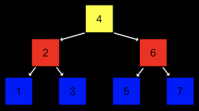
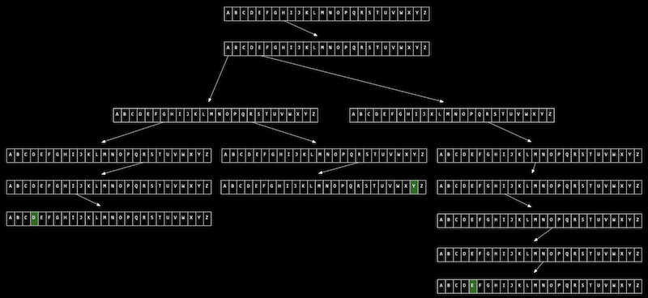

# 5. 자료구조

[Naver BoostCourse CS50 2019](https://www.edwith.org/boostcourse-cs-050)

<details>
  <summary>1) malloc과 포인터 복습</summary>

# 학습 목표

포인터의 개념과 malloc 함수의 용법을 잘 이해할 수 있다.

# malloc과 포인터 복습

아래와 같은 main 함수 코드가 있다. 여기서 문제가 될 만한 지점을 발견해 보자

```c
#include <stdlib.h>

int main(void)
{
    int *x;
    int *y;

    x = malloc(sizeof(int));

    *x = 42;
    *y = 13;
}
```

main 함수 안의 첫 두 줄에서는 **포인터 x와 y**를 선언한다.

그리고 x에는 **malloc** 함수를 이용해서 int 자료형 크기에 해당하는 메모리를 할당한다.

그 다음에는 x와 y 포인터가 가리키는 지점에 각각 42와 13을 저장한다.

여기서 문제가 될 만한 부분은 \*y = 13이다. y는 포인터로만 선언되었을 뿐이지, 어디를 가리킬 지에 대해서는 아직 정의가 되지 않았다.

따라서 **초기화 되지 않은 \*y**는 프로그램 어딘가를 임의로 가리키고 있을 수도 있다.

따라서 그 곳에 13이라는 값을 저장하는 것이 오류를 발생시킬 수도 있는 것이다.

아래 코드와 같이 `y = x;`라는 코드를 더해주면, y는 x가 가리키는 곳과 동일한 곳을 가리키게 된다.

따라서 `*y = 13;`으로 저장하면 x가 가리키는 곳에도 동일하게 13으로 저장될 것이다.

```c
y = x;

*y = 13;
```

# 생각해보기

포인터를 초기화시키지 않고 값을 저장하면 어떤 오류가 발생할 수 있을까?

- 초기화되지 않는 포인터는 프로그램 어딘가를 임의로 가리키고 있을 수 있는데, 거기에는 쓰레기 값이 있다고 가정해야 된다. 이처럼 없거나 잘못된 주소에 접근하여 값을 저장하려 하면 메모리 문제가 일어날 수 있다.g

</details>

<details>
  <summary>2) 배열의 크기 조정하기</summary>
  
  # 학습 목표

배열의 크기를 조정하는 코드를 작성할 수 있다.

# 배열의 크기 조정하기

일정한 크기의 배열이 주어졌을 때, 그 크기를 키우려면 어떻게 해야 할까요?

단순하게 현재 배열이 저장되어 있는 메모리 위치의 바로 옆에 일정 크기의 메모리를 더 덧붙이면 되겠지만, 실제로는 다른 데이터가 저장되어 있을 확률이 높다.

따라서 안전하게 **새로운 공간에 큰 크기의 메모리를 다시 할당**하고 기존 배열의 값들을 하나씩 옮겨줘야 한다.

따라서 이런 작업은 **O(n)**, 즉 배열의 크기 n만큼의 실행 시간이 소요될 것이다.

이 과정을 아래 코드와 같이 나타낼 수 있다.

```c
#include <stdio.h>
#include <stdlib.h>

int main(void)
{
    //int 자료형 3개로 이루어진 list라는 포인터를 선언하고 메모리 할당
    int *list = malloc(3 * sizeof(int));

    //포인터가 잘 선언되었는지 확인
    if (list == NULL)
    {
        return 1;
    }

    //list 배열의 각 인덱스에 값 저장
    list[0] = 1;
    list[1] = 2;
    list[2] = 3;

    //int 자료형 4개 크기의 tmp 라는 포인터를 선언하고 메모리 할당
    int *tmp = malloc(4 * sizeof(int));

    if (tmp == NULL)
    {
        return 1;
    }

    //list 값을 tmp로 복사
    for (int i = 0; i < 3; i++)
    {
        tmp[i] = list[i];
    }

    //tmp 배열의 네 번째 값도 설정
    tmp[3] = 4;

    //list의 메모리를 초기화
    free(list);

    //list가 tmp와 같은 곳을 가리키도록 지정
    list = tmp;

    //새로운 배열 list의 값 확인
    for (int i = 0; i < 4; i++)
    {
        printf("%i\n", list[i]);
    }

    //list의 메모리 초기화
    free(list);
}
```

위와 동일한 작업을 **realloc** 이라는 함수를 이용해서 수행할 수도 있다.

```c
#include <stdio.h>
#include <stdlib.h>

int main(void)
{
    int *list = malloc(3 * sizeof(int));
    if (list == NULL)
    {
        return 1;
    }

    list[0] = 1;
    list[1] = 2;
    list[2] = 3;

    //tmp 포인터에 메모리를 할당하고 list의 값 복사
    int *tmp = realloc(list, 4 * sizeof(int));
    if (tmp == NULL)
    {
        return 1;
    }

    //list가 tmp와 같은 곳을 가리키도록 지정
    list = tmp;

    //새로운 list의 네 번째 값 저장
    list[3] = 4;

    //list의 값 확인
    for (int i = 0; i < 4; i++)
    {
        printf("%i\n", list[i]);
    }

    //list의 메모리 초기화
    free(list);
}
```

# 생각해보기

이미 할당된 메모리의 크기를 조절할 때 임시 메모리를 새로 할당해줘야 하는 이유는 무엇인가?

- 이미 메모리가 할당되어 있는 곳 주변을 이미 프로그램의 다른 부분에서 사용하고 있을 수 있기 때문에 메모리의 크기를 조정할 때에는 다른 주소에 새로 메모리를 할당해줘야 한다.

</details>

<details>
  <summary>3) 연결 리스트: 도입</summary>

# 학습 목표

연결 리스트의 정의를 설명할 수 있다.

# 연결 리스트

**데이터 구조**는 우리가 컴퓨터 메모리를 더 효율적으로 관리하기 위해 새로 정의하는 구조체이다.

일종의 메모리 레이아웃, 또는 지도라고 생각할 수 있다.

이번에는 데이터 구조 중 하나인 **연결 리스트**에 대해 알아보자.

**배열**에서는 각 인덱스의 값이 메모리 상에서 연이어 저장되어 있다.

하지만 꼭 그럴 필요가 있을까? 각 값이 메모리 상의 여러 군데 나뉘어져 있다고 하더라도 바로 다음 값의 **메모리 주소**만 기억하고 있다면 여전히 값을 연이어서 읽어들일 수 있다.

이를 '**연결 리스트**'라고 한다. 아래 그림과 같이 크기가 3인 연결 리스트는 각 인덱스의 메모리 주소에서 **자신의 값**과 함께 **바로 다음 값의 주소(포인터)**를 저장한다.


연결 리스트의 가장 첫 번째 값인 1은 2의 메모리 주소를, 2는 3의 메모리 주소를 함께 저장하고 있다.

3은 다음 값이 없기 때문에 NULL (\0, 즉 0으로 채워진 값을 의미한다)을 다음 값의 주소로 저장한다.

연결 리스트는 아래 코드와 같이 간단한 구조체로 정의할 수 있다.

```c
typedef struct node // type name
{
	int number;
	struct node *next;
}
node; // alias
```

# 생각해보기

연결 리스트를 배열과 비교했을 때 장단점은 무엇이 있을까?

- 장점: 리스트의 크기를 유연하게 조절할 수 있다. (즉, 새로운 요소를 추가, 삭제, 수정하기가 용이하다).
- 단점: 값 뿐만 아니라 다음 값에 대한 주소까지도 함께 저장해야 하기 때문에 메모리 사용량이 늘어난다.

</details>

<details>
  <summary>4) 연결 리스트: 코딩</summary>

# 학습 목표

연결 리스트를 구현하고 사용할 수 있다.

# 연결리스트

앞서 정의한 구조체를 활용해서 실제로 연결 리스트를 구현해보자.

아래 코드의 내용과 각 주석을 따라가 보자

```c
#include <stdio.h>
#include <stdlib.h>

//연결 리스트의 기본 단위가 되는 node 구조체를 정의한다.
typedef struct node
{
    //node 안에서 정수형 값이 저장되는 변수를 number로 지정한다.
    int number;

    //다음 node의 주소를 가리키는 포인터를 *next로 지정한다.
    struct node *next;
}
node;

int main(void)
{
    //list라는 이름의 node 포인터를 정의한다. 연결 리스트의 가장 첫 번째 node를 가리킬 거이다.
    //이 포인터는 현재 아무 것도 가리키고 있지 않기 때문에 NULL로 초기화한다.
    node *list = NULL;

    //새로운 node를 위해 메모리를 할당하고 포인터 *n으로 가리킨다.
    node *n = malloc(sizeof(node));
    if (n == NULL)
    {
        return 1;
    }

    //n의 number 필드에 1의 값을 저장한다. "n->number"는 "(*n).number"와 동일한 의미이다.
    //즉, n이 가리키는 node의 number 필드를 의미하는 것이다.
    //간단하게 화살표 표시 '->'로 쓸 수 있다. n의 number의 값을 1로 저장한다.
    n->number = 1;

    //n 다음에 정의된 node가 없으므로 NULL로 초기화한다.
    n->next = NULL;

    //이제 첫 번째 node를 정의했기 때문에 list 포인터를 n 포인터로 바꿔준다.
    list = n;

    //이제 list에 다른 node를 더 연결하기 위해 n에 새로운 메모리를 다시 할당한다.
    n = malloc(sizeof(node));
    if (n == NULL)
    {
        return 1;
    }

    //n의 number와 next의 값을 각각 저장한다.
    n->number = 2;
    n->next = NULL;

    //list가 가리키는 것은 첫 번째 node이다.
    //이 node의 다음 node를 n 포인터로 지정한다.
    list->next = n;

    //다시 한 번 n 포인터에 새로운 메모리를 할당하고 number과 next의 값을 저장한다.
    n = malloc(sizeof(node));
    n->number = 3;
    n-> next = NULL;

    //현재 list는 첫 번째 node를 가리키고, 이는 두 번째 node와 연결되어 있다.
    //따라서 세 번째 node를 더 연결하기 위해 첫 번째 node(list)의
    //다음 node(list->next)이 다음 node(list->next->next)를 n 포인터로 지정한다.
    list->next->next = n;

    //이제 list에 연결된 node를 처음부터 방문하면서 각 number 값을 출력한다.
    //마지막 node의 next에는 NULL이 저장되어 있을 것이기 때문에 이 것이 for 루프의 종료 조건이 된다.
    for (node *tmp = list; tmp != NULL; tmp = tmp->next)
    {
        printf("%i\n", tmp->number);
    }

    //메모리를 해제해 주기 위해 listㅇ에 연결된 node들을 처음부터 방문하면서 free 해준다.
    while (list != NULL)
    {
        node *tmp = list->next;
        free(list);
        list = tmp;
    }
}
```

# 생각해보기

연결 리스트의 중간에 node를 추가하거나 삭제하는 코드는 어떻게 작성할 수 있을까?

```c
#include <stdio.h>
#include <stdlib.h>

typedef struct node
{
    int number;
    struct node *next;
}
node;

int main(void)
{
    node *list = NULL;

    node *n = malloc(sizeof(node));
    if (n == NULL)
    {
        return 1;
    }

    n->number = 1;
    n->next = NULL;

    list = n;

    n = malloc(sizeof(node));
    if (n == NULL)
    {
        return 1;
    }

    n->number = 3;
    n->next = NULL;

    list->next = n;

    n = malloc(sizeof(node));
    if (n == NULL)
    {
        return 1;
    }

    n->number = 4;
    n->next = NULL;
    list->next->next = n;

    //중간에 number 필드의 값이 2인 노드 추가
    n = malloc(sizeof(node));
    if (n == NULL)
    {
        return 1;
    }

    n->number = 2;
    //새로 만든 노드가 number 필드의 값이 3인 node를 가리키도록 지정
    n->next = list->next;
    list->next = n;

    //number 필드의 값이 3인 중간 노드 삭제
    n = list->next->next;
    list->next->next = n->next;
    free(n);

    //모든 노드의 number 값 출력
    for (node *tmp = list; tmp != NULL; tmp = tmp->next)
    {
        printf("%i\n", tmp->number);
    }


}
```

</details>

<details>
  <summary>5) 연결 리스트: 시연</summary>

# 학습 목표

연결 리스트와 배열의 장단점을 설명할 수 있다.

# 연결 리스트

배열과 비교해서 **연결 리스트**는 새로운 값을 추가할 때 전체 덩어리에 다시 메모리를 할당하지 않아도 된다는 장점이 있다.

하지만 이런 유동적인 구조는 그 대가가 따른다. 구조가 정적인 배열과 달리 연결 리스트에서는 임의 접근이 불가능하다. (중간의 특정 인덱스 위치에 바로 접근할 수가 없음)

연결 리스트에 값을 추가하거나 검색하는 경우를 생각해 보자.

이를 위해서는 해당하는 위치까지 리스트의 각 node들을 따라 이동해야 한다.

따라서 연결 리스트의 크기가 n일 때 그 실행 시간은 **O(n)**이 된다.

배열의 경우 임의 접근이 가능하기 때문에 (정렬되어 있는 경우) 이진 검색을 이용하면 **O(log n)**의 실행 시간이 소요되는 것에 비해서 다소 불리하다.

이처럼 여러 자료구조에는 각각의 장단점이 존재한다.

프로그래밍을 할 때 목적에 부합하는 가장 효율적인 자료구조를 고민해서 사용하는 것이 중요하다.

# 생각해보기

배열이 정렬되어 있지 않은 경우의 검색 소요 시간을 연결 리스트의 검색 시간과 비교해 보자.

- 배열이 정렬되어 있지 않은 경우: 이진 탐색을 사용하기에 적절하지 않기에 선형 탐색을 사용하게 될 경우 실행시간의 상한이 **O(n)**이 된다.
- 연결 리스트의 경우에는 임의 접근이 불가능하기 때문에 처음부터 포인터를 따라가며 모든 값들을 확인해야 하기 때문에 마찬가지로 실행시간의 상한이 **O(n)**이 된다.

</details>

<details>
  <summary>6) 연결 리스트: 트리</summary>

# 학습 목표

트리의 구조를 설명하고 활용하는 코드를 작성할 수 있다.

# 트리

트리는 연결 리스트를 기반으로 한 새로운 자료 구조이다.

연결 리스트에서 각 노드(연결 리스트 내의 한 요소를 지칭)들의 연결이 1차원적으로 구성되어 있다면, 트리에서의 노드들의 연결은 2차원적으로 구성되어 있다고 볼 수 있다.

각 노드는 일정한 층에 속하고, 다음 층의 노드들을 가리키는 포인터를 가지게 된다.

아래 그림은 트리의 한 예이다. 나무가 거꾸로 뒤집혀 있는 형태를 생각하면 된다.

가장 높은 층에서 트리가 시작되는 노드를 '**루트**'라고 한다. 루트 노드는 다음 층의 노드들을 가리키고 있고, 이를 '**자식 노드**'라고 한다.



위 그림에 묘사된 트리는 구체적으로 '**이진 검색 트리**'이다.

각 노드가 구성되어 있는 구조를 살펴보면 일정한 규칙을 알 수 있다.

먼저 하나의 노드는 두 개의 자식 노드를 가진다.

또 왼쪽 자식 노드는 자신의 값보다 작고, 오른쪽 자식 노드는 자신의 값보다 크다.

따라서 이런 트리 구조는 이진 검색을 수행하는데 유리하다.

아래 코드에서는 이진 검색 트리의 노드 구조체와 "50"을 재귀적으로 검색하는 **이진 검색 함수**가 구현되어 있다

```c
//이진 검색 트리의 노드 구조체
typedef struct node
{
    //노드의 값
    int number;

    //왼쪽 자식 노드
    struct node *left;

    //오른쪽 자식의 노드
    struct node *right;
}
node;

//이진 검색 함수 (*tree는 이진 검색 트리를 가리키는 포인터)
bool search(node *tree)
{
    //트리가 비어있는 경우 'false'를 반환하고 함수 종료
    if (tree == NULL)
    {
        return false;
    }
    //현재 노드의 값이 50보다 크면 왼쪽 노드 검색
    else if (50 < tree->number)
    {
        return search(tree->left);
    }
    //현재 노드의 값이 50보다 작으면 오른쪽 노드 검색
    else if (50 > tree->number)
    {
        return search(tree->right);
    }
    //위 모든 조건이 만족하지 않으면 노드의 값이 50이므로 'true' 반환
    else {
        return true;
    }
}
```

이진 검색 트리를 활용하였을 때 검색 실행 시간과 노드 삽입 시간은 모두 **O(log n)**이다.

# 생각해보기

값을 검색할 때 이진 트리가 기본 연결 리스트에 비해 가지는 장점과 단점은 무엇이 있을까?

- 장점: 이진 검색이 가능하기 때문에 검색 시 실행시간이 O(n)에서 O(log n)으로 더 빨라진다.
- 단점: 트리의 각 노드에서 기본 연결 리스트에 비해서 한 개의 포인터를 더 가지기 때문에 메모리를 더 많이 사용하게 된다.

</details>

<details>
  <summary>7) 해시 테이블</summary>

# 학습 목표

해시 테이블의 원리와 구조를 설명할 수 있다.

# 해시 테이블

해시 테이블은 '**연결 리스트의 배열**'이다. 여러 값들을 몇 개의 바구니에 나눠 담는 상황을 생각해보자.

각 값들은 '**해시 함수**'라는 맞춤형 함수를 통해서 어떤 바구니에 담기는 지가 결정된다.

각 바구니에 담기는 값들은 그 바구니에서 새롭게 정의되는 연결 리스트로 이어진다.

이와 같이 연결 리스트가 담긴 바구니가 여러 개 있는 것이 '연결 리스트의 배열', 즉 '해시 테이블'이 된다.

쉬운 예로 아래 그림과 같이 사람의 이름이 해시 테이블에 저장되며, 해시 함수는 '**이름의 가장 첫 글자**'인 경우를 생각해 보자.

그 경우 알파벳 개수에 해당하는 총 26개의 포인터들이 있을 수 있으며, 각 포인터는 그 알파벳을 시작으로 하는 이름들을 저장하는 연결 리스트를 가리키게 된다.


만약 해시 함수가 이상적이라면, 각 바구니에는 단 하나의 값들만 담기게 될 것이다.

따라서 검색 시간은 **O(1)**이 된다.

하지만 그렇지 않은 경우, 최악의 상황에는 단 하나의 바구니에 모든 값들이 담겨서 **O(n)**이 될 수도 있다.

일반적으로는 최대한 많은 바구니를 만드는 해시 함수를 사용하기 때문에 거의 O(1)에 가깝다고 볼 수 있다.

# 생각해보기

해시 함수는 어떻게 만들 수 있을까?

- 일단 해시 함수의 기준('첫 번째 문자', '첫 두 개의 문자' 등)을 정하고, 어떤 기준에 부합하는 지를 체크하는 코드를 만든 뒤, 기준에 해당하는 포인터에 할당하는 코드를 만들고, 각 포인터에서 연결리스트의 어떤 부분에 삽입될 지 결정하는 알고리즘을 구현해야 할 것이다.

</details>

<details>
  <summary>8) 트라이</summary>

# 학습 목표

트라이의 원리와 구조를 설명할 수 있다.

# 트라이

'**트라이**'는 기본적으로 '트리' 형태의 자료 구조이다.

특이한 점은 **각 노드가 '배열'**로 이루어져 있다는 것이다.

예를 들어 영어 알파벳으로 이루어진 문자열 값을 저장한다고 한다면 이 노드는 a부터 z까지의 값을 가지는 배열이 된다.

그리고 배열의 각 요소, 즉 알파벳은 다음 층의 노드(a-z 배열)을 가리킨다.

아래 그림과 같이 Hermione, Harry, Hagrid 세 문자열을 트라이에 저장해 보자.

루트 노드를 시작으로 각 화살표가 가리키는 알파벳을 따라가면서 노드를 이어주면 된다.



위와 같은 트라이에서 값을 검색하는 데 걸리는 시간은 '**문자열의 길이**'에 의해 한정된다.

단순히 문자열의 각 문자를 보며 트리를 탐색해 나가기만 하면 되기 때문이다.

일반적인 영어 이름의 길이를 **n**이라고 했을 때, 검색 시간은 **O(n)**이 되지만, 대부분의 이름은 그리 크지 않은 **상수값**(예, 20자 이내)이기 때문에 **O(1)**이나 마찬가지라고 볼 수 있다.

# 생각해보기

트라이가 해시 테이블에 비해 가지는 장점과 단점은 무엇일까?

- 장점: 이름과 같은 일반적인 문자열의 길이는 상수값을 지니기 때문에 해시 테이블에 비해 실행시간이 훨씬 빠르다. O(n) → O(1)
- 단점: 메모리를 훨씬 더 많이 사용하게 된다.

</details>

<details>
  <summary>9) 스택, 큐, 딕셔너리</summary>

# 학습 목표

스택, 큐, 딕셔너리의 원리와 구조를 설명할 수 있다.

# 큐

큐는 값이 아래로 쌓이는 구조이다.

값을 넣고 뺄 때 '**선입 선출**' 또는 '**FIFO**'라는 방식을 따르게 된다. 가장 먼저 들어온 값이 가장 먼저 나가는 것이다.

은행에서 줄을 설 때 가장 먼저 줄을 선 사람이 가장 먼저 업무를 처리하게 되는 것과 동일하하다.

**배열**이나 **연결 리스트**를 통해 구현 가능하다.

# 스택

반면 스택은 값이 위로 쌓이는 구조이다.

따라서 값을 넣고 뺄 때 '**후입 선출**' 또는 '**LIFO**'라는 방식을 따르게 된다. 가장 나중에 들어온 값이 가장 먼저 나가는 것이다.

뷔페에서 접시를 쌓아 뒀을 때 사람들이 가장 위에 있는(즉, 가장 나중에 쌓인) 접시를 가장 먼저 들고 가는 것과 동일하다.

역시 **배열**이나 **연결 리스트**를 통해 구현 가능하다.

# 딕셔너리

딕셔너리는 '**키**'와 '**값**'이라는 요소로 이루어져 있다.

'키'에 해당하는 '값'을 저장하고 읽어 오는 것이다. 마치 대학교에서 '학번'에 따라서 '학생'이 결정되는 것과 동일하다.

일반적인 의미에서 '**해시 테이블**'과 동일한 개념이라고도 볼 수 있다.

역시 '키'를 어떻게 정의할 것인지가 중요하다.

# 생각해보기

여태까지 배운 개념들을 기반으로 해서 나만의 새로운 자료 구조를 만들어 볼 수 있을까?

- 매우 많은 노력과 시간을 들인다면 나만의 자료 구조도 만들어볼 수 있을 것 같다. 하지만 그 자료 구조가 어떤 문제 상황에 빛을 발할 수 있을 지 분명히 생각해볼 필요가 있다.

</details>
