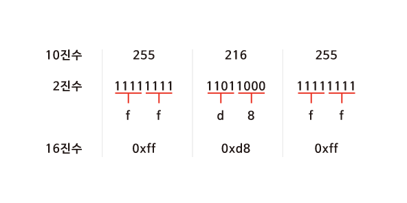
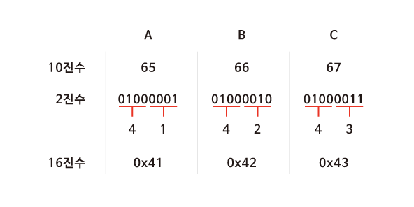
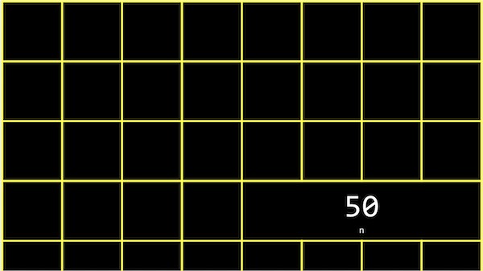
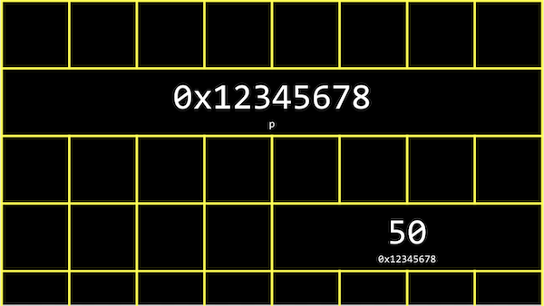
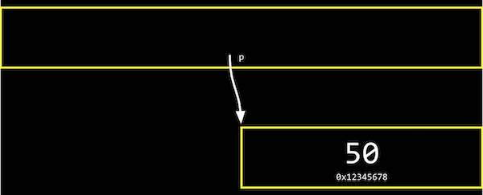
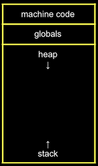
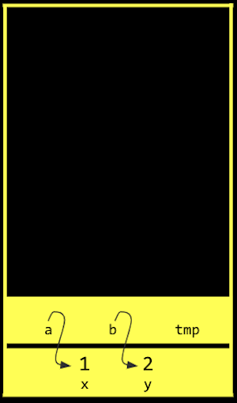

# 5. 메모리

[Naver BoostCourse CS50 2019](https://www.edwith.org/boostcourse-cs-050)

<details>
  <summary>1) 메모리 주소</summary>

# 학습 목표

16진법을 읽고 쓸 수 있다.

메모리 주소에 접근하고 값을 받아오는 코드를 C로 작성할 수 있다.

# 16진수

컴퓨터과학에서는 숫자를 10진수나 2진수 대신 **16진수(Hexadecimal)**로 표현하는 경우가 많다. 컴퓨터에서 데이터를 처리하기 위해 16진수를 사용할 때 장점이 있기 때문이다.

16진수와 일상생활에서 우리가 사용하는 10진수를 비교하면 그 차이를 알 수 있다. 16진수를 사용하면 10진수보다 2진수를 간단하게 나타낼 수 있다. 16진수로 값을 표현하는 방법을 이해하고 나면 16진수, 2진수, 10진수를 변환하는 프로그램을 만들어볼 수 있다.

# 10진수를 16진수로 바꿔 보기

JPG 이미지 파일은 항상 255 216 255 로 시작되고 이것은 10진수이다. 하지만 실제 컴퓨터 내에서는 10진수를 사용하지 않는다. 컴퓨터는 0과 1만을 이해할 수 있기 때문이다.



먼저 255 215 255를 2진수를 나타내보면 위의 그림과 같다. 2진수로 모든 데이터를 표현하기에는 너무 길어지기 때문에 16진수로 바꾸면 **2^4이 16이기 때문에 4bits씩** 두 덩어리로 나누어 보면 0000부터 1111까지는 16진수로 표현할 수 있다는 것을 알 수 있다.

그렇다면 16진수에서 10부터 15까지는 어떻게 표기할까? 10은 a, 11은 b, ..., 15는 f를 대입하여 사용한다. 4bits씩 15진수로 변환 후 **0x**를 붙여 뒤에 오는 문자들이 16진수임을 알려 준다.

# 16진수의 유용성

ASCII 코드에 의해 "A, B, C"는 10진수로 65, 66, 67에 해당한다. 컴퓨터는 10진수를 이해할 수 없으므로 2진수로 표현해보면 "01000001 01000010 01000011"이 된다. 컴퓨터가 처리할 수 있어야 하기에 어쩔 수 없지만 그 길이가 너무 긴 것을 알 수 있다.

하지만 16진수로 표현하면 2진수로 표현했을 때보다 훨씬 간단해진다. 또한 컴퓨터는 8개의 비트가 모인 바이트 단위로 정보를 표현한다. **2개의 16진수는 1byte의 2진수로 변환**되기 때문에 정보를 표현하기 매우 유용하다.



# 메모리 주소

정수형 변수 n에 50이라는 값을 저장하고 출력한다고 생각해 보자.

이 n이라는 값은 **int** 타입이므로, 아래 그림과 같이 우리 컴퓨터의 메모리 어딘가에 **4바이트** 만큼의 자리를 차지하며 저장되어 있을 것이다.



C에서는 변수의 **메모리상 주소**를 받기 위해 '**&**'이라는 연산자를 사용할 수 있다.

```c
#include <stdio.h>

int main(void)
{
    int n = 50;
    printf("%p\n", &n);
}
```

예를 들어, 위와 같은 코드를 실행하면 '0x7ffef009b75c'와 같은 값을 얻을 수 있고, 이는 변수 n의 **16진법**으로 표현된 메모리의 주소이다.

반대로 '**\***'를 사용하면 그 메모리 주소에 있는 **실제 값**을 얻을 수 있다.

```c
#include <stdio.h>

int main(void)
{
    int n = 50;
    printf("%i\n", *&n);
}
```

위 코드는 먼저 **n의 주소**를 얻고, 또 다시 **그 주소에 해당하는 값**을 얻어와 출력한 것이므로 결국 '50'이라는 값이 출력된다.

# 생각해보기

'CS50'을 16진수로 표현해보자

- ASCII코드 기준 CS50의 값은 10진수로 각각 67 83 53 48 이다
- 따라서 16진수로 표현하면 43 53 35 30 이다

</details>

<details>
  <summary>2) 포인터</summary>

# 학습하기

포인터 변수를 정의하고 사용할 수 있다.

# 포인터

지난 파트에서 배웠던 '\*' 연산자는 어떤 메모리 주소에 있는 값을 받아오게 해준다.

이 연산자를 이용해서 **포인터 역할을 하는 변수**를 선언할 수도 있다.

```c
#include <stdio.h>

int main(void)
{
    int n = 50;
    int *p = &n;
    printf("%p\n", p);
    printf("%i\n", *p);
}
```

위 코드를 보면 정수형 변수 n에는 50이라는 값이 저장되어 있다.

그리고 **\*p**라는 **포인터 변수**에 &n이라는 값, 즉 **변수 n의 주소**를 저장한다.

int *p에서 p앞의 *는 이 변수가 포인터라는 의미이고, int는 이 포인터가 int 타입의 변수를 가리킨다는 의미이다.

따라서 첫 번째 printf문과 같이 포인터 p의 값, 즉 변수 **n의 주소를 출력**하거나, 두 번째 printf문과 같이 포인터 **p가 가리키는 변수의 값**, 즉 변수 n의 값을 출력할 수도 있다.

실제 컴퓨터 메모리에서 변수 p는 아래와 같이 저장될 수 있다.



하지만 아래 그림과 같이 실제로 p의 값, 즉 n의 주소 값을 생각하지 않고, 추상적으로 단지 **p가 n을 가리키고 있다는 것**만 생각해도 된다.



이런 포인터를 기반으로 해서 앞으로 배울 다양한 데이터 구조를 정의하고 사용할 수 있다.

# 생각해보기

포인터의 크기는 메모리의 크기와 어떤 관계가 있을까?

- 컴퓨터에 있는 메모리의 크기가 크면 각각의 메모리 주소를 표현하는 숫자 또한 커지기 때문에 포인터의 크기도 커질 것 같다.

</details>

<details>
  <summary>3) 문자열</summary>

# 학습 목표

문자열 형태의 새로운 자료형인 string이 어떻게 정의되었는지 설명할 수 있다.

# 문자열

우리는 여태껏 문자열을 저장하기 위해 CS50 라이브러리에 포함된 string 자료형을 사용하였다.

아래와 같이 s에 "EMMA"라는 값을 저장한다고 생각해 보자

`string s = "EMMA";`

문자열은 결국 **문자의 배열**이고, s[0], s[1], s[2], .. 와 같이 하나의 문자가 배열의 한 부분을 나타낸다.

가장 마지막의 **\0**은 0으로 이루어진 바이트로, **문자열의 끝**을 표시하는 약속이다.


여기서 **변수 s**는 결국 이러한 **문자열을 가리키는 포인터**가 된다.

더 상세히는 문자열의 가장 첫번째 문자, 즉 주소 0x123에 있는 s[0]를 가리키게 된다.


실제 CS50 라이브러리를 보면 string 자료형은 아래와 같이 정의되어 있다.

`typedef char *string`

여기서 typedef는 새로운 자료형을, cahr \*은 문자에 대한 포인터를, string은 자료형의 이름을 의미한다.

따라서 아래 두 코드는 동일하게 동작할 것이다.

1. string 자료형을 이용하여 "EMMA" 출력

   ```c
   #include <stdio.h>
   #include <cs50.h>

   int main(void)
   {
       string s = "EMMA";
       printf("%s\n", s);
   }
   ```

2. char 포인터를 이용하여 "EMMA" 출력

   ```c
   #include <stdio.h>

   int main(void)
   {
       char *s = "EMMA";
       printf("%s\n", s);
   }
   ```

# 생각해보기

string 자료형을 정의해서 사용하면 어떤 장점이 있을까?

- 실생활에서는 char 처럼 문자 하나 단위보다 여러 문자들이 연결되어 있는 문자열을 사용하는 일이 훨씬 잦기 때문에 C에서 제공하는 기본 데이터 타입에 추가로 string 자료형을 정의해서 사용하면 보다 직관적으로 프로그래밍을 할 수 있다.

</details>

<details>
  <summary>4) 문자열 비교</summary>

# 학습 목표

문자열이 저장되어 있는 방식에 근거해서 문자열을 비교하는 방법에 대해 설명할 수 있다.

# 문자열 비교

```c
#include <stdio.h>

int main(void)
{
    char *s = "EMMA";
    printf("%p\n", s);
}
```

위 코드를 실행하면, s라는 포인터의 값, 즉 "EMMA"라는 문자열의 가장 첫 값인 "E"에 해당하는 **메모리 주소**를 출력하게 될 것이다.

그렇다면 아래 코드들은 무엇을 출력할까?

```c
printf("%p\n", &s[0]);
printf("%p\n", &s[1]);
printf("%p\n", &s[2]);
printf("%p\n", &s[3]);
```

s가 가리키는 곳을 시작으로 "EMMA"라는 문자열로 이루어진 문자들의 배열이 있으니, 각각

s라는 문자열의 첫 번째 문자에 해당하는 주소 값,

s라는 문자열의 두 번째 문자에 해당하는 주소 값,

s라는 문자열의 세 번째 문자에 해당하는 주소 값,

s라는 문자열의 네 번째 문자에 해당하는 주소 값을 출력하게 된다.

이를 좀 더 자세히 들여다보면 &s[0]는 "E"의 주소 값을, &s[1]은 "M"의 주소 값을, &[2]은 "M"의 주소 값을, &s[3]은 "A"의 주소 값을 의미한다.

문자열은 첫 번째 문자를 시작으로 메모리상에서 바로 옆에 저장되어 있다.

다시 말해, 가장 첫 번째 문자에 해당하는 **주소 값을 하나씩 증가시키면** 바로 옆에 있는 문자의 값을 출력할 수 있는 것이다.

따라서 아래 코드는 E M M A를 순서대로 출력할 것이다.

```c
printf("%c\n", *s);
printf("%c\n", *(s+1));
printf("%c\n", *(s+2));
printf("%c\n", *(s+3));
```

문자열을 비교할 때도 아래 코드와 같이 문자열이 저장된 변수를 바로 비교하게 되면 그 변수가 저장되어 있는 **주소가 다르기 때문에** 다르다는 결과가 나올 것이다.

정확한 비교를 위해서는 실제 문자열이 저장되어 있는 곳으로 이동하여, 각 문자를 하나하나씩 비교해야 된다.

```c
#include <cs50.h>
#include <stdio.h>

int main(void)
{
    //사용자로부터 s와 t 두 개의 문자열 입력받아 저장
    string s = get_string("s: ");
    string t = get_string("t: ");

    //두 문자열을 비교 (각 문자들을 비교)
    if (s == t)
    {
        printf("Same\n");
    }
    else
    {
        printf("Different\n");
    }
}
```

# 생각해보기

문자열을 비교하는 코드는 어떻게 작성해야 할까?

- 각 문자열의 첫번째 문자의 주소부터 각 문자열의 문자 하나하나씩 비교하여 모두 같으면 두 문자열이 같은 것으로 판단하는 코드를 짜야 한다. (반복문 사용하여 첫번째 문자부터 '\0' 이전까지의 문자 모두 비교)

```c
#include <cs50.h>
#include <stdio.h>

int main(void)
{
    //사용자로부터 s와 t 두 개의 문자열 입력받아 저장
    string s = get_string("s: ");
    string t = get_string("t: ");

    //문자열 s의 길이를 체크
    int n = 0;
    while (s[n] != '\0' )
    {
        n++;
    }

    //두 문자열을 비교 (각 문자들을 비교)
	  // t가 s보다 길 수도 있기 때문에 s에서 '\0'에 해당하는 s[n]과 t[n]도 비교
    for (int i = 0; i <= n; i++)

    {
        if (s[i] != t[i])
        {
            printf("Different\n");
            return 1;
        }
    }
    printf("Same\n");
}
```

</details>

<details>
  <summary>5) 문자열 복사</summary>

# 학습 목표

문자열을 복사할 수 있다.

# 문자열 복사

문자열을 복사하기 위해 아래 코드를 실행하면 어떻게 될까?

```c
#include <cs50.h>
#include <ctype.h>
#include <stdio.h>

int main(void)
{
    string s = get_string("s: ");
    string t = s;

    t[0] = toupper(t[0]);

    printf("s: %s\n", s);
    printf("t: %s\n", t);
}
```

사용자에게 입력 값을 받아 string s에 저장하고, string t를 s로 정의한다.

그리고 t의 첫 번째 문자를 toupper 함수를 이용하여 대문자로 바꾼다면 s와 t는 각각 어떻게 출력될까?

입력 값으로 "emma"를 주게 된다면, 단순한 예상과는 다르게 s와 t 모두 "Emma"라고 출력된다.

그 이유는 **s**라는 변수는 "emma" 라는 문자열이 아닌 그 문자열이 있는 **메모리의 주소가 저장**되기 때문이다.

**string s**는 **char \*s**와 동일한 의미라는 것을 떠올리면 된다.

따라서 t도 s와 동일한 주소를 가리키고 있고, t를 통한 수정은 s에도 그대로 반영이 되는 것이다.

그렇다면 두 문자열을 실제로 메모리상에서 복사하려면 어떻게 해야 할까?

아래 코드와 같이 **메모리 할당 함수**를 사용하면 된다.

```c
#include <cs50.h> // get_string()
#include <ctype.h> // toupper()
#include <stdio.h> // printf()
#include <string.h> // strlen()
#include <stdlib.h> // malloc()

int main(void)
{
    char *s = get_string("s: ");
    char *t = malloc(strlen(s) + 1);

    for (int i = 0, n = strlen(s); i < n + 1; i++)
    {
        t[i] = s[i];
    }

    t[0] = toupper(t[0]);

    printf("s: %s\n", s);
    printf("t: %s\n", t);
}
```

위의 코드와 다른 점은 **malloc**이라는 함수를 이용해서 t를 정의한다는 것이다.

malloc 이라는 함수는 정해진 크기 만큼 메모리를 할당하는 함수이다.

즉 s 문자열의 길이에 **널 종단 문자(\0)**에 해당하는 **1**을 더한 만큼 메모리에 할당한다.

그리고 루프를 돌면서 s 문자열 배열에 있는 문자 하나 하나를 t 배열에 복사해주면 된다.

이 코드를 컴파일 후 실행시키고 입력 값으로 "emma"를 주면 우리가 예상한 대로 s는 "emma"가, t는 "Emma"가 출력된다.

따라서 성공적으로 복사가 된 것을 확인할 수 있다.

<string.h> 라이브러리에 포함된 strcpy() 함수를 이용하면 문자열을 복사할 수 있다.

```c
#include <cs50.h> // get_string()
#include <stdio.h> // printf()
#include <string.h> // strlen()
#include <stdlib.h> // malloc()

int main(void)
{
    char *s = get_string("s: ");

    char *t = malloc(strlen(s) + 1);;
    strcpy(t, s); // 포인터 s가 가리키는 문자열을 다른 메모리 주소를 가리키는 포인터 t에 복사
}
```

# 생각해보기

배운 바와 같이 메모리 할당을 통해 문자열을 복사하지 않고, 단순히 문자열의 주소만 복사했을 때는 어떤 문제가 생길까?

- 복사한 문자열에 대해서만 조작을 하고 기존의 문자열에는 변화를 주고 싶지 않을 때에 의도치 않게 기존의 문자열까지도 훼손하게 되는 일이 발생한다.

</details>

<details>
  <summary>6) 메모리 할당과 해제</summary>

# 학습 목표

메모리를 할당하고 해제할 수 있다.

# 메모리 할당과 해제

malloc 함수를 이용하여 메모리를 할당한 후에는 **free**라는 함수를 이용하여 메모리를 해제해줘야 한다.

그렇지 않은 경우 메모리에 저장한 값은 **쓰레기 값**으로 남게 되어 메모리 용량의 낭비가 발생하게 된다.

이러한 현상을 '**메모리 누수**'라고 일컫는다.

**valgrind** 라는 프로그램을 사용하면 우리가 작성한 코드에서 메모리와 관련된 문제가 있는지를 쉽게 확인할 수 있다.

`help50 valgrind ./filename`와 같은 명령어를 사용하면 filename 파일에 대한 valgrind 검사 내용을 쉽게 확인할 수 있다.

아래와 같은 코드가 있다고 생각해보자

```c
#include <stdio.h>
#include <stdlib.h>

void f(void)
{
    int *x = malloc(10 * sizeof(int));
    x[10] = 0;
}

int main(void)
{
    f();
    return 0;
}
```

f 함수를 살펴보면 먼저 포인터 x에는 int 형의 사이즈(4바이트)의 10배에 해당하는 크기의 메모리, 즉 40바이트를 할당한다.

그리고 x의 11번째 값으로 0을 할당한다.

그리고 main 함수에서 f를 실행하게 되는데, 이 코드를 **valgrind** 로 검사해보면 버퍼 오버플로우와 메모리 누수 두 가지 에러를 확인할 수 있다.

먼저 **버퍼 오버플로우**는 x[10] = 0; 코드로 인해 발생한다.

우리는 10개의 int 형의 배열을 만들었는데 배열의 인덱스가 0부터 시작한다는 점을 감안하면 인덱스 10은 11번째 인덱스에 접근하겠다는 의미이고, 이는 정의되지 않은 것이기 때문에 버퍼 오버플로우가 발생하는 것이다.

따라서 이 오류는 0에서 9 사이의 인덱스를 사용하면 해결할 수 있다.

또한 **메모리 누수**는 x라는 포인터를 통해 할당한 메모리를 해제하기 위해 free(x) 라는 코드를 추가해줌으로써 해결할 수 있다.

# 생각해보기

제한된 메모리를 가지고 프로그래밍을 할 때 메모리를 해제하지 않으면 어떤 문제가 발생할 수 있을까?

- 메모리 누수로 인해 쓸데없이 메모리를 낭비하게 될 것이고, 심한 경우 낭비되고 있는 메모리 때문에 프로그램을 실행하는 데에 필요한 메모리가 충분하지 않아 충돌이 날 수 있다.

</details>

<details>
  <summary>7) 메모리 교환, 스택, 힙</summary>

# 학습 목표

메모리에 저장된 두 값을 교환하는 코드를 작성할 수 있다.

# 메모리 교환, 스택, 힙

아래와 같은 코드가 있다. 함수 **swap**은 정수 a와 b를 입력받아 그 값을 바꾸는 일을 수행한다.

main 함수에서는 x에 1, y에 2를 입력하고 swap 함수를 통해 그 두 값을 바꾸려고 하고 있다.

과연 의도대로 잘 바뀌어서 출력이 될까?

```c
#include <stdio.h>

void swap(int a, int b);

int main(void)
{
    int x = 1;
    int y = 2;

    printf("x is %i, y is %i\n", x, y);
    swap(x, y);
    printf("x is %i, y is %i\n", x, y);
}

void swap(int a, int b){
    int tmp = a;
    a = b;
    b = tmp;
}
```

위 코드를 컴파일하고 출력해보면 우리 의도와는 다르게 swap 함수를 거친 후에도 x와 y의 값이 바뀌지 않은 채 그대로 출력됨을 알 수 있다.

사실 swap 함수를 교환 작업을 제대로 수행하고 있는데, 문제는 교환하는 대상이 x, y 그 자체가 아닌 함수 내에서 새롭게 정의된 a, b라는 것이다.

a와 b는 각각 x와 y의 **값을 복제**하여 가지게 된다. **서로 다른 메모리 주소에 저장**되는 것이다.

아래 그림에서와 같이 메모리 안에는 데이터가 저장되는 구역이 나뉘어져 있다.

머신 코드 영역에는 우리 프로그램이 실행될 때 그 프로그램이 컴파일된 바이너리가 저장된다.

글로벌 영역에는 프로그램 안에서 저장된 전역 변수가 저장된다.

**힙** 영역에는 malloc으로 할당된 메모리의 데이터가 저장된다. 그리고 **스택**에는 프로그램 내의 함수와 관련된 것들이 저장된다.



이를 바탕으로 다시 생각해보면, 위의 코드에서 a, b, x, y, tmp 모두 **스택 영역**에 저장되지만, a와 x, b와 y는 그 안에서도 서로 다른 위치에 저장된 변수이다.

따라서 a와 b를 바꾸는 것은 x와 y를 바꾸는 것에 아무런 영향도 미치지 않는 것이다.

따라서 아래 그림 및 코드와 같이 a와 b를 각각 **x와 y를 가리키는 포인터로 지정**함으로써 이 문제를 쉽게 해결할 수 있다.



```c
#include <stdio.h>

void swap(int *a, int*b);

int main(void)
{
    int x = 1;
    int y = 2;

    printf("x is %i, y is %i\n", x, y);
    swap(&x, &y);
    printf("x is %i, y is %i\n", x, y);
}

void swap(int *a, int*b)
{
    int tmp = *a;
    *a = *b;
    *b = tmp;
}
```

# 생각해보기

메모리 영역을 다양하게 나누는 이유는 무엇일까?

- 메모리 영역을 다양하게 나누어 놓아야 상황과 필요에 따라 알맞게 메모리를 할당하고 해제할 수 있으며, 그래야 프로그램을 실행할 때 메모리가 서로 충돌하지 않고 올바르게 작동할 수 있을 것이다.

</details>

<details>
  <summary>8) 파일 쓰기</summary>

# 학습 목표

사용자로부터 값을 입력받아 파일에 출력하는 프로그램을 작성할 수 있다.

# 파일 쓰기

지난 강의에서 아래 그림과 같은 **메모리 구조**를 간략하게 배웠다.

다시 복습하면, **머신 코드 영역**에는 우리 프로그램이 실행될 때 그 프로그램이 컴파일된 바이너리 저장된다.

**글로벌 영역**에는 프로그램 안에서 저장된 전역 변수가 저장된다.

**힙 영역**에는 malloc으로 할당된 메모리의 데이터가 저장된다. 그리고 **스택**에는 프로그램 내의 함수와 관련된 것들이 저장된다.


힙 영역에서는 **malloc에 의해 메모리가 더 할당될수록**, 점점 사용하는 메모리의 범위가 아래로 늘어난다.

마찬가지로 스택 영역에서도 **함수가 더 많이 호출 될수록** 사용하는 메모리의 범위가 점점 위로 늘어난다.

이렇게 점점 늘어나다 보면 제한된 메모리 용량 하에서는 기존의 값을 침범하는 상황도 발생할 것이다.

이를 **힙 오버플로우** 또는 **스택 오버플로우**라고 일컫는다.

# 사용자에게 입력 받기

스택은 우리가 여태껏 많이 써왔던 get_int나 get_string과 같은 함수에서도 사용된다.

만약 이런 함수들을 직접 구현한다면 아래와 같은 코드가 될 것이다.

`get_int`

```c
#include <stdio.h>

int main(void)
{
    int x;
    printf("x: ");
    scanf("%i", &x);
    printf("x: %i\n", x);
}
```

`get_string`

```c
#include <stdio.h>

int main(void)
{
    char s[5];
    printf("s: ");
    scanf("%s", s);
    printf("s: %s\n", s);
}
```

위 코드들에서 **scanf**라는 함수는 사용자로부터 형식 지정자에 해당되는 값을 입력받아 저장하는 함수이다.

`get_int` 코드에서 int x를 정의한 후에 scanf에 x가 아닌 **&x**로 그 주소를 입력해주는 부분에 유의하자. scanf 함수의 변수가 실제로 스택 영역 안에 x가 저장된 주소로 찾아가서 사용자가 입력한 값을 저장하도록 하기 위함이다.

반면 `get_string` 코드에서는 scanf에 그대로 s를 입력해줬다. 그 이유는 s를 크기가 5인 문자열, 즉 크기가 5인 char 자료형의 배열로 정의했기 때문이다.

**clang** 컴파일러는 문자 배열의 이름을 포인터처럼 다룬다. 즉 scanf에 s라는 배열의 첫 바이트 주소를 넘겨주는 것이다.

# 파일 쓰기

이제 사용자로부터 입력을 받아 파일에 저장하는 프로그램도 작성할 수 있다.

```c
#include <cs50.h>
#include <stdio.h>
#include <string.h>

int main(void)
{
    FILE *file = fopen("phonebook.csv", "a");
    char *name = get_string("Name: ");
    char *number = get_string("Number: ");
    fprintf(file, "%s, %s\n", name, number);
    fclose(file);
}
```

**fopen**이라는 함수를 이용하면 파일을 FILE이라는 자료형으로 불러올 수 있다.

fopen 함수의 첫 번째 인자는 파일의 이름, 두 번째 인자는 모드로 r은 읽기, w는 쓰기, a는 덧붙이기를 의미한다.

사용자에게 name과 number라는 문자열을 입력 받고, 이를 **fprintf** 함수를 이용하여 printf에서처럼 파일에 직접 내용을 출력할 수 있다.

작업이 끝난 후에는 **fclose** 함수로 파일에 대한 작업을 종료해줘야 한다.

# 생각해보기

get_long, get_float, get_char도 비슷한 방식으로 직접 구현할 수 있을까?

`get_long`

```c
#include <stdio.h>

int main(void)
{
    long x;
    printf("x: ");
    scanf("%li", &x);
    printf("x: %li\n", x);
}
```

`get_float`

```c
#include <stdio.h>

int main(void)
{
    float x;
    printf("x: ");
    scanf("%f", &x);
    printf("x: %.3f\n", x);
}
```

`get_char`

```c
#include <stdio.h>

int main(void)
{
    char x;
    printf("x: ");
    scanf("%c", &x);
    printf("x: %c\n", x);
}
```

</details>

<details>
  <summary>9) 파일 읽기</summary>

# 학습 목표

파일을 읽고 JPEG 파일인지를 검사하는 프로그램을 작성할 수 있다.

# 파일 읽기

이전 강의에서 파일에 쓰는 프로그램을 작성했다면, 이번에는 파일의 내용을 읽어서 파일의 형식이 JPEG 이미지인지를 검사하는 프로그램을 작성해보자

```c
#include <stdio.h>

int main(int argc, char *argv[])
{
    if (argc != 2)
    {
        return 1;
    }

    FILE *file = fopen(argv[1], "r");

    if (file == NULL)
    {
        return 1;
    }

    unsigned char bytes[3];
    fread(bytes, 3, 1, file);

    if (bytes[0] == 0xff && bytes[1] == 0xd8 && bytes[2] == 0xff)
    {
        printf("Maybe\n");
    }
    else
    {
        printf("No\n");
    }
    fclose(file);
}
```

위 코드에서 main 함수를 보면 사용자로부터 입력을 받는 것을 알 수 있다.

여기서는 **파일의 이름**을 입력으로 받을 예정이다.

만약 argc가 2가 아니라면, 파일명이 입력되지 않았거나 파일명 외의 다른 인자가 입력되었기 때문에 1(오류)을 리턴하고 프로그램을 종료한다.

만약 argc가 2라면 프로그램이 그대로 진행된다.

입력받은 파일명(argv[1])을 '**읽기(r)**' 모드로 불러온다.

만약 파일이 제대로 열리지 않으면 fopen 함수는 NULL을 리턴하기 때문에 이를 검사해서 file을 제대로 쓸 수 있는지를 검사하고, 아니라면 역시 1(오류)를 리턴하고 프로그램을 종료한다.

만약 파일이 잘 열렸다면, 프로그램이 계속 진행된다.

그 후 크기가 3인 문자 배열을 만들고, fread 함수를 이용해서 파일에서 첫 바이트를 읽어온다.

fread 함수의 각 인자는 (배열, 읽을 바이트 수, 읽을 횟수, 읽을 파일)을 의미한다.

그리고 마지막으로 읽어들인 각 바이트가 각각 0xff, 0xd8, 0xff 인지를 확인한다.

이는 **JPEG 형식의 파일을 정의할 때 만든 약속**으로, JPEG 파일의 시작점에 꼭 포함되어 있어야 한다.

따라서 이를 검사하면 JPEG 파일인지를 확인할 수 있다.

# 생각해보기

JPEG 외에 다른 파일 형식도 그 형식임을 알려주는 약속이 있을까?

- GIF - 0x47("G") 0x49("I") 0x46("F")
- PNG - 0x80("‰") 0x50("P") 0x4e("N") 0x47("G") 0x0d("CR") 0x0a("LF") 0x1A("SUB") 0x0a("LF")

- "gif header", "png header"로 검색

</details>
