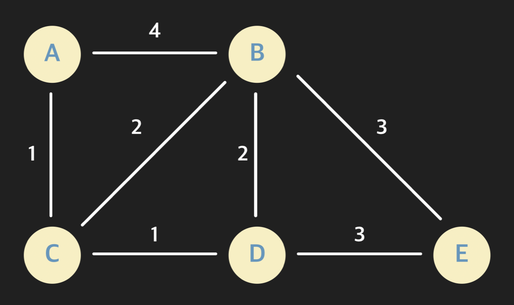

# 3. 그래프

[코드잇 자료구조 코스](https://www.codeit.kr/courses/data-structures)

<details>
  <summary>1) 그래프란?</summary>
  <details>
    <summary>연결 관계 데이터와 그래프 & 그래프 기본 용어 정리</summary>

# 연결 관계 데이터와 그래프

우리가 자료 구조를 공부하는 이유 중 하나는, 상황에 맞는 방식으로 데이터를 저장하고 사용하기 위함임. 데이터 사이에 어떤 관계가 있는지에 따라 적절한 자료 구조를 골라서 사용해야 함.

전후 관계를 저장하고 싶으면 배열이나 링크드 리스트처럼 선형적 자료 구조를, 계층적 관계를 저장하고 싶으면 트리를 사용하면 됨

## 그래프

그래프는 연결 관계를 표현하기 위해 사용함

연괄 관계 예시: 위치 데이터, 사회 연결망

### 다양한 연결 관계

- 통신: 수많은 컴퓨터들의 연결 관계인 인터넷
- 생물: 유전자와 단백질의 상호 작용 관계

# 그래프 용어 / 성질 정리

## 그래프 기본 용어

- 노드: 그래프에서 하나의 데이터 단위를 나타내는 객체.
- 엣지: 그래프에서 두 노드의 직접적인 연결 관계 데이터. 두 노드 사이에 엣지가 있을 때, "두 노드는 인접해 있다"라고 표현함. 엣지가 갖는 특성에 따라 그래프의 종류가 나뉘기도 함
  - 방향 그래프 (directed graph): 방향 그래프에서는 엣지들이 방향을 갖는다. 인스타그램의 팔로우 관계처럼 한 유저가 다른 유저를 팔로우하는 일방적인 관계를 나타낼 수 있게 해준다.
  - 가중치 그래프 (weighted graph): 가중치 그래프에서는 엣지들의 연결 관계뿐만 아니라 어떤 정보를 나타내는 수치를 가진다. 그 정보는 예를 들자면 친구 관계에서는 친밀도, 위치 정보 그래프면 두 장소 사이의 거리 같은 것이다.
- 차수(degree): 하나의 노드에 연결된 엣지들의 수
  - 무방향 그래프(undirected graph)에서는 하나의 노드에 연결된 엣지들의 수를 나타내고, 방향 그래프에서는 노드를 떠나는 엣지의 수를 출력 차수(outdegree), 노드에 들어오는 엣지의 수를 입력 차수(indegree)로 구별해서 부른다.
- 경로: 한 노드에서 다른 노드까지 가는 길. 두 노드가 서로 인접해있지 않다고 해서 두 노드 사이의 경로가 없는 건 아니다. 두 노드 사이를 이어주는 길을 경로라고 한다
  - 경로의 거리
    - 비가중치 그래프: 한 경로에 있는 엣지의 수
    - 가중치 그래프: 한 경로에 있는 엣지의 가중치의 합
  - 최단 경로: 두 노드 사이의 경로 중 거리가 가장 짧은 경로
  - 사이클: 한 노드에서 시작해서 같은 노드로 돌아오는 경로

## 연결된 그래프

그래프는 여러 개의 노드와 엣지들을 갖지만, 그래프 안에 있는 모든 노드들이 서로 경로를 통해 연결될 필요는 없다.

서로 연결된 노드들의 집합이 서로 나누어져 있을 수도 있고, 조금 더 극단적인 예시를 보면 아예 엣지가 없고 노드만 있는 그래프도 있을 수 있는 것이다.

  </details>
  <details>
    <summary>그래프 노드 구현</summary>

# 그래프 노드 구현

```python
class StationNode:
  """지하철 역 노드를 나타내는 클래스"""
  def __init__(self, name, num_exits):
    self.name = name
    self.num_exits = num_exits

# 지하철 역 노드 인스턴스 생성
station_0 = StationNode("교대역", "14")
station_1 = StationNode("사당역", "14")
station_2 = StationNode("종로3가역", "16")
station_3 = StationNode("서울역", "16")

# 노드들을 파이썬 리스트에 저장 (해시 테이블로 구현되어 있음)
# 노드의 각 고유한 인덱스를 통해 빠르게 접근할 수 있음
stations = [station_0, station_1, station_2, station_3]

print(stations[3].name) # 서울역

# 지하철 역 노드들을 파이썬 딕셔너리에 저장
# 좀 더 직관적으로 노드들을 가져올 수 있음
stations = {
  "교대역": station_0,
  "사당역": station_1,
  "종로3가역": station_2,
  "서울역": station_3
}

node_1 = stations["교대역"]
node_2 = stations["서울역"]

# 만약 SNS에서 이름을 key로 사용하는 경우 key가 겹치는 경우가 발생
# 그럴 땐 사용자의 이메일 주소와 같이 겹치지 않는 것을 key로 사용하면 됨
```

# 그래프 노드 만들어보기

stations.txt 파일에는 각 줄에 각 호선의 역 이름이 "소요산 - 동두천 - 보산 ... " 이런 식으로 저장되어 있다.

```python
class StationNode:
    """간단한 지하철 역 노드 클래스"""
    def __init__(self, station_name):
        self.station_name = station_name


def create_station_nodes(input_file):
    """input_file에서 데이터를 읽어 와서 지하철 그래프 노드들을 리턴하는 함수"""
    stations = {}  # 지하철 역 노드들을 담을 딕셔너리

    # 파라미터로 받은 input_file 파일을 연다
    with open(input_file) as stations_raw_file:
        for line in stations_raw_file:  # 파일을 한 줄씩 받아온다
            subway_line = line.strip().split("-")  # 앞 뒤 띄어쓰기를 없애고 "-"를 기준점으로 데이터를 나눈다

            for name in subway_line:
                station_name = name.strip()  # 앞 뒤 띄어쓰기 없애기

                # 지하철 역 이름이 이미 저장된 key인지 확인
                if station_name not in stations:
                    # 새로운 노드 인스턴스를 생성하고
                    current_station = StationNode(station_name)
                    # dictionary에 역 이름은 key로, 역 노드 인스턴스를 value로 저장한다
                    stations[station_name] = current_station

    return stations

stations = create_station_nodes("./stations.txt")  # stations.txt 파일로 그래프 노드들을 만든다

# stations에 저장한 역들 이름 출력 (체점을 위해 역 이름 순서대로 출력)
for station in sorted(stations.keys()):
    print(stations[station].station_name)
```

  </details>
  <details>
    <summary>엣지 구현</summary>

# 엣지 구현 1: 인접 행렬

## 인접 행렬

- 각 노드를 배열 또는 파이썬 리스트에 저장해 고유 정수 인덱스를 준다
- 노드 수 X 노드 수 크기의 행렬을 만든다
- 노드들의 엣지 유무 및 가중치에 따라 행렬의 요소를 채운다.

# 인접 행렬 구현

## 구현할 그래프


위에 있는 무방향 그래프를 구현하자. 각 노드 위나 옆에 있는 정수가 노드의 고유 숫자이다. 이 고유 숫자를 행렬의 인덱스로 사용한다.

## 내가 짠 코드

```python
# 모든 요소를 0으로 초기화시킨 크기 6 x 6 인접 행렬
adjacency_matrix = [[0 for i in range(6)] for i in range(6)]

adjacency_matrix[0] = [0, 1, 1, 0, 0, 0]
adjacency_matrix[1] = [1, 0, 0, 1, 0, 1]
adjacency_matrix[2] = [1, 0, 0, 0, 0, 1]
adjacency_matrix[3] = [0, 1, 0, 0, 1, 1]
adjacency_matrix[4] = [0, 0, 0, 1, 0, 1]
adjacency_matrix[5] = [0, 1, 1, 1, 1, 0]

print(adjacency_matrix)
```

## 다른 회원 코드

```python
# 모든 요소를 0으로 초기화시킨 크기 6 x 6 인접 행렬
adjacency_matrix = [[0 for i in range(6)] for i in range(6)]

adjacency_matrix[0][1]=1
adjacency_matrix[0][2]=1
adjacency_matrix[1][3]=1
adjacency_matrix[1][5]=1
adjacency_matrix[2][5]=1
adjacency_matrix[3][4]=1
adjacency_matrix[3][5]=1
adjacency_matrix[4][5]=1

# 나머지 절반 자동으로 채우기 (i와 j 순서에 유의)
for i in range(6):
    for j in range(6):
        adjacency_matrix[j][i]=adjacency_matrix[i][j]

print(adjacency_matrix)
```

# 엣지 구현 2: 인접 리스트

## 인접 리스트

- 각 노드의 엣지를 리스트에 저장하는 방법
- 각 노드마다 스스로 연결된 노드들에 대한 레퍼런스를 리스트로 저장
- 가중치 그래프의 경우 연결된 노드에 대한 레퍼런스와 가중치를 튜플에 저장 ex) [(노드1, 3), (노드2, 5)]

# 인접 리스트 연습

### StationNode.py

```python
class StationNode:
    """간단한 지하철 역 노드 클래스"""
    def __init__(self, station_name):
        self.station_name = station_name
        self.adjacent_stations = []  # 인접 리스트

    def add_connection(self, other_station):
        """지하철 역 노드 사이 엣지 저장하기"""
        self.adjacent_stations.append(other_station)
        other_station.adjacent_stations.append(self)

    def __str__(self):
        """지하철 노드 문자열 메소드. 지하철 역 이름과 연결된 역들을 모두 출력해준다"""
        res_str = f"{self.station_name}: "  # 리턴할 문자열

        # 리턴할 문자열에 인접한 역 이름들 저장
        for station in self.adjacent_stations:
            res_str += f"{station.station_name} "

        return res_str
```

### 내가 쓴 main.py

```python
from StationNode import *

# 코드를 추가하세요
def create_subway_graph(input_file):
    """input_file에서 데이터를 읽어 와서 지하철 그래프를 리턴하는 함수"""
    stations = {}  # 지하철 역 노드들을 담을 딕셔너리

    # 파라미터로 받은 input_file 파일을 연다
    with open(input_file) as stations_raw_file:
        for line in stations_raw_file:  # 파일을 한 줄씩 받아온다
            subway_line = line.strip().split("-")  # 앞 뒤 띄어쓰기를 없애고 "-"를 기준점으로 데이터를 나눈다

            for name in subway_line:
                station_name = name.strip()  # 앞 뒤 띄어쓰기 없애기

                # 지하철 역 이름이 이미 저장한 key 인지 확인
                if station_name not in stations:
                    current_station = StationNode(station_name)  # 새로운 인스턴스를 생성하고
                    stations[station_name] = current_station  # dictionary에 역 이름은 key로, 역 노드 인스턴스를 value로 저장한다

						# 첫번째 역부터 마지막에서 두번째 역까지 돈다
            for i in range(len(subway_line) - 1):
								# 현재 역과 다음 역의 이름을 받아온다
                current_station_name = subway_line[i].strip()
                next_station_name = subway_line[i+1].strip()

								# 현재 역과 다음 역의 노드 인스턴스를 각각 받아온다
                current_station = stations[current_station_name]
                next_station = stations[next_station_name]

                # 서로 인접한 두 역 사이의 엣지를 생성한다
								current_station.add_connection(next_station)


    return stations

stations = create_subway_graph("./stations.txt")  # stations.txt 파일로 그래프를 만든다

# stations에 저장한 역 인접 역들 출력 (체점을 위해 역 이름 순서대로 출력)
for station in sorted(stations.keys()):
        print(stations[station])
```

### 코드잇 해설 [main.py](http://main.py) (더 나은 코드)

```python
from StationNode import *

# 코드를 추가하세요
def create_subway_graph(input_file):
    """input_file에서 데이터를 읽어 와서 지하철 그래프를 리턴하는 함수"""
    stations = {}  # 지하철 역 노드들을 담을 딕셔너리

    # 파라미터로 받은 input_file 파일을 연다
    with open(input_file) as stations_raw_file:
        for line in stations_raw_file:  # 파일을 한 줄씩 받아온다
            subway_line = line.strip().split("-")  # 앞 뒤 띄어쓰기를 없애고 "-"를 기준점으로 데이터를 나눈다

            # 엣지를 저장하기 위한 도우미 변수. 현재 보고 있는 역 전 역을 저장한다
            previous_station = None

            for name in subway_line:
                station_name = name.strip()  # 앞 뒤 띄어쓰기 없애기

                # 지하철    역 이름이 이미 저장한 key 인지 확인
                if station_name not in stations:
                    current_station = StationNode(station_name)  # 새로운 인스턴스를 생성하고
                    stations[station_name] = current_station  # dictionary에 역 이름은 key로, 역 노드 인스턴스를 value로 저장한다
                # 이미 저장한 역이면 stations에서 역 인스턴스를 갖고 온다
                else:
                    current_station = stations[station_name]

                if previous_station is not None:
                    # 현재 역과 전 역의 엣지를 연결한다
                    current_station.add_connection(previous_station)

                # 현재 역을 전 역으로 저장
                previous_station = current_station

    return stations

stations = create_subway_graph("./stations.txt")  # stations.txt 파일로 그래프를 만든다

# stations에 저장한 역 인접 역들 출력 (체점을 위해 역 이름 순서대로 출력)
for station in sorted(stations.keys()):
        print(stations[station])
```

해설에서 제공한 코드에서는 도우미 변수 previous_station을 이용하여, 내 코드처럼 굳이 반복문을 한 번 더 돌지 않아도 되어서 더 효율적인 것으로 보인다.

  </details>
  <details>
    <summary>인접 행렬 vs 인접 리스트</summary>

# 인접 행렬 vs 인접 리스트

## 복잡도 표현 기호

보통 다른 자료 구조들을 공부할 때는 들어있는 데이터 수를 n이라고 했음.

그래프를 분석할 때는 다른 알파벳들을 씀.

### _V_

*V*는 그래프 안에 있는 모든 노드들의 집합.

그래프에 있는 하나의 데이터 객체를 노드라고도 부르지만, Vertex라는 표현을 사용하기도 함.

### _E_

*E*는 그래프 안에 있는 모든 엣지(Edge)들의 집합.

원래 *V*와 *E*는 노드와 엣지의 수를 나타내는 건 아닌데, 점근 표기법에서 사용할 때 *V*는 모든 노드의 수, 그리고 *E*를 모든 엣지의 수로 사용하기도 한다.

### *V*와 *E*의 관계

노드 수가 *V*일 때 그래프 안에는 최대 몇 개의 엣지가 있을 수 있을까?

- 무방향 그래프: V^(2)/2
- 방향 그래프: V^(2)

두 경우 모두 V^(2)에 비례하는 만큼의 엣지를 가질 수 있음. 그렇기 때문에 *E*는 최악의 경우 V^(2)에 비례함.

그래프를 배울 때는 O(n), O(lg(n)) 이런 점근 표기법 대신 O(V), O(E), O(lg(V)) 이렇게 표시를 한다.

## 노드를 저장하는 공간

일단 인접 행렬을 사용하던 인접 리스트를 사용하던 노드들을 저장해야 되는데, 총 *V*개의 노드를 저장하기 때문에 노드를 저장하는 데에는 **O(V)**의 공간을 사용한다고 할 수 있음.

## 인접 행렬이 차지하는 공간

인접 행렬을 정의할 때에는 "총 노드의 수 x 총 노드의 수"만큼의 행렬을 만들었음

그래프 안에 있는 노드의 수가 *V*라고 할 때 인접 행렬은 _V_ x _V_ 크기의 행렬을 저장하고 각 요소들이 0 또는 1을 저장했음. 그럼 총 V^(2)개의 정수를 저장한 것임. 따라서 인접 행렬은 총 V^(2)에 비례하는 공간, **O(V^(2))**의 공간을 차지함

## 인접 리스트가 차지하는 공간

인접 리스트는 각 노드가 자신과 인접한 노드들을 가리키는 레퍼런스를 저장하고 있다

일단 모든 노드는 하나의 인접 리스트를 갖는다. 따라서 총 *V*개의 배열 또는 파이썬 리스트를 저장해야 함. *V*에 비례하기 때문에 일단 최소 O(V) 만큼의 공간을 차지한다.

그럼 엣지를 저장하는데는 얼만큼의 공간을 사용할까? 모든 노드에 저장된 엣지 데이터를 다 합치면 무방향 그래프일 때 _2E_, 방향 그래프일 때는 *E*이다. (무방향 그래프는 똑같은 엣지를 2개씩 저장하기 때문). 총 저장하는 레퍼런스 수는 *E*에 비례한다고 할 수 있음. **O(E)**

그럼에도 불구하고 *E*는 최악의 경우 (모든 노드가 서로 다른 모든 노드에 연결된 경우) V^(2)에 비례.

그렇기 때문에 O(V+E)라고 볼 수도 있겠지만, E=O(V^(2))라는 최악의 경우를 생각하면 읹버 리스트도 O(V^(2))의 공간을 차지한다고 할 수 있음

하지만 좀 더 공간 복잡도를 현실적으로 표기하기 위해 주로 O(V+E)라고 한다.

## 두 노드가 연결됐는지 확인하는 데 걸리는 시간

**인접 행렬**을 이용하면 두 노드가 인접하는지 아닌지를 O(1)로 알아낼 수 있음.

ex) `adjacency_matrix[3][5]`

**인접 리스트**는 어떨까?

```python
gangnam_station = stations["강남"]
seocho_station = stations["서초"]

print(seocho_stations in gangnam_station.adjacent_stations)
```

이런 식으로 한 노드의 리스트 안에 특정 역이 저장됐는지를 탐색해야 함. 선형 탐색을 해야하기 때문에 리스트 안에 있는 데이터를 다 돌아야 한다. 몇 개의 데이터가 있는지에 따라 다르겠지만, 최악의 경우 *V*개의 요소를 확인해야 함

## 한 노드에 연결된 모든 노드들을 알아내는 데 걸리는 시간

주로 한 노드에 연결된 모든 노드를 가지고 오는 작업을 많이 한다면 어떤 방법을 사용하는 게 좋을까?

인접 행렬에서는 한 노드를 나타내는 배열, 또는 파이썬 리스트 전체를 다 돌아야지만 그 노드가 연결된 다른 노드들을 갖고 올 수 있다. 그러니까 리스트 안에 있는 데이터를 하나씩 돌면서 0인지 1인지 확인해야 된다. 모든 리스트 안에는 총 *V*개의 데이터 요소가 들어 있으니까 매번 *V*번 돌아야 한다.

인접 리스트를 쓸 때는 각 노드가 자신과 인접한 노드들에 대한 레퍼런스만 갖고 있다. 물론 최악의 경우 한 노드가 다른 모든 노드들과 연결되어 있으면, 인접 행렬과 마찬가지로 총 *V*번 돌아서 인접한 노드들을 가지고 와야되기는 하지만, 그런 경우는 그렇게 많지 않다. 대부분의 경우 인접 행렬을 사용하는 것보다 더 빠르게 실행된다.

결국 위와 같은 용도로는 인접 리스트를 사용하는 게 인접 행렬을 사용하는 것보다 좀 더 효율적이다.

  </details>
</details>
<details>
  <summary>2) 그래프 탐색</summary>
  <details>
    <summary>그래프 탐색이란? & BFS 알고리즘</summary>

# 그래프 탐색이란?

## 그래프 탐색

- 하나의 시작점 노드에서 연결된 노드들을 모두 찾는 것

그래프 순회라고도 함

각 노드들을 어떤 순서로 탐색하는지에 따라 Breadth First Search, Depth First Search로 나뉨

# BFS(Breadth First Search) 개념

## BFS

그래프를 수평적으로, 너비 우선적으로 탐색하는 알고리즘

# 큐

## 큐

- 맨 뒤에 데이터 삽입
- 맨 앞 데이터 삭제
- 맨 앞 데이터 접근

큐는 위와 같은 기능들을 약속하는 추상 자료형임. FIFO (First-in-first-out)

## 파이썬에서 큐 사용하기

```python
from collections import deque

queue = deque()

# 큐 맨 끝에 데이터 추가
queue.append("태호")
queue.append("영훈")
queue.append("현승")
queue.append("지웅")

# 큐 데이터를 출력한다
print(queue) # deque(['태호', '영훈', '현승', '지웅'])

# 큐 맨 앞 데이터를 삭제한다
# 보통 큐에서도 맨 앞 데이터를 삭제하면 해당 메소드가 삭제한 데이터를 리턴한다
print(queue.popleft()) # 태호
print(queue.popleft()) # 영훈
print(queue.popleft()) # 현승

# 큐 데이터를 출력한다
print(queue) # deque(['지웅'])
```

큐는 BFS 알고리즘에서 굉장히 중요한 역할을 한다.

# BFS 알고리즘

## BFS 알고리즘

- 시작 노드를 방문 표시 후, 큐에 넣음
- 큐에 아무 노드가 없을 때까지:
  - 큐 가장 앞 노드를 꺼낸다
  - 꺼낸 노드에 인접한 노드들을 모두 보면서:
    - 처음 방문한 노드면:
      - 방문한 노드 표시를 해준다
      - 큐에 넣어준다

# BFS로 연결된 역 찾기 구현

## subway_graph.py

```python
class StationNode:
    """지하철 역을 나타내는 역"""
    def __init__(self, station_name):
        self.station_name = station_name
        self.adjacent_stations = []
        self.visited = False

    def add_connection(self, station):
        """파라미터로 받은 역과 엣지를 만들어주는 메소드"""
        self.adjacent_stations.append(station)
        station.adjacent_stations.append(self)

def create_station_graph(input_file):
    stations = {}

    # 일반 텍스트 파일을 여는 코드
    with open(input_file) as stations_raw_file:
        for line in stations_raw_file:  # 파일을 한 줄씩 받아온다
            previous_station = None  # 엣지를 저장하기 위한 변수
            raw_data = line.strip().split("-")

            for name in raw_data:
                station_name = name.strip()

                if station_name not in stations:
                    current_station = StationNode(station_name)
                    stations[station_name] = current_station

                else:
                    current_station = stations[station_name]

                if previous_station is not None:
                    current_station.add_connection(previous_station)

                previous_station = current_station

    return stations
```

## 내가 짠 main.py

```python
from collections import deque
from subway_graph import create_station_graph

def bfs(graph, start_node):
    """시작 노드에서 bfs를 실행하는 함수"""
    queue = deque()  # 빈 큐 생성

    # 일단 모든 노드를 방문하지 않은 노드로 표시
    for station_node in graph.values():
        station_node.visited = False

    # 첫번째 노드에 방문 표시하고 큐에 넣는다
    start_node.visited = True
    queue.append(start_node)

    while len(queue) != 0:
        current_station = queue.popleft()
        for adjacent_station in current_station.adjacent_stations:
            if adjacent_station.visited is False:
                adjacent_station.visited = True
                queue.append(adjacent_station)


stations = create_station_graph("./new_stations.txt")  # stations.txt 파일로 그래프를 만든다

gangnam_station = stations["강남"]

# 강남역과 경로를 통해 연결된 모든 노드를 탐색
bfs(stations, gangnam_station)

# 강남역과 서울 지하철 역들이 연결됐는지 확인
print(stations["강동구청"].visited) # True
print(stations["평촌"].visited) # True
print(stations["송도"].visited) # True
print(stations["개화산"].visited) # True

# 강남역과 대전 지하철 역들이 연결됐는지 확인
print(stations["반석"].visited) # False
print(stations["지족"].visited) # False
print(stations["노은"].visited) # False
print(stations["(대전)신흥"].visited) # False
```

## 코드잇 해설 main.py

```python
from collections import deque
from subway_graph import create_station_graph

def bfs(graph, start_node):
    """시작 노드에서 bfs를 실행하는 함수"""
    queue = deque()  # 빈 큐 생성

    # 일단 모든 노드를 방문하지 않은 노드로 표시
    for station_node in graph.values():
        station_node.visited = False

    # 시작점 노드를 방문 표시한 후 큐에 넣어준다
    start_node.visited = True
    queue.append(start_node)

    while queue: # 큐에 노드가 있는 동안 계속
        current_station = queue.popleft() # 큐의 가장 앞 데이터를 갖고 온다
        for neighbor in current_node.adjacent_stations: # 인접한 노드를 돌면서
            if not neighbor.visited: # 방문하지 않은 노드면
                neighbor.visited = True # 방문 표시를 하고
                queue.append(neighbor) # 큐에 넣는다


stations = create_station_graph("./new_stations.txt")  # stations.txt 파일로 그래프를 만든다

gangnam_station = stations["강남"]

# 강남역과 경로를 통해 연결된 모든 노드를 탐색
bfs(stations, gangnam_station)

# 강남역과 서울 지하철 역들이 연결됐는지 확인
print(stations["강동구청"].visited) # True
print(stations["평촌"].visited) # True
print(stations["송도"].visited) # True
print(stations["개화산"].visited) # True

# 강남역과 대전 지하철 역들이 연결됐는지 확인
print(stations["반석"].visited) # False
print(stations["지족"].visited) # False
print(stations["노은"].visited) # False
print(stations["(대전)신흥"].visited) # False
```

해설의 `while queue`, `if not neighbor.visited` 이 두 부분을 보면서 내 코드를 좀 더 간결하게 쓰는 게 좋겠다는 생각이 들었다.

# BFS 알고리즘 시간 복잡도 분석

총 노드의 수 = _V_

총 엣지의 수 = _E_

## BFS 알고리즘

- (처음에 모든 노드를 방문하지 않았다고 표시)
- 시작점 노드를 방문 표시한 후, 큐에 넣는다
- 큐에 아무 노드도 없을 때까지:
  - 큐에서 가장 앞 노드를 꺼낸다
  - 이 노드에 인접해 있는 노드들을 돌면서:
    - 처음 방문한 노드면:
      - 방문한 노드로 표시한다
      - 큐에 넣는다

## BFS 노드 전처리

먼저 모든 노드를 방문 하지 않는 노드로 표시하는 데는 *V*의 시간이 걸린다.

모든 노드를 다 돌면서 방문했다는 노드 표시인 `visited` 변수를 `False`로 만들어야 하기 때문

## 큐에 노드를 넣고 빼는 데 걸리는 시간

BFS는 방문한 노드를 표시하고 다시 방문하지 않는다. 큐에 들어가는 노드는 딱 한 번만 들어가고 다시 들어갈 수 없다는 뜻. 큐는 더블리 링크드 리스트를 사용하면 맨 뒤에 삽입하고 맨 앞에 있는 데이터를 꺼내오는 연산들을 O(1)으로 할 수 있음. (파이썬 deque는 더블리 링크드 리스트로 구현되었음)

최대 *V*개의 노드들이 큐에 들어갔다 나옴. 노드들이 큐에 들어갔다 나오는 데 걸리는 총 시간은 **O(V)**라고 할 수 있음

## 큐에서 뺀 노드의 인접한 노드들을 도는 데 걸리는 시간

큐에서 노드를 꺼낼 때마다 그 노드에 인접한 다른 노드들을 도는데, 이 부분은 다 합치면 얼마나 걸릴까?

모든 노드는 큐에 한 번만 들어가서 한 번만 나옴. 노드가 한 번 나올 때마다 그 노드의 인접 리스트를 돌게 됨. 그러니까 모든 노드들의 인접 리스트를 딱 한 번만 돈다고도 할 수 있음.

그럼 총 엣지 수가 *E*니까 이 단계도 총 *E*에 비례하는 만큼 실행된다고 할 수 있음.

큐에서 뺀 노드들의 인접한 노드들을 도는데 **O(E)**가 걸리는 것임

## 정리

- 전처리: O(V)
- 큐에서 노드 넣고 빼기: O(V)
- 인접한 노드들을 도는 데 걸리는 시간: O(E)

총 **O(V+E)**의 시간이 걸린다고 할 수 있음

  </details>
  <details>
    <summary>DFS 알고리즘</summary>

# DFS(Depth First Search) 개념

## Depth First Search(DFS): 깊이 우선 탐색

하나의 노드에 인접한 모든 노드를 우선적으로 탐색하는 대신, 하나의 노드에서 시작해서 최대한 깊이, 멀리 가서 탐색하는 방법

# 스택

BFS에서 큐가 중요했던 것처럼, DFS에서는 스택이 중요함

## 스택

- 맨 뒤에 데이터 추가
- 맨 뒤 데이터 삭제
- 맨 뒤 데이터 접근

스택은 위와 같은 기능을 약속하는 추상 자료형임. LIFO(Last-in-first-out)

## 파이썬에서 스택 사용하기

스택도 큐와 마찬가지로 파이썬에서 자료형 deque로 씀.

```python
from collections import deque

stack = deque()

# 스택 뒤에 정보 추가: "Taeho!"
stack.append("T")
stack.append("a")
stack.append("e")
stack.append("h")
stack.append("o")

# 스택 정보를 출력한다
print(stack) # deque(['T', 'a', 'e', 'h', 'o'])

# 스택 마지막 정보를 삭제한다
# 보통 스택에서 마지막 데이터를 삭제하면 해당 메소드가 삭제한 데이터를 리턴한다
print(stack.pop()) # o
print(stack.pop()) # h
print(stack.pop()) # e

# 스택 정보를 출력한다
print(stack) # deque(['T', 'a'])
```

스택은 가장 뒤 데이터를 삭제할 수 있다. 파이썬 deque에서는 `pop` 메소드를 이용하면 뒤에서부터 데이터를 삭제할 수 있다. 큐를 쓸 때 배웠던 `popleft` 메소드와 같이 `pop` 메소드도 삭제하는 데이터를 리턴한다.

# DFS 알고리즘

## DFS 알고리즘

- 시작 노드를 옅은 회색 표시 후, 스택에 넣음
- 스택에 아무 노드가 없을 때까지:
  - 스택 가장 위 노드를 꺼낸다
  - 노드를 방문 (진한 회색) 표시한다
  - 인접한 노드들을 모두 보면서:
    - 처음 방문하거나 스택에 없는 노드면:
      - 옅은 회색 표시를 해준다
      - 스택에 넣어준다

# DFS로 연결된 역 찾기 구현

## subway_graph.py

```python
class StationNode:
    """간단한 지하철 역 노드 클래스"""
    def __init__(self, station_name):
        self.station_name = station_name
        self.visited = 0  # 한 번도 본적 없을 때: 0, 스택에 있을 때: 1, 발견된 상태: 2
        self.adjacent_stations = []

    def add_connection(self, other_station):
        """지하철 역 노드 사이 엣지 저장하기"""
        self.adjacent_stations.append(other_station)
        other_station.adjacent_stations.append(self)

def create_station_graph(input_file):
    """input_file에서 데이터를 읽어 와서 지하철 그래프 노드들을 리턴하는 함수"""
    stations = {}  # 지하철 역 노드들을 담을 딕셔너리

    # 파라미터로 받은 input_file 파일을 연다
    with open(input_file) as stations_raw_file:
        for line in stations_raw_file:  # 파일을 한 줄씩 받아온다
            previous_station = None  # 엣지를 저장하기 위한 도우미 변수. 현재 보고 있는 역 전 역을 저장한다
            subway_line = line.strip().split("-")  # 앞 뒤 띄어쓰기를 없애고 "-"를 기준점으로 데이터를 나눈다

            for name in subway_line:
                station_name = name.strip()  # 앞 뒤 띄어쓰기 없애기

                # 지하철 역 이름이 이미 저장한 key 인지 확인
                if station_name not in stations:
                    current_station = StationNode(station_name)  # 새로운 인스턴스를 생성하고
                    stations[station_name] = current_station  # dictionary에 역 이름은 key로, 역 인스턴스를 value로 저장한다

                else:
                    current_station = stations[station_name]  # 이미 저장한 역이면 stations에서 역 인스턴스를 갖고 온다

                if previous_station is not None:
                    current_station.add_connection(previous_station)  # 현재 역과 전 역의 엣지를 연결한다

                previous_station = current_station  # 현재 역을 전 역으로 저장

    return stations
```

## main.py

```python
from collections import deque
from subway_graph import *

def dfs(graph, start_node):
    """최단 경로용 bfs 함수"""
    stack = deque()  # 빈 큐 생성

    # 모든 노드를 처음 보는 노드로 초기화
    for station_node in graph.values():
        station_node.visited = 0

    # 시작점 노드를 스택에 넣는다는 표시(옅은 회색) 후, 스택에 넣는다
    start_node.visited = 1
    stack.append(start_node)

    # 스택에 아무 노드도 없을 때까지
    while stack:
        current_station = stack.pop() # 스택에서 가장 위 노드를 꺼낸다
        current_station.visited = 2 # 짙은 회색(방문 처리) 표시를 한다
        # 이 노드에 인접해 있는 노드들을 돌면서
        for neighbor in current_station.adjacent_stations:
            if neighbor.visited == 0: # 아무 표시가 안 된 노드면
                neighbor.visited = 1 # 옅은 회색으로 표시한다
                stack.append(neighbor) # 스택에 넣는다

stations = create_station_graph("./new_stations.txt")  # stations.txt 파일로 그래프를 만든다

gangnam_station = stations["강남"]

# 강남역과 경로를 통해 연결된 모든 노드를 탐색
dfs(stations, gangnam_station)

# 강남역과 서울 지하철 역들 연결됐는지 확인
print(stations["강동구청"].visited)
print(stations["평촌"].visited)
print(stations["송도"].visited)
print(stations["개화산"].visited)

# 강남역과 대전 지하철 역들 연결됐는지 확인
print(stations["반석"].visited)
print(stations["지족"].visited)
print(stations["노은"].visited)
print(stations["(대전)신흥"].visited)
```

# DFS 알고리즘 시간 복잡도 분석

총 노드의 수 = _V_

총 엣지의 수 = _E_

## DFS 알고리즘

- (처음에 모든 노드를 방문하지 않았다고 표시)
- 시작점 노드를 옅은 회색 표시 후, 스택에 넣는다
- 스택에 아무 노드도 없을 때까지:
  - 스텍에서 가장 위 노드를 꺼낸다
  - 짙은 회색(방문 처리) 표시를 한다
  - 이 노드에 인접해 있는 노드들을 돌면서:
    - 아직 방문하지 않은 노드면:
      - 옅은 회색으로 표시한다
      - 스택에 넣는다

## DFS 전처리

먼저 모든 노드를 방문하지 않았다고 표시하는 데는 *V*의 시간이 걸린다.

노드들의 전처리는 O(V)가 걸린다고 할 수 있다

## 스택에 노드를 넣고 빼는 데 걸리는 시간

BFS를 할 때 큐에 같은 노드가 두 번 들어갈 수 없었던 것처럼, DFS를 할 때도 스택에 같은 노드가 두 번 들어갈 수 없다. 꺼낸 노드를 돌 때 회색인 노드들은(이미 방문했거나 스택에 있는 노드들) 무시해주기 때문.

스택은 더블리 링크드 리스트를 사용하면 맨 뒤에 삽입하고 맨 뒤에 있는 데이터를 꺼내오는 연산들을 O(1)으로 할 수 있음

최대 _V_ 개의 노드들이 스택에 들어갔다 나옴. 노드들이 들어갔다 나오는 데 걸리는 총 시간은 **O(V)**라고 할 수 있음

## 스택에서 뺀 노드들의 인접한 노드들을 도는데 걸리는 시간

스택에서 노드를 꺼낼 때마다 노드에 인접한 다른 노드들을 도는데, 이 부분은 다 합치면 얼마나 걸릴까?

모든 노드는 스택에 한 번만 들어가서 한 번만 나올 수 있음. 노드가 한 번 나올 때마다 그 노드의 인접리스트를 돌게 됨. 그러니까 모든 노드들의 인접 리스트를 딱 한 번만 돈다고도 할 수 있음

총 엣지 수가 *E*니까 이 단계도 총 *E*에 비례하는 만큼 실행된다고 할 수 있음.

스택에서 뺀 노드들의 인접한 노드들을 도는데 **O(E)**가 걸린다.

## 정리

- 전처리: O(V)
- 스택에서 노드 넣고 빼기: O(V)
- 인접한 노드들을 도는 데 걸리는 시간: O(E)

총 **O(V+E)**의 시간 복잡도가 걸린다고 할 수 있음

  </details>
</details>
<details>
  <summary>3) 최단 경로 알고리즘</summary>
  <details>
    <summary>최단 경로 알고리즘이란? & 최단 경로용 BFS</summary>

# 최단 경로 알고리즘이란?

## 최단 경로 (Shortest Path)

- 두 노드 사이 경로 중 가장 거리가 짧은 경로

## 최단 경로 알고리즘

- 최단 경로를 구하는 구체적인 방법들!
- 그래프 특성에 따라 다양하게 있음 (BFS, Dijkstra 등)

# BFS predecessor

## Predecessor

BFS 알고리즘을 조금만 수정하면 최단 경로 알고리즘으로 쓸 수 있음

각 노드의 변수로 predecessor 추가.

이 변수는 직전에 방문한 노드를 담고 있음

# 최단 경로용 BFS

## 최단 경로용 BFS 알고리즘

- 시작 노드를 방문 표시 후, 큐에 넣음
- 큐에 아무 노드가 없을 때까지:
  - 큐 가장 앞 노드를 꺼낸다
  - 꺼낸 노드에 인접한 노드들을 모두 보면서:
    - 처음 방문한 노드면:
      - 방문 표시를 해준다
      - predecessor 변수를 큐에서 꺼낸 노드로 설정
      - 큐에 넣어준다

## Backtracking

거꾸로 찾아가는 걸 backtracking이라고 부름

- 현재 노드를 경로에 추가한다
- 현재 노드의 predecessor로 간다
- predecessor가 없을 때까지 위 단계들 반복

# BFS로 찾은 경로가 최단 경로인 이유

BFS 알고리즘은 시작점 노드로부터 가까운 순서대로 방문하고, 한 번 방문한 노드는 다시 큐에 넣지 않음.

방문할 때 predecessor 변수에 이전 노드를 추가하고, 다시 방문하지 않기 때문에 이 predecessor 라는 변수는 자동적으로 최단 경로에 포함되는 이전 노드를 담게 됨.

# BFS 최단 경로용으로 바꾸기

## subway_graph.py

```python
class StationNode:
    """지하철 역을 나타내는 역"""
    def __init__(self, station_name):
        self.station_name = station_name
        self.adjacent_stations = []
        self.visited = False

    def add_connection(self, station):
        """파라미터로 받은 역과 엣지를 만들어주는 메소드"""
        self.adjacent_stations.append(station)
        station.adjacent_stations.append(self)

def create_station_graph(input_file):
    stations = {}

    # 일반 텍스트 파일을 여는 코드
    with open(input_file) as stations_raw_file:
        for line in stations_raw_file:  # 파일을 한 줄씩 받아온다
            previous_station = None  # 엣지를 저장하기 위한 변수
            raw_data = line.strip().split("-")

            for name in raw_data:
                station_name = name.strip()

                if station_name not in stations:
                    current_station = StationNode(station_name)
                    stations[station_name] = current_station

                else:
                    current_station = stations[station_name]

                if previous_station is not None:
                    current_station.add_connection(previous_station)

                previous_station = current_station

    return stations
```

## 내가 짠 main.py

```python
from collections import deque
from subway_graph import *

def bfs(graph, start_node):
    """최단 경로용 bfs 함수"""
    queue = deque()  # 빈 큐 생성

    # 모든 노드를 방문하지 않은 노드로 표시, 모든 predecessor는 None으로 초기화
    for station_node in graph.values():
        station_node.visited = False
        station_node.predecessor = None

    # 시작점 노드를 방문 표시한 후 큐에 넣어준다
    start_node.visited = True
    queue.append(start_node)

    while queue:  # 큐에 노드가 있을 때까지
        current_station = queue.popleft()  # 큐의 가장 앞 데이터를 갖고 온다
        for neighbor in current_station.adjacent_stations:  # 인접한 노드를 돌면서
            if not neighbor.visited:  # 방문하지 않은 노드면
                neighbor.visited = True  # 방문 표시를 하고
                # 현재 큐에서 꺼낸 데이터를 predecessor로 설정한다
                neighbor.predecessor = current_station
                queue.append(neighbor)  # 큐에 넣는다


def back_track(destination_node):
    """최단 경로를 찾기 위한 back tracking 함수"""
    res_str = ""  # 리턴할 결과 문자열

    # 목적지 노드를 도우미 변수 temp에 할당
    temp = destination_node
    # 도착지 이름을 문자열에 추가
    res_str =f"{temp.station_name}"

    # predecessor가 없을 때까지 (시작점에 도달할 때까지)
    while temp.predecessor is not None:
        # 문자열에 predecessor의 이름 추가
        res_str = f"{temp.predecessor.station_name} " + res_str
        temp = temp.predecessor # temp 변수를 predecessor에 담긴 노드로 변경

    # 최단 경로가 담긴 문자열 리턴
    return res_str

stations = create_station_graph("./new_stations.txt")  # stations.txt 파일로 그래프를 만든다

bfs(stations, stations["을지로3가"])  # 지하철 그래프에서 을지로3가역을 시작 노드로 bfs 실행
print(back_track(stations["강동구청"]))  # 을지로3가에서 강동구청역까지 최단 경로 출력
# 을지로3가 을지로4가 동대문역사문화공원 신당 상왕십리 왕십리 마장 답십리 장한평 군자 아차산 광나루 천호 강동구청
```

## 해설과의 비교

```python
temp = destination_node

while temp is not None:
	res_str = f"{temp.station_name} {res_str}"
	temp = temp.predecessor
```

- `res_str = f"{temp.station_name} " + res_str` 대신 해설처럼 `res_str = f"{temp.station_name} {res_str}"` 와 같이 쓰는 편이 띄어쓰기 관련해서 실수가 더 적을 것 같다.
- `while temp is not None`으로 반복문을 도는 것이 따로 도착지를 먼저 문자열에 추가하는 코드 없이 더 명료해 보인다.
  </details>
  <details>
    <summary>Dijkstra 알고리즘</summary>

# Dijkstra 알고리즘 변수들

## Dijkstra 알고리즘

다익스트라 알고리즘은 가중치 그래프의 최단 경로이며, `distance`, `predecessor`, 그리고 `complete` 변수를 사용한다.

- distance: 특정 노드까지의 "최단 거리 예상치" (현재까지 아는 정보로 계산한 최단 거리)
- complete: 노드까지의 최단 경로를 찾았다고 표시하기 위한 변수

# 엣지 Relaxation

## 엣지 Relaxation이란?

노드 A에서 B를 방문하면서, B의 `distance`, `predecessor`를 바꾸는 것.

엣지 (A, B)를 relax한다.

현재 노드(A)의 `distance` + 엣지 (A, B)의 가중치가 기존의 B의 `distance` 보다 작은지를 비교하고 더 작으면 B의 `predecessor`와 `distance`를 업데이트 해주는 과정임

최단거리 예상 값을 계속 줄여나가는 게 노드의 긴장을 풀어준다는 개념과 비슷하기 때문에 사용하는 용어임

# Dijkstra 알고리즘

## Dijkstra 알고리즘

- 모든 노드들의 `distance`를 무한대로, `predecessor`를 None으로 `complete`를 False로 설정
- 시작점의 `distance`를 0으로, `predecessor`를 None으로 설정
- 모든 노드가 `complete`일 때까지:
  - `complete`하지 않은 노드 중 `distance`가 가장 작은 노드 선택
  - 이 노드에 인접한 노드 중 `complete`하지 않은 노드를 돌면서:
    - 각 엣지를 relax한다
  - 현재 노드를 `complete` 처리한다

# Dijkstra로 찾은 경로가 최단 경로인 이유

## 최단 경로 문제와 최적 부분 구조(Optimal Substructure)

Dijkstra로 구한 경로가 왜 최단 경로인지 보기 전에 먼저 최단 경로의 중요한 성질을 알아보자



그래프를 보면 A부터 E까지의 최단 경로는 A - C - D - E이다. 여기서 부분 경로를 보자

**중요한 성질**: 만약 A - C - D - E 가 A에서 E까지의 최단 경로라면, A - C - D는 A에서 D까지의 최단 경로고, C - D - E는 C부터 E까지의 최단 경로다.

즉, 최단 경로 안에 있는 부분 경로들은 모두 최단 경로라는 것

그럼 이 성질이 의미하는 것을 뭘까?

A에서 E까지의 최단 경로를 찾는 문제는 A에서 D까지의 최단 경로를 찾는 문제와도 연관이 있고, A에서 B까지의 최단 경로를 찾는 문제와도 연관이 있고, A에서 C까지의 최단 경로를 찾는 문제와도 연관이 있다.

최단 경로를 구하기 위해서 부분 최단 경로를 이용할 수 있다는 것

## Dijkstra 알고리즘 증명 정리

1. Dijkstra 알고리즘은 반복문을 돌면서 최단 경로를 이미 찾은 노드를 하나씩 찾아준다.
   1. 처음에는 시작 노드의 최단 경로를 확정 짓고, 그 다음에는 C의 최단 경로를 확정지었다.
2. 그리고 최단 경로를 이미 찾은 노드의 엣지들을 모두 relax 해줬다
   1. 최단 경로는 다른 노드들까지의 최단 경로 + 현재 노드이기 때문에, 이미 확정난 최단 경로들로 다른 노드들까지의 최단 거리 예상치(`distance`)를 구하는 것이다.
3. 매 단계에서 이 `distance`가 가장 작은 노드는 최단 거리를 이미 찾았다고 확신을 할 수 있음 1. 노드 D까지 가는 최단 거리는 이 세 가지 가능성 중 하나일 수밖에 없음. (최적 부분 구조) 1. C까지 가는 최단 경로 거리 + 엣지 (C, D)의 가중치 2. B까지 가는 최단 경로 거리 + 엣지 (B, D)의 가중치 3. E까지 가는 최단 경로 거리 + 엣지 (E, D)의 가중치 2. D가 선택됐다는 건 현재 찾은 경로(A - C - D)의 거리가 B까지 가는 최단 거리, E까지 가는 최단거리보다 작기 때문임. 그렇기 때문이 반복문이 한 번 실행될 때마다 `distance`가 가장 작은 노드가 최단 거리 노드라고 확신할 수 있다.
  </details>
</details>
