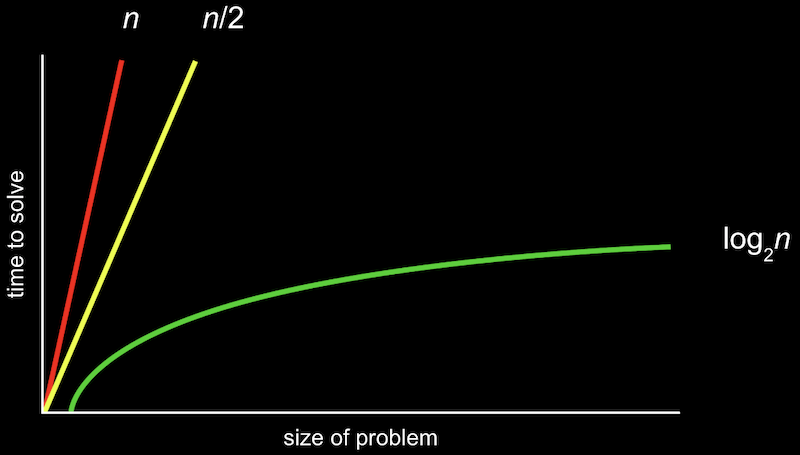

# 4. 알고리즘

[Naver BoostCourse CS50 2019](https://www.edwith.org/boostcourse-cs-050)

<details>
  <summary>1) 검색 알고리즘</summary>

# 학습 목표

주어진 배열 속에서 특정 값을 찾는 방법을 설명할 수 있다.

# 검색 알고리즘

**배열**은 한 자료형의 여러 값들이 메모리 상에 모여 있는 구조이다.

컴퓨터는 이 값들에 접근할 때 배열의 인덱스 하나하나를 접근한다.

만약 어떤 값이 배열 안에 속해 있는지를 찾아 보기 위해서는 배열이 정렬되어 있는지 여부에 따라 아래와 같은 방법을 사용할 수 있다.

# 선형 검색

배열의 인덱스를 처음부터 끝까지 하나씩 증가시키면서 방문하여 그 값이 속하는지를 검사한다.

아래 의사코드와 같이 나타낼 수 있다.

```
For i from 0 to n–1

    If i'th element is 50

        Return true

Return false
```

# 이진 검색

만약 배열이 정렬되어 있다면, 배열 중간 인덱스부터 시작하여 찾고자 하는 값과 비교하며 그보다 작은(작은 값이 저장되어 있는) 인덱스 또는 큰(큰 값이 저장되어 있는) 인덱스로 이동을 반복하면 된다.

아래 의사코드와 같이 나타낼 수 있다.

```
If no items

    Return false

If middle item is 50

    Return true

Else if 50 < middle item

    Search left half

Else if 50 > middle item

    Search right half
```

# 생각해보기

만약 정렬되지 않은 배열이 있다면, 선형 검색이 빠를까 이진 검색이 빠를까?

- 정답을 찾는 속도는 선형 검색이 더 빠를 것이다. 선형 검색은 데이터를 차례대로 계속해서 찾기만 하지만, 이진 검색의 경우 해당 인덱스의 데이터와 찾고자 하는 값을 비교하는 과정을 반복하기 때문이다.
- 또한, 정렬되지 않은 상태에서 이진 검색으로 찾게 되면 데이터가 배열 안에 존재하는 데에도 불구하고 그 데이터가 없는 것으로 잘못 결론을 내릴 수도 있다.
- 하지만 배열이 정렬되어 있는 경우라면 이진 검색이 올바른 결과를 도출하면서도 그 속도가 평균적으로 훨씬 빠를 것이다.

</details>

<details>
  <summary>2) 알고리즘 표기법</summary>

# 학습 목표

알고리즘의 실행 시간의 상한과 하한을 표기할 수 있다.

# 알고리즘 표기법

1주차에 아래 그림과 같이 알고리즘을 실행하는데 걸리는 시간을 표현해 봤다.



위와 같은 그림을 공식으로 표기한 것이 **Big O 표기법**이다.

여기서 O는 "**on the order of**"의 약자로, 쉽게 생각하면 "**~만큼의 정도로 커지는**" 것이라고 볼 수 있다.

O(n)은 n만큼 커지는 것이므로 n이 늘어날수록 선형적으로 증가하게 된다. O(n/2)도 결국 n이 매우 커지면 1/2은 큰 의미가 없어지므로 O(n)이라고 볼 수 있다.

주로 아래 목록과 같은 Big O 표기가 실행 시간을 나타내기 위해 많이 사용된다.

- O(n^2)
- O(n log n)
- O(n) - 선형 검색
- O(log n) - 이진 검색
- O(1)

**Big O**가 알고리즘 **실행 시간의 상한**을 나타낸 것이라면, 반대로 **Big Ω**는 알고리즘 **실행 시간의 하한**을 나타내는 것이다.

예를 들어 선형 검색에서는 n개의 항목이 있을 때 최대 n번의 검색을 해야 하므로 상한이 O(n)이 되지만 운이 좋다면 한 번만에 검색을 끝낼 수도 있으므로 하한은 Ω(1)이 된다.

역시 아래 목록과 같은 Big Ω 표기가 많이 사용된다.

- Ω(n^2)
- Ω(n log n)
- Ω(n) - 배열 안에 존재하는 값의 개수 세기
- Ω(log n)
- Ω(1) - 선형 검색, 이진 검색

# 생각해보기

실행시간의 상한이 낮은 알고리즘이 더 좋을까? 하한이 낮은 알고리즘이 더 좋을까?

- 실행시간의 상한이 낮은 알고리즘이 더 좋을 것이다. 왜냐하면 실행시간의 상한이 높은 비효율적인 알고리즘은 다루는 데이터의 크기가 커짐에 따라서 최악의 경우에 걸리는 실행시간이 기하급수적으로 늘어날 수 있기 때문이다.
- 또한 상한 시간이 같다면, 평균적으로 실행 시간이 낮은 알고리즘이 좋은 알고리즘일 것이다.

</details>

<details>
  <summary>3) 선형 검색</summary>

# 학습 목표

주어진 배열 또는 구조체에서 선형 검색을 할 수 있다.

# 선형 검색

찾고자 하는 자료를 검색하는 데 사용되는 다양한 알고리즘이 있다. 그 중 하나가 **선형 검색**이다.

선형 검색은 **원하는 원소가 발견될 때까지 처음부터 마지막 자료까지 차례대로 검색**한다.

이렇게 하여 선형 검색은 찾고자 하는 자료를 찾을 때까지 모든 자료를 확인해야 한다.

# 효율성 그리고 비효율성

**선형 검색 알고리즘**은 **정확하지만 아주 효율적이지 못한 방법**이다.

리스트의 길이가 n이라고 했을 때, 최악의 경우 리스트의 모든 원소를 확인해야 하므로 n번만큼 실행된다.

여기서 최악의 상황은 찾고자 하는 자료가 맨 마지막에 있거나 리스트 안에 없는 경우를 말한다.

만약 100만 개의 원소가 있는 리스트라고 가정해본다면 효율성이 매우 떨어짐을 느낄 수 있다.

반대로 최선의 상황은 처음 시도했을 때 찾고자 하는 값이 있는 경우이다.

평균적으로 선형 검색이 최악의 상황에서 종료되는 것에 가깝다고 가정할 수 있다.

선형 검색은 **자료가 정렬되어 있지 않거나 그 어떤 정보도 없이 하나씩 찾아야 하는 경우에 유용**하다.

이러한 경우 무작위로 탐색하는 것보다 순서대로 탐색하는 것이 효율적이다.

이제 우리는 검색 이전에 정렬이 필요한 이유를 알 수 있다.

정렬은 시간이 오래 걸리고 공간을 더 차지한다.

하지만 이 추가적인 과정을 진행하면 우리는 여러 번 리스트를 검색해야 하거나 매우 큰 리스트를 검색해야 할 경우 시간을 단축할 수 있을 것이다.

주어진 배열에서 특정 값을 찾기 위해 선형 검색을 사용한다면, 아래와 같은 코드를 작성할 수 있다.

```c
#include <cs50.h>
#include <stdio.h>

int main(void)
{
    //numbers 배열 정의 및 값 입력
    int numbers[] = {4, 8, 15, 16, 23, 42};

    //값 50 검색
    for (int i = 0; i < 6; i++)
    {
        if (numbers[i] == 50)
        {
            printf("Found\n");
            return 0;
        }
    printf("Not found\n");
    return 1;
    }
}
```

배열의 크기만큼 for 루프를 돌면서 배열의 인덱스를 차례대로 방문하며 찾는 값이 있는지를 검사하면 된다.

문자열로 이루어진 배열도 비슷한 방식으로 검색할 수 있다.

만약 전화번호부에서 특정 이름을 찾아 해당하는 전화번호를 출력하는 프로그램을 작성하려면 어떻게 할 수 있을까?

가장 간단한 예는 아래와 같은 프로그램이 될 것이다.

```c
#include <cs50.h>
#include <stdio.h>
#include <string.h>

int main(void)
{
    string names[] = {"EMMA", "RODRIGO", "BRIAN", "DAVID"};
    string numbers[] = {"617-555-0100", "617-555-0101", "617-555-0102", "617-555-0103"};

    for (int i = 0; i < 4; i++)
    {
        if (strcmp(names[i], "EMMA") == 0)
        {
            printf("Found %s\n", numbers[i]);
            return 0;
        }
    }
    printf("Not found\n");
    return 1;
}
```

names 배열과 numbers 배열을 따로 정의하고 names 배열에서 검색을 해서 해당하는 인덱스의 numbers 배열 값을 출력하는 것이다.

하지만 이 경우에는 names 배열과 numbers 배열이 서로 같은 인덱스를 가져야 한다는 한계가 있다.

더 좋은 방법은 아래 코드와 같이 새로운 자료형으로 **구조체**를 정의해서 이름과 번호를 묶어주는 것이다.

```c
#include <cs50.h>
#include <stdio.h>
#include <string.h>

typedef struct
{
    string name;
    string number;
}
person;

int main(void)
{
    person people[4];

    people[0].name = "EMMA";
    people[0].number = "617-555-0100";
    people[1].name = "RODRIGO";
    people[1].number = "617-555-0101";
    people[2].name = "BRIAN";
    people[2].number = "617-555-0102";
    people[3].name = "DAVID";
    people[3].number ="617-555-0103";

    //EMMA 검색
    for (int i = 0; i < 4; i++)
    {
        if (strcmp(people[i].name, "EMMA") == 0)
        {
            printf("Found %s\n", people[i].number);
            return 0;
        }
    }
    printf("Not found\n");
    return 1;
}
```

person이라는 이름의 구조체를 자료형으로 정의하고 person 자료형의 배열을 선언하면 그 안에 포함된 속성값은 '.'으로 연결해서 접근할 수 있다.

person a; 라는 변수가 있다면, a.name 또는 a.number 이 각각 이름과 전화번호를 저장하는 변수가 된다.

이렇게 함으로써 더욱 확장성 있는 전화번호부 검색 프로그램을 만들 수 있다.

# 생각해보기

전화번호부와 같이 구조체를 정의하여 관리 및 검색을 하면 더 편리한 예는 또 무엇이 있을까?

- 쇼핑몰 회원의 아이디와 전화번호 및 주소 등

</details>

<details>
  <summary>4) 버블 정렬</summary>

</details>

<details>
  <summary>5) 선택 정렬</summary>

</details>

<details>
  <summary>6) 정렬 알고리즘의 실행시간</summary>

</details>

<details>
  <summary>7) 재귀</summary>

</details>

<details>
  <summary>8) 병합 정렬</summary>

</details>
