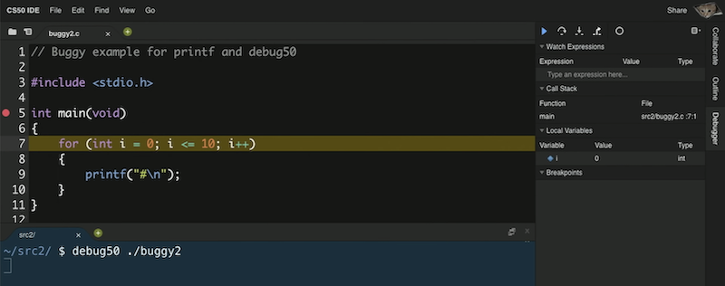
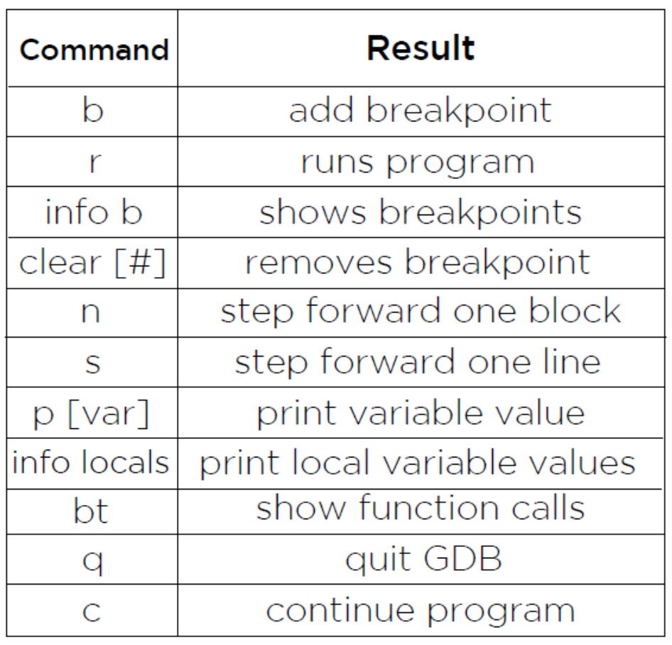
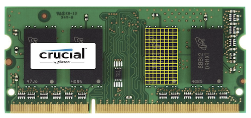

# 3. 배열

[Naver BoostCourse CS50 2019](https://www.edwith.org/boostcourse-cs-050)

<details>
  <summary>1) 컴파일링</summary>

# 학습 목표

컴파일링의 네 단계를 설명할 수 있다.

# 컴파일링

지금까지는 아무것도 모른 채 마구잡이로 쓴 코드가 잘 돌아갔다면 이제부터는 연습과 응용을 통해 동작 원리를 이해할 수 있을 것이다.

우선 첫 수업에 봤던 예제를 다시 살펴보며 지금 사용하는 방법이 그때 우리가 사용한 방법과 어떻게 다른지 알아보자.

```c
#include <stdio.h>

int main(void)
{
    printf("hello, world\n");
}
```

우선 main이라는 함수가 있었다. 프로그램의 시작점으로써 **실행 버튼을 클릭**하는 것과 같다.

printf는 출력을 담당하는 함수이다. printf 함수를 사용하기 위해서는 stdio.h 라이브러리가 필요하다.

정확히 말하면 stdio.h는 헤더 파일로 C언어로 작성되어 있으며 파일명이 .h로 끝나는 파일이다.

이 파일에는 printf 함수의 프로토타입이 있어서 Clang 컴파일러가 프로그램을 컴파일할 때 printf가 무엇인지 알려주는 역할을 한다.

코드를 `clang hello.c`로 컴파일하고 `./a.out` 명령으로 프로그램을 실행할 때 이 과정은 컴퓨터가 이해하는 0과 1로 가득찬 파일 a.out을 생성하며 실행 가능하게 한다.

이해하기 어려운 이 과정에 대한 이해는 잠시 미뤄두고 우선 넘어가보도록 하자.

만약 a.out과 다른 이름(hello)으로 컴파일을 하고 싶다면 아래와 같이 명령행 인자를 추가해줘야 한다.

`clang -o hello hello.c`

또한 우리는 CS50 라이브러리를 사용해 보았다.

이처럼 CS50 라이브러리를 사용한 프로그램을 컴파일 할 때는 clang에 또 하나의 프로그램(-lcs50)이 필요했다. 그래야 clang이 실행되었다.

`clang -o hello hello.c -lcs50`

이는 clang에게 CS50 라이브러리에 있는 모든 0과 1들을 여기에 연결하라는 의미이다.

더 간단히는, 이전에 배웠듯이 make 프로그램을 이용하면 이 모든 컴파일 과정을 자동으로 처리할 수 있다. make나 clang을 사용해서 프로그램을 실행할 때 아래 네 개의 단계를 거친다.

- 전처리(Preprocessing)
- 컴파일링(Compiling)
- 어셈블링(Assembling)
- 링킹(Linking)

우리가 명령어를 실행할 때 정확히 어떤 일이 일어나는지 알아보도록 하자.

## 전처리(Precompile)

**컴파일의 전체 과정은 네 단계로 나누어볼 수 있다**. 그 중 첫 번째 단계는 **전처리**인데, 전처리기에 의해 수행된다. #으로 시작되는 C 소스코드는 전처리기에게 **실질적인 컴파일이 이루어지기 전에 무언가를 실행**하라고 알려준다.

예를 들어, #include는 전처리기에게 다른 파일의 내용을 포함시키라고 알려준다. 프로그램의 소스 코드에 #include와 같은 줄을 포함하면, 전처리기는 새로운 파일을 생성하는데 이 파일은 여전히 C 소스코드 형태이며 stdio.h 파일의 내용이 #include 부분에 포함된다.

## 컴파일(Compile)

전처리기가 전처리한 소스 코드를 생성하고 나면 그 다음 단계는 **컴파일**이다. **컴파일러**라고 불리는 프로그램은 **C 코드를 어셈블리어라는 저수준 프로그래밍 언어로 컴파일**한다.

**어셈블리**는 C보다 연산의 종류가 훨씬 적지만, 여러 연산들이 함께 사용되면 C에서 할 수 있는 모든 것들을 수행할 수 있다. C코드를 어셈블리 코드로 변환시켜줌으로써 컴파일러는 컴퓨터가 이해할 수 있는 언어와 최대한 가까운 프로그램을 만들어 준다. 컴파일이라는 용어는 소스 코드에서 오브젝트 코드(머신 코드, 기계어)로 변환하는 전체 과정을 통틀어 일컫기도 하지만, 구체적으로 전처리한 소스 코드를 어셈블리 코드로 변환시키는 단계를 말하기도 한다.

## 어셈블(Assemble)

소스 코드가 어셈블리 코드로 변환되면, 다음 단계는 **어셈블** 단계로 **어셈블리 코드를 오브젝트 코드로 변환**시키는 것이다. 컴퓨터의 중앙처리장치가 프로그램을 어떻게 수행해야 하는지 알 수 있는 명령어 형태인 **연속된 0고 1들로 바꿔주는 작업**이다. 이 변환 작업은 **어셈블러**라는 프로그램이 수행한다. 소스 코드에서 오브젝트 코드로 컴파일 되어야 할 파일이 딱 한 개라면, 컴파일 작업은 여기서 끝이 난다. 그러나 그렇지 않은 경우에는 링크라 불리는 단계가 추가된다.

## 링크(Link)

만약 프로그램이 (math.h나 cs50.h와 같은 라이브러리를 포함해) **여러 개의 파일로 이루어져 있어 하나의 오브젝트 파일로 합쳐져야 한다면 *링크*라는 컴파일의 마지막 단계가 필요하다.** 링커는 여러 개의 다른 오브젝트 코드 파일을 실행 가능한 하나의 오브젝트 코드 파일로 합쳐준다. 예를 들어, 컴파일을 하는 동안에 CS50 라이브러리를 링크하면 오브젝트 코드는 `GetInt()`나 `GetString()` 같은 함수를 어떻게 실행할 지 알 수 있게 된다.

이 네 단계를 거치면 최종적으로 실행 가능한 파일이 완성된다.

# 생각해보기

만약 컴파일링 과정을 거치지 않기 위해 바로 머신코드로 우리가 원하는 프로그램을 작성하려고 한다면 어떤 문제가 있을까?

- 단순한 목적을 달성하기 위해서도 프로그래밍을 하는 데에 투자해야 하는 시간과 노력이 클 것이다.
- 즉, 원하는 목적 그 자체를 이루는 것에 집중하기 힘들 수 있다.

</details>

<details>
  <summary>2) 디버깅</summary>

# 학습 목표

디버깅 하는 여러 방법을 설명할 수 있다.

# 버그와 디버깅

**버그(bug)**는 **코드에 들어있는 오류**이다. 버그로 인해 프로그램의 실행에 실패하거나 프로그래머가 원하는 대로 동작하지 않게 된다. 버그를 만들고 싶지 않겠지만 모든 프로그래머들은 버그와 마주하게 되어있다. **디버깅(debugging)**은 **코드에 있는 버그를 식별하고 고치는 과정**이다. 프로그래머는 **디버거**라고 불리는 프로그램을 사용하여 디버깅을 하게 된다.

# 디버깅의 기본

프로그램은 일반적으로 인간보다 훨씬 빠르게 연산을 수행한다. 그래서 프로그램을 실행시켜보는 것만으로는 무엇이 잘못됐는지 찾아내기 어렵다. 디버거는 프로그램을 특정 행에서 멈출 수 있게 해주기 때문에 버그를 찾는데 도움이 된다. 프로그래머는 멈춰진 그 지점에서 무슨 일이 일어나는지 볼 수 있다. **프로그램이 멈추는 특정 지점**을 **중지점**이라고 한다. 또한 프로그래머가 프로그램을 한 번에 한 행씩 실행할 수 있게 해준다. 이로써 프로그래머는 프로그램이 내리는 모든 결정들을 단계별로 따라갈 수 있게 된다.

# help50

아래 코드를 컴파일하고 실행한다고 생각해보자

```c
int main(void)
{
    printf("hello, world\n");
}
```

make 프로그램을 이용하여 컴파일해보면 "implicitly declaring library function 'prinftf'" 라는 에러 메시지가 나타난다.

이런 에러 메시지를 이해하기 힘들다면, **help50 프로그램**을 사용해보자.

아래와 같이 make 앞에 help50를 붙여서 실행하면 다시 컴파일 시 생기는 오류를 해석해준다.

`help50 make 파일이름`

문제의 원인은 printf 함수를 사용하기 위해서 stdio.h 라이브러리를 포함해야 한다는 것이었다.

# printf

하지만 이렇게 프로그램을 사용해서 해결할 수 없는 문제도 있다.

아래 코드는 #을 10개 출력하기 위해 작성한 것이다.

```c
#include <stdio.h>

int main(void)
{
    for (int i = 0; i <= 10; i++)
    {
        printf("#\n");
    }
}
```

이 코드를 컴파일 하고 실행해보면 에러는 발생하지 않지만, 우리 의도와는 다르게 #이 11개나 출력되는 것을 확인할 수 있다.

그 이유는 뭘까?

디버깅의 다른 방법으로 직접 의심이 가는 변수를 출력해서 확인해 볼 수 있다.

아래와 같이 변수 i를 출력해보자

```c
#include <stdio.h>

int main(void)
{
    for (int i = 0; i <= 10; i++)
    {
        printf("i is now %i: ", i);
        printf("#\n");
    }
}
```

그 결과 i가 0에서 시작하기 때문에 for 루프의 i <=10 이라는 조건은 실제로 11번 만족한다는 사실을 알 수 있다.

따라서 이를 i < 10으로 수정해주면 우리 의도대로 #이 10번 출력될 것이다.

# debug50

CS50 IDE를 사용하면 **debug50**이라는 프로그램도 사용할 수 있다.

아래와 같이 소스 코드에 직접 브레이크 포인트를 지정하고 소스파일을 컴파일한 후에 " **debug50 파일명**" 으로 실행하면, 오른쪽 패널을 통해 변수의 값을 확인하거나 브레이크 포인트부터 한 줄 씩 코드를 실행해 볼 수 있다.

디버깅 종료를 위해서는 **Ctrl + c**를 누르면 된다.

  

# 생각해보기

디버깅을 도와주는 프로그램은 어떤 경우에 더 큰 도움이 될까? 만약 이런 프로그램의 도움 없이 직접 디버깅을 해야 한다면 어떻게 코드를 작성하는 것이 좋을까?

- 프로그램이 더 복잡하고 긴 경우에는 오류를 직접 한 눈에 찾기 어렵기 때문에 디버깅을 도와주는 프로그램이 큰 도움이 될 것이다.
- 직접 디버깅을 해야하는 경우에는 프로그램의 각 부분이 어떤 기능을 수행하는지 명확하게 알 수 있도록 변수명, 함수명에 신경을 써서 작성하고 주석도 잘 달아주어야 하겠다. 또한, 각 기능들이 블럭 별로 잘 구분되어 작성된 후 필요한 자리에 알맞게 쓰이는 것이 좋겠다.

## GDB 사용해보기

**GDB**는 자주 쓰이는 디버거 중 하나이다. C 프로그램에 GDB를 실행시키려면, 먼저 프로그램을 컴파일해야 한다.

그런 다음, 보통 때처럼 "./프로그램*이름" 을 치지 말고, "\*\*gdb 프로그램*이름\*\*" 을 친다.

GDB가 열리면, 가장 먼저 해야할 일은 **중지점을 설정**하는 것이다. 어디에서 프로그램이 잘못되는지 짐작이 간다면, 그 지점 이전에 있는 행에 중지점을 설정하는 것이 좋다. 플그램이 문제가 생길 것이라 생각한 그 지점에 들어서면 어떤 일이 생기는지 볼 수 있기 때문이다. 어디서 문제인지 확실하지 않다면, 처음부터 모든 코드를 살펴볼 수 있도록 main 함수의 첫 행에 중지점을 설정해도 괜찮다.

중지점을 설정하기 위해서는 프로그램을 멈추고 싶은 행 번호 다음에 '**b**'를 치고(breakpoint를 의미) 엔터 키를 누른다. 이렇게 하면 프로그램에 중지점이 설정될 것이다. 현재의 모든 중지점을 보고 싶다면 "**info b**"를 치면 모든 중지점의 위치를 보여줄 것이다. 중지점의 행 번호 다음에 "**clear**"를 치면 중지점을 제거할 수 있다.

중지점을 설정했다면, 'r' (run의 의미)로 프로그램을 실핸한다. 프로그램이 명령어 인자를 받는다면, 'r' 다음에 인자들을 쓴다. 프로그램이 실행될 것이고, 중지점에서 자동으로 멈출 것이다. 중지점마다 프롬프트가 나타날 것이다. 이 때 몇 가지 옵션들이 있다.

현재 지점에서 **프로그램의 변수값을 보고 싶다면** 변수 이름 다음에 '**p**'를 입력한다(print). "**info locals**" 명령어는 **현재 모든 지역 변수값**을 보여줄 것이다.

코드의 다음 행으로 나아가고 싶다면 '**n**'을 입력한다(next). '**s**'를 쳐도 코드의 다음 행으로 가기는 하지만, 함수 내부로 들어가서 함수 내부의 각 행을 훑을 것이다.

프로그램을 계속 실행하고 싶다면 '**c**'를 입력한다(continue). 중지점이 없다면 프로그램은 종료할 것이다. 중지점이 있다면, GDB는 다음 중지점에서 멈출 것이다.



</details>

<details>
  <summary>3) 코드의 디자인</summary>

# 학습 목표

코드의 정확성과 디자인을 관리하는 방법을 설명할 수 있다.

# check50

check50 프로그램을 이용하면 과제를 잘 수행했는지 자동으로 검사할 수 있다.

물론 이 프로그램은 cs50 강의를 위해서만 작성되었지만, 실제로 많은 사람들이 함께 작업하는 환경에서 이와 같은 자동 검사 프로그램은 많은 도움이 된다.

여러 사람들이 각자 한 부분을 맡아 코드를 작성할 때 각자가 수정한 코드가 전체 프로그램의 정확성을 해치지 않는지 쉽게 확인할 수 있기 때문이다.

# style50

style50 프로그램을 이용하면 코드가 심미적으로 잘 작성되어 있는지 검사할 수 있다.

공백의 수나 줄바꿈과 같은 것들은 코드의 실행에 직접적으로 영향을 주지는 않지만 코드를 작성하는 사람들이 코드를 읽고 이해하는데 영향을 주기 때문이다.

가령 아래와 같이 for 루프를 작성할 때에도 사람에 따라 여러 방식으로 작성할 수 있다.

```c
for (int i = 0; i <= 10; i++)
    {
        printf("#\n");
    }
```

```c
for (int i = 0; i <= 10; i++){
    printf("#\n");
}
```

```c
for (int i = 0; i <= 10; i++){ printf("#\n"); }
```

많은 회사들이 사내에서 코드를 작성할 때 특정한 스타일 가이드를 따르도록 한다.

여러 사람들이 코드를 작성하기 때문에 서로 불필요한 오해를 없애고, 코드를 이해하는 데 드는 비용을 최소화하기 때문이다.

# 고무 오리(러버덕)

때로는 코드에 포함된 오류를 해결할 때 앞서 소개한 help50, debug50, check50와 같은 프로그램들이 존재하지 않거나, 있다 하더라도 디버깅에 큰 도움이 안 될 수도 있다.

이 때는 먼저 한숨 돌리고 직접 곰곰이 생각해보는 수 밖에 없다.

한 가지 유명한 방법으로는 '**고무 오리**'와 같이 무언가 대상이 되는 물체를 앞에 두고, 내가 작성한 코드를 한 줄 한 줄 말로 설명해주는 과정을 거쳐볼 수 있다.

이를 통해 미처 놓치고 있었던 논리적 오류를 찾아낼 수도 있다.

# 생각해보기

만약 여러 사람들이 함께 참여하는 프로젝트에서, 각자가 작성하는 코드 스타일이 서로 다르다면 어떤 비효율적인 일이 일어날까?

- 서로의 코드를 이해하는 데에 시간이 많이 들 것이고, 이로 인해 코드를 통한 의사소통 및 피드백 과정이 매끄럽지 않을 것이다. 이는 결국 팀의 총 생산성과 업무 성과의 저하로 이어질 것이다.

</details>

<details>
  <summary>4) 배열(1)</summary>

# 학습 목표

배열을 정의하고 사용하는 방법을 설명할 수 있다.

# 메모리

C에는 아래와 같은 여러 자료형이 있고, 각각의 자료형은 서로 다른 크기의 메모리를 차지한다.

- bool: 불리언, 1바이트
- char: 문자, 1바이트
- int: 정수, 4바이트
- float: 실수, 4바이트
- long: (더 큰) 정수, 8바이트
- double: (더 큰) 실수, 8바이트
- string: 문자열, ?바이트

컴퓨터 안에는 아래 사진과 같음 **RAM**이라고 하는 물리적 칩이 메모리 역할을 한다.

쉽게 생각하면 아래 사진에서 여러 개의 노란색 사각형이 메모리를 의미하고, 작은 사각형 하나가 **1바이트**를 의미한다고 볼 수 있다.



예를 들어 char 타입의 변수를 하나 생성하고, 그 값을 입력한다고 하면 위 사진에서 한 사각형 안에 그 변수의 값이 저장되는 것이다.

# 배열

아래와 같이 세 개의 점수를 저장하고 그 평균을 출력하는 프로그램이 있다.

```c
#include <cs50.h>
#include <stdio.h>

int main(void)
{
    // Scores
    int score1 = 72;
    int score2 = 73;
    int score3 = 33;

    // Print average
    printf("Average: %i\n", (score1 + score2 + score3) / 3);
}
```

만약 점수의 개수가 더 많아진다면 이 프로그램은 많은 부분을 수정해줘야 한다.

이 때 활용할 수 있는 것이 배열의 개념이다.

배열은 같은 자료형의 데이터를 메모리상에 연이어서 저장하고 이를 하나의 변수로 관리하기 위해 사용된다.

위 코드는 배열을 이용하면 아래와 같이 바꿀 수 있다.

```c
#include <cs50.h>
#include <stdio.h>

int main(void)
{
    // Scores
    int scores[3];
    scores[0] = 72;
    scores[1] = 73;
    scores[2] = 33;

    // Print average
    printf("Average: %i\n", (scores[0] + scores[1] + scores[2]) / 3);
}
```

`int scores[3];`이라는 코드는 int 자료형을 가지는 크기 3의 배열을 scores라는 이름으로 생성하겠다는 의미이다. 배열의 인덱스는 0부터 시작하기 때문에, scores의 인덱스는 0, 1, 2 세 개가 있다.

이 인덱스를 변수명 뒤 대괄호 [ ] 사이에 입력하여 배열의 원하는 위치에 원하는 값을 저장하고 불러올 수 있다.

하지만 위와 같은 코드는 여전히 정수의 개수가 바뀌는 상황에서 제약이 많다.

다음 파트에서 배열을 보다 동적으로 선언하고 저장하는 방법을 알아보자

# 생각해보기

실생활의 어떤 데이터를 배열로 표현할 수 있을까?

- 학번, 성적, 과목명 등

</details>

<details>
  <summary>5) 배열(2)</summary>

</details>

<details>
  <summary>6) 문자열과 배열</summary>

</details>

<details>
  <summary>7) 문자열의 활용</summary>

</details>

<details>
  <summary>8) 명령행 인자</summary>

</details>
