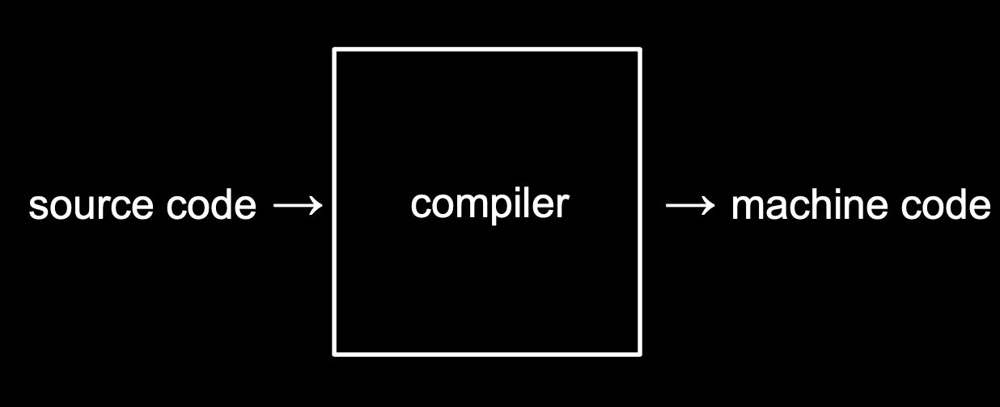

# 2. C 언어

[Naver BoostCourse CS50 2019](https://www.edwith.org/boostcourse-cs-050)

<details>
  <summary>1) C 기초</summary>

# C 기초

# 학습 목표

C로 "hello, world"를 출력하는 프로그램을 만들 수 있다.

## C 언어

```c
#include <stdio.h>

int main(void)
{
    printf("hello, world\n");
}
```

C는 아주 오래되고 전통적인 순수 텍스트 기반의 언어이다.

`int main(void)`는 **시작한다**의 의미를 가지고 있다고 보면 된다. 앞으로 우리가 작성할 코드 모두는 이 `int main(void) {}`의 중괄호 사이에 작성하게 될 것이다.

C에는 **printf**라는 함수가 있다.

`printf("hello, world\n")`는 스크래치의 "hello, world라고 말하기" 블록과 같은 역할을 한다.

- 글자나 단어, 문장을 적을 때는 **언제나 텍스트에 "" 쌍따옴표로 감싸야 한다**
- 그리고 우리가 일상에서 문장의 끝에 마침표를 붙이는 것처럼 C에서는 `세미콜론(;)`을 붙여야 한다.

`include <stdio.h>`는 "stdio.h"라는 이름의 파일을 찾아서 "printf" 함수에 접근할 수 있도록 해준다.

C로 작성한 코드는 `"파일이름.c"`로 저장해야 한다. (확장자 ".c"는 C로 작성된 코드라는 의미)

마이크로 소프트의 Word처럼 자동적으로 붙여주지 않기 때문에 C의 경우에는 직접 .c를 붙여줘야 한다.

## 컴파일러

우리가 직접 작성한 코드는 **소스 코드**라고 불린다. 이를 2진수로 작성된 "머신 코드"로 변환해야 컴퓨터가 이해할 수 있다. 이런 작업을 컴파일러라는 프로그램이 수행해 준다.



터미널 창의 명령어 프롬프트에서 "\$" 기호 옆에 우리가 원하는 명령어를 입력하면 된다.

clang hello.c 라는 명령어는 "clang"이라는 컴파일러로 "hello.c"라는 코드를 컴파일하라는 의미이다.

그 결과 **a.out**이라는 파일이 생성된다.

**./a.out** 이라는 명령어를 실행하면 컴퓨터가 현재 디렉토리에 있는 a.out이라는 프로그램을 실행하게 해준다.

</details>

<details>
  <summary>2) 문자열</summary>

# 문자열

# 학습 목표

C로 문자열 형식을 가진 변수를 선언하고 출력하는 프로그램을 만들 수 있다.\

# 문자열 다루기

C 언어로 사용자의 이름을 입력으로 받고, 그 사람의 이름을 불러서 인사를 해보자.

CS50 Sandbox에서는 스크래치의 ask 함수와 가장 비슷한 것은 `get_string()` 함수이다. String은 단어나 구절, 문장을 부르는 말이다.

## 변수와 형식지정자

`string answer = get_string("What's your name?\n")`;

사용자의 이름을 받아서 저장할 **변수**를 **answer**라고 정해보자. 변수명은 마음대로 정해도 되지만, 유의해야 할 점은 C는 오래된 언어이기 때문에 변수가 저장하는 **데이터의 종류를 아주 정확하게 명시해줘야 한다**.

그래서 우리는 저장하고자 하는 값의 종류가 **문자열(string)**이라는 것을 알려줘야 한다. 이때 string을 **형식지정자**라고 한다. 컴퓨터에게 "answer"에 들어갈 것은 문자라고 알려주는 것이다.

## 할당 연산자 =

프로그래밍 언어에서 **=**는 오른쪽에 있는 것을 왼쪽으로 **지정**해준다. 이를 할당 연산자라고 한다.

여기서는 **get_string**함수가 사용자의 이름을 반환하면 그 이름을 **answer**이라는 변수에 저장하는 것이다. 이제 컴퓨터의 메모리 어딘가에 사용자의 이름이 저장되어 있는 것이다.

## 출력

`printf("hello, %s\n", answer)`;

이때 유의할 점은 `printf("hello, answer");`이 아니라는 점이다. 이 코드를 실행한다면 answer이 출력되어 hello, answer이 그대로 결과로 나온다.

우리는 answer이라는 변수에 들어있는 이름을 출력해야 하기 때문에 **%**를 사용해준다. 이 때에도 어떤 종류의 인자를 받는지 말해줘야 한다.

우리는 이름이라는 문자열을 받기 때문에 **string**에서의 **s**를 **%** 뒤에 붙여서 인자를 받아준다. 그래서 최종적으로는 `printf("hello, %s\n", answer);`이 되는 것이다

## 코드

```c
#include <cs50.h>
#include <stdio.h>

string answer = get_string("What's your name?\n");
printf("hello, %s\n", answer);
```

가장 위에 포함된 cs50.h 파일 안에 string이라는 문자열 형식과 get_string 이라는 함수에 대한 코드가 포함되어 있다. 이 파일을 포함해야만 전체 코드를 컴파일 하고 실행할 수 있다.

터미널 창에 아래 명령어를 입력하여 컴파일을 할 수 있다.

`clang -o string string.c -lcs50`

여기서 -o string은 string.c를 string.out이라는 머신코드로 저장하도록 하는 명령어이다.

-lcs50은 "link"라는 의미를 지닌 -l이라는 인자에 우리가 추가로 포함한 "cs50" 파일을 합친 것이다. 이를 통해 컴파일시 cs50 파일을 연결하도록 알려줄 수 있다.

다소 복잡한 이런 과정 대신에, 아래 make 명령어를 통해 간단하게 컴파일을 수행할 수도 있다.

`make string`

이와 같이 작성한 코드를 컴파일 하고 실행하면, 사용자에게 입력값을 받고 문장 내에 포함하여 출력하는 프로그램이 된다.

# 생각해보기

"좋아하는 동물을 알려주세요"로 질문하여 동물 이름을 animal이라는 변수에 저장하고, 이를 "내가 좋아하는 동물은"으로 출력해주는 코드를 작성해 보자.

```c
#include <stdio.h>
#include <cs50.h>

int main(void) {
    string answer = get_string("좋아하는 동물을 알려주세요\n");
    printf("내가 좋아하는 동물은 %s입니다\n", answer);
}
```

</details>

<details>
  <summary>3) 조건문과 루프</summary>

</details>

<details>
  <summary>4) 자료형, 형식 지정자, 연산자</summary>

</details>

<details>
  <summary>5) 사용자 정의 함수, 중첩 루프</summary>

</details>

<details>
  <summary>6) 하드웨어의 한계</summary>

</details>
