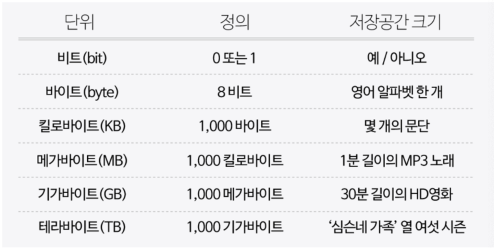

# 1. 컴퓨팅 사고력, 스크래치

[Naver BoostCourse CS50 2019](https://www.edwith.org/boostcourse-cs-050)

  
1) 2진법

# 학습목표

컴퓨터 과학이 무엇인지 정의하고, 컴퓨터가 정보를 표현하는 방법에 대해 설명할 수 있다.

# 학습하기

## 컴퓨터 과학

컴퓨터 과학은 **문제 해결에 대한 학문이다.**

문제 해결은 **입력(Input)**을 전달받아 **출력(Output)**을 만들어내는 과정이다.

그 중간에 있는 과정이 바로 컴퓨터 과학이다.

이러한 입력과 출력을 **표현**하기 위해서 모두가 동의할 **약속(표준)**이 필요하다.

따라서 컴퓨터 과학의 가장 첫 번째 개념은 어떻게 표현하는지에 대한 **표현 방법**이다.

## 2진법

컴퓨터는 오직 0과 1로만 데이터를 표현하는데, 이처럼 0과 1로만 표현하는 것을 **2진법**이라고 한다.

2진법에서는 **각 자리수가 2의 거듭제곱을 의미**한다.

이와 같은 2진법은 전기를 통해 연산하는, 즉 전기를 켜고 끄는 방식으로 작동하는 컴퓨터에게 적합한 방법이다.

컴퓨터에는 굉장히 많은 스위치(트랜지스터)가 있고 **on/off 상태를 통해 0과 1을 표현한다.**

컴퓨터는 2진법에서 하나의 자릿수를 표현하는 단위를 **비트(bit)**라고 한다.

## 비트

정보를 저장하고 연산을 수행하기 위해 컴퓨터는 **비트(bit)**라는 측정 단위를 쓴다.

비트는 **이진 숫자**라는 뜻을 가진 "binary digit"의 줄임말이며, 0과 1, 두 가지 값만 가질 수 있는 측정 단위이다.

컴퓨터는 전기적 신호 켜짐(1)과 꺼짐(0)을 이용하여 작동하기 때문에 2진수를 사용한다.

디지털 데이터를 여러 비트들로 나타냄으로써 두 가지 값만을 가지고도 많은 양의 정보를 저장할 수 있고, 저장되어 있는 데이터를 수정하기 위해 비트에 수학적 연산을 수행할 수 있다.

## 비트열

비트 한 개는 많은 양의 데이터를 나타내기에 턱없이 부족하다. 그렇기 때문에 여러 숫자 조합을 컴퓨터에 나타내기 위해 비트열을 사용한다.

**바이트(byte)**는 **여덟 개의 비트가 모여 만들어진 것**이다.

하나의 바이트에 여덟 개의 비트가 있고, 비트 하나는 0과 1로 표현될 수 있기 때문에 **2^8 = 256개의** 서로 다른 바이트가 존재할 수 있다.

바이트가 모이면 더 큰 단위가 될 수 있다. (킬로바이트, 메가바이트, 기가바이트, 테라바이트, 페타, 엑사 ...)

### **데이터의 단위와 각각의 저장공간 크기로 나타낼 수 있는 대략의 정보**

  
2) 정보의 표현

# 정보의 표현

# 학습 목표

컴퓨터가 문자, 사진, 영상, 음악 등 다양한 정보를 처리하는 방식을 설명할 수 있다.

# 학습하기

## 문자의 표현

문자를 숫자로 표현할 수 있도록 정해진 약속(표준)이 있는데, 그 중 하나는 설명미국정보교환표준부호 **ASCII**(아스키코드 / American Standard Code for Information Interchange)이다.

**총 128개의 부호**로 정의되어 있는데, 가령 알파벳 A는 10진수 기준으로 65, 알파벳 B는 66으로 되어있다.

- A를 2진법으로 표현하면 **1000001**이다.

이 외에도 **Unicode**라는 표준에서는 더 많은 비트를 사용하여 더 다양한 다른 문자들도 표현 가능하도록 지원하고 있다.

- ASCII로는 문자들을 표현하기에 충분하지 않았기 때문이다.
- 유니코드는 100만개 이상의 문자들을 나타낼 수 있는 인코딩표준이다.
- 유니코드의 첫 128개의 문자는 ASCII의 128개 문자와 동일하므로 서로 호환이 된다.

**Unicode**는 😂 이런 이모티콘까지 표현할 수 있게 해주었다.

- 이 이모티콘은 10진법으로 128,514, 2진법으로는 11111011000000010
- 친구에게 이 이모티콘을 보낸다면 **11111011000000010**이라는 1과 0의 패턴을 보낸 것임

## 그림, 영상, 음악의 표현

문자와 같이 그림도 역시 숫자로 표현할 수 있음

우리가 스크린을 통해 보는 그림을 자세히 보면 수많은 작은 점들이
빨간색,
초록색,
파란색을 띄고 있음

이런 작은 점을 **픽셀**이라고 부른다. 각각의 픽셀은 세 가지 색을 서로 다른 비율로 조합하여 특정한 색을 가지게 된다.

- 예를 들어 빨간색 72, 초록색 72, 파란색 33을 섞게 되면 노란색이 되는 것과 같은 방식

이 숫자들을 표현하는 방식을 RGB(Red,
Green,
Blue)라고 한다.

- 즉, 노란색의 커다란 이미지는 72 73 33 으로 정의되는 무수히 많은 픽셀들의 RGB코드(숫자)로 표현될 수 있다.

영상 또한 수많은 그림을 빠르게 연속적으로 이어 붙여놓은 것이기 때문에 숫자로 표현이 가능하다. 음악도 마찬가지로 각 음표를 숫자로 표현할 수 있다.

# 생각해보기

CS50을 2진법으로 표현해보면?

- 아스키 코드 기준, 숫자 하나 하나 문자로 취급한다고 가정.
- 10진수 기준 C = 67, S = 83, 5 = 53, 0 = 48
- **C**: 01000011 **S**: 01010011 **5**: 00110101 **0**: 00110000

  
3) 알고리즘

  

  
4) 스크래치: 기초

  

  
5) 스크래치: 심화

  

