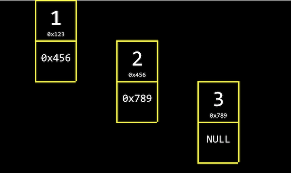

# 5. 자료구조

[Naver BoostCourse CS50 2019](https://www.edwith.org/boostcourse-cs-050)

<details>
  <summary>1) malloc과 포인터 복습</summary>

# 학습 목표

포인터의 개념과 malloc 함수의 용법을 잘 이해할 수 있다.

# malloc과 포인터 복습

아래와 같은 main 함수 코드가 있다. 여기서 문제가 될 만한 지점을 발견해 보자

```c
#include <stdlib.h>

int main(void)
{
    int *x;
    int *y;

    x = malloc(sizeof(int));

    *x = 42;
    *y = 13;
}
```

main 함수 안의 첫 두 줄에서는 **포인터 x와 y**를 선언한다.

그리고 x에는 **malloc** 함수를 이용해서 int 자료형 크기에 해당하는 메모리를 할당한다.

그 다음에는 x와 y 포인터가 가리키는 지점에 각각 42와 13을 저장한다.

여기서 문제가 될 만한 부분은 \*y = 13이다. y는 포인터로만 선언되었을 뿐이지, 어디를 가리킬 지에 대해서는 아직 정의가 되지 않았다.

따라서 **초기화 되지 않은 \*y**는 프로그램 어딘가를 임의로 가리키고 있을 수도 있다.

따라서 그 곳에 13이라는 값을 저장하는 것이 오류를 발생시킬 수도 있는 것이다.

아래 코드와 같이 `y = x;`라는 코드를 더해주면, y는 x가 가리키는 곳과 동일한 곳을 가리키게 된다.

따라서 `*y = 13;`으로 저장하면 x가 가리키는 곳에도 동일하게 13으로 저장될 것이다.

```c
y = x;

*y = 13;
```

# 생각해보기

포인터를 초기화시키지 않고 값을 저장하면 어떤 오류가 발생할 수 있을까?

- 초기화되지 않는 포인터는 프로그램 어딘가를 임의로 가리키고 있을 수 있는데, 거기에는 쓰레기 값이 있다고 가정해야 된다. 이처럼 없거나 잘못된 주소에 접근하여 값을 저장하려 하면 메모리 문제가 일어날 수 있다.g

</details>

<details>
  <summary>2) 배열의 크기 조정하기</summary>
  
  # 학습 목표

배열의 크기를 조정하는 코드를 작성할 수 있다.

# 배열의 크기 조정하기

일정한 크기의 배열이 주어졌을 때, 그 크기를 키우려면 어떻게 해야 할까요?

단순하게 현재 배열이 저장되어 있는 메모리 위치의 바로 옆에 일정 크기의 메모리를 더 덧붙이면 되겠지만, 실제로는 다른 데이터가 저장되어 있을 확률이 높다.

따라서 안전하게 **새로운 공간에 큰 크기의 메모리를 다시 할당**하고 기존 배열의 값들을 하나씩 옮겨줘야 한다.

따라서 이런 작업은 **O(n)**, 즉 배열의 크기 n만큼의 실행 시간이 소요될 것이다.

이 과정을 아래 코드와 같이 나타낼 수 있다.

```c
#include <stdio.h>
#include <stdlib.h>

int main(void)
{
    //int 자료형 3개로 이루어진 list라는 포인터를 선언하고 메모리 할당
    int *list = malloc(3 * sizeof(int));

    //포인터가 잘 선언되었는지 확인
    if (list == NULL)
    {
        return 1;
    }

    //list 배열의 각 인덱스에 값 저장
    list[0] = 1;
    list[1] = 2;
    list[2] = 3;

    //int 자료형 4개 크기의 tmp 라는 포인터를 선언하고 메모리 할당
    int *tmp = malloc(4 * sizeof(int));

    if (tmp == NULL)
    {
        return 1;
    }

    //list 값을 tmp로 복사
    for (int i = 0; i < 3; i++)
    {
        tmp[i] = list[i];
    }

    //tmp 배열의 네 번째 값도 설정
    tmp[3] = 4;

    //list의 메모리를 초기화
    free(list);

    //list가 tmp와 같은 곳을 가리키도록 지정
    list = tmp;

    //새로운 배열 list의 값 확인
    for (int i = 0; i < 4; i++)
    {
        printf("%i\n", list[i]);
    }

    //list의 메모리 초기화
    free(list);
}
```

위와 동일한 작업을 **realloc** 이라는 함수를 이용해서 수행할 수도 있다.

```c
#include <stdio.h>
#include <stdlib.h>

int main(void)
{
    int *list = malloc(3 * sizeof(int));
    if (list == NULL)
    {
        return 1;
    }

    list[0] = 1;
    list[1] = 2;
    list[2] = 3;

    //tmp 포인터에 메모리를 할당하고 list의 값 복사
    int *tmp = realloc(list, 4 * sizeof(int));
    if (tmp == NULL)
    {
        return 1;
    }

    //list가 tmp와 같은 곳을 가리키도록 지정
    list = tmp;

    //새로운 list의 네 번째 값 저장
    list[3] = 4;

    //list의 값 확인
    for (int i = 0; i < 4; i++)
    {
        printf("%i\n", list[i]);
    }

    //list의 메모리 초기화
    free(list);
}
```

# 생각해보기

이미 할당된 메모리의 크기를 조절할 때 임시 메모리를 새로 할당해줘야 하는 이유는 무엇인가?

- 이미 메모리가 할당되어 있는 곳 주변을 이미 프로그램의 다른 부분에서 사용하고 있을 수 있기 때문에 메모리의 크기를 조정할 때에는 다른 주소에 새로 메모리를 할당해줘야 한다.

</details>

<details>
  <summary>3) 연결 리스트: 도입</summary>

# 학습 목표

연결 리스트의 정의를 설명할 수 있다.

# 연결 리스트

**데이터 구조**는 우리가 컴퓨터 메모리를 더 효율적으로 관리하기 위해 새로 정의하는 구조체이다.

일종의 메모리 레이아웃, 또는 지도라고 생각할 수 있다.

이번에는 데이터 구조 중 하나인 **연결 리스트**에 대해 알아보자.

**배열**에서는 각 인덱스의 값이 메모리 상에서 연이어 저장되어 있다.

하지만 꼭 그럴 필요가 있을까? 각 값이 메모리 상의 여러 군데 나뉘어져 있다고 하더라도 바로 다음 값의 **메모리 주소**만 기억하고 있다면 여전히 값을 연이어서 읽어들일 수 있다.

이를 '**연결 리스트**'라고 한다. 아래 그림과 같이 크기가 3인 연결 리스트는 각 인덱스의 메모리 주소에서 **자신의 값**과 함께 **바로 다음 값의 주소(포인터)**를 저장한다.



연결 리스트의 가장 첫 번째 값인 1은 2의 메모리 주소를, 2는 3의 메모리 주소를 함께 저장하고 있다.

3은 다음 값이 없기 때문에 NULL (\0, 즉 0으로 채워진 값을 의미한다)을 다음 값의 주소로 저장한다.

연결 리스트는 아래 코드와 같이 간단한 구조체로 정의할 수 있다.

```c
typedef struct node // type name
{
	int number;
	struct node *next;
}
node; // alias
```

# 생각해보기

연결 리스트를 배열과 비교했을 때 장단점은 무엇이 있을까?

- 장점: 리스트의 크기를 유연하게 조절할 수 있다. (즉, 새로운 요소를 추가, 삭제, 수정하기가 용이하다).
- 단점: 값 뿐만 아니라 다음 값에 대한 주소까지도 함께 저장해야 하기 때문에 메모리 사용량이 늘어난다.

</details>

<details>
  <summary>4) 연결 리스트: 코딩</summary>

# 학습 목표

연결 리스트를 구현하고 사용할 수 있다.

# 연결리스트

앞서 정의한 구조체를 활용해서 실제로 연결 리스트를 구현해보자.

아래 코드의 내용과 각 주석을 따라가 보자

```c
#include <stdio.h>
#include <stdlib.h>

//연결 리스트의 기본 단위가 되는 node 구조체를 정의한다.
typedef struct node
{
    //node 안에서 정수형 값이 저장되는 변수를 number로 지정한다.
    int number;

    //다음 node의 주소를 가리키는 포인터를 *next로 지정한다.
    struct node *next;
}
node;

int main(void)
{
    //list라는 이름의 node 포인터를 정의한다. 연결 리스트의 가장 첫 번째 node를 가리킬 거이다.
    //이 포인터는 현재 아무 것도 가리키고 있지 않기 때문에 NULL로 초기화한다.
    node *list = NULL;

    //새로운 node를 위해 메모리를 할당하고 포인터 *n으로 가리킨다.
    node *n = malloc(sizeof(node));
    if (n == NULL)
    {
        return 1;
    }

    //n의 number 필드에 1의 값을 저장한다. "n->number"는 "(*n).number"와 동일한 의미이다.
    //즉, n이 가리키는 node의 number 필드를 의미하는 것이다.
    //간단하게 화살표 표시 '->'로 쓸 수 있다. n의 number의 값을 1로 저장한다.
    n->number = 1;

    //n 다음에 정의된 node가 없으므로 NULL로 초기화한다.
    n->next = NULL;

    //이제 첫 번째 node를 정의했기 때문에 list 포인터를 n 포인터로 바꿔준다.
    list = n;

    //이제 list에 다른 node를 더 연결하기 위해 n에 새로운 메모리를 다시 할당한다.
    n = malloc(sizeof(node));
    if (n == NULL)
    {
        return 1;
    }

    //n의 number와 next의 값을 각각 저장한다.
    n->number = 2;
    n->next = NULL;

    //list가 가리키는 것은 첫 번째 node이다.
    //이 node의 다음 node를 n 포인터로 지정한다.
    list->next = n;

    //다시 한 번 n 포인터에 새로운 메모리를 할당하고 number과 next의 값을 저장한다.
    n = malloc(sizeof(node));
    n->number = 3;
    n-> next = NULL;

    //현재 list는 첫 번째 node를 가리키고, 이는 두 번째 node와 연결되어 있다.
    //따라서 세 번째 node를 더 연결하기 위해 첫 번째 node(list)의
    //다음 node(list->next)이 다음 node(list->next->next)를 n 포인터로 지정한다.
    list->next->next = n;

    //이제 list에 연결된 node를 처음부터 방문하면서 각 number 값을 출력한다.
    //마지막 node의 next에는 NULL이 저장되어 있을 것이기 때문에 이 것이 for 루프의 종료 조건이 된다.
    for (node *tmp = list; tmp != NULL; tmp = tmp->next)
    {
        printf("%i\n", tmp->number);
    }

    //메모리를 해제해 주기 위해 listㅇ에 연결된 node들을 처음부터 방문하면서 free 해준다.
    while (list != NULL)
    {
        node *tmp = list->next;
        free(list);
        list = tmp;
    }
}
```

# 생각해보기

연결 리스트의 중간에 node를 추가하거나 삭제하는 코드는 어떻게 작성할 수 있을까?

```c
#include <stdio.h>
#include <stdlib.h>

typedef struct node
{
    int number;
    struct node *next;
}
node;

int main(void)
{
    node *list = NULL;

    node *n = malloc(sizeof(node));
    if (n == NULL)
    {
        return 1;
    }

    n->number = 1;
    n->next = NULL;

    list = n;

    n = malloc(sizeof(node));
    if (n == NULL)
    {
        return 1;
    }

    n->number = 3;
    n->next = NULL;

    list->next = n;

    n = malloc(sizeof(node));
    if (n == NULL)
    {
        return 1;
    }

    n->number = 4;
    n->next = NULL;
    list->next->next = n;

    //중간에 number 필드의 값이 2인 노드 추가
    n = malloc(sizeof(node));
    if (n == NULL)
    {
        return 1;
    }

    n->number = 2;
    //새로 만든 노드가 number 필드의 값이 3인 node를 가리키도록 지정
    n->next = list->next;
    list->next = n;

    //number 필드의 값이 3인 중간 노드 삭제
    n = list->next->next;
    list->next->next = n->next;
    free(n);

    //모든 노드의 number 값 출력
    for (node *tmp = list; tmp != NULL; tmp = tmp->next)
    {
        printf("%i\n", tmp->number);
    }


}
```

</details>

<details>
  <summary>5) 연결 리스트: 시연</summary>

</details>

<details>
  <summary>6) 연결 리스트: 트리</summary>

</details>

<details>
  <summary>7) 해시 테이블</summary>

</details>

<details>
  <summary>8) 트라이</summary>

</details>

<details>
  <summary>9) 스택, 큐, 딕셔너리</summary>

</details>
