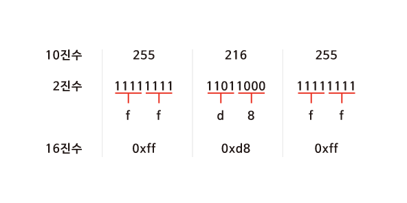
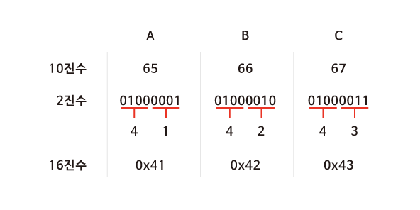
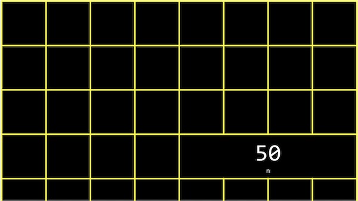
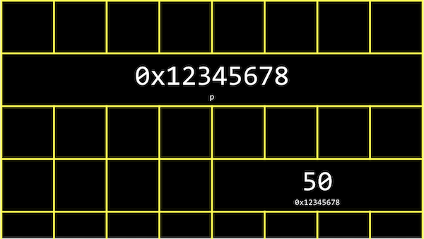
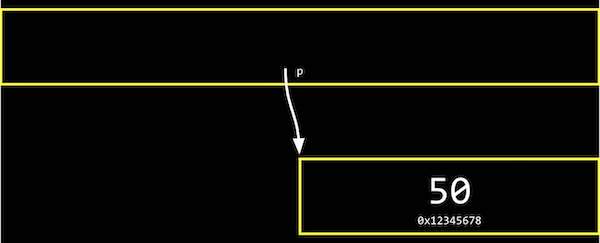

# 5. 메모리

[Naver BoostCourse CS50 2019](https://www.edwith.org/boostcourse-cs-050)

<details>
  <summary>1) 메모리 주소</summary>

# 학습 목표

16진법을 읽고 쓸 수 있다.

메모리 주소에 접근하고 값을 받아오는 코드를 C로 작성할 수 있다.

# 16진수

컴퓨터과학에서는 숫자를 10진수나 2진수 대신 **16진수(Hexadecimal)**로 표현하는 경우가 많다. 컴퓨터에서 데이터를 처리하기 위해 16진수를 사용할 때 장점이 있기 때문이다.

16진수와 일상생활에서 우리가 사용하는 10진수를 비교하면 그 차이를 알 수 있다. 16진수를 사용하면 10진수보다 2진수를 간단하게 나타낼 수 있다. 16진수로 값을 표현하는 방법을 이해하고 나면 16진수, 2진수, 10진수를 변환하는 프로그램을 만들어볼 수 있다.

# 10진수를 16진수로 바꿔 보기

JPG 이미지 파일은 항상 255 216 255 로 시작되고 이것은 10진수이다. 하지만 실제 컴퓨터 내에서는 10진수를 사용하지 않는다. 컴퓨터는 0과 1만을 이해할 수 있기 때문이다.



먼저 255 215 255를 2진수를 나타내보면 위의 그림과 같다. 2진수로 모든 데이터를 표현하기에는 너무 길어지기 때문에 16진수로 바꾸면 **2^4이 16이기 때문에 4bits씩** 두 덩어리로 나누어 보면 0000부터 1111까지는 16진수로 표현할 수 있다는 것을 알 수 있다.

그렇다면 16진수에서 10부터 15까지는 어떻게 표기할까? 10은 a, 11은 b, ..., 15는 f를 대입하여 사용한다. 4bits씩 15진수로 변환 후 **0x**를 붙여 뒤에 오는 문자들이 16진수임을 알려 준다.

# 16진수의 유용성

ASCII 코드에 의해 "A, B, C"는 10진수로 65, 66, 67에 해당한다. 컴퓨터는 10진수를 이해할 수 없으므로 2진수로 표현해보면 "01000001 01000010 01000011"이 된다. 컴퓨터가 처리할 수 있어야 하기에 어쩔 수 없지만 그 길이가 너무 긴 것을 알 수 있다.

하지만 16진수로 표현하면 2진수로 표현했을 때보다 훨씬 간단해진다. 또한 컴퓨터는 8개의 비트가 모인 바이트 단위로 정보를 표현한다. **2개의 16진수는 1byte의 2진수로 변환**되기 때문에 정보를 표현하기 매우 유용하다.



# 메모리 주소

정수형 변수 n에 50이라는 값을 저장하고 출력한다고 생각해 보자.

이 n이라는 값은 **int** 타입이므로, 아래 그림과 같이 우리 컴퓨터의 메모리 어딘가에 **4바이트** 만큼의 자리를 차지하며 저장되어 있을 것이다.



C에서는 변수의 **메모리상 주소**를 받기 위해 '**&**'이라는 연산자를 사용할 수 있다.

```c
#include <stdio.h>

int main(void)
{
    int n = 50;
    printf("%p\n", &n);
}
```

예를 들어, 위와 같은 코드를 실행하면 '0x7ffef009b75c'와 같은 값을 얻을 수 있고, 이는 변수 n의 **16진법**으로 표현된 메모리의 주소이다.

반대로 '**\***'를 사용하면 그 메모리 주소에 있는 **실제 값**을 얻을 수 있다.

```c
#include <stdio.h>

int main(void)
{
    int n = 50;
    printf("%i\n", *&n);
}
```

위 코드는 먼저 **n의 주소**를 얻고, 또 다시 **그 주소에 해당하는 값**을 얻어와 출력한 것이므로 결국 '50'이라는 값이 출력된다.

# 생각해보기

'CS50'을 16진수로 표현해보자

- ASCII코드 기준 CS50의 값은 10진수로 각각 67 83 53 48 이다
- 따라서 16진수로 표현하면 43 53 35 30 이다

</details>

<details>
  <summary>2) 포인터</summary>

# 학습하기

포인터 변수를 정의하고 사용할 수 있다.

# 포인터

지난 파트에서 배웠던 '\*' 연산자는 어떤 메모리 주소에 있는 값을 받아오게 해준다.

이 연산자를 이용해서 **포인터 역할을 하는 변수**를 선언할 수도 있다.

```c
#include <stdio.h>

int main(void)
{
    int n = 50;
    int *p = &n;
    printf("%p\n", p);
    printf("%i\n", *p);
}
```

위 코드를 보면 정수형 변수 n에는 50이라는 값이 저장되어 있다.

그리고 **\*p**라는 **포인터 변수**에 &n이라는 값, 즉 **변수 n의 주소**를 저장한다.

int *p에서 p앞의 *는 이 변수가 포인터라는 의미이고, int는 이 포인터가 int 타입의 변수를 가리킨다는 의미이다.

따라서 첫 번째 printf문과 같이 포인터 p의 값, 즉 변수 **n의 주소를 출력**하거나, 두 번째 printf문과 같이 포인터 **p가 가리키는 변수의 값**, 즉 변수 n의 값을 출력할 수도 있다.

실제 컴퓨터 메모리에서 변수 p는 아래와 같이 저장될 수 있다.



하지만 아래 그림과 같이 실제로 p의 값, 즉 n의 주소 값을 생각하지 않고, 추상적으로 단지 **p가 n을 가리키고 있다는 것**만 생각해도 된다.



이런 포인터를 기반으로 해서 앞으로 배울 다양한 데이터 구조를 정의하고 사용할 수 있다.

# 생각해보기

포인터의 크기는 메모리의 크기와 어떤 관계가 있을까?

- 컴퓨터에 있는 메모리의 크기가 크면 각각의 메모리 주소를 표현하는 숫자 또한 커지기 때문에 포인터의 크기도 커질 것 같다.

</details>

<details>
  <summary>3) 문자열</summary>

# 학습 목표

문자열 형태의 새로운 자료형인 string이 어떻게 정의되었는지 설명할 수 있다.

# 문자열

우리는 여태껏 문자열을 저장하기 위해 CS50 라이브러리에 포함된 string 자료형을 사용하였다.

아래와 같이 s에 "EMMA"라는 값을 저장한다고 생각해 보자

`string s = "EMMA";`

문자열은 결국 **문자의 배열**이고, s[0], s[1], s[2], .. 와 같이 하나의 문자가 배열의 한 부분을 나타낸다.

가장 마지막의 **\0**은 0으로 이루어진 바이트로, **문자열의 끝**을 표시하는 약속이다.


여기서 **변수 s**는 결국 이러한 **문자열을 가리키는 포인터**가 된다.

더 상세히는 문자열의 가장 첫번째 문자, 즉 주소 0x123에 있는 s[0]를 가리키게 된다.


실제 CS50 라이브러리를 보면 string 자료형은 아래와 같이 정의되어 있다.

`typedef char *string`

여기서 typedef는 새로운 자료형을, cahr \*은 문자에 대한 포인터를, string은 자료형의 이름을 의미한다.

따라서 아래 두 코드는 동일하게 동작할 것이다.

1. string 자료형을 이용하여 "EMMA" 출력

   ```c
   #include <stdio.h>
   #include <cs50.h>

   int main(void)
   {
       string s = "EMMA";
       printf("%s\n", s);
   }
   ```

2. char 포인터를 이용하여 "EMMA" 출력

   ```c
   #include <stdio.h>

   int main(void)
   {
       char *s = "EMMA";
       printf("%s\n", s);
   }
   ```

# 생각해보기

string 자료형을 정의해서 사용하면 어떤 장점이 있을까?

- 실생활에서는 char 처럼 문자 하나 단위보다 여러 문자들이 연결되어 있는 문자열을 사용하는 일이 훨씬 잦기 때문에 C에서 제공하는 기본 데이터 타입에 추가로 string 자료형을 정의해서 사용하면 보다 직관적으로 프로그래밍을 할 수 있다.

</details>

<details>
  <summary>4) 문자열 비교</summary>

# 학습 목표

문자열이 저장되어 있는 방식에 근거해서 문자열을 비교하는 방법에 대해 설명할 수 있다.

# 문자열 비교

```c
#include <stdio.h>

int main(void)
{
    char *s = "EMMA";
    printf("%p\n", s);
}
```

위 코드를 실행하면, s라는 포인터의 값, 즉 "EMMA"라는 문자열의 가장 첫 값인 "E"에 해당하는 **메모리 주소**를 출력하게 될 것이다.

그렇다면 아래 코드들은 무엇을 출력할까?

```c
printf("%p\n", &s[0]);
printf("%p\n", &s[1]);
printf("%p\n", &s[2]);
printf("%p\n", &s[3]);
```

s가 가리키는 곳을 시작으로 "EMMA"라는 문자열로 이루어진 문자들의 배열이 있으니, 각각

s라는 문자열의 첫 번째 문자에 해당하는 주소 값,

s라는 문자열의 두 번째 문자에 해당하는 주소 값,

s라는 문자열의 세 번째 문자에 해당하는 주소 값,

s라는 문자열의 네 번째 문자에 해당하는 주소 값을 출력하게 된다.

이를 좀 더 자세히 들여다보면 &s[0]는 "E"의 주소 값을, &s[1]은 "M"의 주소 값을, &[2]은 "M"의 주소 값을, &s[3]은 "A"의 주소 값을 의미한다.

문자열은 첫 번째 문자를 시작으로 메모리상에서 바로 옆에 저장되어 있다.

다시 말해, 가장 첫 번째 문자에 해당하는 **주소 값을 하나씩 증가시키면** 바로 옆에 있는 문자의 값을 출력할 수 있는 것이다.

따라서 아래 코드는 E M M A를 순서대로 출력할 것이다.

```c
printf("%c\n", *s);
printf("%c\n", *(s+1));
printf("%c\n", *(s+2));
printf("%c\n", *(s+3));
```

문자열을 비교할 때도 아래 코드와 같이 문자열이 저장된 변수를 바로 비교하게 되면 그 변수가 저장되어 있는 **주소가 다르기 때문에** 다르다는 결과가 나올 것이다.

정확한 비교를 위해서는 실제 문자열이 저장되어 있는 곳으로 이동하여, 각 문자를 하나하나씩 비교해야 된다.

```c
#include <cs50.h>
#include <stdio.h>

int main(void)
{
    //사용자로부터 s와 t 두 개의 문자열 입력받아 저장
    string s = get_string("s: ");
    string t = get_string("t: ");

    //두 문자열을 비교 (각 문자들을 비교)
    if (s == t)
    {
        printf("Same\n");
    }
    else
    {
        printf("Different\n");
    }
}
```

# 생각해보기

문자열을 비교하는 코드는 어떻게 작성해야 할까?

- 각 문자열의 첫번째 문자의 주소부터 각 문자열의 문자 하나하나씩 비교하여 모두 같으면 두 문자열이 같은 것으로 판단하는 코드를 짜야 한다. (반복문 사용하여 첫번째 문자부터 '\0' 이전까지의 문자 모두 비교)

```c
#include <cs50.h>
#include <stdio.h>

int main(void)
{
    //사용자로부터 s와 t 두 개의 문자열 입력받아 저장
    string s = get_string("s: ");
    string t = get_string("t: ");

    //문자열 s의 길이를 체크
    int n = 0;
    while (s[n] != '\0' )
    {
        n++;
    }

    //두 문자열을 비교 (각 문자들을 비교)
	  // t가 s보다 길 수도 있기 때문에 s에서 '\0'에 해당하는 s[n]과 t[n]도 비교
    for (int i = 0; i <= n; i++)

    {
        if (s[i] != t[i])
        {
            printf("Different\n");
            return 1;
        }
    }
    printf("Same\n");
}
```

</details>

<details>
  <summary>5) 문자열 복사</summary>

</details>

<details>
  <summary>6) 메모리 할당과 해제</summary>

</details>

<details>
  <summary>7) 메모리 교환, 스택, 힙</summary>

</details>

<details>
  <summary>8) 파일 쓰기</summary>

</details>

<details>
  <summary>9) 파일 읽기</summary>

</details>
