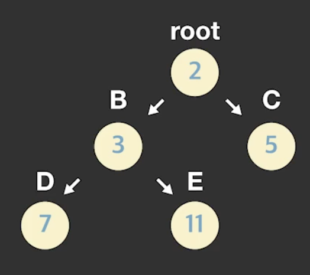
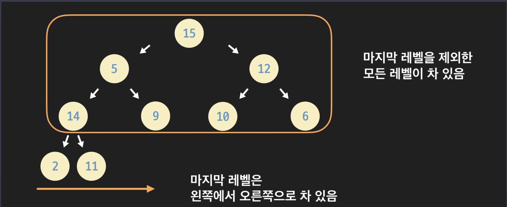
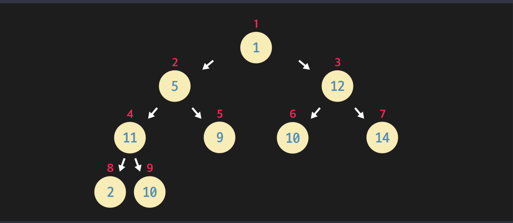
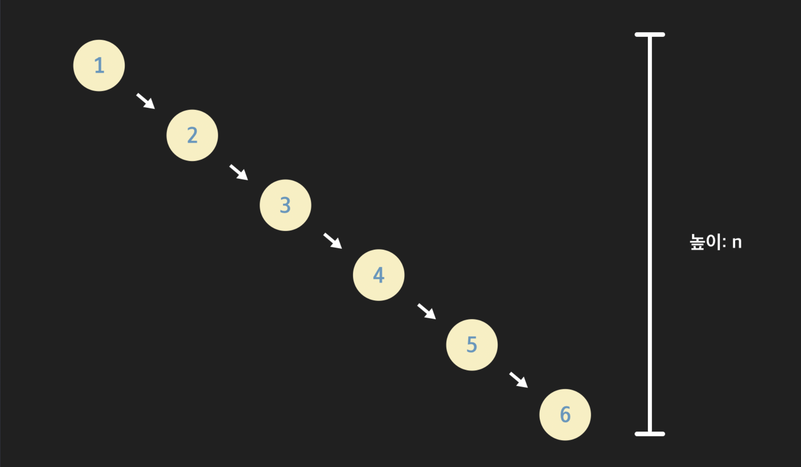
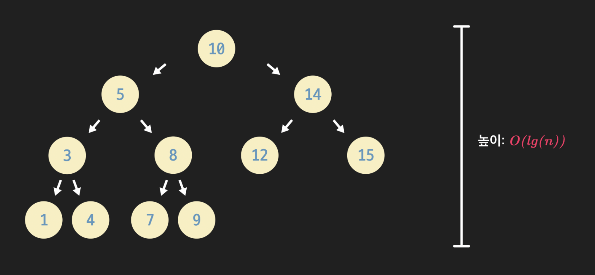

# 2. 트리

[코드잇 자료구조 코스 ](https://www.codeit.kr/courses/data-structures)

<details>
  <summary>1) 트리란?</summary>
  <details>
    <summary>계층적 관계 & 트리란? & 트리 용어 & 트리의 활용</summary>

# 계층적 관계

## 트리

- 데이터의 상-하 관계(계층적 관계)를 저장하는 자료 구조

계층적 관계의 예시: 회사의 직급, 컴퓨터 폴더 구조, 클래스 상속 관계

## 계층적 데이터 저장

배열, 링크드 리스트 → 선형적 자료 구조

해시 테이블 → 데이터 관계 저장 X

따라서 위의 자료 구조들은 계층적 관계를 나타내기에는 적합하지 않음

# 트리란?

링크드 리스트가 노드들 간의 앞뒤 관계를 포함하고 있듯이,

트리는 노드들 간의 계층적 관계(상하 관계)를 포함하고 있다.

이때, 이 관계를 부모-자식 관계라고 한다.

여러 노드들이 부모-자식 관계를 통해서 연결되어 있고, 이 관계가 뻗어나가는 모양이 나무와 같다고 하여 트리라는 이름을 갖게 되었다.

트리에서 가장 상위에 있는 노드, 즉 트리의 시작점이 되는 노드를 나무의 뿌리와 같다 하여, 루트 노드 (root node)라 부른다.

# 트리 용어

- root 노드 (뿌리 노드): 트리의 시작 노드, 뿌리가 되는 노드를 말함. 보통 트리를 표현할 때 가장 위에 root 노드를 놓는 방식으로 나타냄
- 부모 노드: 특정 노드의 직속 상위 노드.
- 자식 노드: 특정 노드의 직속 하위 노드. 부모 노드와 반대되는 개념.
- 형제 노드: 같은 부모를 갖는 노드
- leaf 노드 (잎/말단 노드): 자식 노드를 갖고 있지 않은, 가장 말단에 있는 노드임. 트리의 끝에 있다고 해서 root(뿌리) 노드와 반대되는 표현으로 leaf(잎) 노드라고 부름.
- 깊이: 특정 노드가 root 노드에서 떨어져 있는 거리. 깊이는 해당 노드로 가기 위해서 root 노드에서 몇 번 아래로 내려와야 하는지를 나타냄.
- 레벨: 깊이 +1. 깊이랑 거의 같은 개념. 그냥 깊이에 1을 더한 값. 레벨 1에 있는 노드들, 레벨 2에 있는 노드들, 이런 식으로 특정 깊이인 노드들을 묶어서 표현할 때 사용하는 용어
- 높이: 트리에서 가장 깊이 있는 노드의 깊이.
- 부분 트리 (sub-tree): 현재 트리의 일부분을 이루고 있는 더 작은 트리를 말함. 오른쪽 부분 트리, 왼쪽 부분 트리 등. 전체 트리를 좀 더 작은 단위로 쪼개보면 더 작은 부분 트리들을 발견할 수 있음. 특정 노드를 root 노드라고 생각하고 바라보면 여러 가지 부분 트리들을 발견할 수 있음.

# 트리의 활용

## 트리의 장점

- 계층적 관계가 있는 데이터를 컴퓨터에서 사용!
- 컴퓨터 과학의 다양한 문제 기발하게 해결! (정렬, 압축)
- 흔히 사용하는 여러 추상 자료형 구현! (딕셔너리, 세트, 우선순위 큐)
  </details>
  <details>
    <summary>이진 트리 & 이진 트리 구현</summary>

# 이진 트리

## 이진 트리란?

각 노드가 최대 2개의 자식 노드를 가질 수 있는 트리

- 왼쪽 자식, 오른쪽 자식

# 이진 트리 구현

## 만들려는 이진 트리



## 파이썬 코드

```python
class Node:
  """이진 트리 노드 클래스"""

  def __init__(self, data):
    """데이터와 두 자식 노드에 대한 레퍼런스를 갖는다"""
    self.data = data
    self.left_child = None
    self.right_child = None

"""노드 인스턴스 생성"""
root_node = Node(2)
node_B = Node(3)
node_C = Node(5)
node_D = Node(7)
node_E = Node(11)

"""B와 C를 root 노드의 자식으로 지정"""
root_node.left_child = node_B
root_node.right_child = node_C

"""D와 E를 B의 자식으로 지정"""
node_B.left_child = node_D
node_B.right_child = node_E

# root 노드에서 왼쪽 자식 노드 받아오기
test_node_1 = root_node.left_child
print(test_node_1.data) # 3

# 노드 B의 오른쪽 자식 노드 받아오기
test_node_2 = test_node_1.right_child
print(test_node_2.data) # 11
```

  </details>
  <details>
    <summary>이진 트리 종류 & 완전 이진 트리 배열로 구현하기</summary>

# 이진 트리 종류

## 정 이진 트리 (Full Binary Tree)

모든 노드가 2개 또는 0개의 자식을 가지는 이진 트리

## 완전 이진 트리 (Complete Binary Tree)

마지막 레벨 직전의 레벨 까지는 모든 노드들이 다 채워진 트리

마지막 레벨에서는 노드들이 다 채워질 필요는 없더라도, 왼쪽부터 오른쪽 방향으로는 노드들이 다 채워져야 함



### 완전 이진 트리의 중요한 성질

완전 이진 트리 안에 저장된 노드: n개

완전 이진 트리의 높이는 항상 *lg(n)*에 비례한다.

완전 이진 트리는 마지막 레벨 직전 레벨까지는 모두 노드로 가득 채워져 있음.

레벨1에 1개, 레벨2에 2개, 레벨3에 4개, 레벨4에 8개. 이런 식으로 레벨이 하나씩 증가할 때마다 이전 레벨에 있는 노드 개수의 2배를 더 담을 수 있음

이진 트리의 높이를 _h_, 그 노드 수를 *n*이라고 할 때,

2^(h) ≤ n ≤ 2^(h+1) - 1 , 2^(h) ≤ n < 2^(h+1) 이고, 각 항에 *lg*를 씌우면

_h_ ≤ _lg(n)_ < _h_+1 이 됨

이걸 보면 완전 이진 트리의 높이는 노드 수에 *lg*를 취한 값보다 작은 정수 중에서 최대의 정수임을 알 수 있다.

즉, 노드 수가 n개인 완전 이진 트리의 **높이**는 **h ≤ lg(n)**를 **만족하는 정수 중 **최대의 정수\*\*임

따라서, 완전 이진 트리의 높이 h는 노드 수인 n에 lg를 취한 값인 lg(n)에 비례해서 증가한다는 것을 알 수 있음. 그럼 언제 확실히 높이가 하나 더 증가할까? 그건 바로 노드 수가 현재보다 최소 2배 이상이 되었을 때이다.

h ≤ lg(n) 인 상황에서 n이 2n이 되면, lg(2n) = lg(n) + 1이고,

h+1 ≤ lg(n) +1을 만족하므로, 최소한 현재 노드 수보다 노드 수가 2배 이상이 되었을 때 확실히 높이도 하나 더 올라간다는 것을 알 수 있다.

정리하자면, 완전 이진 트리의 높이는 결국 O(lg(n))이라고 할 수 있음

## 포화 이진 트리 (Perfect Binary Tree)

포화 이진 트리는 모든 레벨이 빠짐없이 다 노드로 채워져 있는 이진 트리임

포화 이진 트리는 기본적으로 정 이진 트리와 완전 이진 트리의 특성을 모두 갖는다.

높이가 0이면 노드 수가 1개, 높이가 1이면 노드 수가 (1+2)개, 높이가 2면 (1+2+4)개, 높이가 3이면 (1+2+4+8)개 이런 식으로 그 높이에 따라 노드의 수가 고정된다.

트리의 높이는 h, 노드 수를 n이라 하면, **n = 2^(h+1) - 1**

식의 양쪽에 1을 더해주면 결국 **n+1 = 2^(h+1)** 와 같은 공식이 성립함

포화 이진 트리는 그 높이나 노드 수, 둘 중에서 하나만 알아도 나머지 하나의 값을 바로 구할 수 있음

# 완전 이진 트리 배열로 구현하기

## 완전 이진 트리 배열 (파이썬 리스트)에 저장하기

트리를 파이썬의 리스트로 구현하는 방법은 모든 이진 트리에 쓸 수 있는 방법은 아니고, 완전 이진 트리인 경우에만 쓸 수 있는 방법이다



이 완전 이진 트리는 아래처럼 리스트에 저장할 수 있다.

```python
complete_binary_tree = [None, 1, 5, 12, 11, 9, 10, 14, 2, 10]
```

위 그림에서 빨간색 작은 숫자는 각 노드의 리스트 내에서의 인덱스를 나타냄. 그러니까 리스트에서 5번째 노드는 노드 9임

## 자식 노드를 찾는 방법

이진 트리에서 각 노드는 기본적으로 자식 노드들을 가리키는 레퍼런스를 가져야 함. 그래야 부모 노드가 자식 노드에 접근할 수 있으니까.

그렇다면 리스트에 노드들이 저장된 경우에는 부모 노드가 자식 노드에 어떻게 접근할 수 있을까?


지금 2번째 노드(노드 5)의 왼쪽 자식 노드를 찾고 싶다고 하자.

그럼 먼저 노드의 인덱스 2에 2를 곱한다. 4다. 그 다음 리스트의 4번째 인덱스에 있는 노드를 찾으면 된다. 노드 11이 있다. 제대로 찾았다.

이번에는 3번째 노드(노드 12)의 오른쪽 자식 노드를 찾아보자.

이번에도 노드의 인덱스 3에 2를 곱한다. 그리고 1을 더해주는데, 그럼 7이다. 이번에는 리스트의 7번째 인덱스를 보면 노드 14가 있다. 맞게 찾았다.

왼쪽 자식 인덱스 = 자신의 인덱스 \* 2

오른쪽 자식 인덱스 = (자신의 인덱스 \* 2) + 1

## 부모 노드를 찾는 방법

부모의 노드를 찾을 때에는, 자신의 인덱스를 2로 나눈 것에서 정수만 취하면 된다.

## 정리

완전 이진 트리는 그 특수한 2가지 성질

- 마지막 레벨 직전의 레벨까지는 노드들로 가득 차 있음
- 마지막 레벨은 왼쪽에서 오른쪽 방향으로 노드들로 가득 차 있어야 함

때문에 이렇게 각 노드를 리스트에 저장한 후에도 부모 노드와 자식 노드를 손쉽게 찾을 수 있다.

## 파이썬 구현

```python
def get_parent_index(complete_binary_tree, index):
    """배열로 구현한 완전 이진 트리에서 index번째 노드의 부모 노드의 인덱스를 리턴하는 함수"""
    parent = index // 2
    if parent != 0:
        return parent
    # root 노드만 부모 노드가 없는데, 이 경우 parent_index가 0. None을 리턴
    else:
        return None

def get_left_child_index(complete_binary_tree, index):
    """배열로 구현한 완전 이진 트리에서 index번째 노드의 왼쪽 자식 노드의 인덱스를 리턴하는 함수"""
    left_child = index * 2
    # 자식 노드가 없으면 - None을 포함한 배열의 길이가 계산된 인덱스+1 보다 작음
    if len(complete_binary_tree) < left_child + 1:
        return None
    else:
        return left_child


def get_right_child_index(complete_binary_tree, index):
    """배열로 구현한 완전 이진 트리에서 index번째 노드의 오른쪽 자식 노드의 인덱스를 리턴하는 함수"""
    right_child = index * 2 + 1
    # 자식 노드가 없으면 - None을 포함한 배열의 길이가 계산된 인덱스+1 보다 작음
    if len(complete_binary_tree) < right_child + 1:
        return None
    else:
        return right_child

# 실행 코드
root_node_index = 1 # root 노드

tree = [None, 1, 5, 12, 11, 9, 10, 14, 2, 10]  # 과제 이미지에 있는 완전 이진 트리

# root 노드의 왼쪽과 오른쪽 자식 노드의 인덱스를 받아온다
left_child_index = get_left_child_index(tree, root_node_index)
right_child_index = get_right_child_index(tree,root_node_index)

print(tree[left_child_index]) # 5
print(tree[right_child_index]) # 12

# 9번째 노드의 부모 노드의 인덱스를 받아온다
parent_index = get_parent_index(tree, 9)

print(tree[parent_index]) # 11

# 부모나 자식 노드들이 없는 경우들
parent_index = get_parent_index(tree, 1)  # root 노드의 부모 노드의 인덱스를 받아온다
print(parent_index) # None

left_child_index = get_left_child_index(tree, 6)  # 6번째 노드의 왼쪽 자식 노드의 인덱스를 받아온다
print(left_child_index) # None

right_child_index = get_right_child_index(tree, 8)  # 8번째 노드의 오른쪽 자식 노드의 인덱스를 받아온다
print(right_child_index) # None
```

  </details>
  <details>
    <summary>트리 순회</summary>

# 트리 순회

## 순회

- 자료 구조에 저장된 모든 데이터를 도는 것

## 재귀 함수

선형적 자료 구조를 순회할 때는 보통 반복분을 사용했는데,

트리 순회에는 재귀 함수 사용!

순회 말고도, 트리에서는 재귀 함수를 많이 사용

## 순회 기본 동작들

- 재귀적으로 왼쪽 부분 트리 순회
- 재귀적으로 오른쪽 부분 트리 순회
- 현재 노드 데이터 출력

# 트리 순회: pre-order

## pre-order 순회

부분 트리 순회 "전"에 현재 노드 출력

1. 현재 노드 데이터를 출력한다
2. 재귀적으로 왼쪽 부분 트리 순회
3. 재귀적으로 오른쪽 부분 트리 순회

# 트리 순회: post-order

## post-order 순회

부분 트리 순회 "후"에 현재 노드 출력

1. 재귀적으로 왼쪽 부분 트리 순회
2. 재귀적으로 오른쪽 부분 트리 순회
3. 현재 노드 데이터를 출력한다.

# 트리 순회: in-order

## in-order 순회

부분 트리 순회 "사이"에 현재 노드 출력

1. 재귀적으로 왼쪽 부분 트리 순회
2. 현재 노드 데이터를 출력한다.
3. 재귀적으로 오른쪽 부분 트리 순회

## 순회

트리를 순회하면 노드들 사이에 **선형적 순서**를 만들 수 있다!

# in-order 순회 구현

## 순회할 트리


## 파이썬 코드

```python
class Node:
    """이진 트리 노드를 나타내는 클래스"""

    def __init__(self, data):
        """이진 트리 노드는 데이터와 두 자식 노드에 대한 레퍼런스를 갖는다"""
        self.data = data
        self.left_child = None
        self.right_child = None

def traverse_inorder(node):
    """in-order 순회 함수"""

    if node.left_child is not None:
        traverse_inorder(node.left_child)

    print(node.data)

    if node.right_child is not None:
        traverse_inorder(node.right_child)


# 여러 노드 인스턴스 생성
node_A = Node("A")
node_B = Node("B")
node_C = Node("C")
node_D = Node("D")
node_E = Node("E")
node_F = Node("F")
node_G = Node("G")
node_H = Node("H")
node_I = Node("I")

# 생성한 노드 인스턴스들 연결
node_F.left_child = node_B
node_F.right_child = node_G

node_B.left_child = node_A
node_B.right_child = node_D

node_D.left_child = node_C
node_D.right_child = node_E

node_G.right_child = node_I

node_I.left_child = node_H

# 노드 F를 root 노드로 만든다
root_node = node_F

# 만들어 놓은 트리를 in-order로 순회한다
traverse_inorder(root_node)
# A
# B
# C
# D
# E
# F
# G
# H
# I
```

  </details>
</details>

<details>
  <summary>2) 힙</summary>
  <details>
    <summary>힙이란?</summary>

# 힙이란?

## 힙의 두 가지 속성

힙은 2가지 속성을 가진 트리임

- 형태 속성: 완전 이진 트리다 ( 높이 = O(lg(n)) )
- 힙 속성: 모든 노드의 데이터는 자식 노드들의 데이터보다 크거나 같다.

## 힙의 두 가지 활용

- 정렬 문제 해결
- 우선순위 큐 구현
  </details>
  <details>
    <summary>정렬 문제</summary>

# 정렬 문제

## 정렬

여러 개의 데이터 요소를 특정 순서로 배치하는 것

정렬 알고리즘: 데이터를 재배치하는 구체적인 방법

- 삽입 정렬, 합병 정렬, 선택 정렬, 힙 정렬

# 배열로 구현한 힙

## 힙 구현하기

- 힙도 완전 이진 트리이므로 동적 배열로 구현! (파이썬 리스트)

# 힙 만들기 1

## heapify

**heapify**: 힙 속성을 지키지 않는 노드가 있을 때마다, 그 노드가 맞는 위치를 찾을 때까지 재배치하는 알고리즘

부모 노드와 자식 노드들의 데이터의 크기를 비교하여, 부모 노드보다 자식 노드가 크면 두 노드의 위치를 바꿔준다.

### 시간 복잡도

모든 노드의 개수: n

최악의 경우: 루트 노드가 리프 노드까지 내려가는 경우

- 총 트리의 높이만큼 데이터를 비교하고 재배치 함

heapify 시간 복잡도: **O(lg(n))**

## 내가 짠 heapify 코드

```python
def swap(tree, index_1, index_2):
    """완전 이진 트리의 노드 index_1과 노드 index_2의 위치를 바꿔준다"""
    temp = tree[index_1]
    tree[index_1] = tree[index_2]
    tree[index_2] = temp

def heapify(tree, index, tree_size):
    """heapify 함수"""

    # 왼쪽 자식 노드의 인덱스와 오른쪽 자식 노드의 인덱스를 계산
    left_child_index = 2 * index
    right_child_index = 2 * index + 1

		parent_data = tree[index]

    # 자식 노드가 없을 때 종료
    if tree_size < left_child_index + 1:
        return
    # 왼쪽 자식 노드만 있을 때
    elif tree_size < right_child_index + 1:
        left_child_data = tree[left_child_index]
        most = max(parent_data, left_child_data)
        # 부모 노드의 데이터가 가장 클 떄
        if parent_data == most:
            return
        # 왼쪽 자식 노드의 데이터가 가장 클 떄
        else:
            swap(tree, index, left_child_index)
            heapify(tree, left_child_index, tree_size)
        return

    # 모든 자식 노드가 있을 때
    left_child_data = tree[left_child_index]
    right_child_data = tree[right_child_index]

    most = max(parent_data, left_child_data, right_child_data)

    # 부모 노드의 데이터가 가장 클 떄
    if parent_data == most:
        return
    # 왼쪽 자식 노드의 데이터가 가장 클 떄
    elif left_child_data == most:
        swap(tree, index, left_child_index)
        heapify(tree, left_child_index, tree_size)
    # 오른쪽 자식 노드의 데이터가 가장 클 떄
    else:
        swap(tree, index, right_child_index)
        heapify(tree, right_child_index, tree_size)


# 실행 코드
tree = [None, 15, 5, 12, 14, 9, 10, 6, 2, 11, 1]  # heapify하려고 하는 완전 이진 트리
heapify(tree, 2, len(tree))  # 노드 2에 heapify 호출
print(tree)
```

## 코드잇 해답: 더 나은 heapify 코드

```python
def swap(tree, index_1, index_2):
    """완전 이진 트리의 노드 index_1과 노드 index_2의 위치를 바꿔준다"""
    temp = tree[index_1]
    tree[index_1] = tree[index_2]
    tree[index_2] = temp

def heapify(tree, index, tree_size):
    """heapify 함수"""

    # 왼쪽 자식 노드의 인덱스와 오른쪽 자식 노드의 인덱스를 계산
    left_child_index = 2 * index
    right_child_index = 2 * index + 1

    largest = index # 일단 부모 노드의 값이 가장 크다고 설정

    # 왼쪽 자식 노드의 값과 비교
    #(동시에 인덱스의 유효 범위 확인을 통해서 자식 노드가 있는지도 확인)
    if 0 < left_child_index < tree_size and tree[largest] < tree[left_child_index]:
        largest = left_child_index

    # 오른쪽 자식 노드의 값과 비교
    if 0 < right_child_index < tree_size and tree[largest] < tree[right_child_index]:
        largest = right_child_index

    if largest != index: # 부모 노드의 값이 자식 노드의 값보다 작으면
        swap(tree, index, largest) # 부모 노드와 최댓값을 가진 자식 노드의 위치를 바꿔준다
	      # 자리가 바뀌어 자식 노드가 된 기존의 부모 노드를 대상으로 또 heapify 함수를 호출한다
				heapify(tree, largest, tree_size)


# 실행 코드
tree = [None, 15, 5, 12, 14, 9, 10, 6, 2, 11, 1]  # heapify하려고 하는 완전 이진 트리
heapify(tree, 2, len(tree))  # 노드 2에 heapify 호출
print(tree)
```

# 힙 만들기 2

## heapify

파라미터로 넘기는 노드가 힙에서 위치를 찾아간다.

파이썬 리스트로 구현한 완전 이진 트리에서, 마지막 인덱스부터 차례로 hipify를 호출해 추면 힙으로 만들 수 있음

- 이미 자식 노드들에 heapify 함수가 호출된 이후에는 부모 노드를 뿌리로 하고 있는 부분들은 모두 힙 속성을 지키고 있는 것으로 가정할 수 있기 때문

## 시간 복잡도

heapify: O(lg(n))

이 heapify를 맨 뒤 노드부터 모든 노드에 호출해야 하기 때문에

시간복잡도는 **O(nlg(n))** 이다!

  </details>
  <details>
  <summary>힙 정렬</summary>

# 힙 정렬

## 힙 정렬

힙을 이용한 정렬 알고리즘!

1. 힙을 만든다
2. root와 마지막 노드를 바꿔준다
3. (바꾼 노드는 없는 노드 취급한다)
4. 새로운 노드가 힙 속성을 지킬 수 있게 heapify 호출

모든 인덱스를 돌 때까지 2~4 반복

### 만약 내림 차순으로 정렬하고 싶으면?

힙 속성을 반대로 (부모 노드의 데이터가 자식 노드의 데이터보다 작아야 한다) 바꾸고, 똑같은 알고리즘을 적용하면 된다.

# 힙 정렬 구현하기

## 순서

1. 먼저 리스트를 힙으로 만든다
2. root 노드와 마지막 노드의 위치를 바꾼다. 마지막 위치로 간 기존의 root 노드는 이제 힙에서 없다고 가정한다.
3. 새로운 root 노드가 힙 속성을 지킬 수 있게 heapify 한다.
4. 힙에 남아있는 노드가 없도록 단계 2~3을 반복한다.

## 내가 짠 코드

```python
def swap(tree, index_1, index_2):
    """완전 이진 트리의 노드 index_1과 노드 index_2의 위치를 바꿔준다"""
    temp = tree[index_1]
    tree[index_1] = tree[index_2]
    tree[index_2] = temp

def heapify(tree, index, tree_size):
    """heapify 함수"""

    # 왼쪽 자식 노드의 인덱스와 오른쪽 자식 노드의 인덱스를 계산
    left_child_index = 2 * index
    right_child_index = 2 * index + 1

    largest = index  # 일단 부모 노드의 값이 가장 크다고 설정

    # 왼쪽 자식 노드의 값과 비교
    if 0 < left_child_index < tree_size and tree[largest] < tree[left_child_index]:
        largest = left_child_index

    # 오른쪽 자식 노드의 값과 비교
    if 0 < right_child_index < tree_size and tree[largest] < tree[right_child_index]:
        largest = right_child_index

    if largest != index: # 부모 노드의 값이 자식 노드의 값보다 작으면
        swap(tree, index, largest)  # 부모 노드와 최댓값을 가진 자식 노드의 위치를 바꿔준다
        heapify(tree, largest, tree_size)  # 자리가 바뀌어 자식 노드가 된 기존의 부모 노드를대상으로 또 heapify 함수를 호출한다

def heapsort(tree):
    """힙 정렬 함수"""
    tree_size = len(tree)

    # 1. 리스트를 힙으로 만든다
    # 마지막 노드부터  root 노드까지 반복
    for i in range(len(tree) - 1, 0, -1):
        # heapify 호출
        heapify(tree, i, tree_size)

    root_index = 1

    # 마지막 노드부터 root 노드까지 반복
    for i in range(len(tree) - 1, 0, -1):
        # 2-1. root 노드와 마지막 노드의 위치를 바꾼다.
        temp = tree[root_index]
        tree[root_index] = tree[i]
        tree[i] = temp

        # 2-2 마지막 위치로 간 기존의 root 노드는 이제 힙에서 없다고 가정한다.
        sub_tree = tree[:i]


        # 3. 새로운 root 노드가 힙 속성을 지킬 수 있게 heapify 한다.
        heapify(sub_tree, root_index, len(sub_tree))


        # 4. 기존의 tree에 반영
        tree[:i] = sub_tree[:]

# 실행 코드
data_to_sort = [None, 6, 1, 4, 7, 10, 3, 8, 5, 1, 5, 7, 4, 2, 1]
heapsort(data_to_sort)
print(data_to_sort)
```

## 코드잇 해답: 더 나은 코드

```python
def swap(tree, index_1, index_2):
    """완전 이진 트리의 노드 index_1과 노드 index_2의 위치를 바꿔준다"""
    temp = tree[index_1]
    tree[index_1] = tree[index_2]
    tree[index_2] = temp

def heapify(tree, index, tree_size):
    """heapify 함수"""

    # 왼쪽 자식 노드의 인덱스와 오른쪽 자식 노드의 인덱스를 계산
    left_child_index = 2 * index
    right_child_index = 2 * index + 1

    largest = index  # 일단 부모 노드의 값이 가장 크다고 설정

    # 왼쪽 자식 노드의 값과 비교
    if 0 < left_child_index < tree_size and tree[largest] < tree[left_child_index]:
        largest = left_child_index

    # 오른쪽 자식 노드의 값과 비교
    if 0 < right_child_index < tree_size and tree[largest] < tree[right_child_index]:
        largest = right_child_index

    if largest != index: # 부모 노드의 값이 자식 노드의 값보다 작으면
        swap(tree, index, largest)  # 부모 노드와 최댓값을 가진 자식 노드의 위치를 바꿔준다
        heapify(tree, largest, tree_size)  # 자리가 바뀌어 자식 노드가 된 기존의 부모 노드를대상으로 또 heapify 함수를 호출한다

def heapsort(tree):
    """힙 정렬 함수"""
    tree_size = len(tree)

    # 마지막 인덱스부터 처음 인덱스까지 heapify를 호출한다
    for index in range(tree_size - 1, 0, -1):
        heapify(tree, index, tree_size)

    # 마지막 인덱스부터 처음 인덱스까지
    for i in range(tree_size - 1, 0, -1):
        swap(tree, 1, i) # root 노드와 마지막 인덱스를 바꿔준 후
        heapify(tree, 1, i) # root 노드에 heapify를 호출한다

# 실행 코드
data_to_sort = [None, 6, 1, 4, 7, 10, 3, 8, 5, 1, 5, 7, 4, 2, 1]
heapsort(data_to_sort)
print(data_to_sort)
```

# 힙 정렬 시간 복잡도 & 평가

## 힙 정렬 시간 복잡도

모든 노드의 수 = n

### 힙 정렬의 각 단계

1. 먼저 리스트를 힙으로 만든다.
2. root 노드와 마지막 노드의 위치를 바꾼다. 마지막 위치로 간 기존의 root 노드는 이제 힙에서 없다고 가정한다.
3. 새로운 root 노드가 힙 속성을 지킬 수 있게 heapify 한다.
4. 힙에 남아있는 노드가 없도록 단계 2 ~ 3을 반복한다.

1번째 단계인 리스트를 힙으로 만드는 데 걸리는 시간은 O(nlg(n))이다.

2번째 단계는 그냥 두 노드의 위치를 바꿔 주는 작업이기 때문에 노드의 개수 n과는 상관없이 항상 O(1)이다.

3번째 단계는 새로운 root 노드에 heapify 하는 것이다. 이때의 시간 복잡도는 O(lg(n)). 그럼 2번째 단계와 3번째 단계를 합치면 O(lg(n) + 1), 즉, O(lg(n))이다.

4번째 단계는 2~3 단계를, 힙에 남아있는 노드가 없을 때까지 반복한다. 힙에는 총 n개의 노드가 있으므로 2, 3, 4단계의 시간 복잡도를 종합하면 O(nlg(n)) 이라고 할 수 있다.

### 정리

- 힙을 만드는 데 O(nlg(n))
- 만든 힙에서 매번 root 노드를 뽑고 남은 것들을 다시 힙을 만들어주는 작업을 반복하는 데 O(nlg(n))이 걸린다.

그럼 힙 정렬의 총 시간 복잡도는 O(nlg(n) + nlg(n))으로 O(2nlg(n))이고,

시간 복잡도에서 상수는 무시되니까 결국 O(nlg(n))이라고 할 수 있다.

힙 정렬은 **O(nlg(n))**의 시간 본잡도를 가지는 정렬 알고리즘이다.

## 다른 정렬 알고리즘들과의 비교

- 선택 정렬: O(n^(2))
- 삽입 정렬: O(n^(2))
- 합병 정렬: O(nlg(n))
- 퀵 정렬: 평균 O(nlg(n)), 최악 O(n^(2))
- 힙 정렬: O(nlg(n))

힙 정렬은 선택 정렬과 삽입 정렬보다는 좋고, 합병 정렬과 퀵 정렬과는 비슷한 성능을 내는 정렬 방법이라는 것을 알 수 있다.

  </details>
  <details>
    <summary>우선순위 큐</summary>

# 우선순위 큐

## 우선순위 큐란?

우선순위 큐는 추상 자료형 중 하나다.

- 데이터를 저장할 수 있다.
- 저장한 데이터가 우선순위 순서대로 나온다.

## 우선순위 큐와 힙의 관계

- 힙을 사용하면 우선순위 큐를 효율적으로 구현할 수 있다.

# 힙에 데이터 삽입하기

## 힙 속성을 유지하면서 힙에 데이터 삽입하는 법

1. 힙의 마지막 인덱스에 데이터를 삽입한다
2. 삽입한 데이터와 부모 노드의 데이터를 비교한다
3. 부모 노드의 데이터가 더 작으면 둘의 위치를 바꿔준다
4. 새로 삽입한 노드가 제 위치를 찾을 때까지 2~3을 반복한다.

# 힙 데이터 삽입 구현하기

## 과정

우선순위 큐는 `PriorityQueue`라는 클래스로 정의되어 있고, 그 안에 힙이 있다. `PriorityQueue` 클래스에는 `heap`이라는 인스턴스 변수가 있고, 이것은 파이썬의 리스트를 가리킨다. 가장 처음 `heap`에는 `None`이라는 원소 하나만 있다.

힙에 데이터를 삽입하는 메소드의 이름은 `insert`이다. `insert` 메소드는 데이터를 삽입할 때 리스트가 계속 힙의 속성을 유지하도록 하는 기능도 포함해야 한다.

`insert` 메소드로 데이터를 삽입할 때 이루어져야 하는 일은 3단계로 나눌 수 있다.

1. 힙의 마지막 인덱스에 노드를 삽입한다.
2. (1) 삽입한 노드와 그 부모 노드를 비교해서 부모 노드가 더 작으면 둘의 위치를 바꾸고, (2)부모 노드가 더 크거나 같으면 그대로 둔다.
3. 2-1의 경우에는 삽입한 노드가 올바른 위치를 찾을 때까지 단계 2를 반복한다.

이때 단계 2와 단계 3의 작업을 하는 별도의 함수 `reverse_heapify`를 정의해 놓고 사용한다.

이 함수는

- 리스트로 구현한 완전 이진 트리, `tree`
- 삽입된 노드의 인덱스, `index`

를 파라미터로 받는다. 그리고 삽입된 노드를 힙 속성을 유지할 수 있는 위치로 이동시킨다.

이전에 배운 `heapify` 함수가 위에 있는 노드를 아래로 이동시켜서 힙 속성을 유지했다면 `reverse_heapify` 함수는 아래에 있는 노드를 위로 이동시켜서 힙 속성을 유지시킨다.

`reverse_heapify` 함수만 완성되면 `insert` 메소드를 완성하는 것은 간단하다

`insert` 함수는

- `self`
- 삽입하는 데이터, `data`

를 파라미터로 받는데, `insert` 메소드는

1. 리스트, `heap`의 마지막에 새로운 데이터를 삽입하고
2. 그 마지막 인덱스를 `reverse_heapify` 함수에 파라미터로 넘겨서 호출하면 된다.

## 힙에 데이터 삽입하기

```python
def swap(tree, index_1, index_2):
    """완전 이진 트리의 노드 index_1과 노드 index_2의 위치를 바꿔준다"""
    temp = tree[index_1]
    tree[index_1] = tree[index_2]
    tree[index_2] = temp

def reverse_heapify(tree, index):
    """삽입된 노드를 힙 속성을 지키는 위치로 이동시키는 함수"""
    parent_index = index // 2  # 삽입된 노드의 부모 노드의 인덱스 계산
    # 해당 자식 노드가 부모 노드보다 크면 두 노드의 위치를 바꾼다
    if 0 < parent_index and tree[parent_index] < tree[index]:
        swap(tree, parent_index, index)
        reverse_heapify(tree, parent_index)


class PriorityQueue:
    """힙으로 구현한 우선순위 큐"""
    def __init__(self):
        self.heap = [None]  # 파이썬 리스트로 구현한 힙

    def insert(self, data):
        """삽입 메소드"""
        # 1 힙의 마지막 인덱스에 노드를 삽입한다
        self.heap.append(data)

        # 2 삽입한 노드와 그 부모 노드를 비교해서 부모 노드가 더 작으면 둘의 위치를 바꾼다
        reverse_heapify(self.heap, len(self.heap)-1)

    def __str__(self):
        return str(self.heap)

# 실행 코드
priority_queue = PriorityQueue()

priority_queue.insert(6)
priority_queue.insert(9)
priority_queue.insert(1)
priority_queue.insert(3)
priority_queue.insert(10)
priority_queue.insert(11)
priority_queue.insert(13)

print(priority_queue)
# [None, 13, 9, 11, 3, 6, 1, 10]
```

# 힙에서 최고 우선순위 데이터 추출하기

## 힙에서 root 노드 데이터 추출하기

- root 노드와 마지막 노드를 서로 바꿔 준다.
- 마지막 노드의 데이터를 변수에 저장해 준다.
- 마지막 노드를 삭제한다.
- root 노드에 heapify를 호출해서 망가진 힙 속성을 고친다.
- 변수에 저장한 데이터를 리턴한다 (최고 우선순위 데이터)

# 힙 우선순위 데이터 추출 구현

## 단계

1. root 노드와 마지막 노드의 위치를 바꾼다
2. 마지막 위치로 간 원래 root 노드의 데이터를 별도 변수에 저장하고, 노드는 힙에서 지운다
3. 새로운 root 노드를 대상으로 heapify해서 망가진 힙 속성을 복원한다
4. 2단계에서 따로 저장해 둔 최우선순위 데이터를 리턴한다

### heapify_code.py

```python
def swap(tree, index_1, index_2):
    """완전 이진 트리의 노드 index_1과 노드 index_2의 위치를 바꿔준다"""
    temp = tree[index_1]
    tree[index_1] = tree[index_2]
    tree[index_2] = temp

def heapify(tree, index, tree_size):
    """heapify 함수"""

    # 왼쪽 자식 노드의 인덱스와 오른쪽 자식 노드의 인덱스를 계산
    left_child_index = 2 * index
    right_child_index = 2 * index + 1

    largest = index  # 일단 부모 노드의 값이 가장 크다고 설정

    # 왼쪽 자식 노드의 값과 비교
    if 0 < left_child_index < tree_size and tree[largest] < tree[left_child_index]:
        largest = left_child_index

    # 오른쪽 자식 노드의 값과 비교
    if 0 < right_child_index < tree_size and tree[largest] < tree[right_child_index]:
        largest = right_child_index

    if largest != index: # 부모 노드의 값이 자식 노드의 값보다 작으면
        swap(tree, index, largest)  # 부모 노드와 최댓값을 가진 자식 노드의 위치를 바꿔준다
        heapify(tree, largest, tree_size)  # 자리가 바뀌어 자식 노드가 된 기존의 부모 노드를대상으로 또 heapify 함수를 호출한다

def reverse_heapify(tree, index):
    """삽입된 노드를 힙 속성을 지키는 위치로 이동시키는 함수"""
    parent_index = index // 2  # 삽입된 노드의 부모 노드의 인덱스 계산

    # 부모 노드가 존재하고, 부모 노드의 값이 삽입된 노드의 값보다 작을 때
    if 0 < parent_index < len(tree) and tree[index] > tree[parent_index]:
        swap(tree, index, parent_index)  # 부모 노드와 삽입된 노드의 위치 교환
        reverse_heapify(tree, parent_index)  # 삽입된 노드를 대상으로 다시 reverse_heapify 호출
```

### main.py

```python
from heapify_code import *

class PriorityQueue:
    """힙으로 구현한 우선순위 큐"""
    def __init__(self):
        self.heap = [None]  # 파이썬 리스트로 구현한 힙

    def insert(self, data):
        """삽입 메소드"""
        self.heap.append(data)  # 힙의 마지막에 데이터 추가
        reverse_heapify(self.heap, len(self.heap)-1) # 삽입된 노드(추가된 데이터)의 위치를 재배치

    def extract_max(self):
        """최우선순위 데이터 추출 메소드"""
        tree = self.heap
        # 1. root 노드와 마지막 노드의 위치를 바꾼다
        swap(tree, 1, len(tree)-1)

        # 2. 마지막 위치로 간 데이터를 별도 변수에 저장, 노드를 힙에서 삭제
        return_value = self.heap.pop()

        # 3. 새로운 root 노드를 대상으로 heapify
        heapify(tree, 1, len(tree))

        # 4. 2단계에서 따로 저장해 둔 최우선순위 데이터를 리턴한다
        return return_value


    def __str__(self):
        return str(self.heap)

# 출력 코드
priority_queue = PriorityQueue()

priority_queue.insert(6)
priority_queue.insert(9)
priority_queue.insert(1)
priority_queue.insert(3)
priority_queue.insert(10)
priority_queue.insert(11)
priority_queue.insert(13)

print(priority_queue.extract_max()) # 13
print(priority_queue.extract_max()) # 11
print(priority_queue.extract_max()) # 10
print(priority_queue.extract_max()) # 9
print(priority_queue.extract_max()) # 6
print(priority_queue.extract_max()) # 3
print(priority_queue.extract_max()) # 1
```

  </details>
  <details>
    <summary>힙 삽입, 추출 시간 복잡도 & 힙으로 구현한 우선순위 큐 평가</summary>

# 힙 삽입, 추출 시간 복잡도

## 힙의 삽입 연산 시간 복잡도

힙에 있는 노드의 개수를 n개라고 가정한다.

### 힙의 삽입 연산 단계

1. 힙의 마지막 인덱스에 노드를 삽입한다.
2. (1) 삽입한 노드와 그 부모 노드를 비교해서 부모 노드가 더 작으면 둘의 위치를 바꾸고, (2) 부모 노드가 더 크거나 같으면 그대로 둔다.
3. 2-(1)의 경우에는 삽입한 노드가 올바른 위치를 찾을 때까지 단계 2를 반복한다.

### 1단계

먼저 힙의 마지막에 노드를 삽입해야 한다. 힙을 동적 배열로 구현했으니, 동적 배열에 원소를 추가하는 것의 시간 복잡도를 분할 상환 분석하면 O(1)이다.

### 2단계

1. 삽입된 노드의 값과 부모 노드의 값을 비교하는 건 O(1)이 걸린다.
2. 삽입된 데이터가 더 큰 경우 부모 노드와의 위치를 바꿔주는 것과 마찬가지로 O(1)이 걸린다.

즉, 2단계에서는 O(2)이 걸리는데, 이건 O(1)과 동일하다.

### 3단계

최악의 경우 2단계를 몇 번이나 반복해야할까? 최악의 경우는 삽입한 데이터가 leaf 노드부터 시작해서 root 노드까지 올라가는 경우인데, 그럼 힙의 높이만큼 2단계를 반복해야 한다.

힙의 높이는 lg(n)에 비례하니까 시간은 O(lg(n))이다. 이 말은, 2단계의 시간인 O(1)를 최대 O(lg(n))번 반복할 수 있다는 말이니까 결국 시간 복잡도는 O(lg(n))이 걸린다.

### 정리

1. 1단계의 O(1)
2. 2단계, 3단계의 O(lg(n))

를 더하면 O(1+lg(n))이 되고, 이건 곧 O(lg(n))과 같다.

결론적으로, 힙에 데이터를 삽입하는 연산의 시간 복잡도는 **O(lg(n))**이다.

## 힙의 추출 연산 시간 복잡도

이제 힙에서 가자 우선 순위가 높은 데이터를 추출하는 데에 시간이 얼마 걸리는지 알아보자. 이번에도 힙에 있는 노드의 개수를 n이라고 한다.

### 힙의 추출 연산 단계

1. root 노드와 마지막 노드의 위치를 바꾼다.
2. 마지막 위치로 간 원래 root 노드의 데이터를 별도 변수에 저장하고, 노드는 힙에서 지운다.
3. 새로운 root 노드를 대상으로 `heapify`해서 망가진 힙 속성을 복원한다.
4. 2단계에서 따로 저장해 둔 최우선순위 데이터를 리턴한다.

### 1단계

root 노드와 마지막 노드위 위치를 바꾸는 건 노드의 개수랑은 전혀 상관 없이 O(1)이 걸린다.

### 2단계

데이터를 변수에 지정하는 것은 O(1)이 걸린다. 힙을 동적 배열로 구현했으니, 동적 배열에서 마지막 인덱스의 원소를 삭제하는 건 분할 상환 분석을 하면 O(1)이 걸린다. 이 단계는 총 O(1+1)이 걸리니까 O(1)이 걸리는 것이다.

### 3단계

새로운 root 노드를 대상으로 `heapify`를 호출해서 망가진 힙 속성을 복원하는 단계이다. `heapify`는 O(lg(n))이 걸린다.

### 4단계

변수를 리턴하는 건 O(1)이 걸린다.

### 정리

총 걸리는 시간을 더하면 O(1+1+lg(n)+1)이다. 여기서 1은 다 무시해도 되니까, 힙에서 가장 우선 순위가 높은 데이터를 추출하는 연산의 시간 복잡도는 **O(lg(n))**이다.

# 힙으로 구현한 우선순위 큐 평가

우선순위 큐를 구현할 때는 힙 말고도 다른 자료 구조들을 활용할 수도 있다.

- 정렬된 동적 배열
- 정렬된 더블리 링크드 리스트

## 정렬된 동적 배열

### 삽입 연산

동적 배열에 데이터가 정렬된 채(오름차순 또는 내림차순)로 있다고 가정하고 새로운 데이터를 삽입할 때는 생각해보자. 새로운 데이터를 정렬된 동적 배열에 삽입하려면 크게 두 가지 작업을 해야한다.

1. 먼저 새로운 데이터가 어느 위치에 들어가야 하는지를 찾고
2. 그위치에 데이터를 넣어야 한다.

### 삽입 연산 시간 복잡도

1. 삽입할 위치를 찾는 것은 이진 탐색을 사용하면 O(lg(n))이 걸린다.
2. 그리고 그 위치에 데이터를 삽입하는 건 최악의 경우 O(n)이 걸린다.

그럼 삽입 연산은 총 O(lg(n) + n)이 걸리고, 이는 곧 O(n)과 같다.

결국, 정렬된 동적 배열에 데이터를 삽입하는 연산은 **O(n)**이 걸린다.

### 추출 연산

동적 배열이 항상 정렬된 상태라면 가장 우선순위가 높은 데이터는 항상 배열의 끝에 있을 것이다. 그래서 추출할 때는 그냥 마지막 데이터를 삭제함과 동시에 리턴하면 된다.

동적 배열 맨 뒤에 있는 데이터를 추출하는 연산은 O(1)이 걸린다.

결국, 정렬된 동적 배열에서 가장 우선순위가 높은 데이터를 추출하는 연산은 **O(1)**이 걸린다.

## 정렬된 더블리 링크드 리스트

### 삽입 연산

일단 데이터를 삽입해야 하는 위치를 찾아야 한다. 링크드 리스트에서는 이럴 때 선형 탐색을 해야 한다. 그러니까 head 노드부터 순서대로 하나씩 노드를 확인하면서 삽입할 위치를 찾아야 하는데, 총 노드 수가 n이라고 했을 때, 최악의 경우 n개의 노드를 다 봐야 한다.

예를 들어, `| 3 | 5 | 6 | 8 | 9 |` 이렇게 정렬된 더블리 링크드 리스트에서 10을 삽입하고 싶으면 선형 탐색으로 3부터 9까지를 다 확인해야 한다.

- 9 뒤에 삽입해야 한다는 걸 알기 위해 n개의 노드를 다 봐야 하는 것이다. 그러니까 삽입할 위치를 찾는 단계는 O(n)이 걸린다.

그럼 삽입은 얼마나 걸릴까? 위치만 정해지고 나면 링크드 리스트에서 데이터를 삽입하는 건 O(1)에 할 수 있다. 위치만 정해지고 나면 링크드 리스트에서 데이터를 삽입하는 건 O(1)에 할 수 있다.

결국, 정렬된 더블리 링크드 리스트에 데이터를 삽입하는 것은 O(1+n)이 걸리고, 이건 **O(n)**과 같다.

### 추출 연산

더블리 링크드 리스트에서 마지막 데이터를 추출하는 데에는 O(1)이 걸린다.

결국, 정렬된 더블리 링크드 리스트에서 가장 우선순위가 높은 데이터를 추출하는 데 **O(1)**이 걸리는 것이다.

## 힙

힙으로 우선순위 큐를 구현할 때에는, 힙에 데이터를 삽입하는 연산과 추출하는 연산의 시간 복잡도는 모두 O(lg(n))이었다.

## 우선순위 큐 시간 복잡도 정리

- 정렬된 동적 배열: 삽입=O(n), 추출=O(1)
- 정렬된 더블리 링크드 리스트: 삽입=O(n), 추출=O(1)
- 힙: 삽입=O(lg(n)), 추출=O(lg(n))

우선순위를 사용할 때

- 정렬된 동적 배열이나 정렬된 더블리 링크드 리스트를 사용하면 데이터를 추출할 때 더 효율적
- 힙을 사용하면 데이터를 삽입할 때 더 효율적

## 우선순위 큐는 뭐로 구현하는 게 가장 좋을까?

만약 새로운 데이터를 삽입할 일이 많으면 힙으로,

기존 데이터를 추출할 일이 더 많으면 정렬된 동적 배열이나 정렬된 더블리 링크드 리스트로 구현하는 게 좋을 것이다.

이렇게 우선순위 큐와 같은 어떤 추상 자료형을 구현할 때는 특정 방식이 항상 더 낫다고 단정하기 힘들다. 단지, 개발자가 처한 상황에 따라 정답이 달라질 뿐이고, 개발자는 이러한 것을 잘 판단해야겠다.

  </details>
</details>

<details>
  <summary>3) 이진 탐색 트리</summary>
  <details>
    <summary>이진 탐색 트리란 & 이진 탐색 트리 노드 구현 & 이진 탐색 트리 출력</summary>

# 이진 탐색 트리란

## 이진 탐색 트리 (Binary Search Tree)

- 딕셔너리나 세트를 구현할 때 쓰일 수 있음

이진 탐색 트리는 이진 트리이면서 어떤 속성을 지켜야 함

이진 탐색 트리 속성: 특정 노드를 봤을 때, 왼쪽 부분 트리에 있는 모든 노드의 데이터는 그 노드의 데이터보다 작아야하고, 오른쪽 부분 트리에 있는 모든 노드의 데이터는 그 노드의 데이터보다 크다.

이 특성을 이용해서 원하는 데이터의 탐색이 가능하다.

# 이진 탐색 트리 노드 구현

이진 탐색 트리는 이진 트리이지만, 항상 완전 이진 트리라는 보장이 없음

- 따라서 배열이나 파이썬 리스트로 구현하지 않는다

### 이진 탐색 트리 노드 구현

```python
class Node:
  """이진 탐색 트리 노드"""
  def __init__(self, data):
    self.data = data
    self.parent = None # 기존 이진 트리 노드 클래스에서 인스턴스 변수 parent 추가
    self.left_child = None
    self.right_child = None

# 노드 인스턴스 생성
node_0 = Node(5)
node_1 = Node(3)
node_2 = Node(7)

node_0.left_child = node_1
node_0.right_child = node_2

node_1.parent = node_0
node_2.parent = node_0
```

각 노드가 자식과 부모 모두에 대한 레퍼런스를 가지고 있다!

### 이진 탐색 트리 클래스 구현

```python
class Node:
  """이진 탐색 트리 노드"""
  def __init__(self, data):
    self.data = data
    self.parent = None
    self.left_child = None
    self.right_child = None

class BinarySearchTree:
  """이진 탐색 트리"""
  def __init__(self):
    self.root = None

# 비어 있는 이진 탐색 트리 생성
bst = BinarySearchTree()
```

# 이진 탐색 트리 출력

### in-order 순회 복습

1. 왼쪽 부분 트리를 in-order 순회한다.
2. 현재 노드의 데이터를 출력한다.
3. 오른쪽 부분 트리를 in-order 순회한다.

## in-order 순회와 이진 탐색 트리

이진 탐색 트리를 in-order 순회하면 저장된 데이터들을 정렬된 순서대로 출력할 수 있따.

## BinarySearchTree 클래스

이전에 구현해 본 in-order 순회 함수를 재활용해서 이진 탐색 트리를 나타내는 BinarySearchTree 클래스에 트리 속의 데이터를 출력하는 메소드, `print_sorted_tree` 메소드를 작성해보자.

## `print_sorted_tree()` 메소드

```python
def print_inorder(node):
    """주어진 노드를 in-order로 출력해주는 함수"""
    if node is not None:
        print_inorder(node.left_child)
        print(node.data)
        print_inorder(node.right_child)

class BinarySearchTree:
    """이진 탐색 트리 클래스"""
    def __init__(self):
        self.root = None

    def print_sorted_tree(self):
        """이진 탐색 트리 내의 데이터를 정렬된 순서로 출력해주는 메소드"""
        print_inorder(self.root)  # root 노드를 in-order로 출력한다
```

  </details>
  <details>
    <summary>이진 탐색 트리 삽입 & 이진 탐색 트리 삽입 구현</summary>

# 이진 탐색 트리 삽입

## 이진 탐색 트리 삽입

연산이 끝난 이후에도 이진 탐색 트리의 속성이 유지되어야 한다

- 새로운 노드 생성
- root 노드부터 비교하면서 저장할 위치 찾음
- 찾은 위치에 새롭게 만든 노드 연결:

### 삽입 시간 복잡도

트리의 높이: h

- 새로운 노드 생성: O(1)
- root 노드부터 비교하면서 저장할 위치 찾기: 최악의 경우 O(h+1) = O(h)
- 찾은 위치에 새롭게 만든 노드 연결: O(1)

삽입 시간 복잡도: **O(h)**

# 이진 탐색 트리 삽입 구현

## 이진 탐색 트리 데이터 삽입 연산

1. 새로운 노드 생성
2. root 노드부터 데이터 비교하면서 새로운 노드를 저장할 위치를 찾는다
   1. 새로운 노드의 데이터가 더 크면, root 노드의 오른쪽 부분 트리에 저장해야 하고
   2. 더 작으면, root 노드의 왼쪽 부분 트리에 저장돼야 한다.
3. 찾은 위치에 새로운 노드를 저장한다.

### 구현

`Node` 클래스, `print_inorder` 함수, `BinarySearchTree` 클래스의 `init`메소드 및 `print_sorted_tree`메소드와 `insert` 메소드에서 root 노드가 없을 때에 대한 예외 처리는 이미 작성되어 있음

`insert` 메소드의 나머지 부분을 완성시킴

### 내가 짠 코드

```python
class Node:
    """이진 탐색 트리 노드 클래스"""
    def __init__(self, data):
        self.data = data
        self.parent = None
        self.right_child = None
        self.left_child = None

def print_inorder(node):
    """주어진 노드를 in-order로 출력해주는 함수"""
    if node is not None:
        print_inorder(node.left_child)
        print(node.data)
        print_inorder(node.right_child)

def find_place(target_node, new_node):
    if target_node.data > new_node.data:
        if target_node.left_child is None:
            target_node.left_child = new_node
            new_node.parent = target_node
        else:
            find_place(target_node.left_child, new_node)
    elif target_node.data < new_node.data:
        if target_node.right_child is None:
            target_node.right_child = new_node
            new_node.parent = target_node
        else:
            find_place(target_node.right_child, new_node)


class BinarySearchTree:
    """이진 탐색 트리 클래스"""
    def __init__(self):
        self.root = None

    def insert(self, data):
        new_node = Node(data)  # 삽입할 데이터를 갖는 새 노드 생성

        # 트리가 비었으면 새로운 노드를 root 노드로 만든다
        if self.root is None:
            self.root = new_node
            return

        # 새로운 데이터를 저장할 위치 찾기
        find_place(self.root, new_node)


    def print_sorted_tree(self):
        """이진 탐색 트리 내의 데이터를 정렬된 순서로 출력해주는 메소드"""
        print_inorder(self.root)  # root 노드를 in-order로 출력한다

# 빈 이진 탐색 트리 생성
bst = BinarySearchTree()

# 데이터 삽입
bst.insert(7)
bst.insert(11)
bst.insert(9)
bst.insert(17)
bst.insert(8)
bst.insert(5)
bst.insert(19)
bst.insert(3)
bst.insert(2)
bst.insert(4)
bst.insert(14)

# 이진 탐색 트리 출력
bst.print_sorted_tree()
# 2
# 3
# 4
# 5
# 7
# 8
# 9
# 11
# 14
# 17
# 19
```

### 코드잇 해설

```python
class Node:
    """이진 탐색 트리 노드 클래스"""
    def __init__(self, data):
        self.data = data
        self.parent = None
        self.right_child = None
        self.left_child = None

def print_inorder(node):
    """주어진 노드를 in-order로 출력해주는 함수"""
    if node is not None:
        print_inorder(node.left_child)
        print(node.data)
        print_inorder(node.right_child)

class BinarySearchTree:
    """이진 탐색 트리 클래스"""
    def __init__(self):
        self.root = None

    def insert(self, data):
        new_node = Node(data)  # 삽입할 데이터를 갖는 새 노드 생성

        # 트리가 비었으면 새로운 노드를 root 노드로 만든다
        if self.root is None:
            self.root = new_node
            return

        temp = self.root # 저장하려는 위치를 찾기 위해 사용할 변수, root 노드로 초기화한다.

        # 원하는 위치를 찾아간다
        while temp is not None:
            if data > temp.data: # 삽입하려는 데이터가 현재 노드의 데이터보다 크다면
                # 오른쪽 자식이 없으면 새로운 노드를 현재 노드의 오른쪽 자식으로 만듦
                if temp.right_child is None:
                    new_node.parent = temp
                    temp.right_child = new_node
                    return
                else:
                    temp = temp.right_child

            elif data < temp.data: # 삽입하려는 데이터가 현재 노드의 데이터보다 작으면
                # 왼쪽 자식이 없으면 새로운 노드를 현재 노드의 왼쪽 자식으로 만듦
                if temp.left_child is None:
                    new_node.parent = temp
                    temp.left_child = new_node
                    return
                else:
                    temp = temp.left_child

    def print_sorted_tree(self):
        """이진 탐색 트리 내의 데이터를 정렬된 순서로 출력해주는 메소드"""
        print_inorder(self.root)  # root 노드를 in-order로 출력한다

# 빈 이진 탐색 트리 생성
bst = BinarySearchTree()

# 데이터 삽입
bst.insert(7)
bst.insert(11)
bst.insert(9)
bst.insert(17)
bst.insert(8)
bst.insert(5)
bst.insert(19)
bst.insert(3)
bst.insert(2)
bst.insert(4)
bst.insert(14)

# 이진 탐색 트리 출력
bst.print_sorted_tree()
# 2
# 3
# 4
# 5
# 7
# 8
# 9
# 11
# 14
# 17
# 19
```

재귀함수를 사용할 때 self.root를 어떻게 이용해야할 지 생각이 안 나서 무작정 함수를 따로 정의하려고만 하고 코드를 짰는데,

해설을 보고나니, while문과 임시 변수 temp를 잘 활용하면 굳이 클래스 밖에 함수를 따로 구현할 필요가 없겠다는 생각이 들었다.

  </details>
  <details>
    <summary>이진 탐색 트리 탐색 & 이진 탐색 트리 탐색 구현</summary>

# 이진 탐색 트리 탐색

## 이진 탐색 트리 탐색 연산

특정 데이터를 갖는 노드를 리턴하는 연산

1. 주어진 노드의 데이터와 탐색하려는 데이터 비교 (root 노드에서 시작)
2. 탐색하려는 데이터가 더 크면 노드의 오른쪽 자식으로 가고, 더 작으면 노드의 왼쪽 자식으로 간다.
3. 위 과정을 찾을 때까지 반복한다.
4. 탐색하려는 노드를 찾으면 리턴한다.

## 탐색 시간 복잡도

트리의 높이: h

최악의 경우: O(h+1) = **O(h)**

# 이진 탐색 트리 탐색 구현

## 탐색 연산 일반화

1. root 노드부터 노드의 데이터와 탐색하려는 데이터를 비교한다.
2. 탐색하려는 데이터가 더 크면 노드의 오른쪽 자식으로, 작으면 왼쪽 자식으로 간다.
3. 데이터를 찾을 때까지 위 단계들을 반복한다.

## 내가 짠 코드

```python
class Node:
    """이진 탐색 트리 노드 클래스"""
    def __init__(self, data):
        self.data = data
        self.parent = None
        self.right_child = None
        self.left_child = None

def print_inorder(node):
    """주어진 노드를 in-order로 출력해주는 함수"""
    if node is not None:
        print_inorder(node.left_child)
        print(node.data)
        print_inorder(node.right_child)

class BinarySearchTree:
    """이진 탐색 트리 클래스"""
    def __init__(self):
        self.root = None

    def search(self, data):
        """이진 탐색 트리 탐색 메소드, 찾는 데이터를 갖는 노드가 없으면 None을 리턴한다"""

        temp = self.root # 루트 노드를 임시 변수로 설정
        # root 노드부터 노드의 데이터와 탐색하려는 데이터를 비교
        while temp is not None:
            if temp.data == data: # 탐색하려는 데이터를 가진 노드를 발견할 경우
                return temp
            elif temp.data < data: # 탐색하려는 데이터가 현재 노드보다 큰 경우
                temp = temp.right_child # 오른쪽 자식으로 간다
            else: # 탐색하려는 데이터가 현재 노드보다 작은 경우
                temp = temp.left_child # 왼쪽 자식으로 간다

        return None # data를 가진 노드가 트리에 없는 경우

    def insert(self, data):
        """이진 탐색 트리 삽입 메소드"""
        new_node = Node(data)  # 삽입할 데이터를 갖는 노드 생성

        # 트리가 비었으면 새로운 노드를 root 노드로 만든다
        if self.root is None:
            self.root = new_node
            return

        # 코드를 쓰세요
        temp = self.root  # 저장하려는 위치를 찾기 위해 사용할 변수. root 노드로 초기화한다

        # 원하는 위치를 찾아간다
        while temp is not None:
            if data > temp.data:  # 삽입하려는 데이터가 현재 노드 데이터보다 크다면
                # 오른쪽 자식이 없으면 새로운 노드를 현재 노드 오른쪽 자식으로 만듦
                if temp.right_child is None:
                    new_node.parent = temp
                    temp.right_child = new_node
                    return
                # 오른쪽 자식이 있으면 오른쪽 자식으로 간다
                else:
                    temp = temp.right_child
            else:  # 삽입하려는 데이터가 현재 노드 데이터보다 작다면
                # 왼쪽 자식이 없으면 새로운 노드를 현재 노드 왼쪽 자식으로 만듦
                if temp.left_child is None:
                    new_node.parent = temp
                    temp.left_child = new_node
                    return
                # 왼쪽 자식이 있다면 왼쪽 자식으로 간다
                else:
                    temp = temp.left_child


    def print_sorted_tree(self):
        """이진 탐색 트리 내의 데이터를 정렬된 순서로 출력해주는 메소드"""
        print_inorder(self.root)  # root 노드를 in-order로 출력한다

# 빈 이진 탐색 트리 생성
bst = BinarySearchTree()

# 데이터 삽입
bst.insert(7)
bst.insert(11)
bst.insert(9)
bst.insert(17)
bst.insert(8)
bst.insert(5)
bst.insert(19)
bst.insert(3)
bst.insert(2)
bst.insert(4)
bst.insert(14)

# 노드 탐색과 출력
print(bst.search(7).data) # 7
print(bst.search(19).data) # 19
print(bst.search(2).data) # 2
print(bst.search(20)) # None
```

  </details>
  <details>
    <summary>이진 탐색 트리 삭제 연산 & 이진 탐색 트리 삭제 연산 구현</summary>

# 이진 탐색 트리 삭제 1

## 이진 탐색 트리 삭제 연산

삭제하려는 데이터를 갖는 노드를 먼저 찾아야 됨

경우 1: 삭제하려는 데이터가 leaf 노드의 데이터일 때

- 부모 노드의 (왼쪽/오른쪽) 자식 레퍼런스를 None으로 변경하면 됨

경우 2: 삭제하려는 데이터가 하나의 자식 노드만 있을 때

- 자식 노드가 부모 노드의 자리를 차지하면 됨

# 이진 탐색 트리 삭제 구현

```python
class Node:
    """이진 탐색 트리 노드 클래스"""
    def __init__(self, data):
        self.data = data
        self.parent = None
        self.right_child = None
        self.left_child = None

def print_inorder(node):
    """주어진 노드를 in-order로 출력해주는 함수"""
    if node is not None:
        print_inorder(node.left_child)
        print(node.data)
        print_inorder(node.right_child)

class BinarySearchTree:
    """이진 탐색 트리 클래스"""
    def __init__(self):
        self.root = None

    def delete(self, data):
        """이진 탐색 트리 삭제 메소드"""
        node_to_delete = self.search(data)  # 삭제할 노드를 가지고 온다
        parent_node = node_to_delete.parent  # 삭제할 노드의 부모 노드

        # 경우 1: 지우려는 노드가 leaf 노드일 때
        if node_to_delete.left_child is None and node_to_delete.right_child is None:
            if self.root is node_to_delete:
                self.root = None
            else:  # 일반적인 경우
                if node_to_delete is parent_node.left_child:
                    parent_node.left_child = None
                else:
                    parent_node.right_child = None

        # 경우 2: 지우려는 노드가 자식이 하나인 노드일 때:
        # 지우려는 노드가 왼쪽 자식만 갖고 있을 때
        elif node_to_delete.right_child is None:
            # 지우려는 노드가 루트 노드일 때
            if node_to_delete is self.root:
                self.root = node_to_delete.left_child
                self.root.parent is None
            # 지우려는 노드가 부모 노드의 왼쪽 자식일 때
            elif node_to_delete is parent_node.left_child:
                parent_node.left_child = node_to_delete.left_child
                node_to_delete.left_child.parent = parent_node
            # 지우려는 노드가 부모 노드의 오른쪽 자식일 때
            else:
                parent_node.right_child = node_to_delete.left_child
                node_to_delete.left_child.parent = parent_node
        # 지우려는 노드가 오른쪽 자식만 갖고 있을 때
        elif node_to_delete.left_child is None:
            # 지우려는 노드가 루트 노드일 때
            if node_to_delete is self.root:
                self.root = node_to_delete.right_child
                self.root.parent = None
            # 지우려는 노드가 부모 노드의 왼쪽 자식일 떄
            elif node_to_delete is parent_node.left_child:
                parent_node.left_child = node_to_delete.right_child
                node_to_delete.right_child.parent = parent_node
            # 지우려는 노드가 부모 노드의 오른쪽 자식일 때
            else:
                parent_node.right_child = node_to_delete.right_child
                node_to_delete.right_child.parent = parent_node


    @staticmethod
    def find_min(node):
        """(부분)이진 탐색 트리의 가장 작은 노드 리턴"""
        # 코드를 쓰세요
        temp = node  # 탐색 변수. 파라미터 node로 초기화

        # temp가 node를 뿌리로 갖는 부분 트리에서 가장 작은 노드일 때까지 왼쪽 자식 노드로 간다
        while temp.left_child is not None:
            temp = temp.left_child

        return temp

    def search(self, data):
        """이진 탐색 트리 탐색 메소드, 찾는 데이터를 갖는 노드가 없으면 None을 리턴한다"""
        temp = self.root  # 탐색 변수. root 노드로 초기화

        # 원하는 데이터를 갖는 노드를 찾을 때까지 돈다
        while temp is not None:
            # 원하는 데이터를 갖는 노드를 찾으면 리턴
            if data == temp.data:
                return temp
            # 원하는 데이터가 노드의 데이터보다 크면 오른쪽 자식 노드로 간다
            if data > temp.data:
                temp = temp.right_child
            # 원하는 데이터가 노드의 데이터보다 작으면 왼쪽 자식 노드로 간다
            else:
                temp = temp.left_child

        return None # 원하는 데이터가 트리에 없으면 None 리턴

    def insert(self, data):
        """이진 탐색 트리 삽입 메소드"""
        new_node = Node(data)  # 삽입할 데이터를 갖는 노드 생성

        # 트리가 비었으면 새로운 노드를 root 노드로 만든다
        if self.root is None:
            self.root = new_node
            return

        # 코드를 쓰세요
        temp = self.root  # 저장하려는 위치를 찾기 위해 사용할 변수. root 노드로 초기화한다

        # 원하는 위치를 찾아간다
        while temp is not None:
            if data > temp.data:  # 삽입하려는 데이터가 현재 노드 데이터보다 크다면
                # 오른쪽 자식이 없으면 새로운 노드를 현재 노드 오른쪽 자식으로 만듦
                if temp.right_child is None:
                    new_node.parent = temp
                    temp.right_child = new_node
                    return
                # 오른쪽 자식이 있으면 오른쪽 자식으로 간다
                else:
                    temp = temp.right_child
            else:  # 삽입하려는 데이터가 현재 노드 데이터보다 작다면
                # 왼쪽 자식이 없으면 새로운 노드를 현재 노드 왼쪽 자식으로 만듦
                if temp.left_child is None:
                    new_node.parent = temp
                    temp.left_child = new_node
                    return
                # 왼쪽 자식이 있다면 왼쪽 자식으로 간다
                else:
                    temp = temp.left_child


    def print_sorted_tree(self):
        """이진 탐색 트리 내의 데이터를 정렬된 순서로 출력해주는 메소드"""
        print_inorder(self.root)  # root 노드를 in-order로 출력한다

# 빈 이진 탐색 트리 생성
bst = BinarySearchTree()

# 데이터 삽입
bst.insert(7)
bst.insert(11)
bst.insert(9)
bst.insert(17)
bst.insert(8)
bst.insert(5)
bst.insert(19)
bst.insert(3)
bst.insert(2)
bst.insert(4)
bst.insert(14)

# 자식이 하나만 있는 노드 삭제
bst.delete(5)
bst.delete(9)

bst.print_sorted_tree()
# 2
# 3
# 4
# 7
# 8
# 11
# 14
# 17
# 19
```

# 이진 탐색 트리 삭제 2

## 이진 탐색 트리 삭제 연산 세번째 경우

경우3: 삭제하려는 데이터의 노드가 두 개의 자식을 가지고 있을 때:

- 지우려는 노드의 오른쪽 부분 트리에서 가장 작은 노드(successor)를 찾아서 그 데이터를 지우려는 노드에 넣어주고, successor 노드를 삭제한다.

# 이진 탐색 트리 삭제 구현 (경우 3)

# 이진 탐색 트리 삭제 경우 3

1. 지우려는 노드의 successor를 받아온다. (find_min 메소드 활용)
2. 삭제하려는 노드 데이터에 successor 데이터를 저장한다.
3. successor 노드를 삭제한다.

이때,

- successor 노드가 부모 노드의 오른쪽 자식인지 왼쪽 자식인지
- successor 노드가 오른쪽 자식을 가지는지

를 고려해줘야 함.

successor 노드가 왼쪽 자식을 가질 수는 없어서 그 경우는 고려해주지 않아도 됨

## 내가 짠 코드

```python
class Node:
    """이진 탐색 트리 노드 클래스"""
    def __init__(self, data):
        self.data = data
        self.parent = None
        self.right_child = None
        self.left_child = None

def print_inorder(node):
    """주어진 노드를 in-order로 출력해주는 함수"""
    if node is not None:
        print_inorder(node.left_child)
        print(node.data)
        print_inorder(node.right_child)

class BinarySearchTree:
    """이진 탐색 트리 클래스"""
    def __init__(self):
        self.root = None

    def delete(self, data):
        """이진 탐색 트리 삭제 메소드"""
        node_to_delete = self.search(data)  # 삭제할 노드를 가지고 온다
        parent_node = node_to_delete.parent  # 삭제할 노드의 부모 노드

        # 경우 1: 지우려는 노드가 leaf 노드일 때
        if node_to_delete.left_child is None and node_to_delete.right_child is None:
            if self.root is node_to_delete:
                self.root = None
            else:  # 일반적인 경우
                if node_to_delete is parent_node.left_child:
                    parent_node.left_child = None
                else:
                    parent_node.right_child = None

        # 경우 2: 지우려는 노드가 자식이 하나인 노드일 때:
        elif node_to_delete.left_child is None:  # 지우려는 노드가 오른쪽 자식만 있을 때:
            # 지우려는 노드가 root 노드일 때
            if node_to_delete is self.root:
                self.root = node_to_delete.right_child
                self.root.parent = None
            # 지우려는 노드가 부모의 왼쪽 자식일 때
            elif node_to_delete is parent_node.left_child:
                parent_node.left_child = node_to_delete.right_child
                node_to_delete.right_child.parent = parent_node
            # 지우려는 노드가 부모의 오른쪽 자식일 때
            else:
                parent_node.right_child = node_to_delete.right_child
                node_to_delete.right_child.parent = parent_node

        elif node_to_delete.right_child is None:  # 지우려는 노드가 왼쪽 자식만 있을 때:
            # 지우려는 노드가 root 노드일 때
            if node_to_delete is self.root:
                self.root = node_to_delete.left_child
                self.root.parent = None
            # 지우려는 노드가 부모의 왼쪽 자식일 때
            elif node_to_delete is parent_node.left_child:
                parent_node.left_child = node_to_delete.left_child
                node_to_delete.left_child.parent = parent_node
            # 지우려는 노드가 부모의 오른쪽 자식일 때
            else:
                parent_node.right_child = node_to_delete.left_child
                node_to_delete.left_child.parent = parent_node

        # 경우 3: 지우려는 노드가 2개의 자식이 있을 때
        else:
            # 지우려는 노드의 successor를 받아온다
            successor = self.find_min(node_to_delete.right_child)

            # 삭제하려는 노드 데이터에 successor의 데이터를 저장한다
            node_to_delete.data = successor.data

            # successor 노드를 삭제한다
            # successor가 leaf 노드일 때
            if successor.right_child is None:
                successor.parent.left_child = None
            # successor 노드에 오른쪽 자식이 있을 때
            else:
                successor.right_child.parent = successor.parent
                successor.parent.left_child = successor.right_child


    @staticmethod
    def find_min(node):
        """(부분)이진 탐색 트리의 가장 작은 노드 리턴"""
        # 코드를 쓰세요
        temp = node  # 탐색 변수. 파라미터 node로 초기화

        # temp가 node를 뿌리로 갖는 부분 트리에서 가장 작은 노드일 때까지 왼쪽 자식 노드로 간다
        while temp.left_child is not None:
            temp = temp.left_child

        return temp

    def search(self, data):
        """이진 탐색 트리 탐색 메소드, 찾는 데이터를 갖는 노드가 없으면 None을 리턴한다"""
        temp = self.root  # 탐색 변수. root 노드로 초기화

        # 원하는 데이터를 갖는 노드를 찾을 때까지 돈다
        while temp is not None:
            # 원하는 데이터를 갖는 노드를 찾으면 리턴
            if data == temp.data:
                return temp
            # 원하는 데이터가 노드의 데이터보다 크면 오른쪽 자식 노드로 간다
            if data > temp.data:
                temp = temp.right_child
            # 원하는 데이터가 노드의 데이터보다 작으면 왼쪽 자식 노드로 간다
            else:
                temp = temp.left_child

        return None # 원하는 데이터가 트리에 없으면 None 리턴

    def insert(self, data):
        """이진 탐색 트리 삽입 메소드"""
        new_node = Node(data)  # 삽입할 데이터를 갖는 노드 생성

        # 트리가 비었으면 새로운 노드를 root 노드로 만든다
        if self.root is None:
            self.root = new_node
            return

        # 코드를 쓰세요
        temp = self.root  # 저장하려는 위치를 찾기 위해 사용할 변수. root 노드로 초기화한다

        # 원하는 위치를 찾아간다
        while temp is not None:
            if data > temp.data:  # 삽입하려는 데이터가 현재 노드 데이터보다 크다면
                # 오른쪽 자식이 없으면 새로운 노드를 현재 노드 오른쪽 자식으로 만듦
                if temp.right_child is None:
                    new_node.parent = temp
                    temp.right_child = new_node
                    return
                # 오른쪽 자식이 있으면 오른쪽 자식으로 간다
                else:
                    temp = temp.right_child
            else:  # 삽입하려는 데이터가 현재 노드 데이터보다 작다면
                # 왼쪽 자식이 없으면 새로운 노드를 현재 노드 왼쪽 자식으로 만듦
                if temp.left_child is None:
                    new_node.parent = temp
                    temp.left_child = new_node
                    return
                # 왼쪽 자식이 있다면 왼쪽 자식으로 간다
                else:
                    temp = temp.left_child


    def print_sorted_tree(self):
        """이진 탐색 트리 내의 데이터를 정렬된 순서로 출력해주는 메소드"""
        print_inorder(self.root)  # root 노드를 in-order로 출력한다

# 빈 이진 탐색 트리 생성
bst = BinarySearchTree()

# 데이터 삽입
bst.insert(7)
bst.insert(11)
bst.insert(9)
bst.insert(17)
bst.insert(8)
bst.insert(5)
bst.insert(19)
bst.insert(3)
bst.insert(2)
bst.insert(4)
bst.insert(14)

# 자식이 두 개 다 있는 노드 삭제
bst.delete(7)
bst.delete(11)

bst.print_sorted_tree()
# 2
# 3
# 4
# 5
# 8
# 9
# 14
# 17
# 19
```

내 코드는 해당 과제에서는 오류가 나지 않았지만,

코드잇 해설 코드와는 달리, successor가 삭제하려는 노드의 오른쪽 자식일 경우는 고려하지 못하고 있다.

또한, successor가 오른쪽 자식이 None이든 아니든, successor의 parent의 자식으로 지정해주면 굳이 코드를 한 줄 더 쓸 필요가 없다.

## 코드잇 해설

```python
class Node:
    """이진 탐색 트리 노드 클래스"""
    def __init__(self, data):
        self.data = data
        self.parent = None
        self.right_child = None
        self.left_child = None

def print_inorder(node):
    """주어진 노드를 in-order로 출력해주는 함수"""
    if node is not None:
        print_inorder(node.left_child)
        print(node.data)
        print_inorder(node.right_child)

class BinarySearchTree:
    """이진 탐색 트리 클래스"""
    def __init__(self):
        self.root = None

    def delete(self, data):
        """이진 탐색 트리 삭제 메소드"""
        node_to_delete = self.search(data)  # 삭제할 노드를 가지고 온다
        parent_node = node_to_delete.parent  # 삭제할 노드의 부모 노드

        # 경우 1: 지우려는 노드가 leaf 노드일 때
        if node_to_delete.left_child is None and node_to_delete.right_child is None:
            if self.root is node_to_delete:
                self.root = None
            else:  # 일반적인 경우
                if node_to_delete is parent_node.left_child:
                    parent_node.left_child = None
                else:
                    parent_node.right_child = None

        # 경우 2: 지우려는 노드가 자식이 하나인 노드일 때:
        elif node_to_delete.left_child is None:  # 지우려는 노드가 오른쪽 자식만 있을 때:
            # 지우려는 노드가 root 노드일 때
            if node_to_delete is self.root:
                self.root = node_to_delete.right_child
                self.root.parent = None
            # 지우려는 노드가 부모의 왼쪽 자식일 때
            elif node_to_delete is parent_node.left_child:
                parent_node.left_child = node_to_delete.right_child
                node_to_delete.right_child.parent = parent_node
            # 지우려는 노드가 부모의 오른쪽 자식일 때
            else:
                parent_node.right_child = node_to_delete.right_child
                node_to_delete.right_child.parent = parent_node

        elif node_to_delete.right_child is None:  # 지우려는 노드가 왼쪽 자식만 있을 때:
            # 지우려는 노드가 root 노드일 때
            if node_to_delete is self.root:
                self.root = node_to_delete.left_child
                self.root.parent = None
            # 지우려는 노드가 부모의 왼쪽 자식일 때
            elif node_to_delete is parent_node.left_child:
                parent_node.left_child = node_to_delete.left_child
                node_to_delete.left_child.parent = parent_node
            # 지우려는 노드가 부모의 오른쪽 자식일 때
            else:
                parent_node.right_child = node_to_delete.left_child
                node_to_delete.left_child.parent = parent_node

        # 경우 3: 지우려는 노드가 2개의 자식이 있을 때
        else:
            # 삭제하려는 노드의 successor 노드 받아오기
            successor = self.find_min(node_to_delete.right_child)

            # 삭제하려는 노드의 데이터에 successor의 데이터 저장
            node_to_delete.data = successor.data

            # successor 노드 트리에서 삭제
            if successor is successor.parent.right_child: # successor 노드가 오른쪽 자식일 때
                successor.parent.right_child = successor.right_child
            else: # successor 노드가 왼쪽 자식일 때
                successor.parent.left_child = successor.right_child

            if successor.right_child is not None: # successor 노드가 오른쪽 자식이 있을 때
                successor.right_child.parent = successor.parent


    @staticmethod
    def find_min(node):
        """(부분)이진 탐색 트리의 가장 작은 노드 리턴"""
        # 코드를 쓰세요
        temp = node  # 탐색 변수. 파라미터 node로 초기화

        # temp가 node를 뿌리로 갖는 부분 트리에서 가장 작은 노드일 때까지 왼쪽 자식 노드로 간다
        while temp.left_child is not None:
            temp = temp.left_child

        return temp

    def search(self, data):
        """이진 탐색 트리 탐색 메소드, 찾는 데이터를 갖는 노드가 없으면 None을 리턴한다"""
        temp = self.root  # 탐색 변수. root 노드로 초기화

        # 원하는 데이터를 갖는 노드를 찾을 때까지 돈다
        while temp is not None:
            # 원하는 데이터를 갖는 노드를 찾으면 리턴
            if data == temp.data:
                return temp
            # 원하는 데이터가 노드의 데이터보다 크면 오른쪽 자식 노드로 간다
            if data > temp.data:
                temp = temp.right_child
            # 원하는 데이터가 노드의 데이터보다 작으면 왼쪽 자식 노드로 간다
            else:
                temp = temp.left_child

        return None # 원하는 데이터가 트리에 없으면 None 리턴

    def insert(self, data):
        """이진 탐색 트리 삽입 메소드"""
        new_node = Node(data)  # 삽입할 데이터를 갖는 노드 생성

        # 트리가 비었으면 새로운 노드를 root 노드로 만든다
        if self.root is None:
            self.root = new_node
            return

        # 코드를 쓰세요
        temp = self.root  # 저장하려는 위치를 찾기 위해 사용할 변수. root 노드로 초기화한다

        # 원하는 위치를 찾아간다
        while temp is not None:
            if data > temp.data:  # 삽입하려는 데이터가 현재 노드 데이터보다 크다면
                # 오른쪽 자식이 없으면 새로운 노드를 현재 노드 오른쪽 자식으로 만듦
                if temp.right_child is None:
                    new_node.parent = temp
                    temp.right_child = new_node
                    return
                # 오른쪽 자식이 있으면 오른쪽 자식으로 간다
                else:
                    temp = temp.right_child
            else:  # 삽입하려는 데이터가 현재 노드 데이터보다 작다면
                # 왼쪽 자식이 없으면 새로운 노드를 현재 노드 왼쪽 자식으로 만듦
                if temp.left_child is None:
                    new_node.parent = temp
                    temp.left_child = new_node
                    return
                # 왼쪽 자식이 있다면 왼쪽 자식으로 간다
                else:
                    temp = temp.left_child


    def print_sorted_tree(self):
        """이진 탐색 트리 내의 데이터를 정렬된 순서로 출력해주는 메소드"""
        print_inorder(self.root)  # root 노드를 in-order로 출력한다

# 빈 이진 탐색 트리 생성
bst = BinarySearchTree()

# 데이터 삽입
bst.insert(7)
bst.insert(11)
bst.insert(9)
bst.insert(17)
bst.insert(8)
bst.insert(5)
bst.insert(19)
bst.insert(3)
bst.insert(2)
bst.insert(4)
bst.insert(14)

# 자식이 두 개 다 있는 노드 삭제
bst.delete(7)
bst.delete(11)

bst.print_sorted_tree()
# 2
# 3
# 4
# 5
# 8
# 9
# 14
# 17
# 19
```

# 이진 탐색 트리 삭제 연산 시간 복잡도

## 탐색

삭제 연산은 공통적으로 삭제하려는 데이털르 갖는 노드를 탐색해야 한다. 이진 탐색 트리의 높이를 h라고 했을 때, 타맥 연산은 O(h)의 시간 복잡도를 가짐

데이터를 삭제할 때의 3가지 경우를, 이미 지우려는 노드를 찾았다고 가정하고 생각해보자.

## 삭제 경우 1: 지우려는 데이터 노드가 leaf 노드일 때

탐색한 노드의 부모에서 자식 레퍼런스를 None으로 지정해주면 됐다. 걸리는 시간이 노드 개수나 트리 높이에 비례하지 않는다. O(1)

## 삭제 경우 2: 지우려는 데이터 노드가 하나의 자식이 있을 때

삭제하려는 노드의 부모의 자식을 삭제하려는 노드의 자식으로 만들어 줬다. 이때는 어떤 노드인지와 상관 없이 그냥 레퍼런스 2개만 연결시켜주면 됨. 이 경우도 O(1)이 걸림

## 삭제 경우 3: 지우려는 데이터 노드가 두 개의 자식이 있을 때

1. 먼저 지우려는 데이터 노드의 successor 노드를 찾는다
2. 지우려는 노드에 successor 노드의 데이터를 저장한 후
3. successor 노드를 지운다.

### 1단계

successor 노드는 삭제하려는 노드의 오른쪽 자식을 `find_min` 메소드의 파라미터로 넘겨줘서 구했는데, `find_min` 메소드는 총 O(h)이 걸린다. 때문에 1단계는 O(h)이 걸린다.

### 2단계

단순히 노드에 데이터를 넣는 단계라서 O(1)이 걸리고

### 3단계

successor가 오른쪽 자식 노드가 있으면 O(2), 없으면 O(1)이 걸리기 때문에 결국 O(1)이 걸린다.

### 경우 3 종합

합쳐 보면 총 O(h+1+1)이 걸리는데, 결국 삭제의 세 번째 경우는 탐색을 제외하고 O(h)이 걸린다.

## 정리

### 삭제 연산 각 경우 시간 복잡도

- 경우 1: O(1)
- 경우 2: O(1)
- 경우 3: O(h)

### 탐색 연산 자체의 시간 복잡도 O(h)를 고려한 삭제 연산 시간 복잡도

- 경우 1: O(h)
- 경우 2: O(h)
- 경우 3: O(h)

결국, 삭제 연산 시간 복잡도 = **O(h)**

  </details>
  <details>
    <summary>이진 탐색 트리 높이 h 분석</summary>

# 이진 탐색 트리 높이 h 분석

## 이진 탐색 트리 높이

트리의 높이가 h라고 할 때, 이진 탐색의 가장 기본적인 연산들: 탐색, 삽입, 삭제의 시간 복잡도는 모두 O(h)이다. 따라서 이진 탐색 트리는 높이가 낮을수록 여러 연산을 하기에 효율적이라는 것을 알 수 있다.

이진 탐색 트리는 완전 이진 트리가 아닌 경우가 더 많다. 따라서 노드가 n개 있을 때, 높이 h가 항상 O(lg(n))이라고 할 수 없다.

### 편향된 경우

최악의 경우를 예로 들자면, 이진 탐색 트리의 높이는 O(n)이 될 수도 있다.



노드의 개수가 n일 때, 트리의 높이도 n이다. 이런 식으로 트리 안에서 노드가 직선적인 모양으로 저장됐을 때 "트리가 한쪽으로 편향됐다 또는 치우쳤다"라고 표현한다.

### 균형을 이룬 경우



root 노드를 기준으로 트리의 왼쪽과 오른쪽이 균형을 이루는 모습이다. 이런 균형 잡힌 모양이 될 수록 이진 탐색 트리의 높이는 작아진다. 트리의 높이가 작을수록, 즉 그 높이가 lg(n)에 가까울수록 "트리가 균형이 잡혔다"라고 한다.

이진 탐색 트리 연산들의 시간은 모두 그 높이 h에 비례한다. 그럼 결론적으로,

- 편향된 트리일수록 연산들이 비효율적으로,
- 균형이 잡힌 트리일수록 연산들이 효율적으로

이루어진다고 볼 수 있다.

## 이진 탐색 트리 평균 높이

최악의 경우 이진 탐색 트리의 높이는 n이 되지만, 항상 최악의 경우가 일어나는 건 아니다.

총 n개의 데이터를 이진 탐색 트리에 삽입하면, 삽입할 떄 그 순서의 경우의 수는 n!이다. 그러니까 1 ~ 6의 정수 데이터를 삽입하는 경우, 총 경우의 수는 6*5*4*3*2\*1이다. 수학적으로 모든 순서의 확률이 동일하다고 가정하고 이 경우들의 평균 높이를 계산하면 O(lg(n))이 된다.

따라서 "따라서 평균적으로 이진 탐색 트리의 높이 h는 O(lg(n))이다"" 라고 할 수 있긴 하다. 하지만 이진 탐색 트리에 삽입 연산과 삭제 연산들을 반복적으로 계속 하면 높이가 O(lg(n))일 거라는 보장을 할 수 없음. 실제로 생각보다 균형을 잃기 쉽다.

## 정리

이진 탐색 트리의 n개의 데이터들이 임의의 순서대로 삽입되었다고 가정을 하면 트리의 높이 h는 평균적으로 O(lg(n))으로 표현할 수 있다. 이걸 이진 탐색 트리의 탐색, 삽입, 삭제 연산에 적용해 보면 세 연산의 시간 복잡도는 모두 평균적으론느 O(lg(n))이다.

- 삽입: O(h) = 평균적 O(lg(n)), 최악 O(n)
- 탐색: O(h) = 평균적 O(lg(n)), 최악 O(n)
- 삭제: O(h) = 평균적 O(lg(n)), 최악 O(n)

하지만 삽입과 삭제 연산들을 반복하다보면 이진 탐색 트리의 노드들이 한쪽으로 편향될 수 있기 때문에 이진 탐색 트리의 연산들의 시간 복잡도는 보통 높이 그대로 O(h)로 표기한다.

  </details>
  <details>
    <summary>이진 탐색 트리로 딕셔너리 구현하기</summary>

# 이진 탐색 트리로 딕셔너리 구현하기

## 이진 탐색 트리 노드

```python
class Node:
	"""이진 탐색 트리 노드 클래스"""
	def __init__(self, data):
		self.data = data
		self.parent = None
		self.left_child = None
		self.right_child = None
```

### 딕셔너리용 이진 탐색 트리 노드

```python
class Node:
	"""이진 탐색 트리 노드 클래스"""
	def __init__(self, key, value):
		self.key = key
		self.value = value
		self.parent = None
		self.left_child = None
		self.right_child = None
```

이렇게 이진 탐색 트리 노드를 새롭게 정의해주면 된다. 전에는 노드의 데이터 변수 `data`를 이용해서 원하는 노드를 삽입, 삭제, 탐색했다. 이렇게 노드를 새롭게 정의하면 노드를 `data`가 아닌 변수 `key`를 사용해서 찾고 저장하고 지운다.

다행히 크게 바뀌는 게 없는데, 이진 탐색 트리 클래스의 연산들도 이 새로운 노드 클래스의 내용에 맞게 수정해주기만 하면 됨

이렇게 하면 이제 이진 탐색 트리 노드에 key - value 데이터 쌍을 자연스럽게 저장할 수 있다.

## 시간 복잡도

어차피 연산들 자체는 data 변수 대신 key를 사용하는 것으로 바뀌었을 뿐. 노드에 data 대신 key - value 두 변수를 저장한다고 시간 복잡도가 바뀌는 건 없다.

- key를 이용한 key - value 데이터 쌍 삭제: O(h) = 평균 O(lg(n))
- key를 이용한 노드 또는 value 탐색: O(h) = 평균 O(lg(n))
- key - value 쌍 삽입: O(h) = 평균 O(lg(n))

세 가지 연산 모두 O(h)로 할 수 있음

  </details>
  <details>
    <summary>이진 탐색 트리 평가</summary>

# 이진 탐색 트리 평가

이진 탐색 트리와 용도가 비슷한 자료 구조가 뭐가 있을까?

이진 탐색 트리를 사용하는 가장 대표적인 예시는 추상 자료형 세트(set)와 딕셔너리(dictionary)를 구현하는 건데, 해시 테이블을 사용해도 두 추상 자료형을 구현할 수 있었다.

### 이진 탐색 트리

- 삽입: O(h) = 평균 O(lg(n)), 최악 O(n)
- 탐색: O(h) = 평균 O(lg(n)), 최악 O(n)
- 삭제: O(h) = 평균 O(lg(n)), 최악 O(n)

### 해시 테이블

- 삽입: 평균 O(1), 최악 O(n)
- 탐색: 평균 O(1), 최악 O(n)
- 삭제: 평균 O(1), 최악 O(n)

삽입, 탐색, 삭제 세 연산 모두 이진 탐색 트리보다 해시 테이블을 사용하는 게 더 효율적이다.

그럼 이진 탐색 트리는 언제 사용하는 걸까?

이진 탐색 트리는 데이터 사이에 순서를 저장해주는 자료 구조이다. 이전에 in-order 순회를 단순히 트리 안에 있는 데이터를 출력하는 용도로 사용했었다. 이런 출력 용도가 아니라도 모든 데이터를 정렬된 상태로 가지고 오거나, 정렬된 상태로 무언가 하고 싶을 때도 in-order 순회를 통해 모든 데이터를 빠르게 정렬해서 가지고 올 수 있다.

반면 해시 테이블은 데이터 사이에 순서 관계를 저장할 수 없는 자료 구조이다. 데이터를 정렬하고 싶으면 순서를 저장하는 다른 자료 구조에 똑같은 데이터를 저장한 뒤 정렬시켜줘야 한다.

**세트**와 **딕셔너리**는 데이터 사이에 순서 관계를 약속하지 않는 추상 자료형이긴 하다. 하지만 이 두가지를 사용하면서도 데이터 사이의 순서 관계를 저장해야 하는 경우들이 생길 수 있는데, 이럴 때 바로 이진 탐색 트리를 사용해야 한다.

## 정리

추상 자료형 세트나 딕셔너리를 코드로 구현할 때, 일반적인 경우에는 해시 테이블을 사용하는 게 이 진 탐색 트리를 사용하는 것보다 더 효율적이다. 하지만 세트의 데이터나 딕셔너리의 key를 정렬된 상태로 사용하고 싶을 때는 이진 탐색 트리를 사용해야 한다. 물론 이 때 해시 테이블보다는 연산의 효율성은 조금 포기해야 한다.

  </details>
</details>
