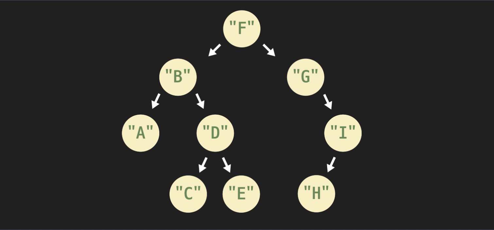

# 2. 트리

[코드잇 자료구조 코스 ](https://www.codeit.kr/courses/data-structures)

<details>
  <summary>1) 트리란?</summary>
  <details>
    <summary>계층적 관계 & 트리란? & 트리 용어 & 트리의 활용</summary>

# 계층적 관계

## 트리

- 데이터의 상-하 관계(계층적 관계)를 저장하는 자료 구조

계층적 관계의 예시: 회사의 직급, 컴퓨터 폴더 구조, 클래스 상속 관계

## 계층적 데이터 저장

배열, 링크드 리스트 → 선형적 자료 구조

해시 테이블 → 데이터 관계 저장 X

따라서 위의 자료 구조들은 계층적 관계를 나타내기에는 적합하지 않음

# 트리란?

링크드 리스트가 노드들 간의 앞뒤 관계를 포함하고 있듯이,

트리는 노드들 간의 계층적 관계(상하 관계)를 포함하고 있다.

이때, 이 관계를 부모-자식 관계라고 한다.

여러 노드들이 부모-자식 관계를 통해서 연결되어 있고, 이 관계가 뻗어나가는 모양이 나무와 같다고 하여 트리라는 이름을 갖게 되었다.

트리에서 가장 상위에 있는 노드, 즉 트리의 시작점이 되는 노드를 나무의 뿌리와 같다 하여, 루트 노드 (root node)라 부른다.

# 트리 용어

- root 노드 (뿌리 노드): 트리의 시작 노드, 뿌리가 되는 노드를 말함. 보통 트리를 표현할 때 가장 위에 root 노드를 놓는 방식으로 나타냄
- 부모 노드: 특정 노드의 직속 상위 노드.
- 자식 노드: 특정 노드의 직속 하위 노드. 부모 노드와 반대되는 개념.
- 형제 노드: 같은 부모를 갖는 노드
- leaf 노드 (잎/말단 노드): 자식 노드를 갖고 있지 않은, 가장 말단에 있는 노드임. 트리의 끝에 있다고 해서 root(뿌리) 노드와 반대되는 표현으로 leaf(잎) 노드라고 부름.
- 깊이: 특정 노드가 root 노드에서 떨어져 있는 거리. 깊이는 해당 노드로 가기 위해서 root 노드에서 몇 번 아래로 내려와야 하는지를 나타냄.
- 레벨: 깊이 +1. 깊이랑 거의 같은 개념. 그냥 깊이에 1을 더한 값. 레벨 1에 있는 노드들, 레벨 2에 있는 노드들, 이런 식으로 특정 깊이인 노드들을 묶어서 표현할 때 사용하는 용어
- 높이: 트리에서 가장 깊이 있는 노드의 깊이.
- 부분 트리 (sub-tree): 현재 트리의 일부분을 이루고 있는 더 작은 트리를 말함. 오른쪽 부분 트리, 왼쪽 부분 트리 등. 전체 트리를 좀 더 작은 단위로 쪼개보면 더 작은 부분 트리들을 발견할 수 있음. 특정 노드를 root 노드라고 생각하고 바라보면 여러 가지 부분 트리들을 발견할 수 있음.

# 트리의 활용

## 트리의 장점

- 계층적 관계가 있는 데이터를 컴퓨터에서 사용!
- 컴퓨터 과학의 다양한 문제 기발하게 해결! (정렬, 압축)
- 흔히 사용하는 여러 추상 자료형 구현! (딕셔너리, 세트, 우선순위 큐)
  </details>
  <details>
    <summary>이진 트리 & 이진 트리 구현</summary>

# 이진 트리

## 이진 트리란?

각 노드가 최대 2개의 자식 노드를 가질 수 있는 트리

- 왼쪽 자식, 오른쪽 자식

# 이진 트리 구현

## 만들려는 이진 트리


## 파이썬 코드

```python
class Node:
  """이진 트리 노드 클래스"""

  def __init__(self, data):
    """데이터와 두 자식 노드에 대한 레퍼런스를 갖는다"""
    self.data = data
    self.left_child = None
    self.right_child = None

"""노드 인스턴스 생성"""
root_node = Node(2)
node_B = Node(3)
node_C = Node(5)
node_D = Node(7)
node_E = Node(11)

"""B와 C를 root 노드의 자식으로 지정"""
root_node.left_child = node_B
root_node.right_child = node_C

"""D와 E를 B의 자식으로 지정"""
node_B.left_child = node_D
node_B.right_child = node_E

# root 노드에서 왼쪽 자식 노드 받아오기
test_node_1 = root_node.left_child
print(test_node_1.data) # 3

# 노드 B의 오른쪽 자식 노드 받아오기
test_node_2 = test_node_1.right_child
print(test_node_2.data) # 11
```

  </details>
  <details>
    <summary>이진 트리 종류 & 완전 이진 트리 배열로 구현하기</summary>

# 이진 트리 종류

## 정 이진 트리 (Full Binary Tree)

모든 노드가 2개 또는 0개의 자식을 가지는 이진 트리

## 완전 이진 트리 (Complete Binary Tree)

마지막 레벨 직전의 레벨 까지는 모든 노드들이 다 채워진 트리

마지막 레벨에서는 노드들이 다 채워질 필요는 없더라도, 왼쪽부터 오른쪽 방향으로는 노드들이 다 채워져야 함


### 완전 이진 트리의 중요한 성질

완전 이진 트리 안에 저장된 노드: n개

완전 이진 트리의 높이는 항상 *lg(n)*에 비례한다.

완전 이진 트리는 마지막 레벨 직전 레벨까지는 모두 노드로 가득 채워져 있음.

레벨1에 1개, 레벨2에 2개, 레벨3에 4개, 레벨4에 8개. 이런 식으로 레벨이 하나씩 증가할 때마다 이전 레벨에 있는 노드 개수의 2배를 더 담을 수 있음

이진 트리의 높이를 _h_, 그 노드 수를 *n*이라고 할 때,

2^(h) ≤ n ≤ 2^(h+1) - 1 , 2^(h) ≤ n < 2^(h+1) 이고, 각 항에 *lg*를 씌우면

_h_ ≤ _lg(n)_ < _h_+1 이 됨

이걸 보면 완전 이진 트리의 높이는 노드 수에 *lg*를 취한 값보다 작은 정수 중에서 최대의 정수임을 알 수 있다.

즉, 노드 수가 n개인 완전 이진 트리의 **높이**는 **h ≤ lg(n)**를 **만족하는 정수 중 **최대의 정수\*\*임

따라서, 완전 이진 트리의 높이 h는 노드 수인 n에 lg를 취한 값인 lg(n)에 비례해서 증가한다는 것을 알 수 있음. 그럼 언제 확실히 높이가 하나 더 증가할까? 그건 바로 노드 수가 현재보다 최소 2배 이상이 되었을 때이다.

h ≤ lg(n) 인 상황에서 n이 2n이 되면, lg(2n) = lg(n) + 1이고,

h+1 ≤ lg(n) +1을 만족하므로, 최소한 현재 노드 수보다 노드 수가 2배 이상이 되었을 때 확실히 높이도 하나 더 올라간다는 것을 알 수 있다.

정리하자면, 완전 이진 트리의 높이는 결국 O(lg(n))이라고 할 수 있음

## 포화 이진 트리 (Perfect Binary Tree)

포화 이진 트리는 모든 레벨이 빠짐없이 다 노드로 채워져 있는 이진 트리임

포화 이진 트리는 기본적으로 정 이진 트리와 완전 이진 트리의 특성을 모두 갖는다.

높이가 0이면 노드 수가 1개, 높이가 1이면 노드 수가 (1+2)개, 높이가 2면 (1+2+4)개, 높이가 3이면 (1+2+4+8)개 이런 식으로 그 높이에 따라 노드의 수가 고정된다.

트리의 높이는 h, 노드 수를 n이라 하면, **n = 2^(h+1) - 1**

식의 양쪽에 1을 더해주면 결국 **n+1 = 2^(h+1)** 와 같은 공식이 성립함

포화 이진 트리는 그 높이나 노드 수, 둘 중에서 하나만 알아도 나머지 하나의 값을 바로 구할 수 있음

# 완전 이진 트리 배열로 구현하기

## 완전 이진 트리 배열 (파이썬 리스트)에 저장하기

트리를 파이썬의 리스트로 구현하는 방법은 모든 이진 트리에 쓸 수 있는 방법은 아니고, 완전 이진 트리인 경우에만 쓸 수 있는 방법이다


이 완전 이진 트리는 아래처럼 리스트에 저장할 수 있다.

```python
complete_binary_tree = [None, 1, 5, 12, 11, 9, 10, 14, 2, 10]
```

위 그림에서 빨간색 작은 숫자는 각 노드의 리스트 내에서의 인덱스를 나타냄. 그러니까 리스트에서 5번째 노드는 노드 9임

## 자식 노드를 찾는 방법

이진 트리에서 각 노드는 기본적으로 자식 노드들을 가리키는 레퍼런스를 가져야 함. 그래야 부모 노드가 자식 노드에 접근할 수 있으니까.

그렇다면 리스트에 노드들이 저장된 경우에는 부모 노드가 자식 노드에 어떻게 접근할 수 있을까?


지금 2번째 노드(노드 5)의 왼쪽 자식 노드를 찾고 싶다고 하자.

그럼 먼저 노드의 인덱스 2에 2를 곱한다. 4다. 그 다음 리스트의 4번째 인덱스에 있는 노드를 찾으면 된다. 노드 11이 있다. 제대로 찾았다.

이번에는 3번째 노드(노드 12)의 오른쪽 자식 노드를 찾아보자.

이번에도 노드의 인덱스 3에 2를 곱한다. 그리고 1을 더해주는데, 그럼 7이다. 이번에는 리스트의 7번째 인덱스를 보면 노드 14가 있다. 맞게 찾았다.

왼쪽 자식 인덱스 = 자신의 인덱스 \* 2

오른쪽 자식 인덱스 = (자신의 인덱스 \* 2) + 1

## 부모 노드를 찾는 방법

부모의 노드를 찾을 때에는, 자신의 인덱스를 2로 나눈 것에서 정수만 취하면 된다.

## 정리

완전 이진 트리는 그 특수한 2가지 성질

- 마지막 레벨 직전의 레벨까지는 노드들로 가득 차 있음
- 마지막 레벨은 왼쪽에서 오른쪽 방향으로 노드들로 가득 차 있어야 함

때문에 이렇게 각 노드를 리스트에 저장한 후에도 부모 노드와 자식 노드를 손쉽게 찾을 수 있다.

## 파이썬 구현

```python
def get_parent_index(complete_binary_tree, index):
    """배열로 구현한 완전 이진 트리에서 index번째 노드의 부모 노드의 인덱스를 리턴하는 함수"""
    parent = index // 2
    if parent != 0:
        return parent
    # root 노드만 부모 노드가 없는데, 이 경우 parent_index가 0. None을 리턴
    else:
        return None

def get_left_child_index(complete_binary_tree, index):
    """배열로 구현한 완전 이진 트리에서 index번째 노드의 왼쪽 자식 노드의 인덱스를 리턴하는 함수"""
    left_child = index * 2
    # 자식 노드가 없으면 - None을 포함한 배열의 길이가 계산된 인덱스+1 보다 작음
    if len(complete_binary_tree) < left_child + 1:
        return None
    else:
        return left_child


def get_right_child_index(complete_binary_tree, index):
    """배열로 구현한 완전 이진 트리에서 index번째 노드의 오른쪽 자식 노드의 인덱스를 리턴하는 함수"""
    right_child = index * 2 + 1
    # 자식 노드가 없으면 - None을 포함한 배열의 길이가 계산된 인덱스+1 보다 작음
    if len(complete_binary_tree) < right_child + 1:
        return None
    else:
        return right_child

# 실행 코드
root_node_index = 1 # root 노드

tree = [None, 1, 5, 12, 11, 9, 10, 14, 2, 10]  # 과제 이미지에 있는 완전 이진 트리

# root 노드의 왼쪽과 오른쪽 자식 노드의 인덱스를 받아온다
left_child_index = get_left_child_index(tree, root_node_index)
right_child_index = get_right_child_index(tree,root_node_index)

print(tree[left_child_index]) # 5
print(tree[right_child_index]) # 12

# 9번째 노드의 부모 노드의 인덱스를 받아온다
parent_index = get_parent_index(tree, 9)

print(tree[parent_index]) # 11

# 부모나 자식 노드들이 없는 경우들
parent_index = get_parent_index(tree, 1)  # root 노드의 부모 노드의 인덱스를 받아온다
print(parent_index) # None

left_child_index = get_left_child_index(tree, 6)  # 6번째 노드의 왼쪽 자식 노드의 인덱스를 받아온다
print(left_child_index) # None

right_child_index = get_right_child_index(tree, 8)  # 8번째 노드의 오른쪽 자식 노드의 인덱스를 받아온다
print(right_child_index) # None
```

  </details>
  <details>
    <summary>트리 순회</summary>

# 트리 순회

## 순회

- 자료 구조에 저장된 모든 데이터를 도는 것

## 재귀 함수

선형적 자료 구조를 순회할 때는 보통 반복분을 사용했는데,

트리 순회에는 재귀 함수 사용!

순회 말고도, 트리에서는 재귀 함수를 많이 사용

## 순회 기본 동작들

- 재귀적으로 왼쪽 부분 트리 순회
- 재귀적으로 오른쪽 부분 트리 순회
- 현재 노드 데이터 출력

# 트리 순회: pre-order

## pre-order 순회

부분 트리 순회 "전"에 현재 노드 출력

1. 현재 노드 데이터를 출력한다
2. 재귀적으로 왼쪽 부분 트리 순회
3. 재귀적으로 오른쪽 부분 트리 순회

# 트리 순회: post-order

## post-order 순회

부분 트리 순회 "후"에 현재 노드 출력

1. 재귀적으로 왼쪽 부분 트리 순회
2. 재귀적으로 오른쪽 부분 트리 순회
3. 현재 노드 데이터를 출력한다.

# 트리 순회: in-order

## in-order 순회

부분 트리 순회 "사이"에 현재 노드 출력

1. 재귀적으로 왼쪽 부분 트리 순회
2. 현재 노드 데이터를 출력한다.
3. 재귀적으로 오른쪽 부분 트리 순회

## 순회

트리를 순회하면 노드들 사이에 **선형적 순서**를 만들 수 있다!

# in-order 순회 구현

## 순회할 트리



## 파이썬 코드

```python
class Node:
    """이진 트리 노드를 나타내는 클래스"""

    def __init__(self, data):
        """이진 트리 노드는 데이터와 두 자식 노드에 대한 레퍼런스를 갖는다"""
        self.data = data
        self.left_child = None
        self.right_child = None

def traverse_inorder(node):
    """in-order 순회 함수"""

    if node.left_child is not None:
        traverse_inorder(node.left_child)

    print(node.data)

    if node.right_child is not None:
        traverse_inorder(node.right_child)


# 여러 노드 인스턴스 생성
node_A = Node("A")
node_B = Node("B")
node_C = Node("C")
node_D = Node("D")
node_E = Node("E")
node_F = Node("F")
node_G = Node("G")
node_H = Node("H")
node_I = Node("I")

# 생성한 노드 인스턴스들 연결
node_F.left_child = node_B
node_F.right_child = node_G

node_B.left_child = node_A
node_B.right_child = node_D

node_D.left_child = node_C
node_D.right_child = node_E

node_G.right_child = node_I

node_I.left_child = node_H

# 노드 F를 root 노드로 만든다
root_node = node_F

# 만들어 놓은 트리를 in-order로 순회한다
traverse_inorder(root_node)
# A
# B
# C
# D
# E
# F
# G
# H
# I
```

  </details>
</details>

<details>
  <summary>2) 힙</summary>
</details>

<details>
  <summary>3) 이진 탐색 트리</summary>
</details>
