# 네이버 부스트코스 iOS Programming #1 Music Player

[Naver BoostCourse](https://www.edwith.org/boost-course/intro)

<details>
  <summary>1. 애플리케이션 만들기</summary>

  <details>
    <summary>1-1. 프로젝트에 이미지 추가하기</summary>
  
  ### 에셋 카탈로그란?

[Apple Documentation](https://help.apple.com/xcode/mac/current/#/dev10510b1f7)

에셋 카탈로그는 에셋과 다양한 디바이스의 속성에 대한 파일의 연결을(mapping) 통해 애플리케이션 리소스에 쉽게 접근할 수 있도록 도와준다.

### 에셋 카탈로그 구성

- Groups: 그룹은 한 개 이상의 또 다른 그룹이나 에셋을 가질 수 있다.
- Assets: 에셋은 한 가지 타입의 관련된 속성과 파일들의 집합을 나타낸다.
- 에셋 이름(Asset name)은 에셋에 접근하기 위해 개발자가 정의한 문자열이다.
- 에셋 파일(Asset files)은 선택한 에셋의 데이터 파일 또는 리소스이다.
- Attributes: 속성은 선택한 그룹, 에셋, 에셋파일의 속성을 나타낸다.
- Asset variations: 에셋 파일들의 집합을 나타낸다. 같은 속성 값(value)이 적용되는 하나의 단위이다.

#### 에셋 카탈로그의 3가지 콘텐츠

- Folders: 에셋 카탈로그 폴더는 다른 그룹 폴더나 에셋 폴더를 포함할 수 있다. 파일시스템의 폴더 이름은 대체적으로 확장자를 갖지 않는다. 하지만 에셋 카탈로그 폴더는 해당 에셋 타입의 확장자가 자동으로 붙는다.
- JSON files: .json 확장자 파일로서 속성에 대한 정보를 포함하도 있다.
- Content files: 콘텐츠 파일은 리소스 파일을 나타낸다.

#### 에셋 카탈로그 폴더의 구조

- Asset catalog folder: 에셋 카탈로그 폴더는 모든 폴더와 파일들을 갖고 있다.
- Group folder: 그룹 폴더는 다른 그룹 폴더나 에셋 폴더를 갖고 있다.
- Asset folder: 에셋 폴더는 리소스 파일들을 갖고 있다.
  - **프로젝트 내의 같은 타겟에는 에셋(폴더)의 이름이 반드시 고유해야 한다. 리소스 타입에 상관없이 이름은 고유해야 한다.**

### 에셋 카탈로그 대표 타입

[Types Overview](https://developer.apple.com/library/archive/documentation/Xcode/Reference/xcode_ref-Asset_Catalog_Format/AssetTypes.html)

- App Icon Type: 애플리케이션의 아이콘
  - 확장자: .appiconset
  - 다양한 크기와 해상도의 애플리케이션 아이콘 원본 이미지
- Catalog Type: 에셋 카탈로그의 최상위 폴더
  - 확장자: xcassets
  - 에셋 카탈로그 폴더구조의 최상위 폴더. 한 개의 에셋 카탈로그에 하나만 존재할 수 있다.
- Image Set type: 객체들이 사용하는 이미지
  - 확장자: .imageset
  - 이미지 에셋에서 UIImage와 NSImage의 인스턴스에 사용되는 이미지 파일
- Data Set Type: 애플리케이션에서 사용되는 데이터 파일
  - 확장자: .dataset
  - 장치 실행 가능 코드(device-executable code)를 제외한 Xcode에 의해 생성된 모든 종류의 데이터를 포함하는 파일들의 집합
- Launch Image Type: 애플리케이션의 실행화면 이미지
  - 확장자: .launchiamge
  - 애플리케이션 실행화면 이미지 (iOS 7.0 이하 버전에만 필요함. iOS 8.0 버전 이상은 기본적으로 실행화면 스토리보드(launch screen storyboard)를 사용한다.)

### 앱 시닝과 앱 슬라이싱이란?

#### 앱 시닝(app thining)

- 애플리케이션이 디바이스에 설치될 때 앱 스토어와 운영체제가 그 디바이스 특성에 맞게 설치하도록 하는 설치 최적화 기술
- 애플리케이션의 설치용량을 최소화하고 다운롣의 속도를 향상시킬 수 있다.
- 앱 시닝의 기술 구성요소는 슬라이싱(slicing), 비트코드(bitcode), 주문형 리소스(on-demand resource)가 있다.

#### 앱 슬라이싱(slicing)

- 애플리케이션이 지원하는 다양한 디바이스에 대한 여러 조각의 애플리케이션 번들(app bundle)을 생성하고 디바이스에 알맞은 조각을 전달하는 기술
- 개발자가 애플리케이션의 전체 버전을 iTunes Connect에 업로드하면, 앱 스토어에는 각 디바이스 특성에 따른 다양한 버전의 조각들이 생성된다.
- 사용자가 애플리케이션을 설치할 때 전체 버전이 아닌 슬라이싱된 조각들 중 사용자의 디바이스에 가장 적합한 조각이 다운로드 되어 설치된다.
- 에셋 카탈로그에서 관리하는 이미지들은 자동으로 적용이 된다. (슬라이싱은 iOS 9.0 버전 이상만 지원한다.)
- - iTunes Connect란 개발자가 앱 스토어에 판매할 애플리케이션을 제출하고 관리할 수 있도록 도와주는 웹 기반 도구임
    </details>
    <details>
      <summary>1-2. 인터페이스 빌더로 화면 구성하기</summary>
      
      [Apple Documentation](https://help.apple.com/xcode/mac/current/#/dev9ffcd0c51)
    </details>
    <details>
      <summary>1-3. 인터페이스 빌더의 객체를 코드와 연결(IBOutlet)</summary>
      
      ### 강의 정리

[Apple Documentation](https://help.apple.com/xcode/mac/current/#/devc06f7ee11)

[Swift.org](https://swift.org/documentation/api-design-guidelines/#naming)

[Menu Command Shortcuts (By Menu)](https://developer.apple.com/library/archive/documentation/IDEs/Conceptual/xcode_help-command_shortcuts/MenuCommands/MenuCommands014.html)

- 코드로 먼저 IBOutlet을 생성한 후 인터페이스 빌더의 Outlet Inspector를 통해 연결
- 코드로 먼저 IBOutlet을 생성한 후 일터페이스 빌더에서 View Controller 우클릭(control + 좌클릭) 팝업에서 연결
- 인터페이스 빌더에서 코드로 끌어당겨 연결

**<<변수명 변경 시 주의사항>>**

- 인터페이스 빌더의 객체와 코드를 연결한 후 변수명 수정 시, 기존의 연결을 끊고 새로운 코드와 객체를 다시 연결해주거나,
- 코드의 변수명에 우클릭 후 refactor > rename 을 통해 이름을 변경해주어야 앱 실행 시 오류가 나지 않는다.
    </details>
    <details>
      <summary>1-4. 인터페이스 빌더의 객체를 코드와 연결(IBAction)</summary>

[Apple Developer Documentation](https://developer.apple.com/documentation/uikit/uicontrol/event)

[Target-Action](https://developer.apple.com/library/archive/documentation/General/Conceptual/CocoaEncyclopedia/Target-Action/Target-Action.html)

[Apple Documentation](https://help.apple.com/xcode/mac/current/#/dev9662c7670)

## 학습 목표

1. 인터페이스 빌더에서 생성한 객체가 전달하는 이벤트를 코드의 액션과 연결한다.
2. 객체에서 발생한 액션이 제대로 동작하는지 확인한다.
3. 액션의 타입에 여러 종류가 있음을 이해하고 다양하게 테스트해본다.

## 학습하기

### 컨트롤 이벤트와 액션과의 관계

UIKit 에는 UIButton, UISwitch, UIStepper 등 UIControl을 상속받은 다양한 컨트롤 클래스가 있다. 그런 컨트롤 객체에 발생한 다양한 이벤트 종류를 특정 액션 메서드에 연결할 수 있다. 즉, 컨트롤 객체에서 특정 이벤트가 발생하면, 미리 지정해 둔 타겟의 액션을 호출하게 된다.

### 컨트롤 이벤트의 종류

컨트롤 이벤트는 UIControl에 Event라는 타입으로 정의되어 있다. 아래는 컨트롤 객체에 발생할 수 있는 이벤트의 종류이다. 다양한 이벤트 종류를 실제로 Xcode에서 테스트해보면 이해하는 데에 도움이 될 것이다.

<details><summary>컨트롤 이벤트 종류와 설명</summary>

**touchDown**

    컨트롤을 터치했을 때 발생하는 이벤트

    UIControl.Event.touchDown

**touchDownRepeat**

    컨트롤을 연속 터치할 때 발생하는 이벤트

    UIControl.Event.touchDownRepeat

**touchDragOutside**

    터치 영역이 컨트롤의 바깥쪽에서 드래그할 때 발생하는 이벤트

    UIControl.Event.touchDragOutside

**touchDragInside**

    컨트롤 범위 내에서 터치한 영역을 드래그할 때 발생하는 이벤트

    UIControl.Event.touchDragInside

**touchDragEnter**

    터치 영역이 컨트롤의 일정 영역 바깥쪽으로 나갔다가 다시 들어왔을 때 발생하는 이벤트

    UIControl.Event.touchDragEnter

**touchDragExit**

    터치 영역이 컨트롤의 일정 영역 바깥쪽으로 나갔을 때 발생하는 이벤트

    UIControl.Event.touchDragExit

**touchUpInside**

    컨트롤 영역 안쪽에서 터치 후 뗐을 때

    UIControl.Event.tochUpInside

**touchUpOutside**

    컨트롤 영역 안쪽에서 터치 후 컨트롤 밖에서 뗐을 때 이벤트

    UIControl.Event.touchUpOutside

**touchCancel**

    터치를 취소하는 이벤트 (touchUp 이벤트가 발생하지 않음)

    UIControl.Event.touchCancel

**valueChanged**

    터치를 드래그 및 다른 방법으로 조작하여 값이 변경되었을 때 발생하는 이벤트

    UIControl.Event.valueChanged

**primaryActionTriggered**

    버튼이 눌릴 때 발생하는 이벤트 (iOS보다는 tvOS에서 사용)

    UIControl.Event.primaryActionTriggered

**editingDidBegin**

    UITextField에서 편집이 시작될 때 호출되는 이벤트

    UIControl.Event.eiditingDidBegin

**editingChanged**

    UITextField에서 값이 바뀔 때마다 호출되는 이벤트

    UIControl.Event.editingChanged

**editingDidEnd**

    UITextField에서 외부객체와의 상호작용으로 인해 편집이 종료되었을 때 발생하는 이벤트

    UIControl.Event.editingDidEnd

**editingDidEndOnExist**

    UITextField의 편집상태에서 키보드의 return 키를 터치했을 때 발생하는 이벤트

    UIControl.Event.editingDidEndOnExit

**allTouchEvents**

    모든 터치 이벤트

    UIControl.Event.allTouchEvents

**allEditingEvents**

    UITextField에서 편집작업의 이벤트

    UIControl.Event.allEditingEvents

**applicationReserved**

    각각의 애플리케이션에서 프로그래머가 임의로 지정할 수 있는 이벤트 값의 범위

    UIControl.Event.applicationReserved

**allEvents**

    시스템 이벤트를 포함한 모든 이벤트

    UIControl.Event.allEvents

  </details>

### 강의 정리

인터페이스 빌더의 객체에서 발생한 액션을 코드의 메서드와 연결

- 코드로 먼저 IBAction을 생성한 후 인터페이스 빌더의 Outlet Inspector를 통해 연결
- 코드로 먼저 IBAction을 생성한 후 인터페이스 빌더에서 View Controller 우클릭 후 팝업에서 연결
- 인터페이스 빌더에서 코드로 끌어당겨 연결 / 생성

print 로그를 통해 액션이 제대로 동작하는지 확인

</details>
<details>
<summary>1-5. UIButton, UISlider, UILable</summary>

## UIButton, UISlider, UILabel

## 학습 목표

1. UIButton 생성 방법, 모양 설정 및 사용자 상호작용에 대응하는 방법을 이해한다.
2. UILabel 생성 방법, 레이블에 입력되는 문구를 설정하는 방법을 이해한다.
3. UISlider 생성 방법, 구성요소 및 관련 메서드를 이해한다.

## 학습하기

### UIButton

[Apple Developer Documentation](https://developer.apple.com/documentation/uikit/uibutton)

UIButton 클래스는 사용자의 상호 작용(터치/탭 등의 이벤트)에 반응해 미리 지정된 코드를 실행하는 컨트롤 요소이다.

#### 버튼 생성 3단계

1. 버튼을 생성하고 버튼의 유형을 선택
2. 버튼을 나타내기 위한 문자(타이틀)을 입력하거나, 이미지를 설정한 뒤 크기 조정
3. 버튼에 특정 이벤트가 발생할 때 작동할 하나 이상의 메서드를 연결

#### 버튼과 메서드를 연결하는 방법

1. addTarget(\_:action:for:) 메서드 사용
2. 인터페이스 빌더에서 연결(@IBAction)

#### 버튼과 연결되는 메서드 방식

버튼을 탭했을 때 필요한 정보에 따라 아래 세 가지 중 한 가지를 선택해 사용해보기

```swift
func doSomething()
func doSomething(sender: UIButton)
func doSomething(sender: UIButton, forEvent event: UIEvent)
```

#### 버튼의 상태

- 버튼의 상태는 다섯가지로 표현한다.
  - default, highlighted, focused, selected, disabled
  - 버튼의 상태는 조합된 상태일 수 있다.
  - 예) [default + highlighted], [selected _ disabled] 등
- 버튼 생성 시 기본 상태 값은 default
- 사용자가 버튼과 상호작용을 하면 상태 값이 변하게 된다.
- 프로그래밍 방식 혹은 인터페이스 빌더를 이용해 버튼의 각 상태에 대한 속성을 별도로 지정할 수 있다.
  - 별도로 속성을 지정하지 않으면 UIButton 클래스에서 제공하는 기본 동작을 사용하게 된다.
  - [예] disabled 버튼은 일반적으로 흐리게 표시되며 사용자가 탭 해도 highlighted 되지 않는다.

#### 버튼 주요 프로퍼티

버튼의 프로퍼티 값을 설정하는 방식에는 코드를 이용하는 방법과 스토리보드의 인스펙터를 이용하는 방법이 있다.

- enum UIButtonType: 버튼의 유형
  - 버튼의 유형에 따라 버튼의 기본적인 외형과 동작이 달라진다.
  - 처음 버튼을 생성할 때 init(type:) 메서드를 이용하거나, 인터페이스 빌더의 "Attribute Inspector"에서 버튼 유형을 지정할 수 있다.
  - 한번 생성된 버튼의 유형은 이후 변경할 수 없다.
  - 가장 많이 사용하는 유형은 Custom과 System이지만 필요에 따라 다른 유형(Detail Disclosure, Info Light, Info Dark, Add Contact)를 사용할 수 있다.
- var titleLabel: UILabel?: 버튼 타이틀 레이블
- var imageView: UIImageView?: 버튼의 이미지 뷰
- var tintColor: UIColor!: 버튼 타이틀과 이미지의 틴트 컬러

#### 버튼의 주요 메서드

```swift
//특정 상태의 버튼의 문자열 설정
func setTitle(String?, for: UIControlState)
//특정 상태의 버튼의 문자열 반환
func title(for: UIControlState) -> String?

//특정 상태의 버튼 이미지 설정
func setImage(UIImage?, for:UIControlState)
//특정 상태의 버튼 이미지 반환
func image(for: UIControlState) -> UIImage?

//특정 상태의 백그라운드 이미지 설정
func setBackgroundImage(UIImage?, for: UIControlState)
//특정 상태의 백그라운드 이미지 반환
func backgroundImage(for: UIControlState) -? UIImage?

//특정 상태의 문자열 색상 설정
func setTitleColor(UIColor?, for: UIControlState)
//특정 상태의 attributed 문자열 설정
func setAttributedTitle(NSAttributedString?, for: UIControlState)
```

### UILabel

[Apple Developer Documentation](https://developer.apple.com/documentation/uikit/uilabel)

UILable은 한 줄 또는 여러 줄의 텍스트를 보여주는 뷰로, UIButton 등의 컨트롤의 목적을 설명하기 위해 사용하는 경우가 많다.

#### 레이블 생성 3단계

1. 레이블 생성
2. 레이블이 표시할 문자열 제공
3. 레이블의 모양 및 특성 설정

#### 레이블 주요 프로퍼티

레이블의 프로퍼티에 접근해 나타내려는 문자의 내용, 색상, 폰트, 문자정렬방식, 라인 수 등을 조정할 수 있다.

레이블의 프로퍼티의 값을 설정하는 방식에는 프로그래밍 방식과 스토리보드의 인스펙터를 이용한 방법이 있다.

- var text: String? : 레이블이 표시할 문자열
  - 문자열이 모두 동일한 속성(폰트, 색상, 기울임꼴 등)으로 표시된다.
  - text 프로퍼티에 값을 할당하면 attributedText 프로퍼티에도 똑같은 내용의 문자열이 할당된다.
- var attributedText: NSAttributedString? : 레이블이 표시할 속성 문자열
  - NSAttributed 클래스를 사용한 속성 문자열 중 특정 부분의 속성을 변경할 수 있다. ([예] 일부 글자 색상 변경/일부 글자 폰트 변경)
  - attributedText 프로퍼티에 값을 할당하면 text 프로퍼티에도 똑같은 내용의 문자열이 할당된다.
- var textColor: UIColor! : 문자 색상
- var font: UIFont!: 문자 폰트
- var textAlignment: NSTextAlignment : 문자열의 가로 정렬 방식
  - left, right, center, justified, natural 중 하나 선택 가능
- var numberOfLines: Int : 문자를 나타내는 최대 라인 수
  - 문자열을 모두 표시하는 데 필요한 만큼 행을 사용하려면 0으로 설정. 기본 값은 1임
  - 설정한 문자열이 최대 라인 수를 초과하면 lineBreakMode 프로퍼티의 값에 따라 적절히 잘라서 표현한다.
  - adjustsFontSizeToFitWidth 프로퍼티를 활용하면 폰트 사이즈를 레이블의 넓이에 따라 자동으로 조절해준다.
- var baselineAdjustment: UIBaselineAdjustment : 문자열이 Autoshrink 되었을 때의 수직 정렬 방식
  - Align Baseline: 문자가 작아졌을 때 기존 문자열의 기준선에 맞춤
  - Align Center: 문자가 작아졌을 때 작아진 문자의 중앙선에 맞춤
  - None: 문자가 작아졌을 때 기존 문자열의 위쪽 선에 맞춤
- var lineBreakMode: NSLineBreakMode : 레이블의 경계선을 벗어나는 문자열에 대응하는 방식
  - Character wrap : 여러 줄 레이블에 주로 적용되며, 글자 단위로 줄 바꿈을 결정한다.
  - Word wrap : 여러 줄 레이블에 주로 적용되며, 단어 단위로 줄 바꿈을 결정한다.
  - Truncate head : 한 줄 레이블에 주로 적용되며, 앞쪽 텍스트를 자르고 ...으로 표시한다.
  - Truncate middle : 한 줄 레이블에 주로 적용되며, 중간 텍스트를 자르고 ...으로 표시한다.
  - Truncate tail : 한줄 레이블에 주로 적용되며, 끝쪽 텍스트를 자르고 ...으로 표시한다. **기본 설정 값**이다.

### UISlider

[Apple Developer Documentation](https://developer.apple.com/documentation/uikit/uislider)

UISlider는 연속된 값 중에서 특정 값을 선택하는데 사용되는 컨트롤이다.

#### 슬라이더 생성 3단계

1. 슬라이더를 생성하고, 슬라이더가 나타내는 값의 범위 지정
2. 적절한 색상과 이미지를 이용해 슬라이더의 모양 구성
3. 하나 이상의 메서드를 슬라이더와 연결

#### 사용자 상호작용에 반응하기

사용자가 슬라이더의 값을 변경하면 슬라이더에 연결된 메서드가 호출되어 원하는 작업이 실행된다.

기본적으로는 사용자가 슬라이더의 Thumb를 이동시키면 연속적으로 이벤트를 호출하지만, isContinuous 프로퍼티 값을 false로 설정하면 슬라이더의 Thumb에서 손을 떼는 동시에 이벤트를 호출한다.

#### 슬라이더와 메서드 연결하는 방법

1. addTarget(\_:action:for) 메서드 사용
2. 인터페이스 빌더에서 연결 (@IBAction)

#### 슬라이더와 연결하는 메서드 형식

슬라이더의 값을 변경했을 때 필요한 정보에 따라 아래 세 가지 중 한 가지를 선택해서 사용

```swift
func doSomething()
func doSomething(sender: UISlider)
func doSomething(sender: UISlider, forEvent event: UIEvent)

```

#### 슬라이더 주요 프로퍼티

슬라이더의 프로퍼티 값을 설정하는 방식에는 프로그래밍 방식과, 스토리보드의 인스펙터를 이용하는 방법이 있다.

- var minimumValue: Float, var maximumValue: Float : 슬라이더의 양끝단의 값
- var value: Float : 슬라이더의 현재 값
- var isContinuous: Bool :슬라이더의 연속적인 값 변화에 따라 이벤트 역시 연속적으로 호출할 것인지의 여부
- var minimumValueImage: UIImage?, var maximumValueImage: UIImage? : 슬라이더 양끝단의 이미지
- var thumbTintColor: UIColor? : thumb의 틴트 색상
- var minimumTrackTintCOlor: UIColor?, var maximumTrackTintColor: UIColor? : thumb를 기준으로 앞쪽 트랙과 뒤쪽 트랙의 틴트 색상

#### 슬라이더 주요 메서드

```swift
//슬라이더의 현재 값 설정
func setValue(Float, animated: Bool)

//특정 상태의 minimumTrackImage 반환
func minimumTrackImage(for: UIControlState) -> UIImage?
//특정 상태의 minimumTrackImage 설정
func setMinimumTrackImage(UIImage?, for: UIControlState)

//특정 상태의 maximumTrackImage 반환
func maximumTrackImage(for: UIControlState) -> UIImage?
//특정 상태의 maximumTrackImage 설정
func setMaximumTrackImage(UIImage?, for: UIControlState)

//특정 상태의 thumbImage 반환
func thumbImage(for: UIControlState) -> UIImage?
//특정 상태의 thumbImage 설정
func setThumbImage(UIImage?, for UIControlState)
```

</details>
<details>
<summary>1-6. 구현 코드 작성하기</summary>
  
  # 구현 코드 작성하기

# 학습 목표

1. 음원 재생기 애플리케이션 코드를 작성하고 예상한대로 동작하는지 확인하기
2. 주석과 mark 키워드를 이해하고 프로젝트에 적용해보기
3. AVFoundation과 Timer 클래스를 이해하기

# 학습하기

## AVFoundation

AVFoundation은 다양한 Apple 플랫폼에서 사운드 및 영상 미디어의 처리, 제어, 가져오기 및 내보내기 등 광범위한 기능을 제공하는 프레임워크이다.

[AVFoundation](https://developer.apple.com/documentation/avfoundation)

### 주요 기능

- 미디어 재생 및 편집 (QuickTime 동영상 및 MPEG-4 파일 재생/생성/편집, HLS 스트림 재생: [재생가능 파일 목록 링크](https://developer.apple.com/documentation/avfoundation/avfiletype))
- 디바이스 카메라와 마이크를 이용한 영상 녹화 및 사운드 녹음
- 시스템 사운드 제어
- 문자의 음성화

### AVAudioPlayer Class

파일 또는 메모리에 있는 사운드 데이터를 재생하는 기능을 제공한다.

[AVAudioPlayer](https://developer.apple.com/documentation/avfoundation/avaudioplayer)

#### AVAudioPlayer 주요 기능

- 파일 또는 메모리에 있는 사운드 재생(네트워크에 있는 사운드 파일은 재생 불가)
- 파일 재생 시간 길이의 제한없이 사운드 재생
- 여러 개 사운드 파일 동시 재생
- 사운드의 재생 속도 제어 및 스테레오 포지셔닝
- 앞으로 감기와 뒤로 감기 등의 기능을 지원해 사운드 파일의 특정 지점 찾기
- 현재 재생 정보 데이터 얻기
- 사운드 반복재생 기능

#### AVAudioPlayer 주요 프로퍼티

- var isPlaying: Bool : 사운드가 현재 재생되고 있는지 아닌지 여부
- var volume: Float : 사운드의 볼륩값, 최소 0.0 ~ 최대 1.0
- var rate : Float : 사운드의 재생 속도
- var numberOfLoops: Int : 사운드 재생 반복 횟수
  - 기본값은 0으로 사운드 1회 재생 후 자동 종료
  - 양수값으로 설정 시 설정값+1회 재생(ex. 1로 설정시 2회 재생 후 종료)
  - 음수값으로 설정시 stop 메서드가 호출 될때까지 무한 재생
- var duration: TimeInterval : 사운드의 총 재생 시간(초 단위)
- var currentTime: TimeInterval : 사운드의 현재 재생 시각(초 단위)
- protocol AVAudioPlayerDelegate : 사운드 재생 완료, 재생 중단 및 디코딩 오류에 응답할 수 있는 프로토콜

#### AVAudioPlayer 주요 메서드

- AVAudioPlayer 초기화 메서드

```swift
//특정 위치에 있는 사운드 파일로 초기화
func init(contentOf: URL)
//메모리에 올라와 있는 데이터를 이용해 초기화
func init(data: Data)
```

- AVAudioPlayer 재생관련 메서드

```swift
//사운드 재생
func play()
//특정 시점에서 사운드 재생
func play(atTime: TimeInterval)

//사운드 일시 정지
func puase()
//사운드 재생 정지
func stop()
```

### Timer

일정한 시간 간격이 지나면 지정된 메시지를 특정 객체로 전달하는 기능을 제공한다.

[Timer](https://developer.apple.com/documentation/foundation/timer)

#### Timer 특징

- 타이머는 런 루프(run loops)에서 작동한다.
- 타이머를 생성할 때 반복 여부를 지정한다.
  - 비 반복 타이머: 한 번 실행된 다음 자동으로 무효화 된다.
  - 반복 타이머: 동일한 런 루프에서 특정 TimeInterval 간격으로 실행된다. 반복되는 타이머 기능을 정지하려면 invalidate() 메서드를 호출해 무효화한다.

#### Timer 주요 프로퍼티

- var isValid: Bool : 타이머가 현재 우효한지 아닌지 여부
- var fireDate: Date : 다음에 타이머가 실행될 시각
- var timeInterval: TimeInterval : 타이머의 실행 시간 간격(초 단위)

#### Timer 생성 메서드

1. 타이머 생성과 동시에 런 루프에 default mode로 등록하는 클래스 메서드

   ```swift
   class func scheduledTimer(withTimeInterval: TimeInterval, repeates: Bool, block: (Timer) -> Void)
   class func scheduledTimer(timeInverval: TimeInterval, target: Any, selector: Selector, userInfo: Any?, repeates: Bool)
   class func scheduledTimer(timeInterval: TimeInterval, invocation: NSInvocation, repeats: Bool)
   ```

2. 타이머 생성 후 수동으로 타이머 객체를 add(\_:forMode:) 메서드를 이용해 런 루프에 추가해줘야 하는 메서드

   ```swift
   func init(timeInterval: TimeInterval, invocation: NSInvocation, repeats: Bool)
   func init(timeInterval: TimeInterval, target: Any, selector: Selector, userInfo: Any?, repeats: Bool)
   func init(fireAt: Date, interval: TimeInterval, target: Any, selector: Selector, userInfo: Any?, repeats: Bool)
   ```

## 주석과 마크

```swift
// MARK - 마크 이름
// 위와 같이 표시해 두면 나중에 코드가 길어졌을 때에도 쉽게 찾을 수 있다!
```

[Xcode Help - Write Code](https://help.apple.com/xcode/mac/current/#/dev8716704af)

  </details>
</details>
<details>
  <summary>2. Foundation과 UIKit 그리고 Cocoa Touch</summary>
  
  <details>
    <summary>2-1. Cocoa Touch 프레임워크란?</summary>

# Cocoa Touch 프레임워크란?

## 학습하기

'코코아 터치' 프레임워크는 iOS 애플리케이션 개발 환경으로, 애플리케이션의 다양한 기능 구현에 필요한 여러 프레임워크를 포함하는 최상위 레벨의 프레임워크이다. 참고로 '코코아' 프레임워크는 macOS 애플리케이션 제작에 사용하는 프레임워크이다.

- '코코아'라는 단어는 Objective-C 런타임을 기반으로 하고, NSObject를 상속받는 모든 클래스 또는 객체를 가리킬 때 사용한다.
- '코코아' 또는 '코코아 터치'는 macOS 또는 iOS의 전반적인 기능을 활용해 애플리케이션을 제작할 때 사용하는 프레임워크이다.
- '코코아 터치'는 핵심 프레임워크인 UIKit과 Foundation을 포함한다.

[애플 공식 문서 - Cocoa (Touch)](https://developer.apple.com/library/archive/documentation/General/Conceptual/DevPedia-CocoaCore/Cocoa.html)

[위키피디아 - Cocoa (API)](<https://en.wikipedia.org/wiki/Cocoa_(API)>)

  </details>
  <details>
  <summary>2-2. UIKit이란?</summary>

# UIKit이란?

[Apple Documentation - UIKit](https://developer.apple.com/documentation/uikit)

## 학습하기

### UIKit 소개

UIKit은 iOS 애플리케이션의 사용자 인터페이스를 구현하고 이벤트를 관리하는 프레임워크이다.

- UIKit 프레임워크는 제스처 처리, 애니메이션, 그림 그리기, 이미지 처리, 텍스트 처리 등 사용자 이벤트 처리를 위한 클래스를 포함한다.
- 또한 테이블뷰, 슬라이더, 버튼, 텍스트 필드, 얼럿 창 등 애플리케이션의 화면을 구성하는 요소를 포함한다.
- UIKit 클래스 중 UIResponder에서 파생된 클래스나 사용자 인터페이스에 관련된 클래스는 애플리케이션의 메인 스레드(혹은 메인 디스패치 큐)에서만 사용하자.
- UIKit은 iOS와 tvOS 플랫폼에서 사용한다.

### UIKit 기능별 요소

#### 사용자 인터페이스

- View and Control: 화면에 콘텐츠 표시
- View Controller: 사용자 인터페이스 관리
- Animation and Haptics: 애니메이션과 햅틱을 통한 피드백 제공
- Window and Screen: 뷰 계층을 위한 윈도우 제공

#### 사용자 액션

- Touch, Press, Gesture: 제스처 인식기를 통한 이벤트 처리 로직
- Drag and Drop: 화면 위에서 드래그 앤 드롭 기능
- Peek and Pop: 3D 터치에 대응한 미리 보기 기능
- Keyboard and Menu: 키보드 입력을 처리 및 사용자 정의 메뉴 표시

## 생각해보기

새롭게 ViewController를 생성하면 상단에 'improt UIKit'이 기본적으로 명시되어 있다. 왜 ViewController와 UIKit는 단짝일까?

- ViewControlle는 UIViewController 클래스를 상속받는데, 이 UIViewController 클래스는 UIKit 프레임워크에 정의된 클래스이기 때문에
- UIKit 을 import 해주어야 컴파일러가 UIViewController가 무엇인지 알 수 있다.
  </details>
  <details>
  <summary>2-3. Foundation이란?</summary>

  # Foundation이란?

[Apple Documentation - Foundation](https://developer.apple.com/documentation/foundation)

[Apple Documentation - Swift Standard Library](https://developer.apple.com/documentation/swift)

## 학습하기

### Foundation 소개

Foundation은 원시 데이터 타입(String, Int, Double), 컬렉션 타입(Array, Dictionary, Set) 및 운영체제 서비스를 사용해 애플리케이션의 기본적인 기능을 관리하는 프레임워크이다.

- Foundation 프레임워크는 데이터 타입, 날짜 및 시간 계산, 필터 및 정렬, 네트워킹 등의 기본 기능을 제공한다.
- Foundation 프레임워크에서 정의한 클래스, 프로토콜 및 데이터 타입은 iOS뿐만 아니라 macOS, watchOS, tvOS 등 모든 애플 SDK에서 사용된다.

Foundation에서 제공하는 데이터 타입 및 컬렉션 타입의 대부분은 Objective-C 언어의 기능에서 지원하지 않는 것이기 때문에 언어기능을 보완하기 위한 구현이며, Swift에서는 이에 해당하는 데이터 타입과 기능 대부분을 [Swift 표준 라이브러리](https://developer.apple.com/documentation/swift)에서 제공한다.

## Foundation 기능별 요소

### 기본

- Number, Data, String: 원시 데이터 타입 사용
- Collection: Array, Dictionary, Set 등과 같은 컬렉션 타입 사용
- Date and Time: 날짜와 시간을 계산하거나 비교하는 작업
- Unit and Measurement: 물리적 차원을 숫자로 표현 및 관련 단위 간 변환 가능
- Data Formatting: 숫자, 날짜, 측정값 등을 문자열로 변환 또는 반대 작업
- Filter and Sorting: 컬렉션의 요소를 검사하거나 정렬하는 작업

### 애플리케이션 지원

- Resources: 애플리케이션의 에셋과 번들 데이터에 접근 지원
- Notification: 정보를 퍼뜨리거나 받아들이는 기능 지원
- App Extension: 확장 애플리케이션과의 상호작용 지원
- Error and Exceptions: API와의 상호작용에서 발생할 수 있는 문제 상황에 대처할 수 있는 기능 지원

### 파일 및 데이터 관리

- File System: 파일 또는 폴더를 생성하고 읽고 쓰는 기능 관리
- Archives and Serialization: 속성 목록, JSON, 바이너리 파일들을 객체로 변환 또는 반대 작업 관리
- iCloud: 사용자의 iCloud 계정을 이용해 데이터를 동기화하는 작업 관리

### 네트워킹

- URL Loading System: 표준 인터넷 프로토콜을 통해 URL과 상호작용하고 서버와 통신하는 작업
- Bonjour: 로컬 네트워크를 위한 작업

## 생각해보기

새롭게 ViewController 파일을 생성하면 상단에 'import UIKit'이 기본적으로 명시되어 있다.

어떤 파일을 생성하면 'import Foundation'이 기본적으로 명시되어 있을까?

- ViewController 파일을 생성하면 UIKIt을 자동적으로 import 하게 되어있는데, UIKit에 들어가 보면 import Foundation 명시되어 있다.
- 따라서 ViewController 파일을 생성하면 UIKit을 import 하게 됨으로써 자동적으로 Foundation 또한 import 하게 된다.
    </details>
  </details>

  <details>
    <summary>3. 오토 레이아웃</summary>
    <details>
      <summary>3-1. 오토 레이아웃이란?</summary>

  # 오토 레이아웃이란?

[Apple Documentation - Auto Layout Guide](https://developer.apple.com/library/archive/documentation/UserExperience/Conceptual/AutolayoutPG/index.html#//apple_ref/doc/uid/TP40010853-CH7-SW1)

[iOS H.I.G - Adaptivity and Layout](https://developer.apple.com/design/human-interface-guidelines/ios/visual-design/adaptivity-and-layout/)

## 학습 목표

1. 오토 레이아웃의 개념에 대해 이해한다.
2. 오토 레이아웃의 필요성에 대해 이해한다.

## 학습하기

### 오토 레이아웃

오토레이아웃은 뷰의 제약 사항을 바탕으로 뷰 체계 내의 모든 뷰의 크기와 위치를 동적으로 계산한다.

오토레이아웃은 애플리케이션을 사용할 때 발생하는 외부 변경과 내부 변경에 동적으로 반응하는 사용자 인터페이스를 가능하게 한다.

### 외부 변경(External Changes)

외부 변경은 슈퍼뷰의 크기나 모양이 변경될 때 발생한다. 각각의 변화와 함께, 사용 가능한 공간을 가장 잘 사용할 수 있도록 뷰 체계의 레이아웃을 업데이트 해줘야 한다.

외부 변경이 발생하는 경우

- 사용자가 아이패드의 분할뷰(Split View)를 사용하거나 사용하지 않는 경우(iOS)
- 장치를 회전하는 경우(iOS)
- 활성화콜(active call)과 오디오 녹음 바가 보여지거나 사라지는 경우(iOS)
- 다른 크기의 클래스를 지원하기 원하는 경우
- 다른 크기의 스크린을 지원하기 원하는 경우

이러한 변경사항의 대부분은 실행 시간에 발생할 수 있으며 애플리케이션으로부터 동적인 응답을 요구한다. 다른 스크린 크기를 지원하는 것과 같은 것은 애플리케이션이 다른 환경에 적응하는 것을 나타낸다. 스크린 크기가 일반적으로 실행 시간에 변경되지 않는다고 하더라도, 적응형 인터페이스를 만들면 애플리케이션이 아이폰 4S, 아이폰 6 플러스, 또는 아이패드에서도 모두 동일하게 잘 작동할 수 있다. 오토레이아웃은 아이패드 내부 변경에서 슬라이드와 분할뷰를 지원하는 핵심 요소이기도 하다.

### 내부 변경(Internal Changes)

내부 변경은 사용자 인터페이스의 뷰의 크기 또는 설정이 변경되었을 때 발생한다.

내부 변경이 발생하는 경우

- 애플리케이션 변경에 의해 콘텐츠가 보여지는 경우
- 애플리케이션이 국제화를 지원하는 경우
- 애플리케이션이 동적 타입을 지원하는 경우

애플리케이션 콘텐츠가 변경 됐을 때, 새로운 콘텐츠는 예전과 다른 레이아웃을 필요로 할 수 있다. 새로운 애플리케이션이 각각의 신문 기사의 크기에 기반을 둔 레이아웃을 조정할 필요가 있는 경우와 같아, 텍스트 또는 이미지를 보여주는 애플리케이션에서 일반적으로 발생하는 일이다. 이와 비슷하게, 사진 콜라주는 이미지 크기와 영상의 가로 세로의 비율을 다뤄야만 한다.

### 오토 레이아웃이 왜 필요할까?

오토레이아웃은 아래의 경우와 같이 인터페이스의 절대적인 좌표가 아닌 동적으로 상대적인 좌표가 필요한 경우에 유용하다.

- 애플리케이션이 실행되는 iOS 기기의 스크린 화면의 크기가 다양한 경우
- 애플리케이션이 실행되는 iOS 기기의 스크린이 회전할 수 있는 경우
- 상태표시줄(Status Bar)에 전화 중임을 나타내는 액티브 콜(active call)과 오디오 녹음 중임을 나타내는 오디오 바가 보여지거나 사라지는 경우
- 애플리케이션의 콘텐츠가 동적으로 보여지는 경우
- 애플리케이션이 지역화(Localization)을 지원하는 경우
- 애플리케이션이 동적 타입을 지원하는 경우

### 오토 레이아웃 속성

오토레이아웃의 속성은 정렬 사각형을 기반으로 한다.

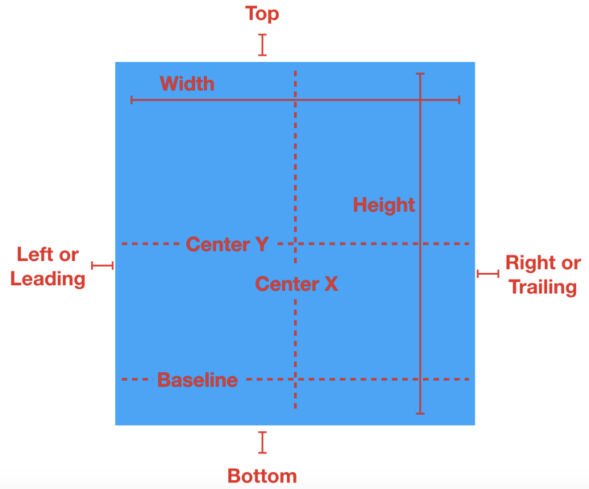

- width: 정렬 사각형의 너비
- height: 정렬 사각형의 높이
- Top: 정렬 사각형의 상단
- Bottom: 정렬 사각형의 하단
- Baseline: 텍스트의 하단
- Horizontal: 수평
- Vertical: 수직
- Leading: 리딩, 텍스트를 읽을 때 시작 방향
- Trailing: 트레일링, 텍스트를 읽을 때 끝 방향
- CenterX: 수평 중심
- CenterY: 수직 중심

### 안전 영역(Safe Area)

- 안전 영역은 콘텐츠가 상태바, 네비게이션바, 툴바, 탭바를 가리는 것을 방지하는 영역이다. 표준 시스템이 제공하는 뷰들은 자동으로 안전 영역 레이아웃 가이드를 준수하게 되어있다.
- 기존의 상/하단 레이아웃 가이드(Top/Bottom Layout Guide)를 대체하며, 하위 버전에도 호환하여 작동한다.
  - 안전 영역은 iOS 11부터 사용할 수 있다.
  - iOS 11 미만의 버전에서는 상/하단 레이아웃 가이드를 사용한다.

안전 영역 레이아웃 가이드는 UIView 클래스의 `var safeAreaLayoutGuide: UILayoutGuide`로 접근할 수 있다.

### 제약(Constraint)

제약은 뷰 스스로 또는 뷰 사이의 관계를 속성을 통하여 정의한다. 제약은 방정식으로 나타낼 수 있다.

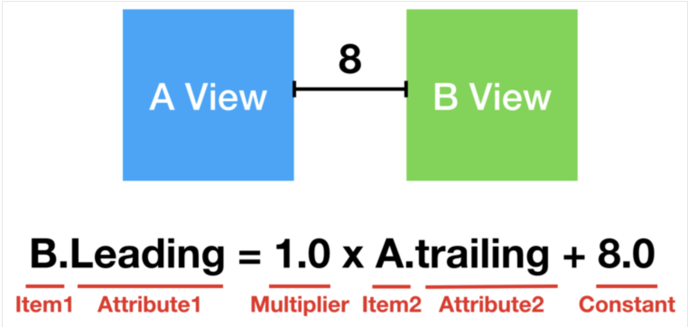

- Item 1: 방정식이 있는 첫번째 아이템(B View)이다. 첫번째 아이템은 반드시 뷰 또는 레이아웃 가이드여야 한다.
- Attribute1: 첫번째 아이템에 대한 속성이다. 이 경우, B View의 리딩이다.
- Multiplier: 속성 2에 곱해지는 값이다. 이 경우 1.0
- Item2: 방정식에 있는 두번째 아이템(A View)이다.
- Attribute2: 두번째 아이템에 대한 속성이다. 이 경우, A View의 트레일링이다.
- Constant: 두번째 아이템의 속성에 더해지는 상수 값이다.

위의 예제 방정식의 제약을 해석하면, 'B View의 리딩은 A View의 트레일링의 1.0배에 8.0을 더한 위치'가 된다.

### 고유 콘텐츠 크기(Intrinsic Content Size)

뷰의 고유 콘텐츠 크기는 뷰가 갖는 원래의 크기로 생각할 수 있다. 예를 들어 레이블의 고유 콘텐츠 크기는 레이블의 텍스트의 크기이고, 이미지의 고유 콘텐츠 크기는 이미지 자체의 크기이다.

### 제약 우선도(Contraint Priorities)

오토레이아웃은 뷰의 고유 콘텐츠 크기를 각 크기에 대한 한 쌍의 제약을 사용하여 나타낸다. 우선도가 높을수록 다른 제약보다 우선적으로 레이아웃에 적용하며, 같은 속성의 다른 제약과 경합하는 경우, 우선도가 낮은 제약은 무시된다.

1. 콘텐츠 허깅 우선도(Content hugging priority): 콘텐츠 고유 사이즈보다 뷰가 커지지 않도록 제한한다. 다른 제약사항보다 우선도가 높으면 뷰가 콘텐츠 사이즈보다 커지지 않는다.
2. 콘텐츠 축소 방지 우선도(Content compression resistance priority): 콘텐츠 고유 사이즈보다 뷰가 작아지지 않도록 제한한다. 다른 제약사항보다 우선도가 높으면 콘텐츠 사이즈보다 작아지지 않는다.

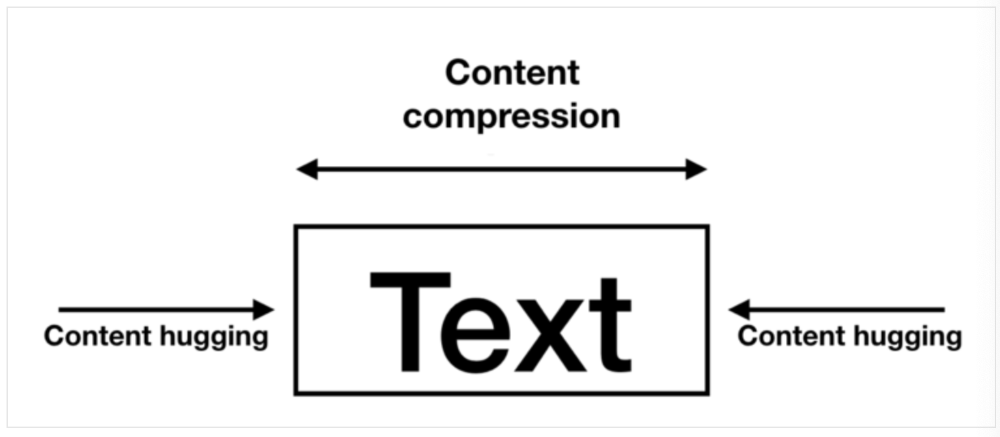

### 레이아웃 마진

뷰에 콘텐츠 내용을 레이아웃할 때 사용하는 기본 간격(default spacing)이다.

- 레이아웃 마진 가이드(Layout Margins Guide): 레이아웃 마진에 따라 형성되는 사각의 프레임 영역

### 앵커(Anchor)

오토레이아웃을 코딩으로 구현하여 제약(Constraint)을 만들기 위해 앵커(Anchor)를 사용할 수 있다.

### Layout Anchor 사용 예제

중앙에 버튼을 배치하고 버튼의 top anchor를 사용해서 레이블의 버튼의 상단으로부터 10만큼 떨어지도록 배치해보자.

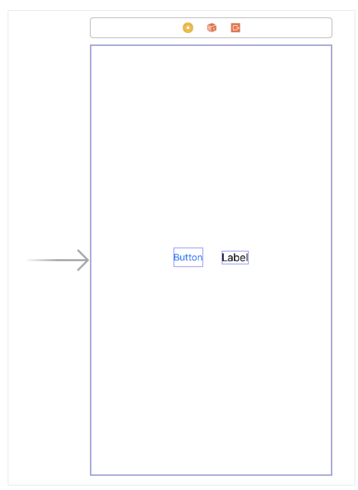

1. 객체 라이브러리에서 버튼과 레이블을 추가한다.
2. `@IBOutlet`을 활용해서 인터페이스 빌더에서 ViewController.swift 파일로 버튼과 레이블을 연결해준다.
3. 버튼을 중앙에 배치하기 위해 버튼의 수평과 수직의 중앙 앵커를 뷰 컨트롤러의 뷰의 중앙에 기준을 잡아준다. 생성된 제약을 적용하기 위해선 isActive 프로퍼티의 값을 true로 설정해주면 된다.

   `translatesAutoresizingMaskIntoConstraints`: 오토레이아웃이 도입되기 전 뷰를 유연하게 표현할 수 있도록 오토리사이징 마스크를 사용하였다. 오토레이아웃을 사용하게 되면 기존이 오토리사이징 마스크가 가지고 있던 제약조건이 자동으로 추가되기 때문에 충돌하게 될 가능성이 발생한다. 그래서 `translatesAutoresizingMaskIntoConstraints`의 값을 false로 지정한 뒤 오토레이아웃을 적용해준다. 참고로 인터페이스 빌더에서 오토레이아웃을 적용한 경우에는 자동으로 값이 false로 설정된다. (참조: [translatesAutoresizingMaskIntoConstraints](https://developer.apple.com/documentation/uikit/uiview/1622572-translatesautoresizingmaskintoco))

   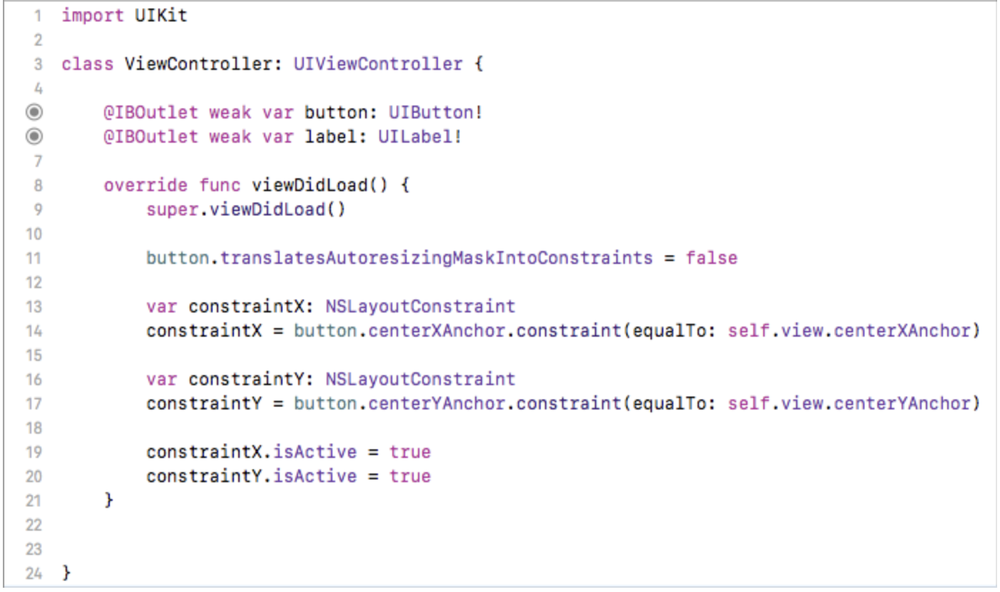

4. 레이블의 수평 중앙을 버튼의 수평 중앙 앵커를 기준으로 제약을 생성한 후, 레이블의 하단 앵커를 버튼 상단 앵커로부터 10만큼의 거리를 두도록 한다(상단 앵커기준으로 위로의 거리는 부호가 - 라는 점에 주의). 생성된 제약을 적용하기 위해 isActive 프로퍼티를 true로 설정해준다. 그림과 같이 레이블이 버튼의 상단에 자리 잡고 있는 것을 볼 수 있다

   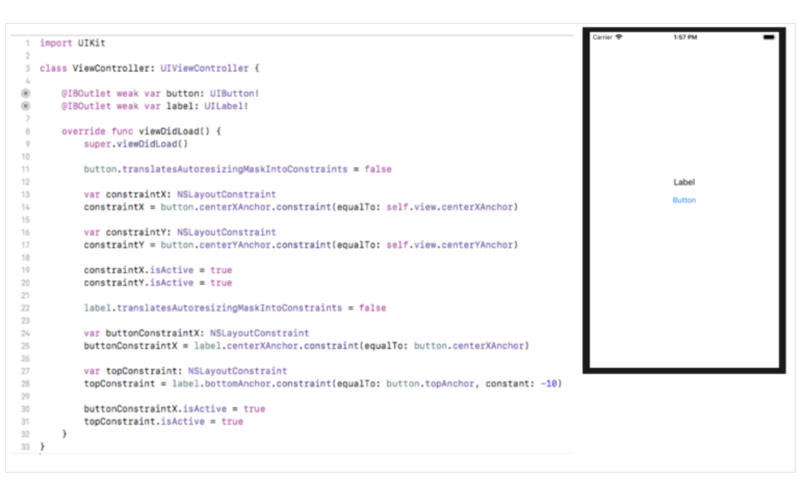

   속성에 곱해지는 multiplier를 활용해 보자. 앵커를 활용하여 레이블의 너비가 버튼의 너비의 2배가 되도록 제약을 만들어 보자.

   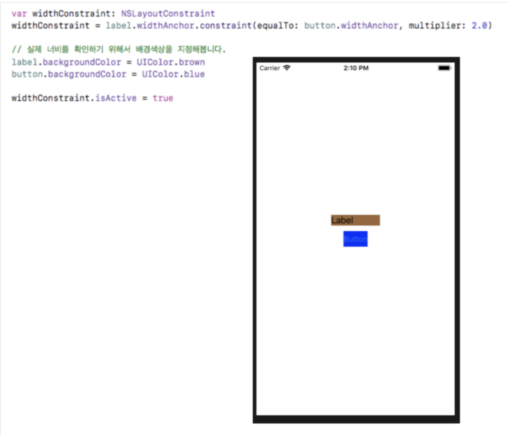

### 앵커와 관련된 프로퍼티

```swift
var constraints: [NSLayoutConstraint]
//뷰에 부여한 제약사항들을 담은 배열

var bottomAnchor: NSLayoutYAxisAnchor { get }
//뷰 프레임의 하단부 레이아웃 앵커

var centerXAnchor: NSLayoutXAxisAnchor { get }
// 뷰 프레임의 수직 중심부 레이아웃 앵커

var centerYAnchor: NSLayoutYAxisAnchor { get }
//뷰 프레임의 수직 중심부 레이아웃 앵커

var heightAnchor: NSLayoutDimension { get }
//뷰 프레임의 높이를 가리키는 레이아웃 앵커

var leadingAnchor: NSLayoutXAxidsAnchor { get }
//뷰 프레임의 리딩을 가리키는 레이아웃 앵커

var topAnchor: NSLayoutYAxisAnchor { get }
//뷰 프레임의 상단부 레이아웃 앵커

var widthAnchor: NSLayoutDimension { get }
//뷰 프레임의 너비를 가리키는 레이아웃 앵커
```

  </details>
    <details>
    <summary>3-2. 오토 레이아웃 구현하기(코드)</summary>

# 오토 레이아웃 구현하기(코드)

[Apple Documentation - Auto Layout Guide(코드)](https://developer.apple.com/library/archive/documentation/UserExperience/Conceptual/AutolayoutPG/ProgrammaticallyCreatingConstraints.html#//apple_ref/doc/uid/TP40010853-CH16-SW1)

[Apple Documentation - Auto Layout Guide(Visual Format Language)](https://developer.apple.com/library/archive/documentation/UserExperience/Conceptual/AutolayoutPG/VisualFormatLanguage.html#//apple_ref/doc/uid/TP40010853-CH27-SW1)

## 학습 목표

1. Layout Anchor를 이용해 오토레이아웃을 구현할 수 있다.
2. NSLayoutConstraint와 Visual Format Language를 이용한 다른 방법에 대해서 이해한다.

## 학습하기

### NSLayoutConstraint

NSLayoutConstraint 인스턴스 생성을 사용하여 제약조건을 지정하는 방법에 대해 알아보자

#### NSLayoutConstraint 인스턴스 생성 제약조건

오토레이아웃 방정식

- view1.attr1 = view2.attr2 \* multiplier + constant
- item.attribute = toItem.attribute \* multiplier + constant

매개변수 설명

**item**

- 제약조건을 받는 뷰(왼쪽)이다.

**relatedBy**

- 제약조건을 받는 뷰 간의 관계
- `NSLayoutRelation` 열거형 값을 가진다. (`.lessThanOrEqual, .equal, .greaterThanOrEqual`)

**attribute**

- 뷰(왼쪽)의 제약조건의 속성이다.
- `NSLayoutAttribute` 열거형 값을 가진다. (`.left, .right, .top, .bottom, .leading, .trailing, .width, .height, .centerX, .centerY, .lastBaseline, .notAnAttribute` 등)

**toItem**

- 뷰(왼쪽)가 제약조건을 받을 뷰(오른쪽)이다.
- 없을 경우 `nil`이 가능하다.

**attribute**

- 뷰(오른쪽)의 제약 조건의 속성이다.
- `NSLayoutAttribute` 열거형 값을 가진다. (`.left, .right, .top, .bottom, .leading, .trailing, .width, .height, .centerX, .centerY, .lastBaseline, .notAnAttribute` 등)

**multiplier**

- 뷰(왼쪽)의 속성값을 얻기 위해 뷰(오른쪽)의 속성값을 곱한다.
- 이 값을 이용해 비율로 크기를 설정할 수 있고, 위치 지정에도 활용할 수 있다.

**constant**

- 상수 값이다.
- 비율(multiplier)의 값이 아닌 상수의 값이 필요한 경우에 사용한다.

#### 코드와 예시

- button과 textField에 기본 간격(Standard Space, iOS 11 8포인트)에 제약을 주기 위해 `NSLayoutConstraint` 인스턴스를 생성하는 코드

  ```swift
  NSLayoutConstraint(item: button,
          attribute: .right,
          relatedBy: .equal,
          toItem: textField,
          attribute: .left,
          multiplier: 1.0,
          constant: 8.0)
  ```

  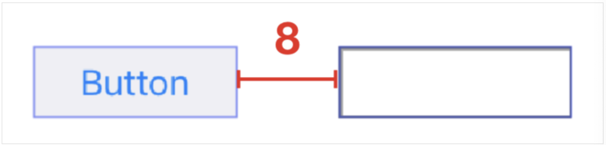

- button의 너비가 50보다 크거나 같도록 너비 제약(Width Constraint)을 줄 수 있는 `NSLayoutConstraint` 인스턴스 생성 코드

  ```swift
  NSLayoutConstraint(item: button,
          attribute: .width,
          relatedBy: .greaterThanOrEqual,
          toItem: nil,
          attribute: .notAnAttribute,
          multiplier: 1.0,
          constant: 50.0)
  ```

  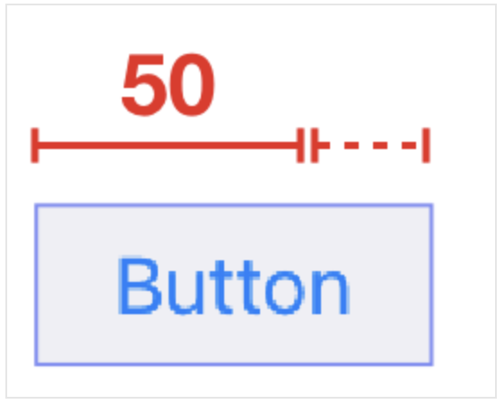

- purpleBox가 superView를 기준으로 왼쪽(Leading) 간격은 50포인트, 오른쪽(Trailing) 간격은 50포인트로 설정한다. (Connection to Superview)

  ```swift
  NSLayoutConstraint(item: purpleBox,
          attribute: .left,
          relatedBy: .equal,
          toItem: self.view,
          attribute: .left,
          multiplier: 1.0,
          constant: 50.0)

    NSLayoutConstraint(item: purpleBox,
          attribute: .right,
          relatedBy: .equal,
          toItem: self.view,
          attribute: .right,
          multiplier: 1.0,
          constant: -50.0)
  ```

  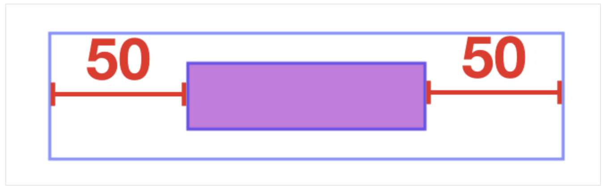

- topField와 bottomField의 세로 사이의 간격을 10포인트로 설정한다. (Vertical Layout)

  ```swift
  NSLayoutConstraint(item: topField,
          attribute: .bottom,
          relatedBy: .equal,
          toItem: bottomField,
          attribute: .top,
          multiplier: 1.0,
          constant: -10.0)
  ```

  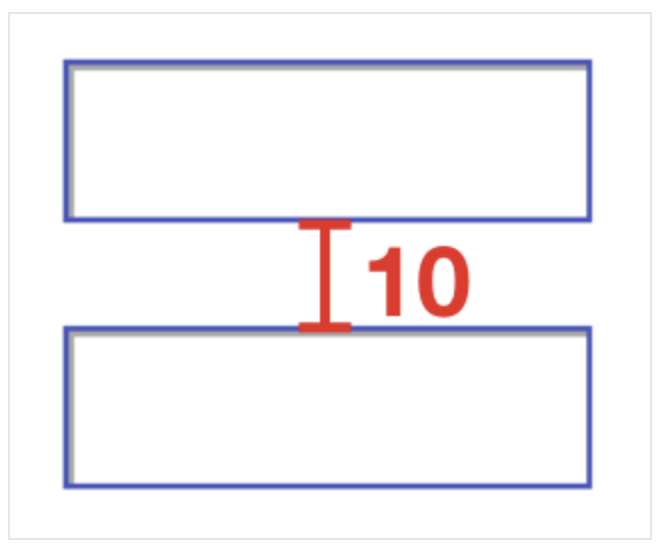

- marronView와 blueView의 간격이 없다. (Flush Views)

  ```swift
  NSLayoutConstraint(item: maroonView,
          attribute: .right,
          relatedBy: .equal,
          toItem: blueView,
          attribute: .left,
          multiplier: 1.0,
          constant: 0.0)
  ```

  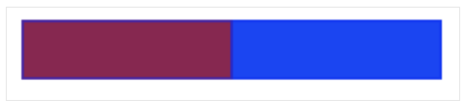

- button의 너비는 100포인트이고 우선도는 20으로 설정한다. (Priority)

  ```swift
  NSLayoutConstraint(item: button,
          attribute: .width,
          relatedBy: .equal,
          toItem: nil,
          attribute: .notAnAttribute,
          multiplier: 1.0,
          constant: 100.0).priority = UILayoutPriority(rawValue: 20)
  ```

  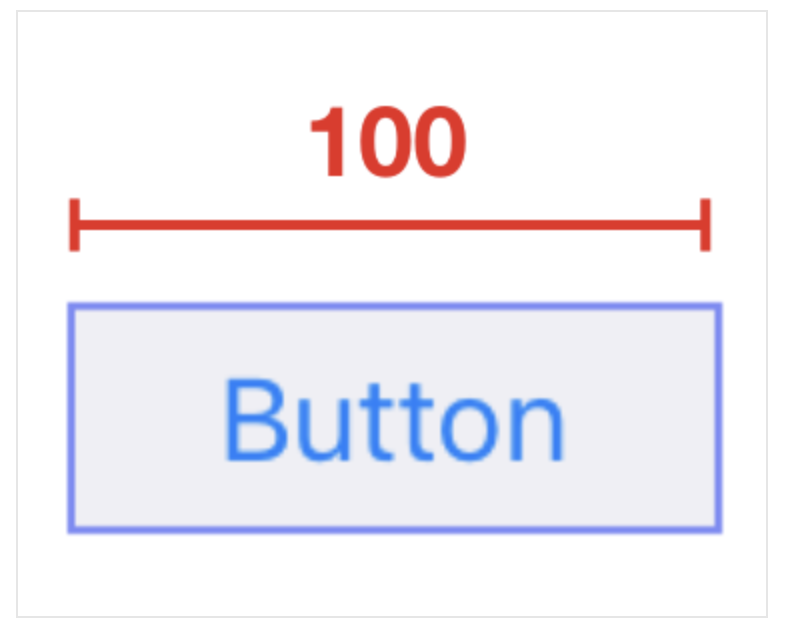

  Tip: 오토 레이아웃에서는 뷰에 제약을 적용할 때, 어떤 제약을 우선시해야 하는지를 우선도로 결정한다. 만약, 하나의 속성(attribute)에 적용할 수 있는 두 개 이상의 제약이 있다면 그 중 우선도가 높은 제약이 적용된다. 우선도는 1부터 1000까지의 정수로 표현할 수 있다.

- button1과 button2의 너비 값이 같도록 제약을 생성한다. Equal Widths)

  ```swift
  NSLayoutConstraint(item: button1,
          attribute: .width,
          relatedBy: .equal,
          toItem: button2,
          attribute: .width,
          multiplier: 1.0,
          constant: 0.0)
  ```

  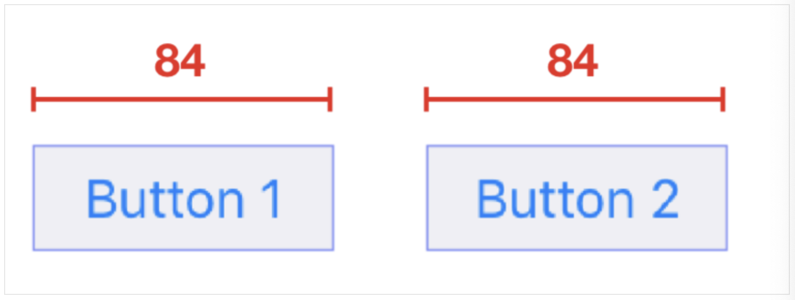

- flexibleButton의 너비 값이 70포인트보다 크거나 같고 100포인트보다 작거나 같도록 제약을 생성한다. (Multiple Predicates)

  ```swift
  NSLayoutConstraint(item: flexibleButton,
          attribute: .width,
          relatedBy: .greaterThanOrEqual,
          toItem: nil,
          attribute: .notAnAttribute,
          multiplier: 1.0,
          constant: 70.0)

    NSLayoutConstraint(item: flexibleButton,
          attribute: .width,
          relatedBy: .lessThanOrEqual,
          toItem: nil,
          attribute: .notAnAttribute,
          multiplier: 1.0,
          constant: 100.0)
  ```

  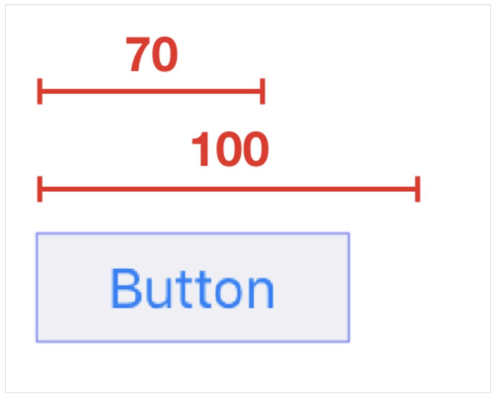

- button1, button2, textField와 superView의 간격은 표준 간격(8포인트)이며 textField의 너비 값은 20포인트보다 크거나 같도록 제약을 생성한다. (A Complete Line of Layout)

  ```swift
  // button1
    NSLayoutConstraint(item: button1,
          attribute: .left,
          relatedBy: .equal,
          toItem: self.view,
          attribute: .left,
          multiplier: 1.0,
          constant: 8.0)

    // button2
    NSLayoutConstraint(item: button2,
          attribute: .left,
          relatedBy: .equal,
          toItem: button1,
          attribute: .right,
          multiplier: 1.0,
          constant: 8.0)

    // textField
    NSLayoutConstraint(item: textField,
          attribute: .left,
          relatedBy: .equal,
          toItem: button2,
          attribute: .right,
          multiplier: 1.0,
          constant: 8.0)

    NSLayoutConstraint(item: textField,
          attribute: .width,
          relatedBy: .greaterThanOrEqual,
          toItem: nil,
          attribute: .notAnAttribute,
          multiplier: 1.0,
          constant: 20.0)

    NSLayoutConstraint(item: textField,
          attribute: .right,
          relatedBy: .equal,
          toItem: self.view,
          attribute: .right,
          multiplier: 1.0,
          constant: -8.0)
  ```

  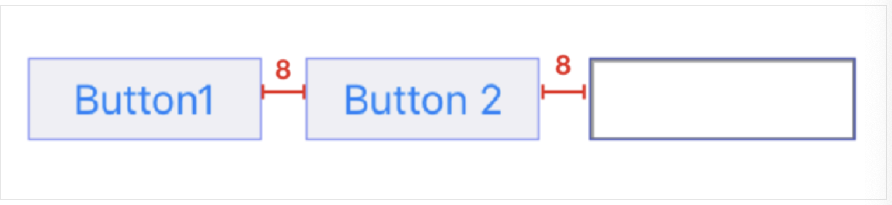

### Visual Format Language

Visual Format Language를 사용하여 제약조건을 지정하는 방법에 대해 알아보고, 위에서 `NSLayoutConstraint`를 이용해 만들었던 동일한 제약조건을 Visual Format Language를 이용해 만들어보자.

#### 사용 가능한 기호 및 문자열

**|**

- superview이다.

**-**

- 표준 간격이다. 기본은 8포인트

**==**

- 같은 너비이다.

**-10-**

- 사이의 간격이 10포인트이다.

**<=50**

- 50보다 작거나 같다.

**>=50**

- 50보다 크거나 같다.

**@750**

- 우선도를 지정할 수 있다.

**H**

- 수평 방향이다(가로)

**V**

- 수직 방향이다(세로)

#### 코드 및 예시

- button과 textField에 기본간격(Standard Space, iOS 11 8포인트)의 제약을 준다.

  ```swift
  H:[button]-8-[textField] 또는 H:[button]-[textField]
  ```

  

- button의 너비가 50포인트보다 크거나 같도록 너비 제약(Width Constraint)을 준다.

  ```swift
  H:[button(>=50)]
  ```

  

- purpleBox가 superView를 기준으로 왼쪽(Leading) 간격은 50포인트, 오른쪽(Trailing) 간격은 50포인트로 설정한다. (Connection to Superview)

  ```swift
  H:|-50-[purpleBox]-50-|
  ```

  

- topField와 bottomField의 세로 사이의 간격을 10포인트로 설정한다. (Vertical Layout)

  ```swift
  V:[topField]-10-[bottomField]
  ```

  

- marronView와 blueView의 간격이 없다. (Flush Views)

  ```swift
  H:[marronView][blueView]
  ```

  

- button의 너비는 100포인트이고 우선도는 20으로 설정한다. (Priority)

  ```swift
  H: [button(100@20)]
  ```

  

- button1과 button2의 너비 값이 같도록 제약을 생성한다. (Equal Widths)

  ```swift
  H:[button1(==button2)]
  ```

  

- flexibleButton의 너비 값이 70포인트보다 크거나 같고 100포인트보다 작거나 같도록 제약을 생성한다. (Multiple Predicates)

  ```swift
  H:[flexibleButton(>=70,<=100)]
  ```

  

- find, findNext, findField와 superView의 간격은 표준 간격(8포인트)이며 findFIeld의 너비 값은 20포인트보다 크거나 같도록 제약을 생성한다.

  ```swift
  H: |-[find]-[findNext]-[findField(>=20)]-|
  ```

  

    </details>
    <details>
    <summary>3-3. 오토 레이아웃 구현하기(인터페이스 빌더)</summary>

  # 오토 레이아웃 구현하기(인터페이스 빌더)

[Apple Documentation - Constraints in Interface Builder](https://developer.apple.com/library/archive/documentation/UserExperience/Conceptual/AutolayoutPG/WorkingwithConstraintsinInterfaceBuidler.html#//apple_ref/doc/uid/TP40010853-CH10-SW1)

[Apple Documentation - Auto Layout Guide: Types of Errors](https://developer.apple.com/library/archive/documentation/UserExperience/Conceptual/AutolayoutPG/TypesofErrors.html#//apple_ref/doc/uid/TP40010853-CH22-SW1)

[Xcode Help - Interface Builder Workflow](https://help.apple.com/xcode/mac/current/#/dev31645f17f)

인터페이스 빌더에서 오토 레이아웃을 구현하는 방법을 실습하며 코드로 구현했던 방식과 어떤 차이가 있고, 어떤 방법이 더 자신에게 편리한 지 비교해 보자.

## 학습 목표

1. 인터페이스 빌더에서 오토 레이아웃을 구현하는 여러가지 방법을 이해한다.
2. 인터페이스 빌더에서 오토 레이아웃과 관련된 툴과 메뉴 기능을 이해한다.
3. 인터페이스 빌더에서 오토 레이아웃을 구현할 수 있다.
4. 인터페이스 빌더에서 생상된 제약을 확인하고 편집할 수 있다.

## 학습하기

## 인터페이스 빌더에서 오토 레이아웃 구현하기

1. 뷰와 뷰 사이에 ctr키 누르고 드래그 하는 방식
2. 스택, 정렬, 핀 그리고 리졸브를 사용하는 방식
3. 인터페이스 빌더가 제약 설정하는 방식

각각의 방식은 장단점이 있으며 대부분의 경우 선호하는 한가지 방법을 주로 사용하게 되지만, 세가지 방법에 대해 모두 알아둬야 여러 업무 상황에 대응할 수 있다.

### 1. 컨트롤-드래그 제약(Control-Dragging Constraints)

두 뷰 사이의 제약을 생성하기 위해, 뷰 중 하나를 클릭한 뒤 컨트롤(ctr) 키를 누른 상태에서 다른 뷰로 드래그한다.

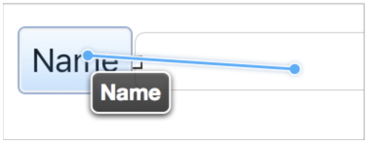

마우스를 원하는 뷰 위에서 놓을 때, 인터페이스 빌더는 HUD 메뉴를 통해 생성가능한 제약을 보여준다.

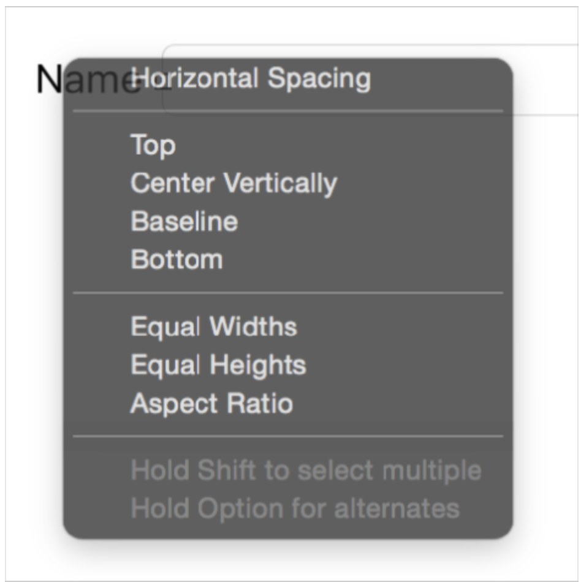

인터페이스 빌더는 오토 레이아웃을 적용하려는 아이템과 드래그 방향에 기반해 선택가능한 제약 조건을 지능적으로 제공한다.

만약 수평으로 드래그했다면, 뷰 사이에 수평적인 공간을 설정할 선택권과 수직적으로 뷰를 정렬할 선택권을 얻을 수 있다.

만약 수직적으로 드래그 했다면, 수직적인 공간을 설정할 선택권과 수평적으로 뷰를 정렬할 선택권을 얻게 된다.

두 제스처 모두 뷰의 상대적 크기와 같은 다른 옵션도 포함한다.

### 2. 스택, 정렬, 핀 그리고 리졸브 툴 사용 (Using the Stack, Align, Pin and Resolve Tools)

인터페이스 빌더는 에디터 윈도우 우측 하단 모서리에 아래 그림과 같은 네 개의 레이아웃을 툴을 제공한다.

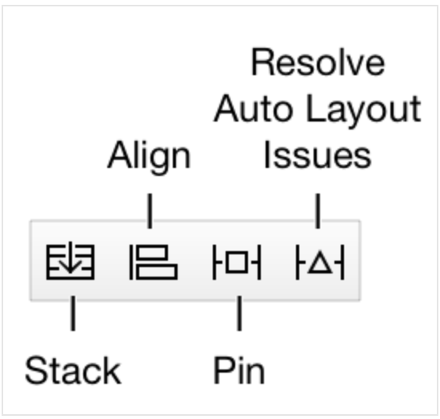

**스택 툴(Stack Tool)**

스택툴은 스택뷰를 재빠르게 생성할 수 있게 해준다. 레이아웃에서 하나 혹은 그 이상의 아이템을 선택한 후, 스택툴을 클릭하면 된다. 인터페이스 빌더는 스택뷰에 선택된 아이템을 추가하고, 스택을 콘텐츠의 최근 피팅 사이즈에 맞게 크기를 재설정한다.

**정렬 툴(Align)**

정렬하려는 뷰를 선택한 뒤, 정렬 툴을 선택하면 아래와 같은 팝오버 창이 뜬다.

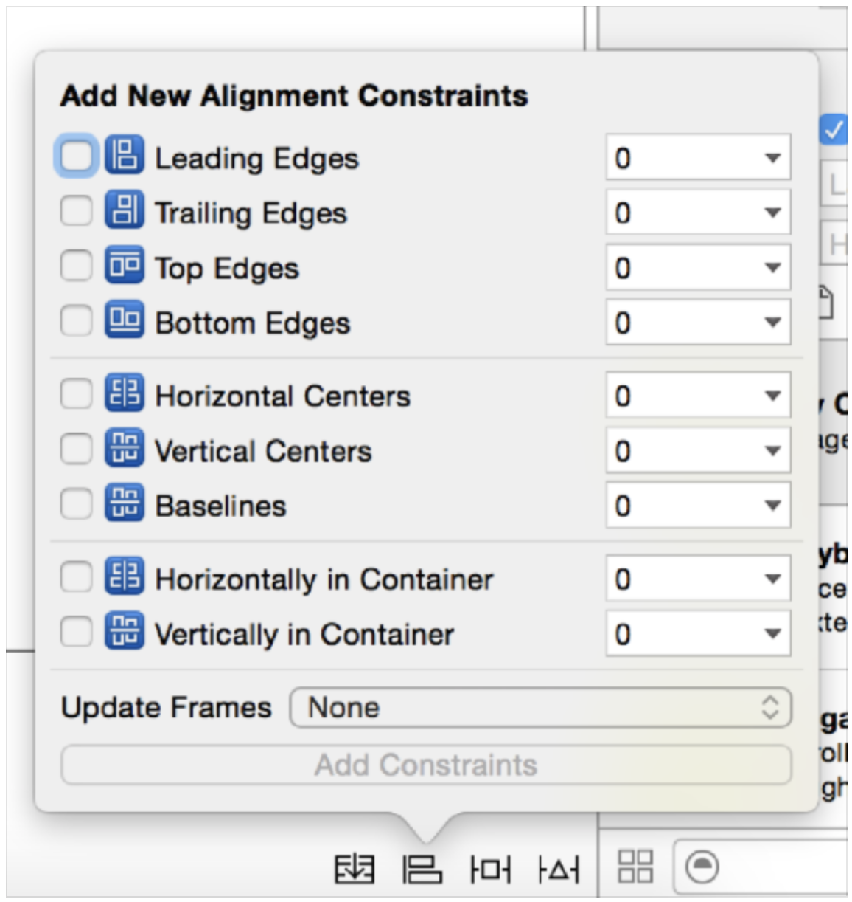

선택된 뷰를 정렬하기 위한 옵션을 선택하고 제약 추가 버튼을 클릭한다. 인터페이스 빌더는 정렬을 확실하게 하는 데 필요한 제약을 생성한다. 일반적으로, 제약은 어떠한 오프셋(서로에 맞게 정렬되어 있는 엣지 또는 센터)도 갖지 않으며 제약이 추가될 때, 어떤 프레임도 업데이트 되지 않는다. 그리고 제약을 생성하기 전에 모든 설정을 변경할 수 있다.

보통 두 개 또는 그 이상의 뷰를 정렬 툴에 사용하기 전에 선택한다. 하지만, 수평적 혹은 수직적으로 컨테이너 내에 있는 제약은 하나의 뷰에 추가될 수 있다. 그리고 동시에 하나 혹은 두 개 이상을 생성하는 것은 거의 말이 되지 않지만, 한 번에 제약을 생성하기 위한 팝오버를 사용할 수 있다.

**핀 툴(Pin Tool)**

핀 툴은 뷰의 이웃과 연관된 뷰의 위치 또는 그 크기를 재빠르게 정의하도록 한다. 고정되기 원하는 아이템의 위치가 크기를 선택하고 핀 툴을 선택한다. 인터페이스 빌더는 여러가지 옵션을 가진 팝오버뷰를 제공한다.

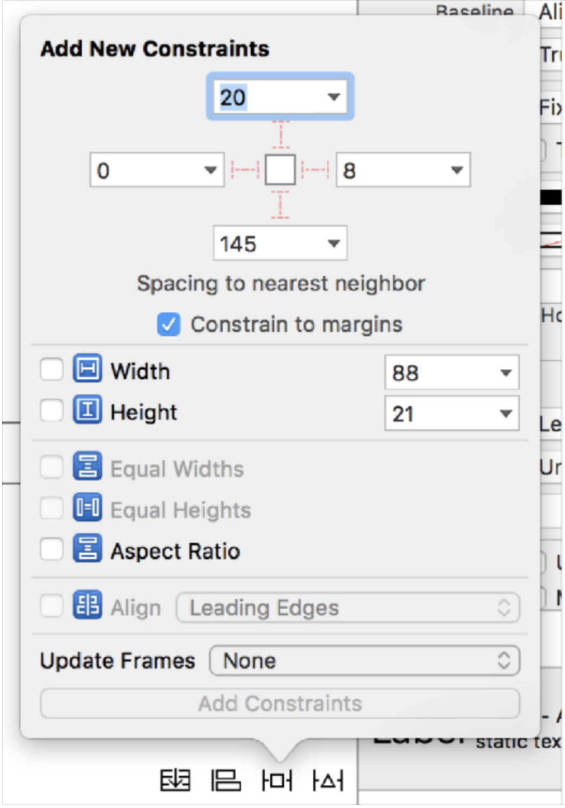

팝오버의 윗 부분은 선택된 아이템의 리딩, 위, 트레일링, 또는 아래 엣지를 가장 가까운 곳에 고정할 수 있도록 한다. 관련된 숫자는 현재 캔버스에 있는 아이템 사이의 공간을 나타낸다. 커스텀 공간에 입력해줄 수도 있고 어떤 뷰가 제약되어야 하는지를 설정하거나 기본 공간을 선택하기 위해 더 보기 삼각형을 클릭할 수도 있다. "여백 제약하기(Constrain to margins)" 체크박스는 슈퍼뷰가 슈퍼뷰의 여백 또는 엣지를 사용하는 것을 제약할 것인지의 여부를 결정한다.

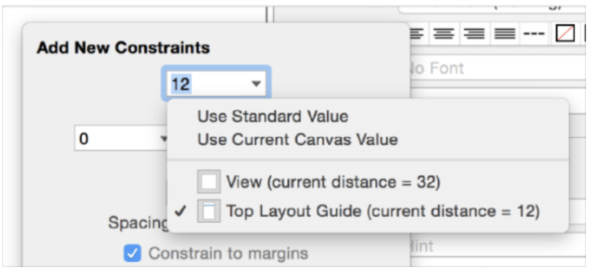

팝 오버의 아래 부분은 아이템의 너비 또는 높이를 설정할 수 있게 해준다. 너비와 높이 제약은 다른 값으로 변경해줄 수 있지만, 현재 캔버스 크기를 기본값으로 한다. 화면 비율 제약은 아이템의 현재 화면 비율을 사용하지만, 이 값을 변경해주고 싶다면 일단 생성한 후에 제약을 다시 살펴보고 편집해줘야 한다.

일반적으로, 고정할 하나의 뷰를 선택한다. 하지만, 두 개 혹은 그 이상의 뷰를 선택할 수 있고 뷰에 모두 같은 너비 또는 높이를 줄 수도 있다. 또한 한 번에 여러 개의 제약을 생성할 수도 있으며 제약을 추가함에 따라 프레임을 업데이트할 수도 있다. 원하는 옵션을 선택한 후 제약을 생성해주는 제약 추가(Add Constraint) 버튼을 누른다.

**리졸브 툴(Resolve Tool)**

리졸브 툴은 오토 레이아웃 문제 해결을 위한 도구로, 일반적인 오토 레이아웃의 문제를 고치는 몇 가지 옵션을 제공한다. 메뉴 절반 위의 옵션은 현재 선택된 뷰에 한해 영향을 준다. 절반 아래의 옵션은 씬(scene)에 있는 모든 뷰에 영향을 준다.

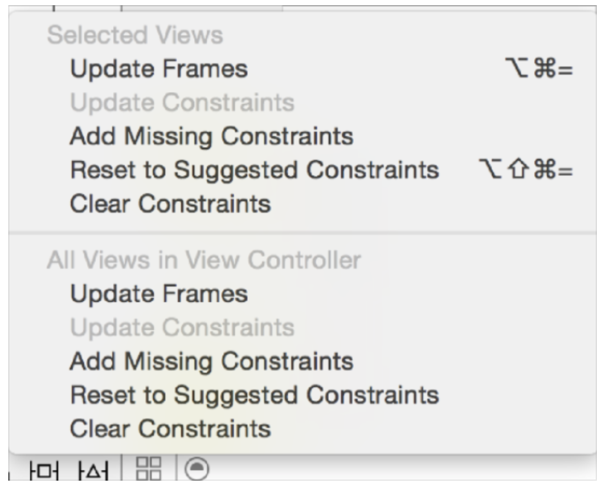

현재 제약에 기반한 뷰 프레임이나 캔버스에 있는 뷰의 현재 위치에 기반한 제약을 업데이트할 때 이 툴을 사용할 수 있다. 또한 빠진 제약을 추가해줄 수 있고 제약을 삭제하거나 인터페이스 빌더에 의해 추천된 제약 묶음에 뷰를 재설정해줄 수 있다.

### 3. 인터페이스 빌더의 제약 생성(Letting Interface Builder Create Constraints)

인터페이스 빌더 스스로 제약 몇 가지 혹은 전부를 생성할 수 있다. 이 방법을 사용할 때, 인터페이스 빌더는 캔버스에 있는 뷰의 현재 크기와 위치에 맞는 최선의 제약을 추론한다. 뷰의 위치를 잘 잡아줘야 한다. 간격에서의 작은 차이가 상당히 다른 레이아웃 결과를 초래할 수 있다.

인터페이스 빌더가 모든 제약을 생성하기 위해 , 오토 레이아웃 문제 해결 툴(Resolve Auto Layout Issues tool) > 추천 제약으로 재설정(Reset to Suggested Constraints)을 클릭한다. 인터페이스 빌더는 선택된 뷰(또는 씬에 있는 모든 뷰)에서 요구되는 모든 제약을 생성한다.

다른 방법으로는, 몇 가지 제약은 직접 추가해준 다음 오토레이아웃 문제 해결 툴(Resolve Auto Layout Issues tool) > 빠진 제약 추가하기(Add Missing Constraints)을 클릭해주는 방법이 있다. 이 선택지는 모호하지 않은 레이아웃을 필요로 하는 제약을 추가해준다. 또, 선택된 뷰나 씬에 있는 모든 뷰에 제약을 추가해줄 수도 있다.

이 방법은 점진적으로 모호하지 않은, 만족스러운 레이아웃을 빌드할 수 있도록 해준다. 하지만 사용자 인터페이스가 복잡하지 않는 한, 결과 레이아웃은 내가 원하는 대로 동작하지 않을 것이다. 의도된 결과를 얻을 수 있을 때까지 항상 사용자 인터페이스를 시험해보고 제약을 수정해야 한다.

## 생성된 제약 찾기

1. 캔버스에 있는 제약 보기
2. 도큐멘트 아웃라인에서 그룹화된 제약 목록 보기
3. 크기 인터페이스에서 제약 보기

### 1. 캔버스에 있는 제약 보기(Viewing Constraints in the Canvas)

편집기는 현재 선택된 뷰에 영향을 주는 모든 뷰를 색이 있는 선으로 나타낸다. 모양, 선 유형, 그리고 선색은 제약의 현재 상태에 대해 많은 것을 나타내 준다.

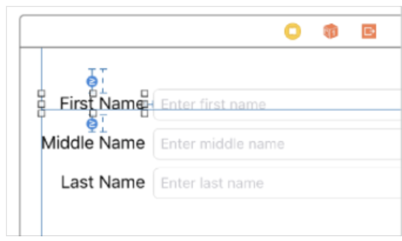

**I-bars(양 끝에 T 모양이 있는 선)**

- I-bars는 공간의 크기를 나타낸다. 이 공간은 두 아이템 사이의 거리, 아이템의 높이와 너비를 나타낼 수 있다.

**일반선(양 끝에 아무것도 없는 직선)**

- 일반선은 엣지가 정렬된 부분을 나타낸다. 인터페이스 빌더는 두 개 혹은 그 이상의 뷰의 리딩 엣지를 정렬하는 데 일반선을 사용한다. 이 선은 아이템 사이에 0 포인트 공간을 갖는 두 아이템을 연결하는 데 사용하기도 한다.

**실선**

- 실선은 필수적 제약을 나타내는 데 사용한다. (우선도=1000)

**점선**

- 점선은 선택적 제약을 나타내는 데 사용한다. (우선도 < 1000)

**빨간선**

- 오류가 있는 제약에 영향을 받은 아이템을 나타낸다. 모호한 레이아웃을 갖거나 만족스럽지 않은 레이아웃을 갖는 아이템의 경우도 빨간 선으로 나타난다. 인터페이스 빌더 아웃라인 뷰(Interface Builder's outline view)에 있는 네비게이터 또는 더 보기 화살표 문제(the isseus navigator or the disclosure arrow)를 살펴보면 더 많은 정보를 얻을 수 있다.

**주황선**

- 주황선은 제약의 영향을 받는 아이템 중 하나의 프레임이 현재 제약에 기반할 때 올바른 위치에 있지 않음을 나타낸다. 인터페이스 빌더는 프레임의 계산된 위치를 점선으로 나타나는 윤곽선으로 나타내기도 한다. 오토 레이아웃 문제 해결 툴 > 프레임 명령 업데이트를 통해 계산된 위치로 아이템을 이동해줄 수도 있다.

**파란선**

- 명확하고 만족스러운 레이아웃을 갖는 제약의 영향을 받는 아이템과아이템 프레임이 오토레이아웃 엔진에 의해 계산된 올바른 위치에 있는 경우 파란선으로 나타난다.

**등호 뱃지**

- 인터페이스 빌더는 두 아이템에게 같은 너비 또는 같은 높이를 주는 제약을 각 아이템에 분리된 막대로 보여준다. 두 막대에는 등호 표시가 있는 파란색 뱃지가 있다.

**더 크거나 같은 뱃지 그리고 더 작거나 같은 뱃지**

- 인터페이스 빌더는 모든 제약을 그 안에 >= 또는 <= 표기가 있는 작은 파란 뱃지를 통해 더 크거나 같은 또는 더 작거나 같은 관계를 나타내는 모든 제약을 표기한다.

### 2. 도큐멘트 아웃라인 제약 목록(Listing Constraints in the Document Outline)

인터페이스 빌더는 제약을 포함하는 뷰 아래에 제약을 그룹화하여 도큐멘트 아웃라인의 모든 제약을 나열한다. 제약은 제약에 두 아이템을 모두 포함하는 가장 가까운 뷰에 묶여있다. 제약은 제약에 두 아이템을 모두 포함한느 가장 가까운 뷰에 묶여있다. 이에 따라, 각 뷰는 자기 자신과 서브뷰를 포함하며 위 그리고 아래 레이아웃 가이드는 씬(scene)의 루트뷰에 포함된다.

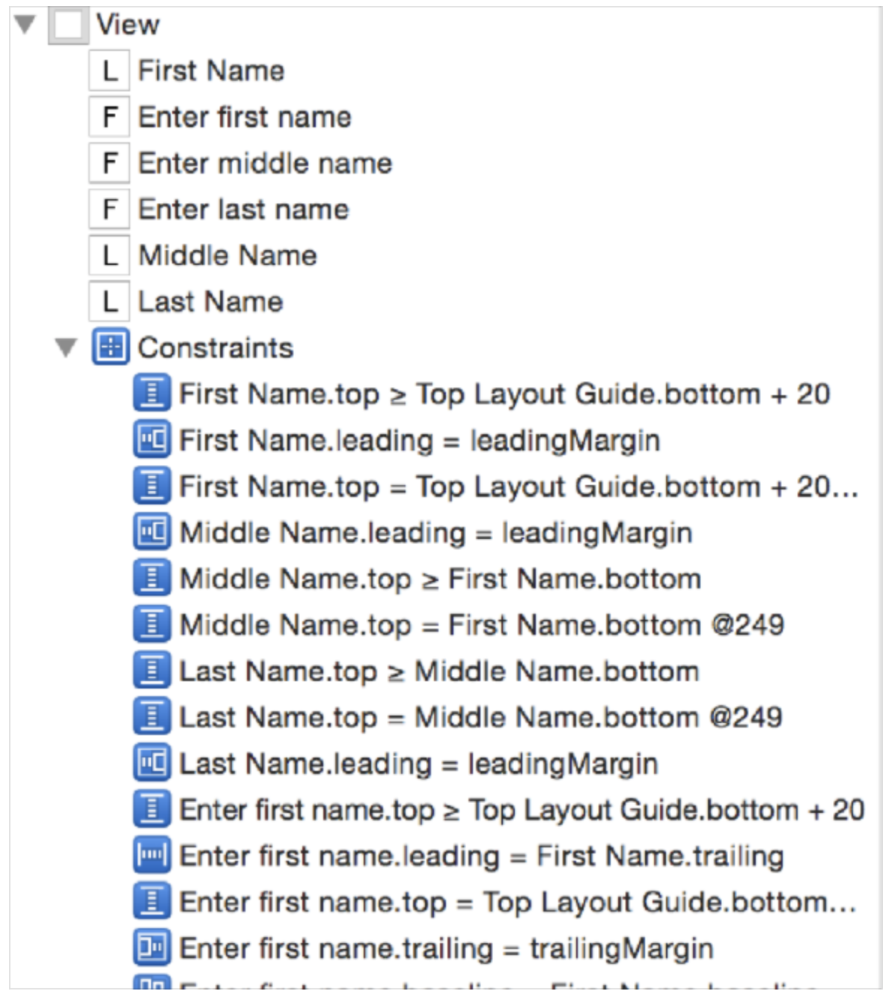

제약이 아웃라인에 퍼질 수 있다고 하더라도, 대부분의 제약은 씬 루트뷰 아래에서 끝난다. 만약 모든 제약을 찾고자 한다면, 뷰 계층 전체를 확장하면 된다.

제약은 의사 코드를 사용해서 열거되어 있다. 이 목록은 길기 때문에 뷰 묶음과 비숫하다. 그래서 의미 있는 정보를 보기 전에 아웃라인의 너비를 늘려줘야 한다. 아웃라인에 있는 제약을 선택하는 것은 캔버스에 있는 제약을 강조한다. 살펴보고자 하는 제약을 빠르게 찾고 싶을 때, 이 특징을 활용하면 도니다.

단순한 씬의 경우, 아웃라인은 모든 씬의 제약을 훑어볼 수 있는 좋은 장소이다. 하지만 레이아웃이 더 복잡해지면, 특정한 제약을 빨리 찾는 것이 어려워지게 된다. 한 번에 하나의 뷰 제약을 조사해보는 것이 캔버스에서 뷰를 선택하거나 크기 인스펙터에서 뷰를 검토하는 것보다 나을 것이다.

### 3. 사이즈 인스펙터에서 제약 찾기(Finding Constraints in the Size Inspector)

사이즈 인스펙터는 현재 선택된 뷰에 영향을 받는 모든 제약을 나타낸다. 필수적 제약은 실선으로 나타나며 선택적 제약은 점선으로 나타난다. 설명은 제약에 관한 중요한 정보를 보여준다. 항상 영향을 받은 속성과 제약에 있는 다른 아이템을 포함한다. 또한 관계와 상수값 그리고 곱하는 수와 비율도 포함한다.

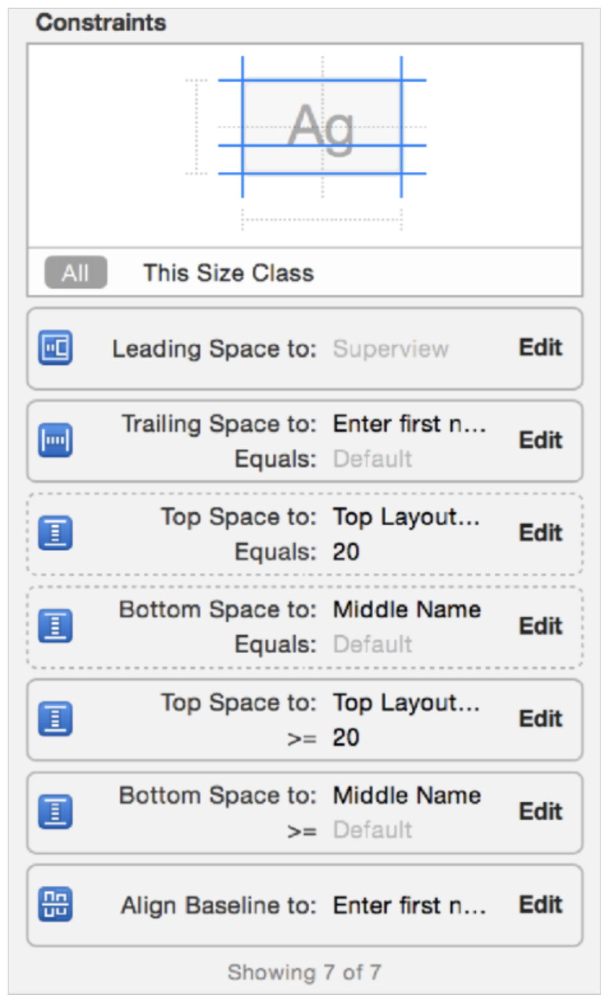

위에 있는 스크린 샷의 윗 부분에 있는 도표는 어떤 속성이 제약에 의해 영향을 받았는지 보여준다. 하나 혹은 그 이상의 도표의 속성을 선택함으로써 제약 목록을 필터링해서 살펴볼 수 있다. 그렇게 하면 선택된 속성에 의해 영향을 받는 제약만 볼 수 있다.

## 제약 편집하기

생성된 제약을 편집할 수 있는 화면은 두 가지다.

1. 사이즈 인스펙터
2. 속성 인스펙터

### 1. 사이즈 인스펙터

사이즈 인스펙터에서 생성된 제약을 확인하고, "Edit" 버튼을 눌러 제약을 바로 수정할 수 있다.

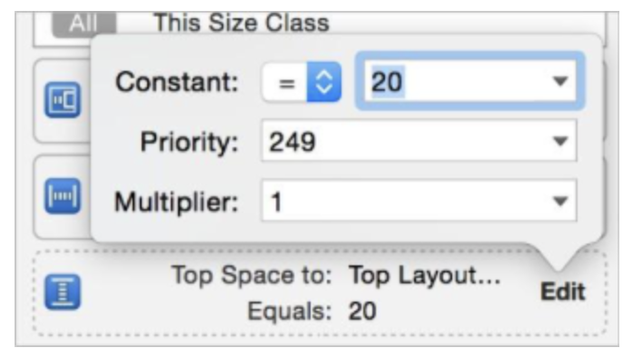

사이즈 인스펙터(Size Inspector)에서 직접적으로 편집 가능한 사항들이 있다. 어떤 제약에서든 Edit 버튼을 누르면 제약의 관계, 상수, 우선도, 또는 배수를 변경할 수 있는 팝오버 창(popover)를 띄울 수 있다. 더 많은 변경이 필요한 경우, 제약을 더블 클릭으로 선택해서 속성 인스펙터를 열 수 있다.

### 2. 속성 인스펙터

캔버스나 문서 아웃라인에서 제약(constraint)을 선택하는 경우, 속성 인스펙터를 통해 제약의 모든 속성을 살펴볼 수 있다.

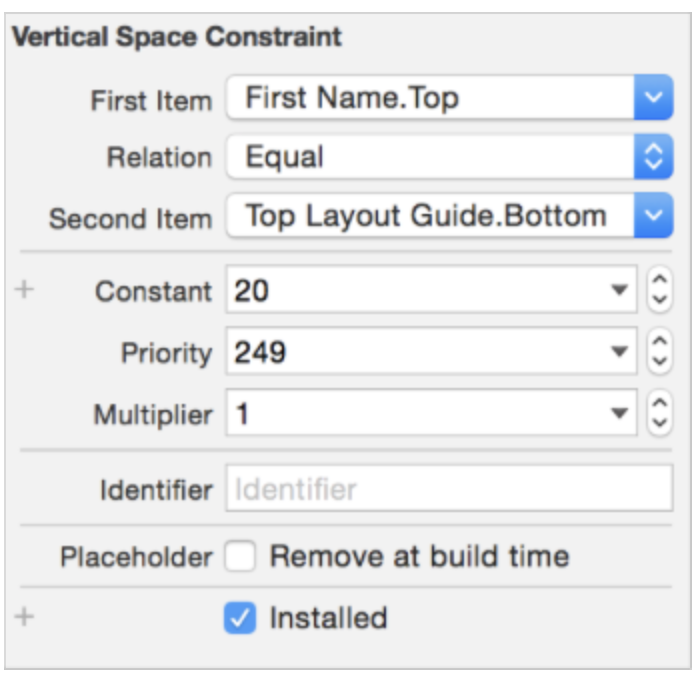

제약 방정식의 모든 값들, 즉 첫 번째 항목(first item), 관계(relation), 두 번째 항목(second item), 상수(constant), 및 배수(multiplier)가 포함된다. 속성 인스펙터는 제약의 우선도와 식별자도 보여준다.

또한, 제약을 플레이스홀더(placeholder)로 체크할 수도 있다. 플레이스홀더가 체크된 제약들은 설계시점(design time)에만 존재하고 애플리케이션 실행 시에는 레이아웃에 포함되지 않는다. 플레이스홀더 제약 추가는 주로 실행시점에서 동적으로 제약을 추가할 경우에 사용한다. 명료하고, 만족스러운 레이아웃을 생성하기 위한 제약을 일시적으로 추가함으로써, 인터페이스 빌더에서 경고나 에러를 제거할 수 있다.

상수, 우선도, 배수, 관계, 식별자 및 플레이스홀더 속성을 자유롭게 수정하는 것이 가능하나, 첫 번째 및 두 번째 항목의 경우 속성 수정에 제한이 따른다. 첫 번째와 두 번째 항목을 서로 바꿀 수도 있다.(필요에 따라 배수와 상수를 도치) 항목의 속성 또한 변경할 수 있으나, 항목 자체를 바꾸는 것은 불가능하다. 전혀 다른 항목으로 제약을 옮기고 싶은 경우, 제약을 삭제한 후 새로운 제약으로 대체해야 한다.

  </details>

</details>

<details>
  <summary>4. iOS View의 체계</summary>

# iOS View 체계

[Apple Documentation - Windows and Views](https://developer.apple.com/library/archive/documentation/WindowsViews/Conceptual/ViewPG_iPhoneOS/Introduction/Introduction.html)

[Apple Documentation - Creating and Managing a View Hierarchy](https://developer.apple.com/library/archive/documentation/WindowsViews/Conceptual/ViewPG_iPhoneOS/CreatingViews/CreatingViews.html#//apple_ref/doc/uid/TP40009503-CH5-SW47)

## 학습목표

1. 뷰 계층(view hierarchy) 구조와 계층에 포함된 뷰가 어떻게 행동하는지를 이해한다.
2. 뷰 계층을 생성하고 관리하는 방법을 이해한다.
3. 뷰의 좌표계를 이해한다.

## 학습하기

## 뷰의 기본적인 역할

iOS에서 화면에 애플리케이션의 콘텐츠를 나타내기 위해 윈도우와 뷰를 사용한다. 윈도우는 그 자체로 콘텐츠를 표현할 수 없지만 애플리케이션의 뷰를 위한 컨테이너 역할을 한다. 뷰는 UIView 클래스 또는 UIView 클래스의 하위 클래스(Subclass)의 인스턴스로 윈도우의 한 영역에서 콘텐츠를 보여준다. 뷰가 나타날 수 있는 콘텐츠는 이미지, 문자, 도형 등과 같이 다양하다. 뷰는 또 다른 뷰를 관리하고 구성하기 위해 사용되기도 한다.

뷰는 제스처 인식시(gesture recognizer)를 사용하거나 직접 터치 이벤트를 처리할 수 있다. 또한 뷰 계층(view hierarchy) 구조에서 부모뷰(parent view)는 자식뷰(child view)의 위치와 크기를 관리한다.

나타내고자 하는 유형의 콘텐츠에 적합한 뷰를 여러 개 사용하여 뷰 계층 구조를 구성하고 이를 통해 콘텐츠를 보여주는 것이 좋다. 예를 들어 UIKit에는 이미지, 텍스트 그리고 다른 유형의 콘텐츠를 나타내는 뷰가 포함되어 있다.

## 뷰 계층(View Hierarchy)

### 뷰 계층구조와 서브뷰 관리

뷰는 자신의 콘텐츠를 보여주는 것과 더불어, 다른 뷰를 위한 컨테이너로써의 역할도 한다. 하나의 뷰가 다른 뷰를 포함할 때, 두 뷰 사이에 부모-자식 관계가 생성된다. 해당 관계에서는 자식뷰는 서브뷰(subview)로, 부모뷰는 슈퍼뷰(superview)로 불려진다. 부모-자식 관계 형성은 애플리케이션의 시각적 모습과 동작 모두에 영향을 미친다.

1. 슈퍼뷰와 서브뷰의 관계에서 서브뷰가 불투명할 경우 아래 그림과 같이 슈퍼뷰가 서브뷰에 가려진다.

   <center>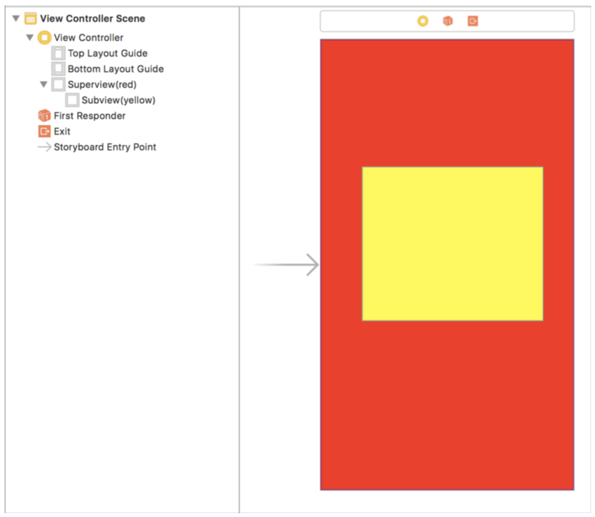</center>

2) 서브뷰가 반투명할 경우 서브뷰와 슈퍼뷰의 콘텐츠가 서로 섞여 화면에 보여지게 된다. 아래 그림과 같이 원래 노란색이었던 뷰가 슈퍼뷰의 빨간색과 섞여 주황색으로 화면에 보이게 된다.

   <center>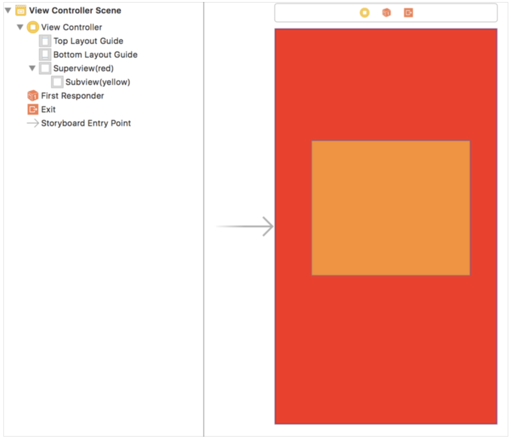</center>

3) 슈퍼뷰는 하나의 배열 안에 서브뷰를 순서대로 저장한다. 만약 하나의 슈퍼뷰에 포함된 두 서브뷰가 서로 겹치게 되면, 나중에 추가된(또는 서브뷰 배열의 끝으로 옮겨진) 서브뷰가 맨 위에 보이게 된다.

   <center>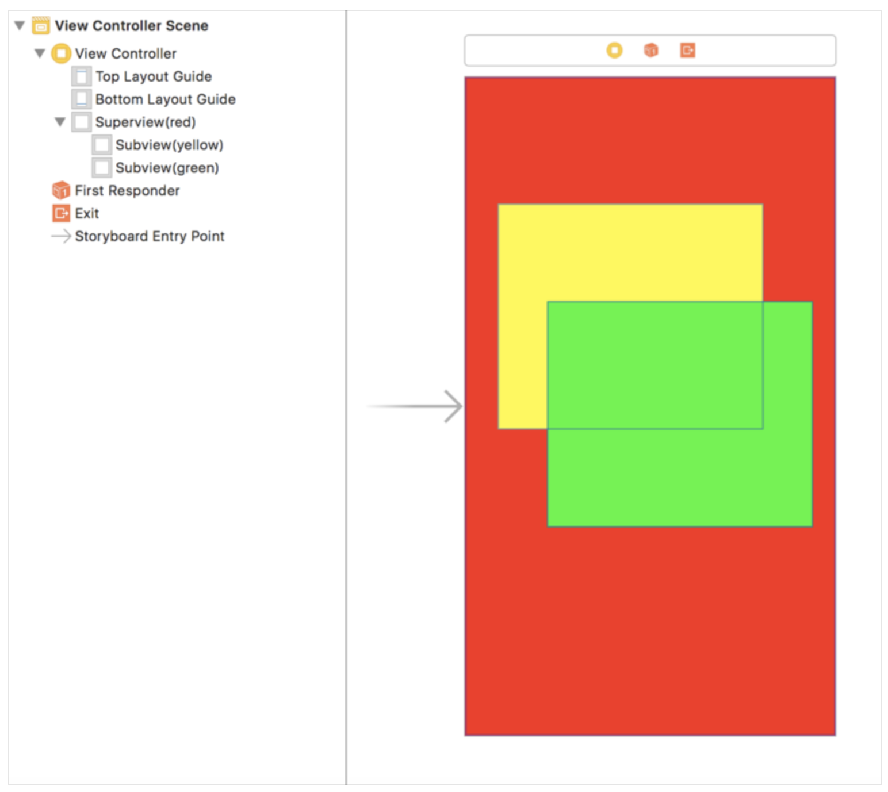</center>

4) 두 서브뷰가 모두 반투명할 경우 뒤에 있는 모든 뷰들이 섞여 화면에 보여지게 된다. 아래 그림과 같이 겹쳐지는 영역에 따라 색이 다르게 표시되는 것을 확인할 수 있다. 뷰 계층 생성과 관련된 더 많은 정보는 [Creating and Managing a View Hierarchy](https://developer.apple.com/library/archive/documentation/WindowsViews/Conceptual/ViewPG_iPhoneOS/CreatingViews/CreatingViews.html#//apple_ref/doc/uid/TP40009503-CH5-SW47) 에서 참고할 수 있다.

   <center>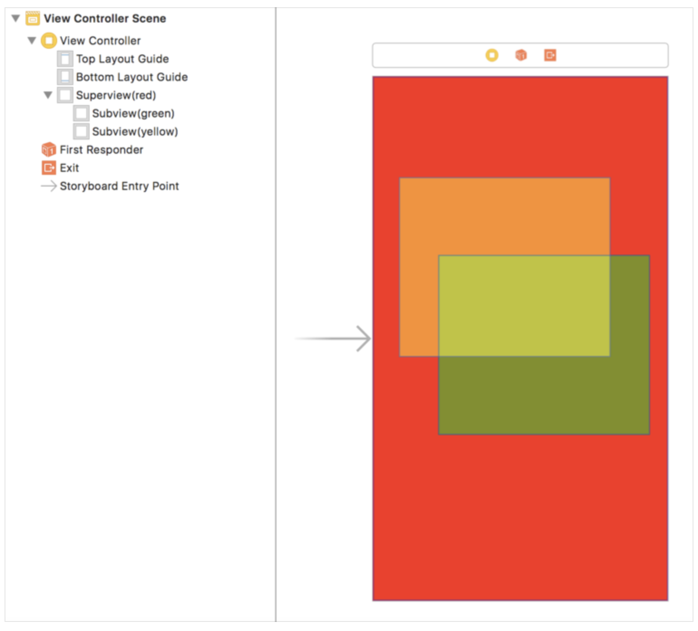</center>

### 뷰 계층의 생성과 관리

OS 애플리케이션에서 뷰 계층을 만드는 방법에는 인터페이스 빌더를 이용하는 방법과 코드를 작성하는 방법이 있다. 코드작성 방식을 사용할 경우 서브뷰를 부모뷰에 추가하기 위해, 부모뷰의 `addSubView(*:)` 메서드를 호출한다. 이 메서드는 해당 서브뷰를 서브뷰 목록의 마지막에 추가한다. 부모뷰의 서브뷰를 제거하기 위해서는 서브뷰의 `removeFromSuperView()` 메서드를 호출한다. 이 외에도 서브뷰를 부모뷰 목록의 중간에 삽입하기 위해 `insertSubview(*:at)`, 부모뷰 내에 이미 존재하는 서브뷰를 정렬하기 위해 `bringSubView(toFront:)`, `sendSubview(toBack:)` 등의 메서드들을 호출할 수 있다.

- 프로젝트 생성 시 기본으로 생성되는 ViewController를 선택하고 Delete키를 눌러서 삭제
- 객체 라이브러리에서 View Controller 객체를 캔버스로 드래그 앤 드롭한다.
- UIViewController는 스스로 화면에 표시되는 인스턴스가 아니므로, 자신이 운용할 View를 반드시 가지고 있어야 한다. 이 때문에 인터페이스 빌더에서 ViewController 인스턴스를 추가하면 View가 자동으로 추가된다.
  - View 클릭 → Identity Inspector → Document의 Label 항목에 새로운 이름 입력(설명의 편의를 위해 View의 이름을 'SuperView'로 설정한다.)
  - 추가된 View Controller를 선택 → Attributes Inspector → 'Is Initial View Controller' 체크.
  - 'Is Initial View Controller'는 애플리케이션 실행 시 처음에 보여지게 될 View Controller임을 명시한다. 체크하면 캔버스의 뷰 컨트롤러의 View 옆에 화살표가 생긴다.

### 여 슈퍼뷰의 서브뷰로 추가하기 (인터페이스 빌더)

- 객체 라이브러리에서 View를 SuperView로 드래그 앤 드롭한다.

  <center>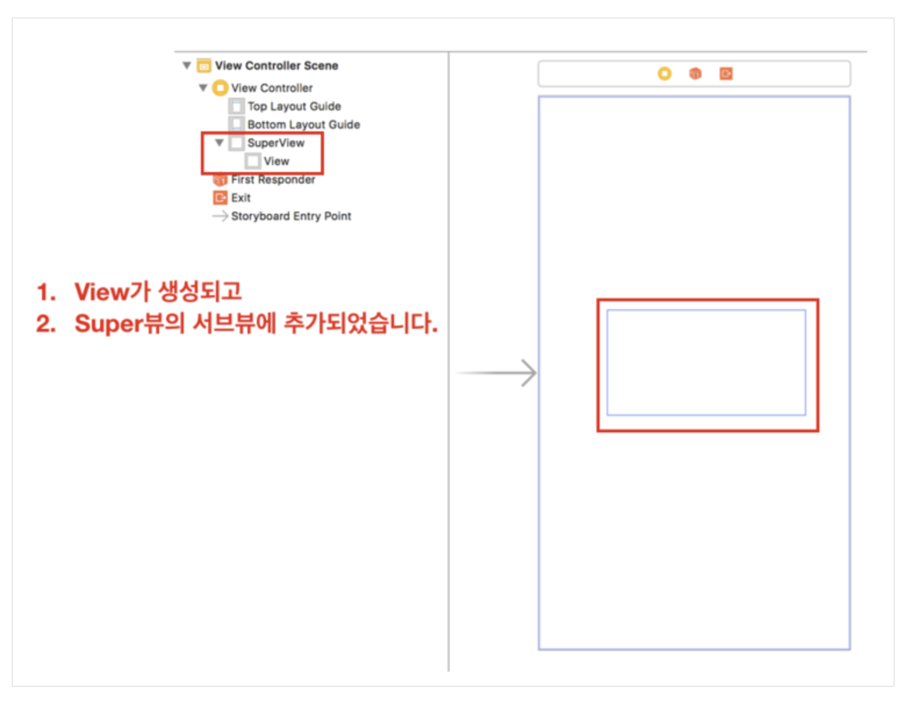</center>

- 생성된 뷰를 클릭 → Attributes Inspector → 배경색 설정

  <center>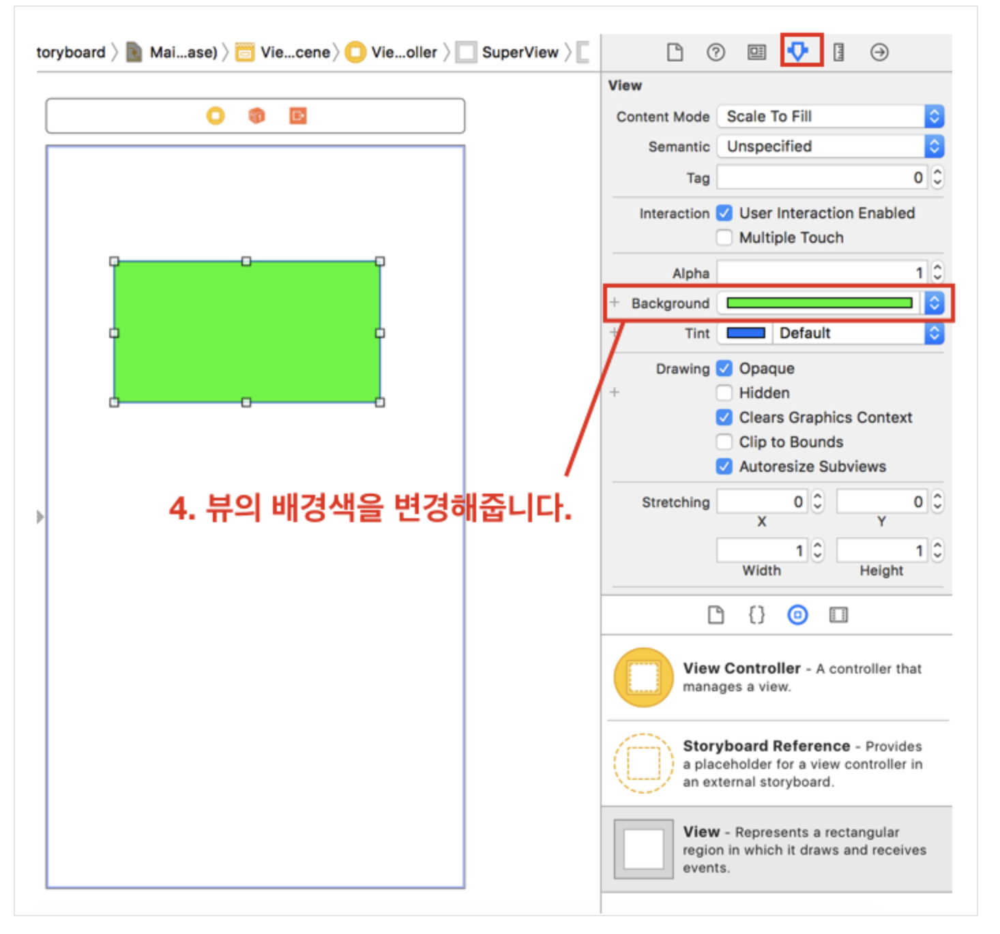</center>

### 서브뷰 제거하기 (인터페이스 빌더)

- Document Outline 또는 스토리보드에서 서브뷰 목록에서 제거할 서브뷰를 선택한다.
- Delete 키를 눌러서 제거한다.

### 뷰를 생성하여 슈퍼뷰의 서브뷰로 추가하기 (코드)

- 서브뷰를 부모뷰에 추가하기 위해서는 부모뷰의 addSubview 메서드를 호출한다. 이 메서드는 해당 서브뷰를 부모뷰의 서브뷰 목록의 마지막에 추가한다. (코드에서 view는 메인 스토리보드에 있는 ViewController의 SuperView를 나타낸다)

  <center>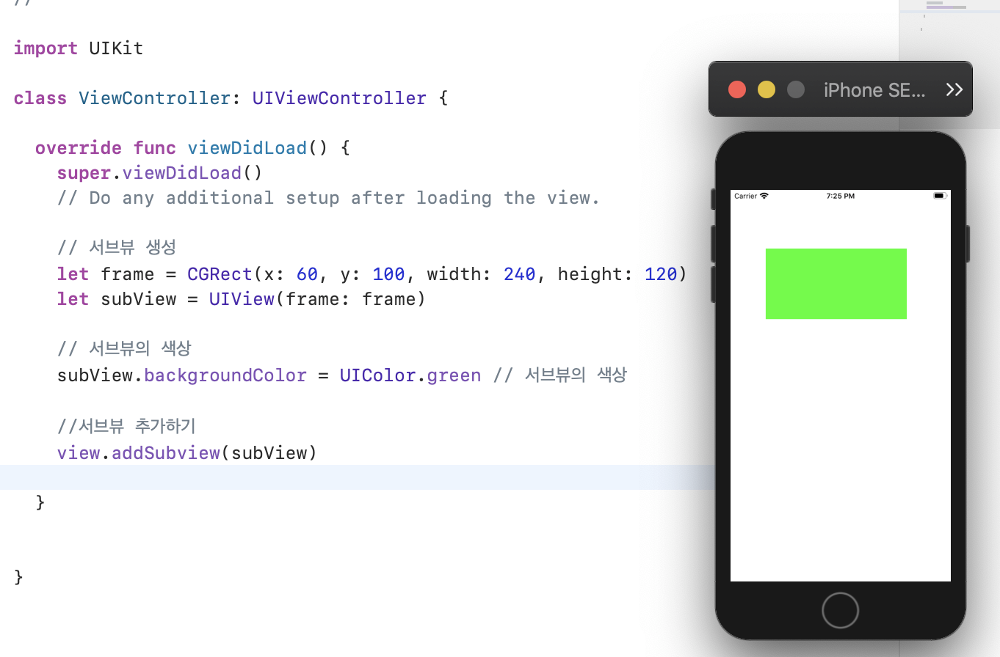</center>

- 주의: 프로젝트 실행 시 이미 존재하는 ViewController를 한 번 삭제하고 다시 만들 때 View Controller의 Identity Inspector 탭에서 View Controller의 클래스를 ViewController로 설정해주어야 코드가 정상적으로 작동한다.

  <center></center>

### 서브뷰 제거하기 (코드)

<center>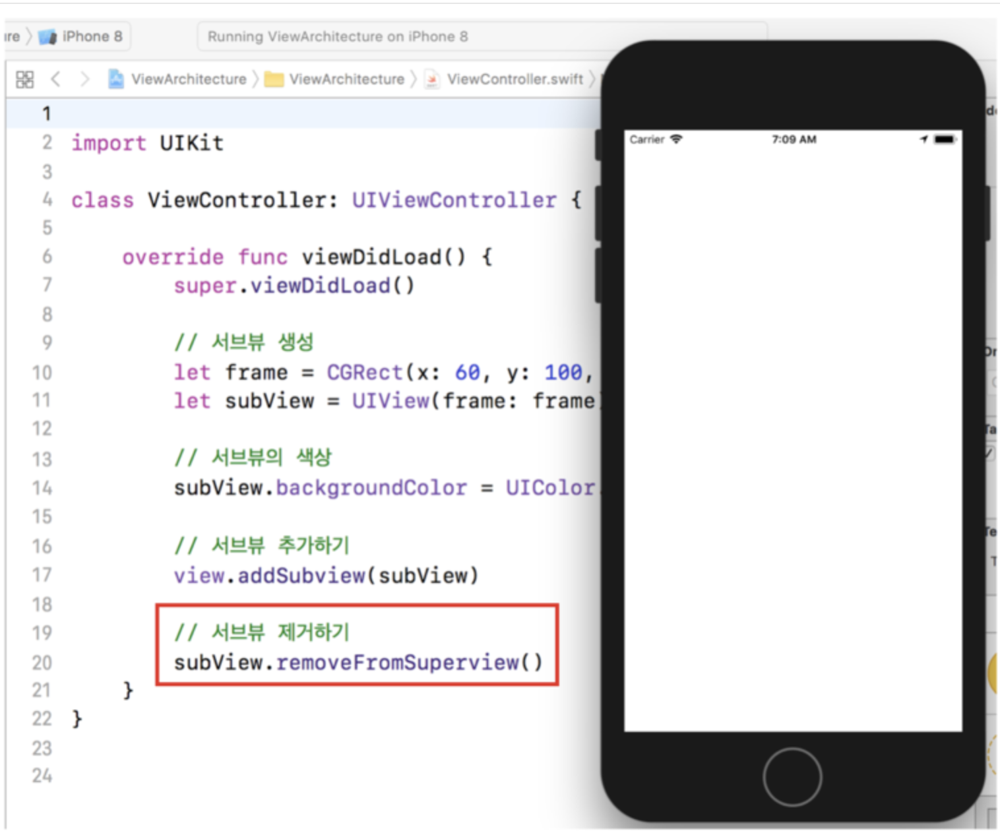</center>

### 뷰의 좌표계

UIKit에서 기본이 되는 좌표계는 좌측 상단 모서리를 원점으로 하며, 원점으로부터 아래쪽, 오른쪽 방향으로 확장된다. 좌표값은 해상도와 상관없이 콘텐츠의 위치를 잡는 부동소수점을 사용해서 나타낸다.

**프레임과 바운드**

iOS의 좌표체계의 시작은 왼쪽 위부터 시작이다. 즉, 제일 왼쪽의 제일 위의 지점이 (0,0)이다. 또, 수평축은 x로, 수직축은 y로 표현한다.

뷰의 프레임(frame)은 뷰의 크기와 위치를 슈퍼뷰의 좌표계를 기준으로 나타낸다. 바운드(bounds)는 뷰의 크기와 위치를 해당 뷰 자신의 좌표계를 기준으로 나타낸다. 아래 그림을 통해 서브뷰의 프레임과 바운드의 차이를 알아보자.

<center>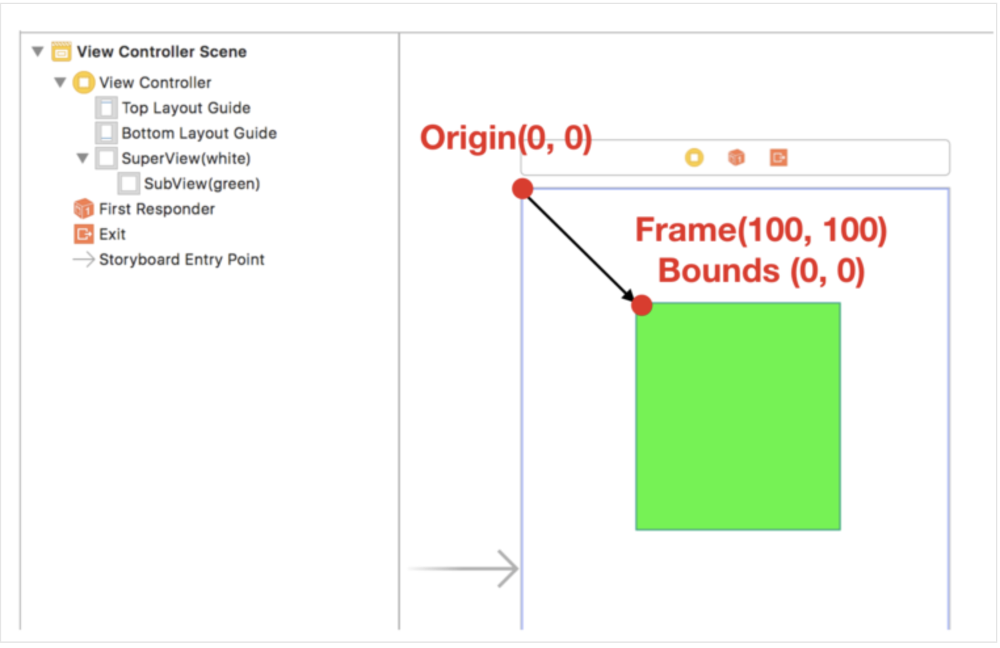</center>

코드 구현

<center>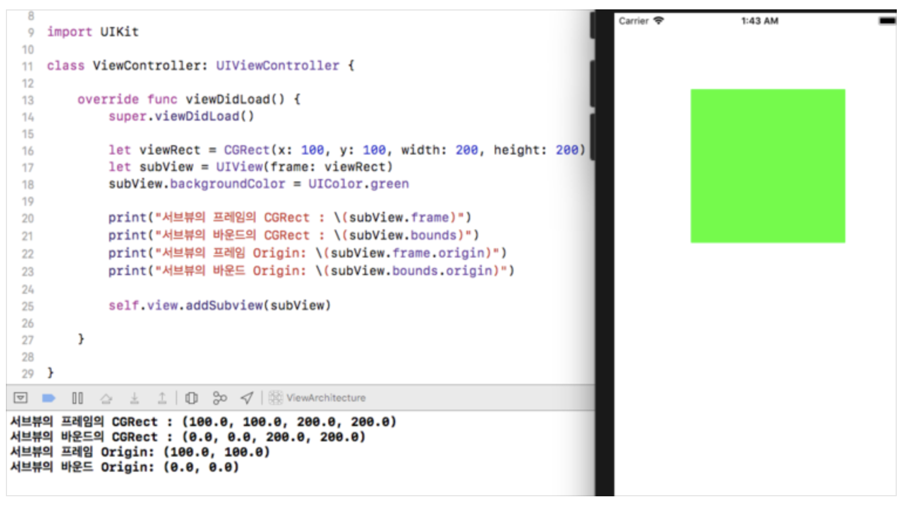</center>

**뷰의 사각형을 정의하기 위해서 필요한 것**

1. 뷰가 그려질 위치
2. 위치로부터 그려질 뷰의 크기

뷰의 프레임(frame)과 바운드(bounds)는 [CGRect](https://developer.apple.com/documentation/coregraphics/cgrect)라는 구조체를 통해서 표현된다. CGRect는 사각형의 크기와 위치에 대한 정보를 담고 있다.

CGRect의 origin 프로퍼티는 CGPoint 타입으로 사각형의 시작점을 나타낸다. CGRect의 size 프로퍼티는 CGSize 타입으로 사각형의 높이와 너비를 나타낸다.

CGPoint는 좌표를 표현할 수 있는 x와 y를 갖고 있다. CGSize는 위치와 높이의 값인 width와 height를 갖고 있다.

CGPoint의 x, y와 CGSize의 width, height는 모두 부동소수점 타입인 CGFloat으로 표현된다.

<center>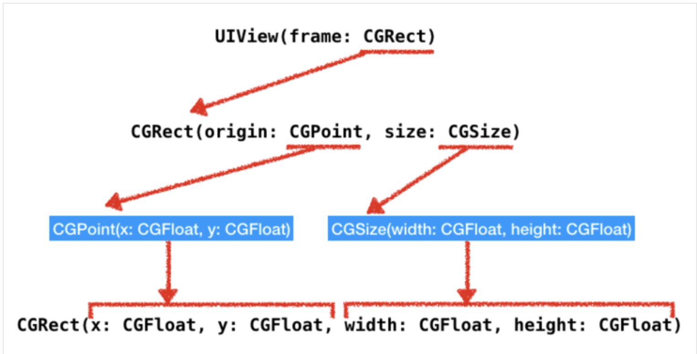</center>

  </details>
  <details>
    <summary>5. MVC (Model-View-Controller)</summary>
      <details>
      <summary>5-1. 프로그래밍 디자인 패턴이란?</summary>

# 프로그래밍 디자인 패턴이란?

[위키피디아 - Software Design Pattern](https://en.wikipedia.org/wiki/Software_design_pattern)

[Apple Documentation - Singleton](https://developer.apple.com/library/archive/documentation/General/Conceptual/DevPedia-CocoaCore/Singleton.html)

[블로그 - 디자인 패턴](https://gmlwjd9405.github.io/2018/07/06/design-pattern.html)

### 참고문헌

- 윤청, "이해하기 쉬운 소프트웨어 공학"
- GoF의 "디자인 패턴"

# 학습 목표

1. 프로그래밍 디자인 패턴이 발생한 배경을 이해한다.
2. 다양한 프로그래밍 디자인 패턴의 종류와 각각의 특징을 이해한다.
3. 프로그래밍 디자인 패턴 사용 시 주의점에 대해 명확히 이해한다.

# 학습하기

## 프로그래밍 디자인 패턴 소개

디자인 패턴이 객체지향 프로그래머에게 크게 영향을 미치게 된 계기는 "디자인 패턴" 책이 출간되면서부터이다. 이 책에서 GoF(Gang of Four의 약자로 디자인 패턴의 저자들 Erich Gamma, Richard Helm, Ralph Johnson, Jone Vlisside 네 사람)는 객체지향 설계를 위한 23개의 패턴을 기술하였다. 이를 토대로 객체지향 분석/설계, 도메인 설계, 프로세스 조직/설계, 사용자 인터페이스 설계와 같은 다양한 분야에서 패턴과 패턴 언어에 대한 논문과 책들이 출간되고 객체지향 프로그래밍 개발에서 디자인 패턴이 폭넓게 사용되기 시작했다.

## 프로그래밍 디자인 패턴이란 무엇인가?

> "특정한 상황에서 일반적 설계문제를 해결하게 위해 상호교류하는 수정 가능한 객체와 클래스들에 대한 설명이다" - by GoF

> "숙련된 객체지향 개발자 및 기타 소프트웨어 개발자는 소프트웨어 개발의 가이드라인이 되는 일반적인 원칙들과 관용적인 해결책들의 레퍼토리를 구축한다. 패턴은 이러한 원칙들과 관용적 해결책들이 문제와 해결책을 기술하는 구조적인 형태로 체계화되고 명명된 것이다." - by 라만(C. Larman)

## 프로그래밍 디자인 패턴의 특징

1. 경험을 통해서 얻을 수 있다.
2. 특정한 형식을 갖고 체계적으로 작성되는 것이 일반적이다.
3. 패턴에는 각기 다른 추상화 수준이 존재하며 계속 진화한다.

## 프로그래밍 디자인 패턴의 장점

1. 의사소통에 도움을 준다.

   디자인 패턴을 알고 있는 설계자들은 특정 문제에 대해 공통으로 알고 있는 패턴을 이용해 해결책에 대해 논의할 수 있기 때문에 더욱 원활하게 의사소통할 수 있다.

2. 경제적이다.

   검증된 지식인 패턴을 사용하면 높은 완성도의 디자인을 빠른 시간에 만들어 낼 수 있기 때문에 소프트웨어 개발 비용을 줄일 수 있다. 또한, 코드의 수준을 한 단계 높여주고 적은 수의 클래스로 원하는 목적을 달성할 수 있는 환경이 제공된다.

3. 소프트웨어의 구조를 쉽게 알 수 있다.

   좋은 설계나 아키텍처가 패턴이라는 이름으로 명명되어 있어 개발자는 그 패턴의 이름만으로도 그 소프트웨어의 구조를 알 수 있다. 이를 바탕으로 이전의 소프트웨어 개발에서 사용한 설계나 구조를 쉽게 이해할 수 있고, 새로운 소프트웨어로 빠르게 적용할 수 있어서 소프트웨어 재사용을 쉽게 해준다.

## 디자인 패턴의 분류

새로운 소프트웨어를 개발할 때마다 대부분 개발자는 어떤 클래스를 만들고 어떤 시점에 객체를 생성하고 소멸시킬 지, 데이터를 어떻게 받아서 처리할 지, 구조 설계를 어떻게 할 지 고민한다. 디자인 패턴 분류는 위와 같이 소프트웨어 코드를 작성할 때 자주 반복되는 특정 상황에서 설계를 용이하게 하며 코드의 재사용이 용이하도록 패턴을 정리해 놓은 것이다. 그 중 가장 잘 알려진 분류법으로 GoF의 패턴분류 방법이 있다. GoF는 디자인 패턴을 목적과 범위로 분류했다.

### 목적

패턴이 무엇을 하는지 정의하는 것으로 "생성", "구조", "행위" 중의 한 가지 목적을 가진다.

**생성 (Creational Pattern)**

- 객체의 생성 과정에 관여하는 패턴이다.
- 객체의 생성과 조합을 캡슐화해 특정 객체가 생성되거나 변경되어도 프로그램 구조에 영향을 크게 받지 않도록 유연성을 제공한다.

**구조 (Structural Pattern)**

- 클래스나 객체의 구성을 통해 더 큰 구조로 만들 수 있게 해주는 것과 관련된 패턴이다.
- 예를 들어 서로 다른 인터페이스를 지닌 2개의 객체르 묶어 단일 인터페이스를 제공하거나 객체들을 서로 묶어 새로운 기능을 제공하는 패턴이다.

**행위 (Behavioral Pattern)**

- 객체나 클래스 사이의 알고리즘이나 책임 분배에 관련된 패턴
- 한 객체가 혼자 수행할 수 없는 작업을 여러 개의 객체로 어떻게 분배하는지, 또 그렇게 하면서도 객체 사이의 결합도를 최소화하는 것에 중점을 둔다.

### 범위

패턴을 클래스에 적용하는지 아니면 객체에 적용하는지에 따라 구분되는 패턴이다.

**클래스 패턴 (Class Pattern)**

- 클래스들과 하위 클래스 간의 관계를 다루는 패턴이다. 컴파일 시에 관계가 결정된다.

**객체 패턴**

- 객체 간의 관계를 다루며 보통 구성을 통해 정의된다. 객체 패턴은 일반적으로 런타임에 관계가 생성되기 때문에 더 동적이면서 유연하다.

## 디자인 패턴의 종류

### 싱글턴 패턴 (Singleton Pattern)

목적: 생성

범위: 객체

객체의 생성에 관련된 패턴으로서 특정 클래스의 인스턴스가 오직 하나임을 보장하고 이 인스턴스에 접근할 방법을 제공한다.

### 퍼사드 패턴 (Facade Pattern)

목적: 구조

범위: 객체

건물의 정문에 있는 안내소처럼 개발자가 사용해야 하는 서브 시스템의 가장 앞쪽에 위치하면서 하위 시스템에 있는 객체들을 사용할 수 있도록 하는 역할을 한다. 시스템의 복잡성을 줄이기 위해 서브 시스템을 구조화하고 서브 시스템으로의 접근을 하나의 퍼사드 객체로 제공하는 패턴이다.

### 옵저버 패턴 (Observer Pattern)

목적: 행위

범위: 객체

객체의 상태변화를 관찰하는 관찰자들, 즉 옵저버들의 목록을 객체에 등록하여 상태 변화가 있을 때마다 메서드 등을 통해 객체가 직접 목록의 각 옵저버에게 통지하도록 하는 패턴이다.

### 스트래티지 패턴 (Strategy Pattern)

목적: 행위

범위: 객체

알고리즘을 담당하는 각각의 클래스를 만들어 책임을 분산하기 위한 목적으로 만든 행위 패턴이다.

### 팩토리 패턴 (Factory Pattern)

목적: 생성

범위: 클래스

객체를 생성하기 위한 인터페이스를 정의하지만 어떤 클래스의 인스턴스를 생성할 지에 대한 결정은 하위 클래스에서 이루어지도록 인스턴스 생성의 책임을 떠넘기는 패턴이다.

### 어댑터 패턴 (Adapter Pattern)

목적: 구조

범위: 클래스, 객체

클래스의 인터페이스를 사용자가 기대하는 다른 인터페이스로 변환하는 패턴으로, 호환성이 없는 인터페이스 때문에 함께 동작할 수 없는 클래스들이 함께 동작하도록 해준다.

## 소프트웨어 디자인 패턴을 사용할 때 생각해볼 점

디자인 패턴은 특정 상황에 대한 선배 프로그래머의 경험의 산물이자 방법론이다. 즉, 디자인 패턴은 모든 상황에서 만능은 아니다. 예를 들어 싱글턴 패턴을 **적재적소에 활용**하면 유용하겠지만, 적절치 못한 상황에 사용하면 오히려 큰 독이 될 수도 있다. 다양한 디자인 패턴을 아는 것도 중요하지만, **언제 어떻게 사용하는 것이 좋을지 고민**하는 것도 굉장히 중요한 문제라고 볼 수 있다.

디자인 패턴은 그 종류도 다양해지고 있으며, 기존의 디자인 패턴을 변형해서 사용하는 경우도 많다. 다양한 디자인 패턴을 익히고 자신의 코드에 적용해 보되, 깊은 공부와 많은 고민은 필수일 것이다.

약물의 오남용이 우리 몸에 치명적인 영향을 미칠 수 있듯이 제대로 알지 못하고 사용하는 디자인 패턴은 코드에 치명적 영향을 미칠 수 있음을 항상 명심해야 한다.

## 생각해보기

싱글턴 패턴은 iOS 애플리케이션의 다양한 곳에 사용되고 있다. 어디에 사용되고 있는지 생각해보자.

- 싱글턴 패턴은 애플리케이션이 얼마나 많은 횟수로 요구하든 같은 인스턴스를 리턴한다.
- 싱글턴은 일반적인 서비스나 자원을 제공하는 클래스들과 같이 단 하나의 통제 point가 바람직한 상황에 사용된다.
  - 사운드를 다른 객체에 제공해주는 클래스가 있다면 이 클래스를 싱글턴으로 만들 수도 있겠다.
- 코코아 프레임워크 클래스들 중 싱글턴의 예시로는 NSFileManager, NSWorkspace, UIApplication, UIAccelerometer 등이 있다.
- 싱글턴 인스턴스를 리턴해주는 factory 메서드의 이름은 관례 상 shared"ClassType" 의 형식을 취한다. 예를 들어 코코아 프레임워크에는 sharedFileManager, sharedColorPanel, sharedWorkspace 등이 있다.

    </details>
      <details>
      <summary>5-2. Model-View-Controller</summary>

# Model-View-Controller

[Apple Documentation - Model-View-Controller (Cocoa Core Competencies)](https://developer.apple.com/library/archive/documentation/General/Conceptual/DevPedia-CocoaCore/MVC.html)

[Apple Documentation - Model-View-Controller (Concepts in Objective-C Programming)](https://developer.apple.com/library/archive/documentation/General/Conceptual/CocoaEncyclopedia/Model-View-Controller/Model-View-Controller.html)

# 학습 목표

1. MVC 디자인 패턴의 개념을 이해한다.
2. 각 객체의 역할과 사용되는 클래스를 이해한다.

# 학습하기

## Model-View-Controller

MVC 디자인 패턴은 애플리케이션의 **객체를 모델, 뷰, 컨트롤러의 세 가지 역할 중 하나의 역할로 할당**한다. 이 패턴은 애플리케이션 내에서 객체가 수행하는 역할 뿐만 아니라 **객체가 서로 통신하는 방식을 정의**한다.

세 가지 유형의 객체는 각각 추상적인 경계에 의해 다른 객체와 구분되며, 그 경계를 넘어 다른 객체와 통신한다. 애플리케이션 내의 **특정 MVC 유형을 한데 모아 레이어**(예: 모델 레이어)라고도 한다.

<center>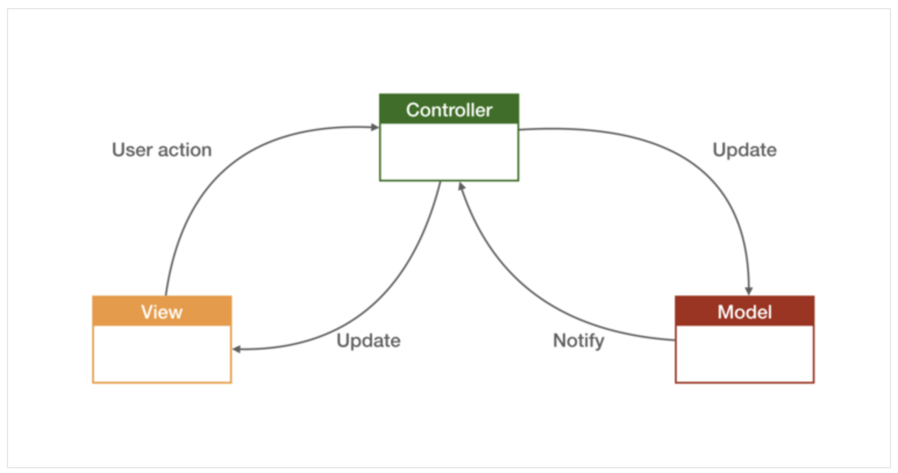</center>

## 모델 객체 (Model Object)

모델 객체는 애플리케이션과 관련된 데이터를 캡슐화하고, 해당 데이터를 조작하고 처리하는 로직과 계산을 정의한다.

하나의 모델 객체는 다른 모델 객체와 일대일 또는 일대다 대응 관계를 맺을 수 있다. 예를 들면 게임 속 캐릭터를 나타내거나 주소록의 연락처를 나타낼 수도 있다.

**모델 객체는** 데이터를 사용자에게 제공하거나 사용자가 이를 편집할 수 있는 **뷰 객체에 명시적으로 연결되어서는 안 된다.** 즉, 사용자 인터페이스나 표시 문제와 관련이 있어서는 안 된다.

### 잘 설계된 모델 클래스

모델 클래스, 즉 모델 객체를 생성하는 클래스는 Core Data Technology를 사용하고 있는 경우 NSManagerObject 서브 클래스를 많이 사용한다. Objective-C 언어를 사용하는 경우 일반적으로 NSObject의 서브클래스이다.

스위프트 언어를 사용하는 경우에는 특별한 경우가 아니라면 NSObject를 상속받지 않는다. 또, 값 타입의 모델이 필요한 경우 클래스 대신에 구조체를 활용하기도 한다.

### 모델 서브클래스를 구현할 때 클래스 디자인에서 고려할 점

**인스턴스 변수**

- 애플리케이션 내에 캡슐화된 데이터를 유지하기 위한 인스턴스 변수를 선언한다. 인스턴스 변수는 객체, 스칼라 값, 또는 NSRange와 같은 구조체일 수 있다.
- 비객체형 대신 객체형을 사용하는 데에는 장단점이 있으므로, 객체 상호 관계(object mutuality)를 고려해야 한다.

**접근자 메서드 (Accessor methods)와 프로퍼티**

- 접근자 메서드는 일반적으로 인스턴스 변숫값을 획득 및 설정하며, 흔히 획득자 및 설정자 메서드 (getter and setter method)라고도 알려져 있다.
- 스위프트 언어를 사용하는 경우, 인스턴스 변수를 private 또는 fileprivate 등으로 접근을 제한한 경우, 인스턴스 외부에서(fileprivate의 경우는 다른 소스파일에서) 접근하려면 접근자 메서드가 필요하다.

**키-값 (Key-Value) 코딩**

- 키-값 코딩은 클라이언트가 프로퍼티 이름을 키로 사용하여 객체의 프로퍼티에 접근할 수 있게 하는 메커니즘이다.
- Core Data에서 사용하고 있으며 Cocoa의 다른 곳에서도 사용하고 있다.
- 접근자 메서드의 이름 지정 (또한, 암시적으로는 선언된 프로퍼티의 이름 지정)이 이 메커니즘의 요소가 된다.

**초기화 및 할당 해제(Initialization and deallocation)**

- 대부분 모델 클래스는 인스턴스 변수를 적절한 초깃값으로 설정하는 이니셜라이저 메서드를 구현한다.
- 여기서 초기화는 이니셜라이저 메서드의 표준 형식을 따라야 하며, deinit 메서드에서 객체 값을 가지는 모든 인스턴스 변수를 해제해야 한다.

**객체 인코딩**

- 모델 클래스의 객체를 보관하려는 경우, 해당 객체의 인스턴스 변수를 인코딩 및 디코딩할 수 있어야 한다.

**객체 복제**

- 클라이언트가 모델 객체를 복제할 것으로 예상하는 경우, 클래스에서 객체 복제를 구현해야 한다.

## 뷰 객체 (View Objects)

뷰 객체는 애플리케이션 내에서 사용자가 볼 수 있는 객체를 말한다. 자신이 보이는 방법을 알고 있고 사용자 동작에 응답할 수 있다.

뷰 객체의 주된 목적은 애플리케이션의 모델 객체의 데이터를 보여주고 해당 데이터를 편집할 수 있도록 하는 것이다.그럼에도 불구하고, 뷰 객체는 MVC 애플리케이션의 모델 객체와는 일반적으로 분리된다.

주소록으로 예를 들면 전화번호 및 정보가 보이는 화면들을 말한다.

## 컨트롤러 객체 (Controller Objects)

컨트롤러 객체는 하나 이상의 애플리케이션 뷰 객체와 하나 이상의 모델 객체 사이의 코디네이터 또는 **중개자 역할**을 한다.

모델-뷰-컨트롤러 디자인 패턴에서 컨트롤러 객체(또는 컨트롤러)는 사용자가 버튼을 탭/클릭하거나 텍스트 필드에서 텍스트를 입력하는 것처럼, 뷰 객체에서 이루어진 사용자 동작 및 의도를 해석하며, 신규 혹은 변경된 데이터를 모델 객체에 전달한다. 따라서 **컨트롤러 객체는 뷰 객체로 하여금 모델 객체의 변경사항을 인지하거나, 그 반대의 경우가 가능하도록 하는 매개체**가 된다.

컨트롤러 객체는 애플리케이션의 설정 및 조정 작업을 수행할 수도 있으며, **다른 객체들의 생애주기(life cycle)를 관리**하기도 한다.

iOS 환경의 Cocoa Touch 프레임워크는 **코디네이팅 컨트롤러**, **뷰 컨트롤러**의 두 가지 기본 컨트롤러 유형을 제공한다.

<center>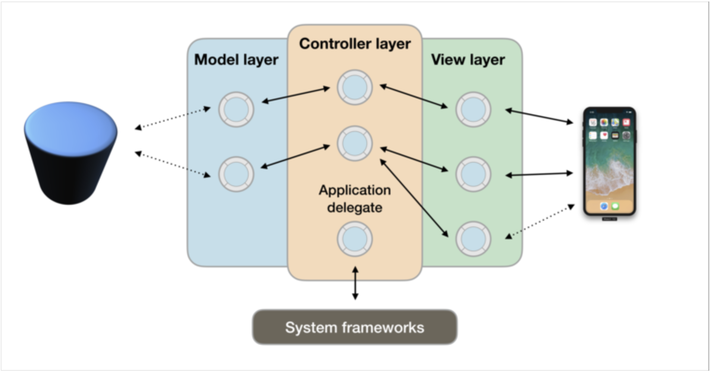</center>

### 코디네이팅 컨트롤러 (Coordinating Controllers)

코디네이팅 컨트롤러는 애플리케이션 전체 혹은 일부 기능을 감독하고 관리한다. 애플리케이션별로 다른 로직이 각 애플리케이션에 주입(injected)되는 장소라고 할 수 있으며, 그 기능은 다음과 같다.

- 델리게이션(delegation) 메시지에 응답하고 알림(notifications)을 관리
- 사용자가 버튼과 같은 컨트롤을 탭 하거나 클릭함에 따라 전송되는 동작 메시지(action message)에 응답
- 객체 간의 연결을 확립하거나 기타 설정 작업을 수행 (예: 애플리케이션을 시작하는 경우)
- 소유한(owned) 객체의 생명 주기 관리.

\*iOS 애플리케이션에서는 뷰 컨트롤러가 코디네이팅 컨트롤러의 역할을 겸하는 경우가 많다.

### 뷰 컨트롤러 (View Controller)

UIKit에서 뷰 컨트롤러는 콘텐츠를 화면에 표시하는 뷰를 관리하며, 해당 뷰에 대한 참조(reference)를 유지하고, 이 뷰의 프레젠테이션(presentation) 및 후속 뷰로의 전환(transition)을 관리한다.

이와 관련된 모든 프레젠테이션 동작이 뷰 컨트롤러 객체에 의해 관리되고 구현된다. 또한, 모달뷰를 표시하고 메모리 부족 경고에 응답하며 기기의 방향(orientation)이 바뀔 때 뷰를 회전시킨다

iOS의 뷰 컨트롤러는 UIViewController 서브클래스의 인스턴스이다. UIKit은 UITableViewController와 같은, UIViewController의 여러 특수 목적 서브클래스를 제공한다. 컨트롤러가 모델과 뷰 간에 데이터를 중개하도록 반드시 프레임워크의 뷰-콘트롤러 클래스(예: UIViewController, UITableViewController 등)을 확장해야 한다. 뷰 콘트롤러는 여러 가지 프레임워크 객체에 대한 델리게이트 혹은 데이터 소스 객체인 경우가 많다.

## 생각해보기

MVC 모델 외에도 MVP(Model-View-Presenter), MVVM(Model-View-ViewModel) 등 다양한 디자인 패턴에 대해서도 알아보자

[블로그 - MVC, MVP, MVVM](https://beomy.tistory.com/43)

**MVC**

<center>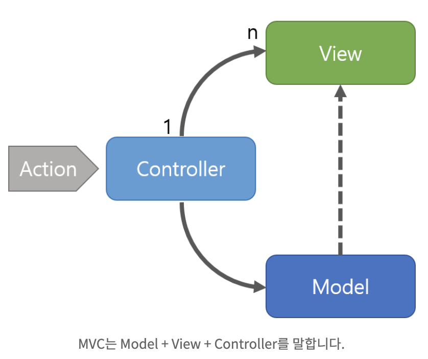</center>

- 특징: Controller는 여러개의 View를 선택할 수 있는 1:n 구조이다. Controller는 View를 선택할 뿐 직접 업데이트하지 않는다. (View는 Controller를 알지 못한다.)
- 장점: 널리 사용되고 있는 패턴이라는 점에 걸맞게 가장 단순하다. 단순하다 보니 보편적으로 많이 사용되는 디자인 패턴이다.
- 단점: View와 Model 사이의 의존성이 높다. View와 Model의 높은 의존성은 애플리케이션이 커질수록 복잡해지고 유지보수가 어렵게 만들 수 있다.

**MVP**

<center>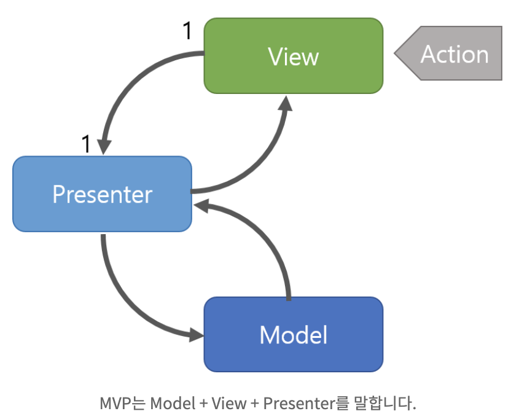</center>

- 특징: Presenter는 View와 Model의 인스턴스를 가지고 있어 둘을 연결하는 접착제 역할을 한다. Presenter와 View는 1:1 관계다.
- 장점: MVP 패턴은 MVC 패턴의 단점이었던 View와 Model의 의존성을 해결하였다. (Presenter를 통해서만 데이터를 전달 받기 때문에)
- 단점: View와 Presenter 사이의 의존성을 가지게 된다. 애플리케이션이 복잡해 질 수록 View와 Presenter 사이의 의존성이 강해지는 단점이 있다.

**MVVM**

<center>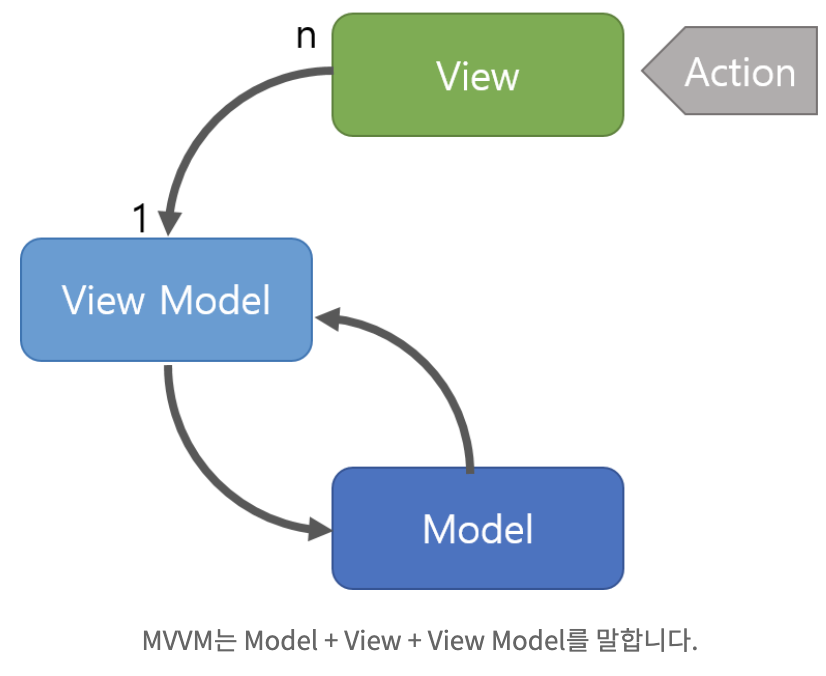</center>

- 특징: MVVM 패턴은 [Command 패턴](https://ko.wikipedia.org/wiki/%EC%BB%A4%EB%A7%A8%EB%93%9C_%ED%8C%A8%ED%84%B4)과 [Data Binding](https://en.wikipedia.org/wiki/Data_binding) 두 가지 패턴을 사용하여 구현되었다. Command 패턴과 Data Binding을 이용하여 View와 View Model 사이의 의존성을 없앴다. View Model과 View는 1:n 관계이다.
- 장점: View와 Model 사이의 의존성이 없다. 또한 Command 패턴과 Data Binding을 사용하여 View와 View Model 사이의 의존성 또한 없앤 디자인패턴이다. 각각의 부분은 독립적이기 때문에 모듈화하여 개발할 수 있다.
- 단점: MMVM 패턴의 단점은 View Model의 설계가 쉽지 않다는 점이다.


    </details>
      <details>
      <summary>5-3. 직접 찾아보기</summary>
    </details>

  </details>
  <details>
    <summary>6. Apple Developer Documentation</summary>
  </details>

  <details>
    <summary>7. Summary</summary>
  </details>
